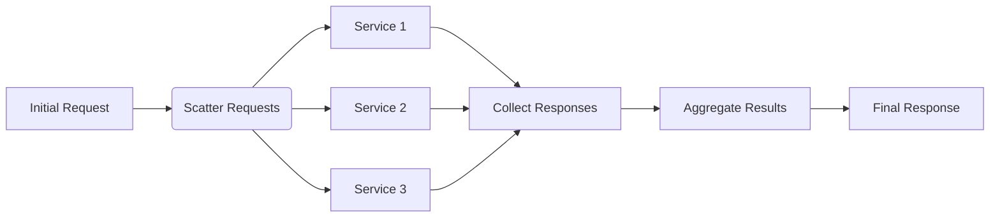

## 6.2.3 Scatter-Gather

### Introduction

The Scatter-Gather pattern is a powerful enterprise integration pattern used to send requests to multiple recipients and aggregate their responses into a single, coherent result. This pattern is particularly useful in distributed systems where data needs to be collected from various sources to form a comprehensive view.

### Detailed Explanation

#### Understand the Concept

The Scatter-Gather pattern involves three main steps:

1. **Distribute Requests:** The initial request is scattered to multiple endpoints or services in parallel.
2. **Collect Responses:** As responses arrive from these endpoints, they are collected by a central mechanism.
3. **Aggregate Results:** The collected responses are then aggregated into a single result that can be returned to the requester.

This pattern is commonly used in scenarios where data needs to be fetched from multiple services, such as querying different databases or microservices to compile a report.

#### Implementation Steps

##### 1. Distribute Requests

In JavaScript and TypeScript, distributing requests can be efficiently handled using asynchronous programming techniques. The `Promise.all()` method is particularly useful for sending multiple requests in parallel and waiting for all of them to complete.

```typescript
async function scatterRequests(urls: string[]): Promise<any[]> {
    const requests = urls.map(url => fetch(url).then(response => response.json()));
    return Promise.all(requests);
}
```

##### 2. Collect Responses

The responses from the distributed requests are collected as they arrive. In the example above, `Promise.all()` collects all responses into an array once all promises are resolved.

##### 3. Aggregate Results

Once the responses are collected, they can be aggregated into a single result. This might involve combining data, filtering, or transforming it into a desired format.

```typescript
async function aggregateResults(urls: string[]): Promise<any> {
    const responses = await scatterRequests(urls);
    return responses.reduce((acc, response) => {
        // Custom aggregation logic
        return { ...acc, ...response };
    }, {});
}
```

### Visual Aids

#### Conceptual Diagram



### Code Examples

Below is a complete example demonstrating the Scatter-Gather pattern using JavaScript's `Promise.all()` to handle multiple asynchronous operations and collect results.

```typescript
async function fetchDataFromServices(serviceUrls: string[]): Promise<any> {
    try {
        const responses = await Promise.all(
            serviceUrls.map(url => fetch(url).then(res => res.json()))
        );
        return responses.reduce((acc, data) => ({ ...acc, ...data }), {});
    } catch (error) {
        console.error("Error fetching data:", error);
        return null;
    }
}

// Example usage
const serviceUrls = [
    "https://api.service1.com/data",
    "https://api.service2.com/data",
    "https://api.service3.com/data"
];

fetchDataFromServices(serviceUrls).then(aggregatedData => {
    console.log("Aggregated Data:", aggregatedData);
});
```

### Use Cases

- **Querying Multiple Services:** A common use case is querying multiple microservices or databases to gather data for a report or dashboard.
- **Search Features:** Implementing a search feature that queries multiple databases and combines the results into a single response.

### Best Practices

- **Handle Timeouts and Failures:** Implement mechanisms to handle timeouts and partial failures gracefully. Consider using `Promise.race()` to set timeouts for requests.
- **Optimize Performance:** Be mindful of the performance impact of sending multiple simultaneous requests. Use caching and load balancing where appropriate.
- **Error Handling:** Ensure robust error handling to manage failed requests and retries.

### Considerations

- **Performance Impact:** The pattern can lead to performance bottlenecks if not managed properly, especially with a large number of requests.
- **Network Latency:** Be aware of network latency and its impact on the overall response time.
- **Data Consistency:** Ensure data consistency when aggregating results from different sources.

### Conclusion

The Scatter-Gather pattern is a versatile integration pattern that can significantly enhance the capabilities of distributed systems by allowing them to efficiently collect and aggregate data from multiple sources. By leveraging modern JavaScript and TypeScript features, developers can implement this pattern effectively, ensuring robust and scalable solutions.

## Quiz Time!



### What is the primary purpose of the Scatter-Gather pattern?

- [x] To send requests to multiple recipients and aggregate their responses.
- [ ] To send a single request to a single recipient.
- [ ] To handle errors in asynchronous operations.
- [ ] To optimize database queries.

> **Explanation:** The Scatter-Gather pattern is designed to send requests to multiple recipients and aggregate their responses into a single result.

### Which JavaScript feature is commonly used to implement the Scatter-Gather pattern?

- [x] Promise.all()
- [ ] setTimeout()
- [ ] Array.map()
- [ ] JSON.stringify()

> **Explanation:** `Promise.all()` is used to handle multiple asynchronous operations in parallel and collect their results.

### What is a common use case for the Scatter-Gather pattern?

- [x] Querying multiple services for data and presenting a unified response.
- [ ] Sending a single request to a single service.
- [ ] Logging errors in a system.
- [ ] Optimizing a single database query.

> **Explanation:** The Scatter-Gather pattern is often used to query multiple services and aggregate their data into a unified response.

### What should be considered when implementing the Scatter-Gather pattern?

- [x] Handling timeouts and partial failures gracefully.
- [ ] Using synchronous operations only.
- [ ] Avoiding any form of error handling.
- [ ] Ignoring network latency.

> **Explanation:** It's important to handle timeouts and partial failures gracefully to ensure robust implementation.

### How can performance be optimized when using the Scatter-Gather pattern?

- [x] Use caching and load balancing.
- [ ] Avoid using asynchronous operations.
- [ ] Increase the number of requests indefinitely.
- [ ] Ignore error handling.

> **Explanation:** Caching and load balancing can help optimize performance by reducing redundant requests and distributing load.

### What is a potential drawback of the Scatter-Gather pattern?

- [x] Performance bottlenecks due to multiple simultaneous requests.
- [ ] It cannot handle asynchronous operations.
- [ ] It only works with synchronous operations.
- [ ] It is not suitable for any real-world applications.

> **Explanation:** The pattern can lead to performance bottlenecks if not managed properly, especially with a large number of requests.

### Which method can be used to set timeouts for requests in the Scatter-Gather pattern?

- [x] Promise.race()
- [ ] Promise.all()
- [ ] Array.filter()
- [ ] JSON.parse()

> **Explanation:** `Promise.race()` can be used to set timeouts by racing a request against a timeout promise.

### What is the role of the aggregation step in the Scatter-Gather pattern?

- [x] To combine responses into a single coherent result.
- [ ] To send requests to multiple endpoints.
- [ ] To log errors in a system.
- [ ] To optimize database queries.

> **Explanation:** The aggregation step combines responses from multiple endpoints into a single coherent result.

### Why is error handling important in the Scatter-Gather pattern?

- [x] To manage failed requests and retries.
- [ ] To ignore any form of network latency.
- [ ] To ensure synchronous operations only.
- [ ] To avoid using asynchronous operations.

> **Explanation:** Robust error handling is crucial to manage failed requests and implement retries effectively.

### True or False: The Scatter-Gather pattern can only be used in synchronous programming.

- [ ] True
- [x] False

> **Explanation:** The Scatter-Gather pattern is typically used in asynchronous programming to handle multiple requests in parallel.


