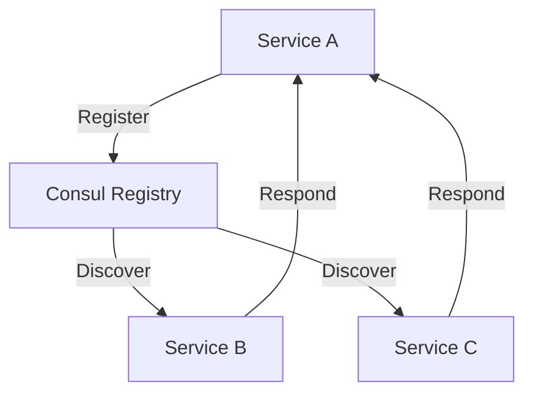

## 6.2.4 Service Discovery

In modern distributed systems, especially those employing microservices architecture, Service Discovery plays a crucial role. It allows services to find each other dynamically, ensuring seamless communication and scalability. This article delves into the concept of Service Discovery, its implementation using JavaScript and TypeScript, and practical examples using Consul and Node.js.

### Understand the Concept

Service Discovery is a mechanism that enables services in a distributed system to locate each other without hardcoding network locations. This is essential in environments where services are dynamically scaled, such as in cloud-native applications.

#### Key Benefits:
- **Dynamic Scaling:** Services can scale up or down without manual intervention.
- **Fault Tolerance:** Services can automatically find replacements if a service instance fails.
- **Load Balancing:** Distributes requests across multiple service instances.

### Implementation Steps

Implementing Service Discovery involves several key steps:

#### 1. Select a Discovery Mechanism

- **Central Registry:** Use tools like Consul or etcd to maintain a registry of available services.
- **DNS-Based Discovery:** Utilize DNS records to resolve service names to IP addresses.

#### 2. Register Services

Services must register themselves with the discovery mechanism upon startup, providing their network locations (e.g., IP address and port).

#### 3. Implement Clients

Clients need logic to query the registry and discover available service instances. This can be done using libraries or custom code.

### Code Examples

Let's explore how to implement Service Discovery using Consul and Node.js.

#### Setting Up Consul

First, install and run Consul on your machine or server. Consul provides a web UI and API for managing service registrations.

```bash
brew install consul

consul agent -dev
```

#### Registering a Service with Consul

Create a simple Node.js service that registers itself with Consul.

```javascript
const express = require('express');
const consul = require('consul')();

const app = express();
const PORT = process.env.PORT || 3000;

// Register service with Consul
const serviceId = 'my-service-' + PORT;
consul.agent.service.register({
  id: serviceId,
  name: 'my-service',
  address: 'localhost',
  port: PORT,
  check: {
    http: `http://localhost:${PORT}/health`,
    interval: '10s'
  }
}, (err) => {
  if (err) throw err;
  console.log(`Service registered with ID: ${serviceId}`);
});

// Health check endpoint
app.get('/health', (req, res) => res.send('OK'));

app.listen(PORT, () => {
  console.log(`Service running on port ${PORT}`);
});
```

#### Discovering Services

Create a client that queries Consul to discover available instances of a service.

```javascript
const consul = require('consul')();

function discoverService(serviceName) {
  consul.agent.service.list((err, services) => {
    if (err) throw err;

    const serviceInstances = Object.values(services).filter(service => service.Service === serviceName);
    console.log(`Discovered instances of ${serviceName}:`, serviceInstances);
  });
}

discoverService('my-service');
```

### Use Cases

Service Discovery is particularly useful in:

- **Microservices Architectures:** Where services need to communicate with each other without fixed network addresses.
- **Cloud Environments:** Where services are dynamically scaled based on demand.

### Practice

To practice, set up a simple microservices environment where multiple services register with Consul and discover each other. Experiment with scaling services up and down and observe how discovery adapts.

### Considerations

- **High Availability:** Ensure the registry is highly available to prevent it from becoming a single point of failure.
- **Security:** Secure the discovery mechanism to prevent unauthorized access and data breaches.

### Visual Aids

#### Service Discovery Workflow



### Advantages and Disadvantages

#### Advantages:
- **Scalability:** Easily scale services without manual reconfiguration.
- **Resilience:** Automatically reroute requests if a service instance fails.

#### Disadvantages:
- **Complexity:** Adds complexity to the system architecture.
- **Dependency:** Relies on the availability and reliability of the discovery mechanism.

### Best Practices

- **Use Health Checks:** Regularly check the health of services to ensure only healthy instances are discoverable.
- **Implement Caching:** Cache discovery results to reduce load on the registry and improve performance.

### Comparisons

Service Discovery can be compared with other integration patterns like API Gateway, which also facilitates service communication but with additional features like request routing and security.

### Conclusion

Service Discovery is a fundamental pattern in distributed systems, enabling dynamic service interaction and scalability. By leveraging tools like Consul and implementing robust client logic, developers can create resilient and scalable applications.

## Quiz Time!



### What is the primary purpose of Service Discovery in distributed systems?

- [x] To enable services to find each other dynamically
- [ ] To store data persistently
- [ ] To manage user authentication
- [ ] To provide a user interface

> **Explanation:** Service Discovery allows services to locate each other dynamically, which is essential in distributed systems where services may change frequently.

### Which tool is commonly used as a central registry for Service Discovery?

- [x] Consul
- [ ] MongoDB
- [ ] Redis
- [ ] PostgreSQL

> **Explanation:** Consul is a popular tool used as a central registry for Service Discovery, providing features like service registration and health checking.

### What is a key advantage of using Service Discovery?

- [x] It allows services to scale dynamically without manual intervention.
- [ ] It simplifies the user interface design.
- [ ] It improves database performance.
- [ ] It enhances data encryption.

> **Explanation:** Service Discovery enables dynamic scaling of services, allowing them to register and deregister automatically as they scale.

### In the context of Service Discovery, what does a client need to do?

- [x] Query the registry to discover service instances
- [ ] Store user data securely
- [ ] Manage network traffic
- [ ] Encrypt service communications

> **Explanation:** Clients need to query the registry to discover available service instances and communicate with them.

### Which of the following is a consideration when implementing Service Discovery?

- [x] Ensuring the registry is highly available
- [ ] Designing a complex user interface
- [ ] Using a relational database
- [ ] Implementing a monolithic architecture

> **Explanation:** Ensuring the registry is highly available is crucial to prevent it from becoming a single point of failure in the system.

### What is a common method for securing the discovery mechanism?

- [x] Implementing authentication and authorization
- [ ] Using a public DNS server
- [ ] Storing data in plain text
- [ ] Disabling health checks

> **Explanation:** Securing the discovery mechanism involves implementing authentication and authorization to prevent unauthorized access.

### Which of the following is a disadvantage of Service Discovery?

- [x] It adds complexity to the system architecture.
- [ ] It simplifies network configuration.
- [ ] It reduces the need for service communication.
- [ ] It eliminates the need for load balancing.

> **Explanation:** While Service Discovery offers many benefits, it also adds complexity to the system architecture, requiring careful management.

### What is the role of health checks in Service Discovery?

- [x] To ensure only healthy service instances are discoverable
- [ ] To manage user sessions
- [ ] To encrypt data transmissions
- [ ] To store configuration data

> **Explanation:** Health checks ensure that only healthy service instances are registered and discoverable, enhancing system reliability.

### How does caching benefit Service Discovery?

- [x] It reduces load on the registry and improves performance.
- [ ] It increases the size of the registry.
- [ ] It complicates service registration.
- [ ] It decreases service availability.

> **Explanation:** Caching discovery results reduces the load on the registry and improves performance by minimizing repeated queries.

### Service Discovery is essential in microservices architectures because it allows for:

- [x] Dynamic service interaction and scalability
- [ ] Static service configuration
- [ ] Centralized data storage
- [ ] Simplified user interfaces

> **Explanation:** In microservices architectures, Service Discovery is crucial for enabling dynamic service interaction and scalability, allowing services to register and discover each other automatically.


