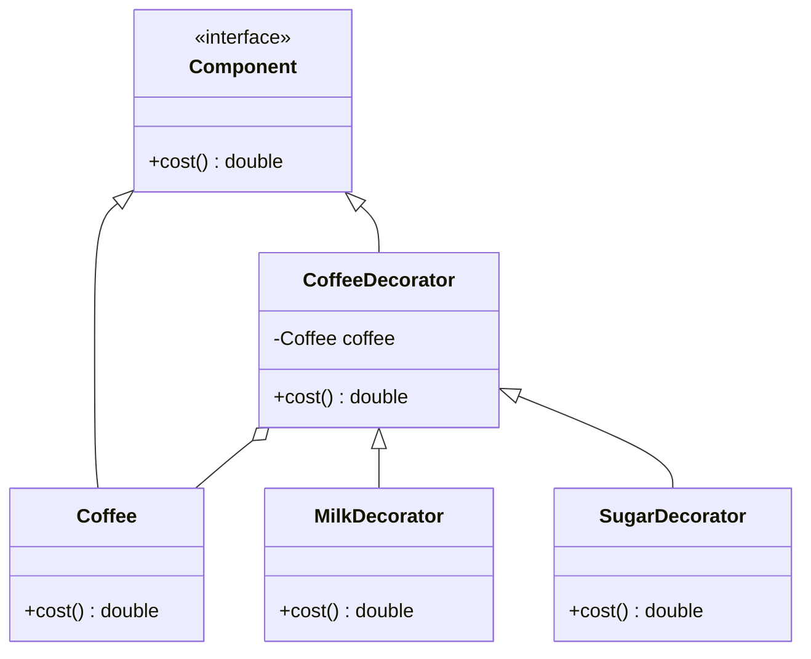

## 6.2 Decorator Pattern for Enhancing Objects

In the realm of software design patterns, the Decorator Pattern stands out as a versatile and powerful tool for dynamically adding responsibilities to objects. Unlike subclassing, which involves creating a new class to extend functionality, the Decorator Pattern allows us to enhance objects without modifying their original code. This approach is particularly beneficial in JavaScript, where flexibility and dynamic behavior are key.

### Understanding the Decorator Pattern

The Decorator Pattern is a structural design pattern that enables behavior to be added to individual objects, either statically or dynamically, without affecting the behavior of other objects from the same class. This pattern is particularly useful when you want to add responsibilities to objects without altering their structure.

#### Key Participants

- **Component**: The interface or abstract class defining the methods that will be implemented.
- **ConcreteComponent**: The class that implements the Component interface. This is the object to which additional responsibilities can be attached.
- **Decorator**: An abstract class that implements the Component interface and contains a reference to a Component object.
- **ConcreteDecorator**: A class that extends the Decorator class and adds responsibilities to the Component.

### How the Decorator Pattern Differs from Subclassing

Subclassing involves creating a new class that inherits from an existing class, adding or overriding functionality. While effective, subclassing can lead to a rigid and complex class hierarchy. The Decorator Pattern, on the other hand, provides a more flexible alternative by allowing behavior to be added to objects at runtime.

#### Advantages of the Decorator Pattern

- **Flexibility**: Easily add or remove responsibilities from objects at runtime.
- **Reusability**: Decorators can be reused across different objects.
- **Single Responsibility**: Each decorator has a specific responsibility, promoting cleaner code.

#### Challenges

- **Complexity**: The use of multiple decorators can lead to complex and hard-to-read code.
- **Performance**: Wrapping objects with multiple decorators can introduce performance overhead.

### Implementing the Decorator Pattern in JavaScript

Let's explore how to implement the Decorator Pattern in JavaScript with a practical example.

#### Example: Enhancing a Coffee Object

Consider a simple `Coffee` object that we want to enhance with additional features like milk and sugar.

```javascript
// Component
class Coffee {
  cost() {
    return 5;
  }
}

// Decorator
class CoffeeDecorator {
  constructor(coffee) {
    this.coffee = coffee;
  }

  cost() {
    return this.coffee.cost();
  }
}

// Concrete Decorators
class MilkDecorator extends CoffeeDecorator {
  cost() {
    return super.cost() + 1;
  }
}

class SugarDecorator extends CoffeeDecorator {
  cost() {
    return super.cost() + 0.5;
  }
}

// Usage
let myCoffee = new Coffee();
console.log("Plain Coffee Cost: $" + myCoffee.cost());

myCoffee = new MilkDecorator(myCoffee);
console.log("Coffee with Milk Cost: $" + myCoffee.cost());

myCoffee = new SugarDecorator(myCoffee);
console.log("Coffee with Milk and Sugar Cost: $" + myCoffee.cost());
```

In this example, we start with a basic `Coffee` object. We then use decorators to add milk and sugar, enhancing the coffee's functionality without altering its original structure.

### Practical Applications of the Decorator Pattern

The Decorator Pattern is widely used in various applications, particularly in enhancing user interface components and middleware systems.

#### Enhancing User Interface Components

In UI development, the Decorator Pattern can be used to add features like scrollbars, borders, or shadows to components without modifying their core functionality. This approach allows for a modular and flexible UI design.

#### Use in Frameworks: Express Middleware

One of the most common uses of the Decorator Pattern in JavaScript is in the Express.js framework, where middleware functions act as decorators. Middleware functions can modify request and response objects, end the request-response cycle, and call the next middleware function in the stack.

```javascript
const express = require('express');
const app = express();

// Middleware function to log requests
function logRequests(req, res, next) {
  console.log(`${req.method} ${req.url}`);
  next();
}

// Middleware function to add a custom header
function addCustomHeader(req, res, next) {
  res.setHeader('X-Custom-Header', 'MyHeaderValue');
  next();
}

// Use middleware
app.use(logRequests);
app.use(addCustomHeader);

app.get('/', (req, res) => {
  res.send('Hello, World!');
});

app.listen(3000, () => {
  console.log('Server is running on port 3000');
});
```

In this example, the `logRequests` and `addCustomHeader` functions act as decorators, enhancing the functionality of the request-response cycle in an Express application.

### Visualizing the Decorator Pattern

To better understand the Decorator Pattern, let's visualize it using a class diagram.



This diagram illustrates the relationship between the `Component`, `ConcreteComponent`, `Decorator`, and `ConcreteDecorator` classes in the Decorator Pattern.

### JavaScript Unique Features

JavaScript's dynamic nature makes it particularly well-suited for the Decorator Pattern. The ability to add properties and methods to objects at runtime allows for flexible and powerful decorators.

#### Differences and Similarities with Other Patterns

The Decorator Pattern is often confused with the Proxy Pattern. While both involve wrapping objects, the Proxy Pattern is primarily used for controlling access to an object, whereas the Decorator Pattern is used for adding behavior.

### Best Practices for Using the Decorator Pattern

- **Keep Decorators Simple**: Each decorator should have a single responsibility to maintain clarity.
- **Limit the Number of Decorators**: Excessive decorators can lead to complex and hard-to-maintain code.
- **Use Descriptive Names**: Clearly name decorators to indicate their purpose and functionality.

### Try It Yourself

Experiment with the Decorator Pattern by modifying the coffee example. Try adding new decorators, such as `VanillaDecorator` or `CaramelDecorator`, and observe how they enhance the coffee object.

### References and Further Reading

- [MDN Web Docs: Decorator Pattern](https://developer.mozilla.org/en-US/docs/Web/JavaScript/Guide/Decorators)
- [Express.js Middleware](https://expressjs.com/en/guide/writing-middleware.html)

### Knowledge Check

- What is the primary purpose of the Decorator Pattern?
- How does the Decorator Pattern differ from subclassing?
- Can you identify a real-world scenario where the Decorator Pattern would be beneficial?

### Embrace the Journey

Remember, mastering design patterns like the Decorator Pattern is a journey. As you continue to explore and experiment, you'll discover new ways to enhance your code and create more flexible and maintainable applications. Keep experimenting, stay curious, and enjoy the journey!

## Quiz: Mastering the Decorator Pattern in JavaScript



### What is the primary purpose of the Decorator Pattern?

- [x] To add responsibilities to objects dynamically without altering their structure.
- [ ] To create a new class hierarchy for extending functionality.
- [ ] To control access to an object.
- [ ] To manage object creation.

> **Explanation:** The Decorator Pattern is used to add responsibilities to objects dynamically without altering their structure.

### How does the Decorator Pattern differ from subclassing?

- [x] It allows adding behavior at runtime without modifying the original class.
- [ ] It requires creating a new class for each new behavior.
- [ ] It is less flexible than subclassing.
- [ ] It is primarily used for controlling access to objects.

> **Explanation:** The Decorator Pattern allows adding behavior at runtime without modifying the original class, unlike subclassing, which involves creating new classes.

### Which of the following is a practical application of the Decorator Pattern?

- [x] Enhancing user interface components.
- [ ] Managing object creation.
- [ ] Controlling access to an object.
- [ ] Implementing a singleton pattern.

> **Explanation:** The Decorator Pattern is often used to enhance user interface components by adding features like scrollbars or borders.

### What is a common challenge when using the Decorator Pattern?

- [x] Increased complexity due to multiple decorators.
- [ ] Difficulty in creating new classes.
- [ ] Limited flexibility in adding behavior.
- [ ] Inability to modify object behavior at runtime.

> **Explanation:** A common challenge with the Decorator Pattern is increased complexity due to the use of multiple decorators.

### In the context of Express.js, what role do middleware functions play?

- [x] They act as decorators, enhancing the request-response cycle.
- [ ] They manage object creation.
- [ ] They control access to routes.
- [ ] They implement singleton behavior.

> **Explanation:** In Express.js, middleware functions act as decorators, enhancing the request-response cycle by adding functionality.

### What is a key advantage of using the Decorator Pattern?

- [x] Flexibility in adding or removing responsibilities at runtime.
- [ ] Simplified class hierarchy.
- [ ] Improved performance.
- [ ] Easier object creation.

> **Explanation:** The Decorator Pattern provides flexibility in adding or removing responsibilities at runtime.

### Which of the following is a key participant in the Decorator Pattern?

- [x] Component
- [x] Decorator
- [ ] Singleton
- [ ] Factory

> **Explanation:** The key participants in the Decorator Pattern include the Component and Decorator.

### What is the primary use of the Proxy Pattern?

- [x] To control access to an object.
- [ ] To add responsibilities to objects dynamically.
- [ ] To manage object creation.
- [ ] To enhance user interface components.

> **Explanation:** The Proxy Pattern is primarily used to control access to an object.

### How can the Decorator Pattern be visualized in a class diagram?

- [x] By showing the relationship between Component, ConcreteComponent, Decorator, and ConcreteDecorator.
- [ ] By illustrating the inheritance hierarchy.
- [ ] By depicting object creation processes.
- [ ] By outlining access control mechanisms.

> **Explanation:** The Decorator Pattern can be visualized in a class diagram by showing the relationship between Component, ConcreteComponent, Decorator, and ConcreteDecorator.

### True or False: The Decorator Pattern is often confused with the Singleton Pattern.

- [ ] True
- [x] False

> **Explanation:** The Decorator Pattern is often confused with the Proxy Pattern, not the Singleton Pattern.


