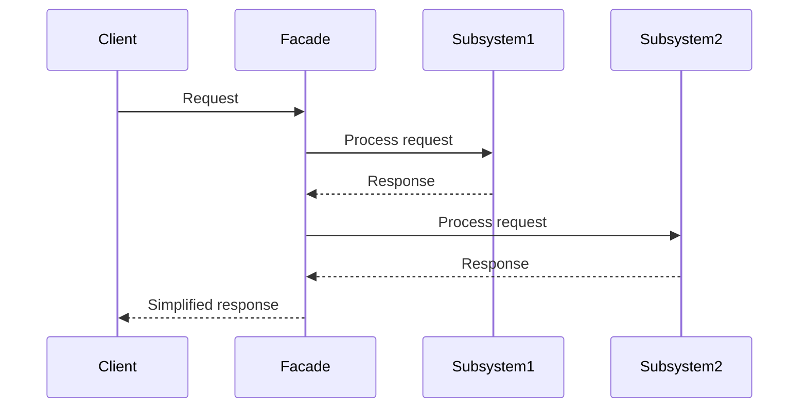

## 6.3 Facade Pattern Simplifying Complex Interfaces

In the world of software development, complexity is often an unavoidable reality. As systems grow, they tend to become more intricate, with numerous components interacting with each other. The Facade Pattern is a structural design pattern that addresses this complexity by providing a simplified interface to a complex subsystem. This pattern is particularly useful in JavaScript, where applications often interact with various APIs and libraries.

### What is the Facade Pattern?

The Facade Pattern is a design pattern that provides a unified interface to a set of interfaces in a subsystem. It defines a higher-level interface that makes the subsystem easier to use. The primary intent of the Facade Pattern is to simplify the interaction with complex systems by hiding the complexities and exposing only what is necessary.

#### Intent of the Facade Pattern

- **Simplify complex systems**: By providing a single, simplified interface, the Facade Pattern reduces the complexity of interacting with a subsystem.
- **Improve usability**: It makes the system easier to use by offering a more intuitive interface.
- **Reduce coupling**: By decoupling the client code from the subsystem, the Facade Pattern helps in reducing dependencies and improving maintainability.

### Key Participants

- **Facade**: The class that provides a simplified interface to the complex subsystem.
- **Subsystem Classes**: The classes that implement the complex functionality. The facade delegates client requests to these classes.

### Applicability

The Facade Pattern is applicable when:

- You want to provide a simple interface to a complex subsystem.
- There are many interdependent classes in a subsystem, and you want to decouple the client from these classes.
- You want to layer your subsystems, using a facade to define an entry point to each subsystem level.

### Creating a Facade in JavaScript

Let's explore how to implement the Facade Pattern in JavaScript with a practical example. Consider a scenario where we have a complex subsystem for managing a multimedia library, including audio, video, and image processing.

#### Subsystem Classes

```javascript
// Audio processing subsystem
class AudioProcessor {
    playAudio(file) {
        console.log(`Playing audio file: ${file}`);
    }

    stopAudio() {
        console.log('Stopping audio playback');
    }
}

// Video processing subsystem
class VideoProcessor {
    playVideo(file) {
        console.log(`Playing video file: ${file}`);
    }

    stopVideo() {
        console.log('Stopping video playback');
    }
}

// Image processing subsystem
class ImageProcessor {
    displayImage(file) {
        console.log(`Displaying image file: ${file}`);
    }

    hideImage() {
        console.log('Hiding image');
    }
}
```

#### Facade Class

```javascript
// Facade class
class MediaFacade {
    constructor() {
        this.audioProcessor = new AudioProcessor();
        this.videoProcessor = new VideoProcessor();
        this.imageProcessor = new ImageProcessor();
    }

    playMedia(type, file) {
        switch (type) {
            case 'audio':
                this.audioProcessor.playAudio(file);
                break;
            case 'video':
                this.videoProcessor.playVideo(file);
                break;
            case 'image':
                this.imageProcessor.displayImage(file);
                break;
            default:
                console.log('Unsupported media type');
        }
    }

    stopMedia(type) {
        switch (type) {
            case 'audio':
                this.audioProcessor.stopAudio();
                break;
            case 'video':
                this.videoProcessor.stopVideo();
                break;
            case 'image':
                this.imageProcessor.hideImage();
                break;
            default:
                console.log('Unsupported media type');
        }
    }
}
```

#### Using the Facade

```javascript
// Client code
const mediaFacade = new MediaFacade();

mediaFacade.playMedia('audio', 'song.mp3');
mediaFacade.stopMedia('audio');

mediaFacade.playMedia('video', 'movie.mp4');
mediaFacade.stopMedia('video');

mediaFacade.playMedia('image', 'picture.jpg');
mediaFacade.stopMedia('image');
```

### How Facades Improve Usability and Reduce Coupling

The Facade Pattern improves usability by providing a simple and consistent interface to a complex subsystem. In the example above, the `MediaFacade` class offers a straightforward way to interact with the audio, video, and image processing subsystems. This approach hides the complexities of the underlying subsystems and exposes only the necessary functionality.

By reducing the number of dependencies between the client and the subsystem classes, the Facade Pattern also reduces coupling. The client interacts only with the facade, which in turn interacts with the subsystem classes. This separation of concerns makes the system easier to maintain and extend.

### Scenarios Where a Facade Simplifies Interactions with Complex APIs

Facades are particularly useful when dealing with complex APIs or libraries. Here are some scenarios where a facade can simplify interactions:

- **Third-party libraries**: When integrating third-party libraries with complex APIs, a facade can provide a simplified interface that abstracts away the intricacies of the library.
- **Legacy systems**: When working with legacy systems that have complex interfaces, a facade can provide a modern, simplified interface for interacting with the system.
- **Microservices**: In a microservices architecture, a facade can provide a unified interface to multiple services, simplifying the interaction for the client.

### Designing Clear and Intuitive Facades

When designing a facade, it's essential to focus on clarity and intuitiveness. Here are some guidelines to consider:

- **Identify common use cases**: Understand the common use cases for the subsystem and design the facade to address these use cases.
- **Limit the interface**: Expose only the necessary functionality through the facade. Avoid exposing unnecessary details of the subsystem.
- **Use meaningful names**: Use descriptive and meaningful names for the facade methods to make the interface intuitive.
- **Document the facade**: Provide clear documentation for the facade, explaining its purpose and how to use it.

### JavaScript Unique Features

JavaScript's dynamic nature and prototype-based inheritance make it particularly well-suited for implementing the Facade Pattern. The ability to create objects on the fly and modify their behavior at runtime allows for flexible and adaptable facade implementations.

### Differences and Similarities

The Facade Pattern is often confused with the Adapter Pattern. While both patterns provide a simplified interface, the Adapter Pattern is used to make two incompatible interfaces compatible, whereas the Facade Pattern simplifies a complex interface without altering its functionality.

### Visualizing the Facade Pattern

To better understand the Facade Pattern, let's visualize the interaction between the client, facade, and subsystem classes using a sequence diagram.



In this diagram, the client interacts with the facade, which delegates requests to the subsystem classes. The facade then returns a simplified response to the client.

### Try It Yourself

Experiment with the code examples provided above. Try adding new media types or modifying the existing subsystem classes to see how the facade adapts to changes. This hands-on approach will help solidify your understanding of the Facade Pattern.

### Knowledge Check

To reinforce your understanding of the Facade Pattern, consider the following questions:

1. What is the primary intent of the Facade Pattern?
2. How does the Facade Pattern improve usability?
3. In what scenarios is the Facade Pattern particularly useful?
4. How does the Facade Pattern reduce coupling?
5. What are some guidelines for designing a clear and intuitive facade?

### Summary

The Facade Pattern is a powerful tool for simplifying complex interfaces in JavaScript. By providing a unified, easy-to-use interface, it improves usability and reduces coupling, making systems easier to maintain and extend. As you continue your journey in mastering JavaScript design patterns, remember to leverage the Facade Pattern to manage complexity and enhance the usability of your applications.

## Test Your Knowledge on the Facade Pattern in JavaScript



### What is the primary intent of the Facade Pattern?

- [x] To simplify complex systems by providing a unified interface
- [ ] To create multiple interfaces for a single subsystem
- [ ] To increase the complexity of a system
- [ ] To replace the subsystem entirely

> **Explanation:** The Facade Pattern aims to simplify complex systems by providing a unified, easy-to-use interface.

### How does the Facade Pattern improve usability?

- [x] By offering a more intuitive interface
- [ ] By exposing all subsystem details
- [ ] By increasing the number of interfaces
- [ ] By making the system more complex

> **Explanation:** The Facade Pattern improves usability by offering a more intuitive interface that hides the complexities of the subsystem.

### In what scenarios is the Facade Pattern particularly useful?

- [x] When dealing with complex APIs or libraries
- [ ] When you want to increase coupling
- [ ] When you need to expose all subsystem details
- [ ] When you want to make the system more complex

> **Explanation:** The Facade Pattern is useful when dealing with complex APIs or libraries, as it simplifies interactions.

### How does the Facade Pattern reduce coupling?

- [x] By decoupling the client from the subsystem
- [ ] By increasing dependencies
- [ ] By exposing all subsystem details
- [ ] By making the client interact directly with the subsystem

> **Explanation:** The Facade Pattern reduces coupling by decoupling the client from the subsystem, allowing the client to interact only with the facade.

### What are some guidelines for designing a clear and intuitive facade?

- [x] Identify common use cases and limit the interface
- [ ] Expose all subsystem details
- [ ] Use complex names for methods
- [ ] Avoid documenting the facade

> **Explanation:** To design a clear and intuitive facade, identify common use cases, limit the interface, use meaningful names, and provide documentation.

### Which pattern is often confused with the Facade Pattern?

- [x] Adapter Pattern
- [ ] Singleton Pattern
- [ ] Observer Pattern
- [ ] Strategy Pattern

> **Explanation:** The Adapter Pattern is often confused with the Facade Pattern, but they serve different purposes.

### What is a key difference between the Facade and Adapter Patterns?

- [x] The Facade simplifies a complex interface, while the Adapter makes two interfaces compatible
- [ ] The Adapter simplifies a complex interface, while the Facade makes two interfaces compatible
- [ ] Both patterns serve the same purpose
- [ ] Neither pattern is used in JavaScript

> **Explanation:** The Facade Pattern simplifies a complex interface, while the Adapter Pattern makes two incompatible interfaces compatible.

### What is a benefit of using the Facade Pattern in JavaScript?

- [x] It leverages JavaScript's dynamic nature for flexible implementations
- [ ] It increases the complexity of the code
- [ ] It requires more code than interacting directly with the subsystem
- [ ] It is not applicable in JavaScript

> **Explanation:** JavaScript's dynamic nature allows for flexible and adaptable facade implementations.

### True or False: The Facade Pattern can be used to layer subsystems.

- [x] True
- [ ] False

> **Explanation:** The Facade Pattern can be used to define an entry point to each subsystem level, effectively layering subsystems.

### True or False: The Facade Pattern should expose all details of the subsystem.

- [ ] True
- [x] False

> **Explanation:** The Facade Pattern should hide the complexities of the subsystem and expose only the necessary functionality.



Remember, this is just the beginning. As you progress, you'll build more complex and interactive web pages. Keep experimenting, stay curious, and enjoy the journey!
