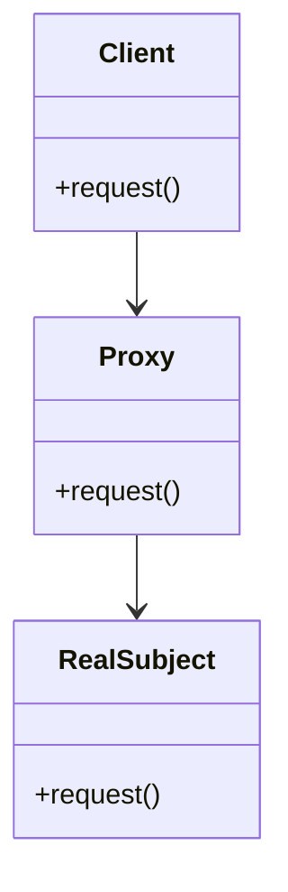

## 6.4 Proxy Pattern for Controlling Access

The Proxy Pattern is a structural design pattern that provides a surrogate or placeholder for another object to control access to it. This pattern is particularly useful in scenarios where direct access to an object is either not desirable or not possible. By using a proxy, you can add an additional layer of control over the interactions with the object, such as access control, logging, lazy initialization, and more.

### Intent

The primary intent of the Proxy Pattern is to control access to an object by acting as an intermediary. It allows you to perform additional operations before or after accessing the object, such as validation, logging, or modifying the request.

### Key Participants

- **Proxy**: The intermediary that controls access to the real subject. It implements the same interface as the real subject.
- **Real Subject**: The actual object that the proxy represents and controls access to.
- **Client**: The entity that interacts with the proxy instead of the real subject.

### Applicability

Use the Proxy Pattern when:

- You need to control access to an object.
- You want to add additional functionality to an object without modifying its code.
- You need to manage resource-intensive operations through lazy initialization.
- You want to log or cache requests to an object.

### JavaScript's `Proxy` Object

JavaScript provides a built-in `Proxy` object that allows you to create a proxy for another object. The `Proxy` object enables you to define custom behavior for fundamental operations (e.g., property lookup, assignment, enumeration, function invocation, etc.).

#### Basic Example

```javascript
// Define a target object
const target = {
  message: "Hello, world!"
};

// Create a proxy to control access to the target object
const handler = {
  get: function(target, property) {
    console.log(`Accessing property: ${property}`);
    return target[property];
  }
};

const proxy = new Proxy(target, handler);

// Accessing properties through the proxy
console.log(proxy.message); // Logs: Accessing property: message
                            // Outputs: Hello, world!
```

In this example, the proxy intercepts the property access and logs the property name before returning its value.

### Applications of the Proxy Pattern

#### Lazy Initialization

Lazy initialization is a technique where the creation of an object is deferred until it is actually needed. This can be particularly useful for resource-intensive objects.

```javascript
class ExpensiveResource {
  constructor() {
    console.log("ExpensiveResource created");
  }

  performOperation() {
    console.log("Operation performed");
  }
}

const resourceProxy = new Proxy({}, {
  get: function(target, property) {
    if (!target.instance) {
      target.instance = new ExpensiveResource();
    }
    return target.instance[property];
  }
});

// The ExpensiveResource is only created when performOperation is called
resourceProxy.performOperation();
```

#### Access Control

Proxies can be used to restrict access to certain properties or methods of an object.

```javascript
const secureData = {
  secret: "Top Secret",
  publicInfo: "This is public"
};

const accessControlProxy = new Proxy(secureData, {
  get: function(target, property) {
    if (property === "secret") {
      throw new Error("Access denied");
    }
    return target[property];
  }
});

console.log(accessControlProxy.publicInfo); // Outputs: This is public
console.log(accessControlProxy.secret);     // Throws: Access denied
```

#### Logging and Monitoring

Proxies can be used to log interactions with an object, which is useful for debugging and monitoring.

```javascript
const user = {
  name: "Alice",
  age: 30
};

const loggingProxy = new Proxy(user, {
  get: function(target, property) {
    console.log(`Property ${property} accessed`);
    return target[property];
  },
  set: function(target, property, value) {
    console.log(`Property ${property} set to ${value}`);
    target[property] = value;
    return true;
  }
});

loggingProxy.name; // Logs: Property name accessed
loggingProxy.age = 31; // Logs: Property age set to 31
```

#### Validation

Proxies can enforce validation rules before allowing operations on an object.

```javascript
const person = {
  name: "Bob",
  age: 25
};

const validationProxy = new Proxy(person, {
  set: function(target, property, value) {
    if (property === "age" && typeof value !== "number") {
      throw new TypeError("Age must be a number");
    }
    target[property] = value;
    return true;
  }
});

validationProxy.age = 30; // Works fine
validationProxy.age = "thirty"; // Throws: TypeError: Age must be a number
```

### Virtual Proxies vs. Protection Proxies

- **Virtual Proxies**: These are used to manage resource-intensive objects. They delay the creation and initialization of the object until it is actually needed.
- **Protection Proxies**: These control access to the object, often used for security purposes. They can restrict access based on user permissions or other criteria.

### Performance Considerations

While proxies are powerful, they can introduce performance overhead due to the additional layer of abstraction. It's important to consider the trade-offs between the benefits of using proxies and the potential impact on performance, especially in performance-critical applications.

### Visualizing the Proxy Pattern



**Diagram Description**: This class diagram illustrates the relationship between the client, proxy, and real subject. The client interacts with the proxy, which in turn interacts with the real subject.

### JavaScript Unique Features

JavaScript's `Proxy` object provides a flexible way to implement the Proxy Pattern. It allows you to intercept and redefine fundamental operations for objects, making it a powerful tool for controlling access and adding functionality.

### Differences and Similarities

The Proxy Pattern is often confused with the Decorator Pattern. While both patterns add functionality to an object, the Proxy Pattern focuses on controlling access, whereas the Decorator Pattern focuses on adding behavior.

### Try It Yourself

Experiment with the code examples provided by modifying the handler functions to add custom behavior. Try creating a proxy that caches results of expensive computations or one that restricts access based on user roles.

### Knowledge Check

- What is the primary purpose of the Proxy Pattern?
- How does JavaScript's `Proxy` object facilitate the implementation of the Proxy Pattern?
- What are some common applications of the Proxy Pattern?
- How do virtual proxies differ from protection proxies?
- What are the performance considerations when using proxies?

### Embrace the Journey

Remember, mastering design patterns is a journey. As you explore the Proxy Pattern, consider how it can be applied to your projects. Keep experimenting, stay curious, and enjoy the journey!

## Quiz: Mastering the Proxy Pattern in JavaScript



### What is the primary purpose of the Proxy Pattern?

- [x] To control access to an object
- [ ] To add new methods to an object
- [ ] To create a new object from a class
- [ ] To remove methods from an object

> **Explanation:** The Proxy Pattern is primarily used to control access to an object by acting as an intermediary.

### Which JavaScript feature is used to implement the Proxy Pattern?

- [x] Proxy object
- [ ] Reflect API
- [ ] Object.assign
- [ ] Array.prototype.map

> **Explanation:** JavaScript's `Proxy` object is used to implement the Proxy Pattern by intercepting and redefining operations on an object.

### What is a common use case for the Proxy Pattern?

- [x] Logging and monitoring
- [ ] Sorting arrays
- [ ] Parsing JSON
- [ ] Animating elements

> **Explanation:** The Proxy Pattern is commonly used for logging and monitoring interactions with an object.

### How do virtual proxies differ from protection proxies?

- [x] Virtual proxies manage resource-intensive objects, while protection proxies control access.
- [ ] Virtual proxies control access, while protection proxies manage resource-intensive objects.
- [ ] Virtual proxies are faster than protection proxies.
- [ ] Virtual proxies are used for security, while protection proxies are used for performance.

> **Explanation:** Virtual proxies manage resource-intensive objects by delaying their creation, while protection proxies control access to objects.

### What is a potential downside of using proxies?

- [x] Performance overhead
- [ ] Increased security
- [ ] Reduced code readability
- [ ] Simplified code structure

> **Explanation:** Proxies can introduce performance overhead due to the additional layer of abstraction they provide.

### Which of the following is NOT a participant in the Proxy Pattern?

- [ ] Proxy
- [ ] Real Subject
- [ ] Client
- [x] Decorator

> **Explanation:** The Decorator is not a participant in the Proxy Pattern; it is a separate design pattern.

### What can a proxy be used for in JavaScript?

- [x] Validation
- [x] Lazy initialization
- [ ] Sorting
- [ ] Compilation

> **Explanation:** Proxies can be used for validation and lazy initialization, among other things.

### What is the role of the handler in a JavaScript Proxy?

- [x] To define custom behavior for operations on the target object
- [ ] To store the target object
- [ ] To create new properties on the target object
- [ ] To delete properties from the target object

> **Explanation:** The handler in a JavaScript Proxy defines custom behavior for operations on the target object.

### Can proxies be used to intercept function calls?

- [x] Yes
- [ ] No

> **Explanation:** Proxies can intercept function calls by defining a `apply` trap in the handler.

### True or False: The Proxy Pattern can be used to enhance security by controlling access to sensitive data.

- [x] True
- [ ] False

> **Explanation:** The Proxy Pattern can enhance security by controlling access to sensitive data through protection proxies.




