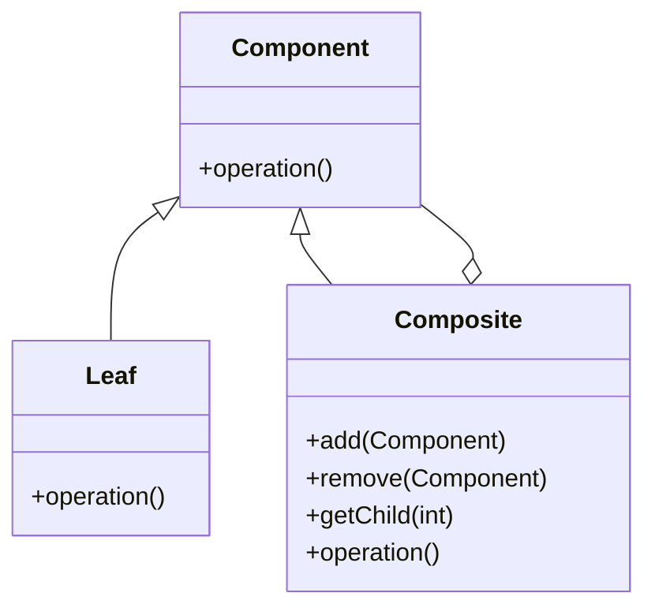

## 6.5 Composite Pattern with Hierarchical Structures

The Composite Pattern is a structural design pattern that allows you to compose objects into tree-like structures to represent part-whole hierarchies. This pattern enables clients to treat individual objects and compositions of objects uniformly, simplifying the client code that interacts with these structures.

### Understanding the Composite Pattern

#### Intent

The primary intent of the Composite Pattern is to allow clients to treat individual objects and compositions of objects uniformly. This is particularly useful when dealing with tree structures, such as file systems, UI components, or any hierarchical data representation.

#### Key Participants

1. **Component**: An interface or abstract class that defines the common operations for both simple and complex objects.
2. **Leaf**: Represents the end objects of a composition. A leaf has no children.
3. **Composite**: A class that represents a group of leaf objects. It implements the component interface and contains child components.

#### Diagram



*Diagram: The Composite Pattern structure showing the relationship between Component, Leaf, and Composite.*

### Implementing the Composite Pattern in JavaScript

Let's explore how to implement the Composite Pattern in JavaScript with a practical example. We'll create a simple file system structure where files and folders are treated uniformly.

#### Step-by-Step Implementation

1. **Define the Component Interface**

   The component interface will declare the common operations for both leaf and composite objects.

   ```javascript
   class FileSystemComponent {
       constructor(name) {
           this.name = name;
       }

       add(component) {
           throw new Error("Method not implemented.");
       }

       remove(component) {
           throw new Error("Method not implemented.");
       }

       getChild(index) {
           throw new Error("Method not implemented.");
       }

       operation() {
           throw new Error("Method not implemented.");
       }
   }
   ```

2. **Create the Leaf Class**

   The leaf class represents the end objects in the composition. In our example, this will be a `File`.

   ```javascript
   class File extends FileSystemComponent {
       operation() {
           console.log(`File: ${this.name}`);
       }
   }
   ```

3. **Create the Composite Class**

   The composite class represents a group of leaf objects. In our example, this will be a `Folder`.

   ```javascript
   class Folder extends FileSystemComponent {
       constructor(name) {
           super(name);
           this.children = [];
       }

       add(component) {
           this.children.push(component);
       }

       remove(component) {
           this.children = this.children.filter(child => child !== component);
       }

       getChild(index) {
           return this.children[index];
       }

       operation() {
           console.log(`Folder: ${this.name}`);
           this.children.forEach(child => child.operation());
       }
   }
   ```

4. **Using the Composite Pattern**

   Now, let's see how we can use the composite pattern to create a file system structure.

   ```javascript
   const rootFolder = new Folder('root');
   const homeFolder = new Folder('home');
   const userFolder = new Folder('user');
   const file1 = new File('file1.txt');
   const file2 = new File('file2.txt');

   userFolder.add(file1);
   homeFolder.add(userFolder);
   rootFolder.add(homeFolder);
   rootFolder.add(file2);

   rootFolder.operation();
   ```

   **Output:**

   ```
   Folder: root
   Folder: home
   Folder: user
   File: file1.txt
   File: file2.txt
   ```

### Use Cases for the Composite Pattern

The Composite Pattern is particularly useful in scenarios where you need to represent hierarchical data structures. Here are some common use cases:

- **File Systems**: Representing files and directories where directories can contain files or other directories.
- **UI Components**: Building complex user interfaces where components can contain other components.
- **Document Structures**: Managing documents with elements like paragraphs, tables, and images, where each element can contain other elements.

### Simplifying Operations on Composite Structures

One of the main advantages of the Composite Pattern is that it simplifies operations on composite structures. By treating individual objects and compositions uniformly, you can perform operations on the entire structure without worrying about whether you are dealing with a leaf or a composite.

For example, in our file system example, the `operation` method can be called on any component, whether it's a file or a folder, and it will perform the appropriate action.

### Challenges in Managing Component Relationships

While the Composite Pattern offers many benefits, it also presents some challenges:

- **Complexity**: Managing the relationships between components can become complex, especially in large structures.
- **Performance**: Traversing large composite structures can be performance-intensive.
- **Type Safety**: In JavaScript, type safety is not enforced, so it's possible to add incompatible components to a composite.

### JavaScript Unique Features

JavaScript's dynamic nature and prototype-based inheritance make it well-suited for implementing the Composite Pattern. The use of classes and inheritance in ES6+ allows for a clean implementation of the pattern, while JavaScript's flexibility enables easy manipulation of composite structures.

### Differences and Similarities with Other Patterns

The Composite Pattern is often confused with the Decorator Pattern, as both involve tree structures. However, the Decorator Pattern focuses on adding behavior to individual objects, while the Composite Pattern focuses on treating individual objects and compositions uniformly.

### Try It Yourself

Experiment with the code examples provided by modifying the structure. Try adding more files and folders, or implement additional operations like `search` or `move`.

### Knowledge Check

To reinforce your understanding of the Composite Pattern, consider the following questions:

- What are the key components of the Composite Pattern?
- How does the Composite Pattern simplify client code?
- What are some common use cases for the Composite Pattern?
- What challenges might you face when implementing the Composite Pattern in JavaScript?

### Summary

The Composite Pattern is a powerful tool for managing hierarchical structures in JavaScript. By allowing you to treat individual objects and compositions uniformly, it simplifies client code and makes it easier to work with complex structures. While there are challenges in managing component relationships, the benefits of the Composite Pattern make it a valuable addition to your design pattern toolkit.

Remember, this is just the beginning. As you progress, you'll build more complex and interactive web applications. Keep experimenting, stay curious, and enjoy the journey!

## Quiz: Mastering the Composite Pattern in JavaScript



### What is the primary intent of the Composite Pattern?

- [x] To allow clients to treat individual objects and compositions of objects uniformly.
- [ ] To add behavior to individual objects.
- [ ] To manage dependencies between objects.
- [ ] To encapsulate a request as an object.

> **Explanation:** The Composite Pattern allows clients to treat individual objects and compositions of objects uniformly, simplifying client code.

### Which of the following is a key participant in the Composite Pattern?

- [x] Component
- [x] Leaf
- [x] Composite
- [ ] Adapter

> **Explanation:** The key participants in the Composite Pattern are Component, Leaf, and Composite.

### In the Composite Pattern, what does a Leaf represent?

- [x] An end object with no children.
- [ ] A group of leaf objects.
- [ ] An interface for common operations.
- [ ] A class that adds behavior to objects.

> **Explanation:** A Leaf represents an end object in the composition with no children.

### What is a common use case for the Composite Pattern?

- [x] Representing hierarchical data like file systems.
- [ ] Adding behavior to individual objects.
- [ ] Managing dependencies between objects.
- [ ] Encapsulating a request as an object.

> **Explanation:** The Composite Pattern is commonly used to represent hierarchical data structures like file systems.

### What challenge might you face when implementing the Composite Pattern?

- [x] Complexity in managing component relationships.
- [ ] Difficulty in adding behavior to objects.
- [ ] Managing dependencies between objects.
- [ ] Encapsulating a request as an object.

> **Explanation:** Managing the relationships between components can become complex, especially in large structures.

### How does the Composite Pattern simplify operations on composite structures?

- [x] By allowing operations to be performed uniformly on both individual objects and compositions.
- [ ] By adding behavior to individual objects.
- [ ] By managing dependencies between objects.
- [ ] By encapsulating a request as an object.

> **Explanation:** The Composite Pattern allows operations to be performed uniformly on both individual objects and compositions, simplifying client code.

### What is a potential performance issue with the Composite Pattern?

- [x] Traversing large composite structures can be performance-intensive.
- [ ] Adding behavior to individual objects can be slow.
- [ ] Managing dependencies between objects can be slow.
- [ ] Encapsulating a request as an object can be slow.

> **Explanation:** Traversing large composite structures can be performance-intensive.

### How does JavaScript's dynamic nature benefit the Composite Pattern?

- [x] It allows for easy manipulation of composite structures.
- [ ] It enforces type safety in composite structures.
- [ ] It simplifies adding behavior to individual objects.
- [ ] It manages dependencies between objects.

> **Explanation:** JavaScript's dynamic nature allows for easy manipulation of composite structures.

### What is a similarity between the Composite Pattern and the Decorator Pattern?

- [x] Both involve tree structures.
- [ ] Both focus on adding behavior to individual objects.
- [ ] Both manage dependencies between objects.
- [ ] Both encapsulate a request as an object.

> **Explanation:** Both the Composite Pattern and the Decorator Pattern involve tree structures, but they serve different purposes.

### True or False: The Composite Pattern is only useful for file systems.

- [ ] True
- [x] False

> **Explanation:** The Composite Pattern is useful for any hierarchical data structure, not just file systems.




