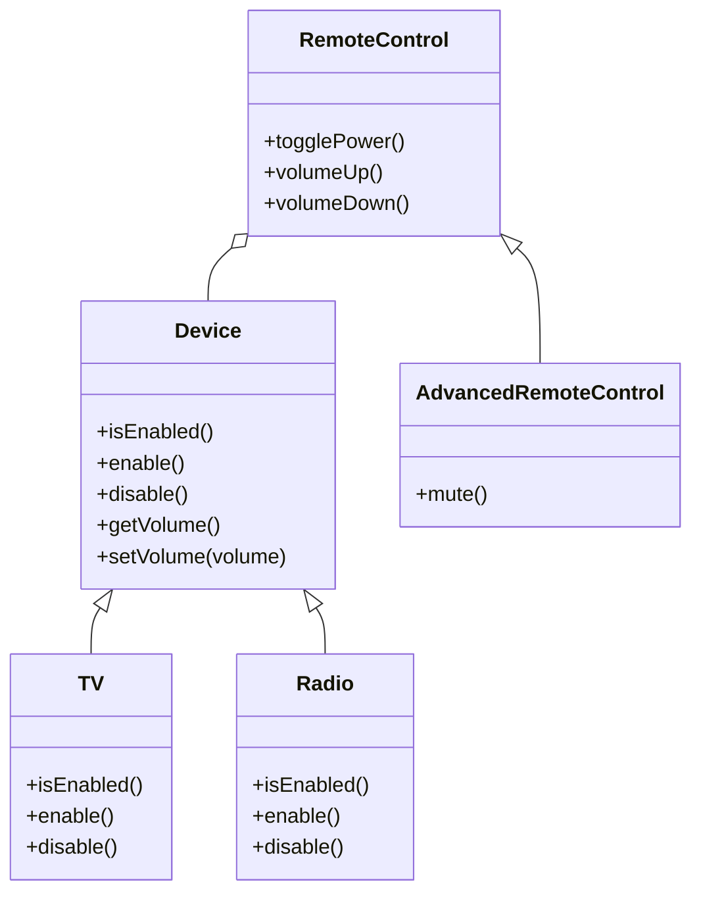

## 6.6 Bridge Pattern for Decoupling Abstractions

The Bridge Pattern is a structural design pattern that plays a crucial role in software development by decoupling an abstraction from its implementation. This separation allows both the abstraction and the implementation to evolve independently, providing flexibility and scalability in software design. In this section, we will delve into the Bridge Pattern, exploring its intent, implementation in JavaScript, and the scenarios where it proves beneficial. We will also compare it with the Adapter Pattern to highlight their differences and discuss considerations for maintaining the separation over time.

### Intent of the Bridge Pattern

The primary intent of the Bridge Pattern is to separate an abstraction from its implementation so that the two can vary independently. This pattern is particularly useful when dealing with complex systems where multiple implementations of an abstraction are required. By decoupling the abstraction from its implementation, the Bridge Pattern allows developers to change or extend either side without affecting the other, leading to more maintainable and flexible code.

### Key Participants

In the Bridge Pattern, the key participants are:

- **Abstraction**: Defines the abstraction's interface and maintains a reference to the implementor.
- **Refined Abstraction**: Extends the interface defined by the Abstraction.
- **Implementor**: Defines the interface for implementation classes.
- **Concrete Implementor**: Implements the Implementor interface.

### Applicability

The Bridge Pattern is applicable in scenarios where:

- You want to avoid a permanent binding between an abstraction and its implementation.
- Both the abstraction and implementation should be extensible by subclassing.
- Changes in the implementation of an abstraction should not affect clients.
- You want to hide the implementation details from the client.

### Sample Code Snippet

Let's explore a practical example of the Bridge Pattern in JavaScript. Consider a scenario where we have different types of devices (e.g., TV, Radio) and different types of remote controls (e.g., BasicRemote, AdvancedRemote). We want to decouple the remote control from the device so that we can mix and match them independently.

```javascript
// Implementor
class Device {
  constructor() {
    this.volume = 0;
  }

  isEnabled() {
    throw new Error("Method 'isEnabled()' must be implemented.");
  }

  enable() {
    throw new Error("Method 'enable()' must be implemented.");
  }

  disable() {
    throw new Error("Method 'disable()' must be implemented.");
  }

  getVolume() {
    return this.volume;
  }

  setVolume(volume) {
    this.volume = volume;
  }
}

// Concrete Implementor
class TV extends Device {
  constructor() {
    super();
    this.enabled = false;
  }

  isEnabled() {
    return this.enabled;
  }

  enable() {
    this.enabled = true;
  }

  disable() {
    this.enabled = false;
  }
}

// Concrete Implementor
class Radio extends Device {
  constructor() {
    super();
    this.enabled = false;
  }

  isEnabled() {
    return this.enabled;
  }

  enable() {
    this.enabled = true;
  }

  disable() {
    this.enabled = false;
  }
}

// Abstraction
class RemoteControl {
  constructor(device) {
    this.device = device;
  }

  togglePower() {
    if (this.device.isEnabled()) {
      this.device.disable();
    } else {
      this.device.enable();
    }
  }

  volumeUp() {
    this.device.setVolume(this.device.getVolume() + 10);
  }

  volumeDown() {
    this.device.setVolume(this.device.getVolume() - 10);
  }
}

// Refined Abstraction
class AdvancedRemoteControl extends RemoteControl {
  mute() {
    this.device.setVolume(0);
  }
}

// Client code
const tv = new TV();
const radio = new Radio();

const basicRemote = new RemoteControl(tv);
const advancedRemote = new AdvancedRemoteControl(radio);

basicRemote.togglePower();
console.log(`TV is ${tv.isEnabled() ? 'enabled' : 'disabled'}.`);

advancedRemote.togglePower();
advancedRemote.mute();
console.log(`Radio volume is ${radio.getVolume()}.`);
```

### Visualizing the Bridge Pattern

To better understand the Bridge Pattern, let's visualize the relationship between the abstraction and the implementation using a class diagram.



### Scenarios for Decoupling Abstraction and Implementation

Decoupling abstraction from implementation is beneficial in various scenarios, such as:

- **Supporting Multiple Platforms**: When developing applications that need to support multiple platforms, the Bridge Pattern allows you to separate platform-specific code from the core logic, making it easier to extend and maintain.
- **Enhancing Flexibility**: By decoupling the abstraction from the implementation, you can easily switch or extend implementations without affecting the abstraction, enhancing the flexibility of your codebase.
- **Reducing Complexity**: The Bridge Pattern helps reduce complexity by separating concerns, making the codebase easier to understand and manage.

### Difference Between Bridge Pattern and Adapter Pattern

While both the Bridge Pattern and the Adapter Pattern are structural design patterns, they serve different purposes:

- **Bridge Pattern**: Focuses on decoupling abstraction from implementation, allowing them to vary independently. It is used when you want to separate the interface from the implementation.
- **Adapter Pattern**: Focuses on converting the interface of a class into another interface that clients expect. It is used when you want to make incompatible interfaces compatible.

### Design Considerations

When implementing the Bridge Pattern, consider the following:

- **Maintain Separation**: Ensure that the abstraction and implementation remain separate over time to preserve the benefits of the pattern.
- **Avoid Over-Engineering**: Use the Bridge Pattern only when necessary. Over-engineering can lead to unnecessary complexity.
- **Consider Performance**: The additional layer of abstraction may introduce a slight performance overhead. Evaluate the trade-offs based on your application's requirements.

### JavaScript Unique Features

JavaScript's prototypal inheritance and dynamic typing make it a flexible language for implementing the Bridge Pattern. The ability to create and extend objects dynamically allows for seamless integration of the pattern without the need for complex class hierarchies.

### Try It Yourself

Experiment with the code example provided by modifying the devices and remote controls. Try adding new devices or remote control features to see how the Bridge Pattern facilitates easy extension and maintenance.

### Knowledge Check

To reinforce your understanding of the Bridge Pattern, consider the following questions:

- How does the Bridge Pattern enhance flexibility in software design?
- What are the key differences between the Bridge Pattern and the Adapter Pattern?
- In what scenarios would you choose to use the Bridge Pattern?

### Embrace the Journey

Remember, mastering design patterns like the Bridge Pattern is a journey. As you continue to explore and apply these patterns, you'll gain a deeper understanding of their benefits and how they can be leveraged to create robust and maintainable software. Keep experimenting, stay curious, and enjoy the journey!

## Quiz: Understanding the Bridge Pattern in JavaScript



### What is the primary intent of the Bridge Pattern?

- [x] To decouple an abstraction from its implementation so that the two can vary independently.
- [ ] To convert the interface of a class into another interface that clients expect.
- [ ] To provide a way to access the elements of an aggregate object sequentially.
- [ ] To define a family of algorithms, encapsulate each one, and make them interchangeable.

> **Explanation:** The Bridge Pattern's primary intent is to decouple an abstraction from its implementation, allowing them to vary independently.

### Which of the following is a key participant in the Bridge Pattern?

- [x] Abstraction
- [x] Implementor
- [ ] Singleton
- [ ] Adapter

> **Explanation:** The key participants in the Bridge Pattern include the Abstraction and the Implementor.

### How does the Bridge Pattern differ from the Adapter Pattern?

- [x] The Bridge Pattern decouples abstraction from implementation, while the Adapter Pattern converts interfaces.
- [ ] The Bridge Pattern is used for creating objects, while the Adapter Pattern is used for structuring code.
- [ ] The Bridge Pattern is a behavioral pattern, while the Adapter Pattern is a creational pattern.
- [ ] The Bridge Pattern is used for optimizing performance, while the Adapter Pattern is used for enhancing security.

> **Explanation:** The Bridge Pattern decouples abstraction from implementation, whereas the Adapter Pattern converts interfaces to make them compatible.

### In which scenario is the Bridge Pattern most beneficial?

- [x] When you want to avoid a permanent binding between an abstraction and its implementation.
- [ ] When you need to ensure a single instance of a class.
- [ ] When you want to provide a simplified interface to a complex subsystem.
- [ ] When you need to define a family of algorithms.

> **Explanation:** The Bridge Pattern is beneficial when you want to avoid a permanent binding between an abstraction and its implementation.

### What is a potential drawback of using the Bridge Pattern?

- [x] It may introduce a slight performance overhead due to the additional layer of abstraction.
- [ ] It can lead to tight coupling between classes.
- [ ] It makes it difficult to extend the system.
- [ ] It is not suitable for object-oriented programming.

> **Explanation:** The Bridge Pattern may introduce a slight performance overhead due to the additional layer of abstraction.

### Which of the following is a benefit of decoupling abstraction from implementation?

- [x] Enhanced flexibility and maintainability.
- [ ] Increased complexity and coupling.
- [ ] Reduced scalability and performance.
- [ ] Limited extensibility and reusability.

> **Explanation:** Decoupling abstraction from implementation enhances flexibility and maintainability.

### What is the role of the Refined Abstraction in the Bridge Pattern?

- [x] To extend the interface defined by the Abstraction.
- [ ] To implement the interface defined by the Implementor.
- [ ] To convert the interface of a class into another interface.
- [ ] To provide a simplified interface to a complex subsystem.

> **Explanation:** The Refined Abstraction extends the interface defined by the Abstraction.

### How can JavaScript's prototypal inheritance benefit the implementation of the Bridge Pattern?

- [x] It allows for dynamic creation and extension of objects without complex class hierarchies.
- [ ] It enforces strict type checking and static typing.
- [ ] It simplifies the conversion of interfaces.
- [ ] It provides built-in support for multithreading.

> **Explanation:** JavaScript's prototypal inheritance allows for dynamic creation and extension of objects, facilitating the implementation of the Bridge Pattern.

### What should be considered when maintaining the separation of abstraction and implementation over time?

- [x] Avoid over-engineering and ensure the separation remains intact.
- [ ] Merge the abstraction and implementation for simplicity.
- [ ] Use the Singleton Pattern to manage instances.
- [ ] Convert interfaces to ensure compatibility.

> **Explanation:** When maintaining the separation of abstraction and implementation, avoid over-engineering and ensure the separation remains intact.

### True or False: The Bridge Pattern is a structural design pattern.

- [x] True
- [ ] False

> **Explanation:** The Bridge Pattern is indeed a structural design pattern.


