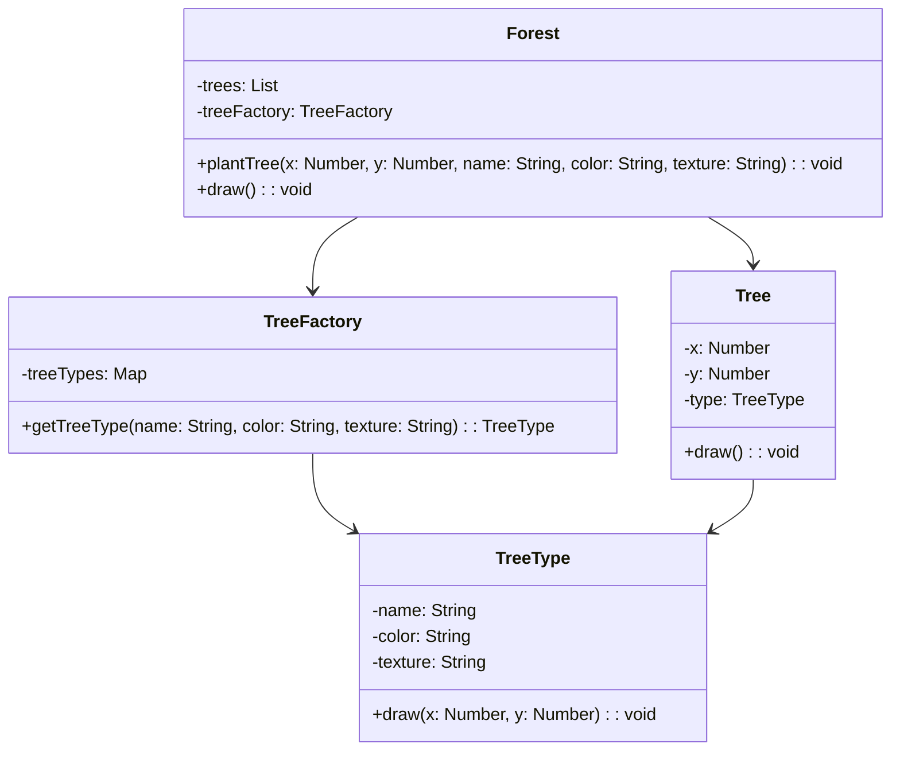

## 6.7 Flyweight Pattern for Resource Optimization

In modern web development, optimizing resource usage is crucial, especially when dealing with large numbers of similar objects. The Flyweight Pattern is a structural design pattern that helps reduce memory consumption by sharing common parts of state among multiple objects. This pattern is particularly useful in scenarios like game development, where numerous similar entities need to be rendered efficiently.

### Understanding the Flyweight Pattern

**Definition**: The Flyweight Pattern is a structural design pattern that minimizes memory usage by sharing as much data as possible with similar objects. It achieves this by separating the intrinsic state (shared) from the extrinsic state (unique to each object).

**Purpose**: The primary goal of the Flyweight Pattern is to reduce the number of objects created and to decrease memory usage and increase performance. This is accomplished by sharing common parts of the state among multiple objects instead of storing them separately.

### Key Concepts

#### Intrinsic vs. Extrinsic State

- **Intrinsic State**: This is the part of the object's state that is shared among many objects. It is stored in the flyweight object and remains constant across different contexts. For example, in a text editor, the font style and size could be intrinsic states shared by multiple characters.

- **Extrinsic State**: This is the part of the object's state that varies with the context. It is stored outside the flyweight object and passed to it when needed. Continuing with the text editor example, the position of each character on the screen would be an extrinsic state.

### Implementing the Flyweight Pattern in JavaScript

Let's explore how to implement the Flyweight Pattern in JavaScript with a practical example. We'll create a simple application that manages a large number of tree objects in a forest simulation.

#### Step-by-Step Implementation

1. **Define the Flyweight Class**: This class will contain the intrinsic state shared by multiple tree objects.

```javascript
class TreeType {
    constructor(name, color, texture) {
        this.name = name;
        this.color = color;
        this.texture = texture;
    }

    draw(x, y) {
        console.log(`Drawing a ${this.name} tree at (${x}, ${y}) with color ${this.color} and texture ${this.texture}.`);
    }
}
```

2. **Create a Flyweight Factory**: This factory will manage the flyweight objects and ensure that they are shared properly.

```javascript
class TreeFactory {
    constructor() {
        this.treeTypes = {};
    }

    getTreeType(name, color, texture) {
        const key = `${name}-${color}-${texture}`;
        if (!this.treeTypes[key]) {
            this.treeTypes[key] = new TreeType(name, color, texture);
        }
        return this.treeTypes[key];
    }
}
```

3. **Use the Flyweight Objects**: Now, let's create a forest that uses the flyweight objects to manage a large number of trees efficiently.

```javascript
class Tree {
    constructor(x, y, type) {
        this.x = x;
        this.y = y;
        this.type = type;
    }

    draw() {
        this.type.draw(this.x, this.y);
    }
}

class Forest {
    constructor() {
        this.trees = [];
        this.treeFactory = new TreeFactory();
    }

    plantTree(x, y, name, color, texture) {
        const type = this.treeFactory.getTreeType(name, color, texture);
        const tree = new Tree(x, y, type);
        this.trees.push(tree);
    }

    draw() {
        this.trees.forEach(tree => tree.draw());
    }
}

// Usage
const forest = new Forest();
forest.plantTree(10, 20, 'Oak', 'Green', 'Rough');
forest.plantTree(30, 40, 'Pine', 'Dark Green', 'Smooth');
forest.plantTree(50, 60, 'Oak', 'Green', 'Rough'); // Reuses the existing Oak tree type
forest.draw();
```

In this example, the `TreeType` class represents the intrinsic state, while the `Tree` class holds the extrinsic state (position). The `TreeFactory` ensures that each unique tree type is created only once and shared among all trees of that type.

### Visualizing the Flyweight Pattern

To better understand the Flyweight Pattern, let's visualize the relationship between the intrinsic and extrinsic states using a class diagram.



### Use Cases for the Flyweight Pattern

The Flyweight Pattern is particularly useful in scenarios where a large number of similar objects need to be created and managed efficiently. Here are some common use cases:

- **Game Development**: In games, numerous entities like trees, buildings, or characters often share common attributes. The Flyweight Pattern helps manage these entities efficiently by sharing common data.

- **Text Editors**: Characters in a document can share font styles and sizes, reducing memory usage.

- **Graphical Applications**: Applications that render complex scenes with many similar objects can benefit from the Flyweight Pattern.

### Design Considerations

While the Flyweight Pattern offers significant memory savings, it also introduces complexity in managing shared state. Here are some considerations:

- **Complexity**: Managing the separation of intrinsic and extrinsic states can be complex, especially in large applications.

- **Thread Safety**: In multi-threaded environments, shared state must be managed carefully to avoid concurrency issues.

- **Performance**: While the Flyweight Pattern reduces memory usage, it may introduce performance overhead due to the need to manage extrinsic state.

### JavaScript Unique Features

JavaScript's dynamic nature and prototypal inheritance make it well-suited for implementing the Flyweight Pattern. The ability to create and manage objects on the fly, combined with closures, allows for efficient state management.

### Differences and Similarities with Other Patterns

The Flyweight Pattern is often confused with the Singleton Pattern, as both involve shared instances. However, the Flyweight Pattern focuses on sharing parts of state among multiple objects, while the Singleton Pattern ensures a single instance of a class.

### Try It Yourself

To deepen your understanding of the Flyweight Pattern, try modifying the code example above:

- Add more tree types with different attributes.
- Experiment with different numbers of trees to observe memory usage.
- Implement a method to remove trees from the forest and observe how the flyweight objects are managed.

### Knowledge Check

To reinforce your understanding of the Flyweight Pattern, consider the following questions and exercises.

## Flyweight Pattern Quiz: Test Your Knowledge



### What is the primary purpose of the Flyweight Pattern?

- [x] To reduce memory usage by sharing common parts of state among multiple objects.
- [ ] To ensure a single instance of a class.
- [ ] To provide a simplified interface to a complex subsystem.
- [ ] To define a family of algorithms.

> **Explanation:** The Flyweight Pattern is designed to minimize memory usage by sharing common parts of state among multiple objects.

### Which of the following is an example of intrinsic state in a text editor?

- [x] Font style
- [ ] Cursor position
- [ ] Line number
- [ ] Document title

> **Explanation:** Intrinsic state is shared among many objects, such as font style in a text editor.

### In the Flyweight Pattern, what is the role of the Flyweight Factory?

- [x] To manage and share flyweight objects.
- [ ] To create unique instances of objects.
- [ ] To provide a simplified interface to a complex subsystem.
- [ ] To define a family of algorithms.

> **Explanation:** The Flyweight Factory manages and shares flyweight objects to ensure efficient memory usage.

### What is the main challenge when implementing the Flyweight Pattern?

- [x] Managing the separation of intrinsic and extrinsic states.
- [ ] Ensuring a single instance of a class.
- [ ] Providing a simplified interface to a complex subsystem.
- [ ] Defining a family of algorithms.

> **Explanation:** The main challenge is managing the separation of intrinsic and extrinsic states.

### Which of the following is a common use case for the Flyweight Pattern?

- [x] Game development
- [ ] Database management
- [ ] Network communication
- [ ] User authentication

> **Explanation:** The Flyweight Pattern is commonly used in game development to manage numerous similar entities efficiently.

### How does the Flyweight Pattern differ from the Singleton Pattern?

- [x] The Flyweight Pattern shares parts of state among multiple objects, while the Singleton Pattern ensures a single instance of a class.
- [ ] The Flyweight Pattern ensures a single instance of a class, while the Singleton Pattern shares parts of state among multiple objects.
- [ ] Both patterns ensure a single instance of a class.
- [ ] Both patterns share parts of state among multiple objects.

> **Explanation:** The Flyweight Pattern shares parts of state among multiple objects, while the Singleton Pattern ensures a single instance of a class.

### What is an example of extrinsic state in a graphical application?

- [x] Position of an object
- [ ] Color of an object
- [ ] Texture of an object
- [ ] Shape of an object

> **Explanation:** Extrinsic state varies with context, such as the position of an object in a graphical application.

### In JavaScript, what feature makes it well-suited for implementing the Flyweight Pattern?

- [x] Dynamic nature and prototypal inheritance
- [ ] Strong typing
- [ ] Static methods
- [ ] Class-based inheritance

> **Explanation:** JavaScript's dynamic nature and prototypal inheritance make it well-suited for implementing the Flyweight Pattern.

### What is a potential drawback of using the Flyweight Pattern?

- [x] Increased complexity in managing shared state
- [ ] Increased memory usage
- [ ] Decreased performance
- [ ] Limited scalability

> **Explanation:** The Flyweight Pattern can increase complexity in managing shared state.

### True or False: The Flyweight Pattern is only applicable to graphical applications.

- [ ] True
- [x] False

> **Explanation:** The Flyweight Pattern is applicable to various scenarios, not just graphical applications.



### Embrace the Journey

Remember, mastering design patterns like the Flyweight Pattern is just the beginning. As you progress, you'll build more efficient and scalable applications. Keep experimenting, stay curious, and enjoy the journey!

---
