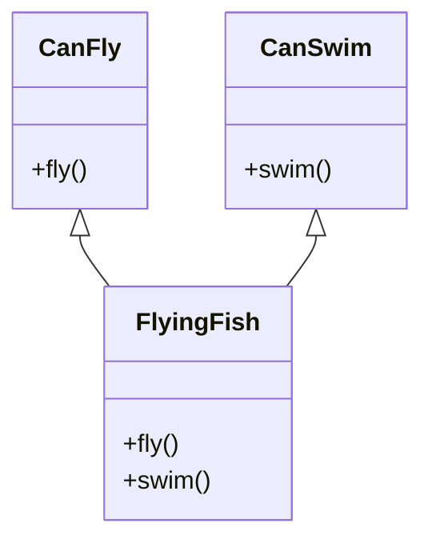

## 6.8 Mixin Pattern for Object Composition

In the world of JavaScript, where flexibility and modularity are key, the Mixin Pattern emerges as a powerful tool for object composition. This pattern allows developers to compose objects from reusable components, promoting code reuse without the constraints of classical inheritance. Let's delve into the Mixin Pattern, exploring its concepts, benefits, potential pitfalls, and its relevance in modern JavaScript development.

### What Are Mixins?

Mixins are a design pattern used to add functionality to objects or classes. Unlike classical inheritance, where a class inherits from a single parent class, mixins allow an object to borrow methods and properties from multiple sources. This approach provides a flexible way to compose behaviors and functionalities without the rigid hierarchy imposed by inheritance.

#### Key Characteristics of Mixins

- **Reusability**: Mixins promote code reuse by allowing the same functionality to be shared across different objects or classes.
- **Modularity**: They enable modular design by separating concerns into distinct, reusable components.
- **Flexibility**: Mixins offer flexibility in composing objects, as they can be applied selectively and combined in various ways.

### Mixins vs. Classical Inheritance

Classical inheritance involves creating a hierarchy of classes where a subclass inherits properties and methods from a parent class. While this approach is effective for some scenarios, it can lead to issues such as the "diamond problem" and tight coupling between classes.

Mixins, on the other hand, provide a way to compose objects without the constraints of a strict hierarchy. They allow for the combination of behaviors from multiple sources, offering a more flexible and modular approach to object composition.

### Composing Objects Using Mixins

Let's explore how to use mixins to compose objects in JavaScript. We'll start with a simple example and gradually build upon it.

#### Basic Mixin Example

Consider a scenario where we have two mixins: `CanFly` and `CanSwim`. We want to create an object that can both fly and swim.

```javascript
// Define the CanFly mixin
const CanFly = {
  fly() {
    console.log("Flying high!");
  }
};

// Define the CanSwim mixin
const CanSwim = {
  swim() {
    console.log("Swimming in the water!");
  }
};

// Create an object that uses both mixins
const flyingFish = Object.assign({}, CanFly, CanSwim);

// Use the composed object
flyingFish.fly();  // Output: Flying high!
flyingFish.swim(); // Output: Swimming in the water!
```

In this example, we use `Object.assign()` to combine the `CanFly` and `CanSwim` mixins into a single object, `flyingFish`. This object can now perform both flying and swimming actions.

#### Mixins with ES6 Classes

With the introduction of ES6 classes, mixins can be applied to class-based structures as well. This allows for a more structured approach to using mixins in modern JavaScript.

```javascript
// Define a mixin function
function withFlying(Base) {
  return class extends Base {
    fly() {
      console.log("Flying high!");
    }
  };
}

function withSwimming(Base) {
  return class extends Base {
    swim() {
      console.log("Swimming in the water!");
    }
  };
}

// Base class
class Animal {
  constructor(name) {
    this.name = name;
  }
}

// Compose a new class using mixins
class FlyingFish extends withFlying(withSwimming(Animal)) {}

// Create an instance of the composed class
const flyingFish = new FlyingFish("Flying Fish");

// Use the composed class
flyingFish.fly();  // Output: Flying high!
flyingFish.swim(); // Output: Swimming in the water!
```

In this example, we define mixin functions `withFlying` and `withSwimming` that extend a base class with additional methods. We then compose a new class, `FlyingFish`, by applying these mixins to the `Animal` class.

### Benefits of Mixins

Mixins offer several benefits that make them a valuable tool in JavaScript development:

- **Code Reuse**: Mixins allow developers to reuse code across different objects or classes, reducing duplication and promoting DRY (Don't Repeat Yourself) principles.
- **Modularity**: By separating functionalities into distinct mixins, developers can create modular code that is easier to maintain and extend.
- **Flexibility**: Mixins provide the flexibility to compose objects in various ways, allowing for dynamic and adaptable designs.

### Potential Issues with Mixins

While mixins offer many advantages, they also come with potential pitfalls that developers should be aware of:

#### Name Collisions

When combining multiple mixins, there is a risk of name collisions, where two mixins define methods or properties with the same name. This can lead to unexpected behavior and bugs.

**Managing Name Collisions**

To manage name collisions, developers can:

- **Rename Methods**: Rename conflicting methods in one of the mixins to avoid collisions.
- **Use Namespaces**: Organize methods within namespaces to prevent conflicts.
- **Override Methods**: Explicitly override methods in the composed object or class to resolve conflicts.

#### Complexity

As the number of mixins increases, the complexity of the codebase can grow, making it harder to understand and maintain. It's important to strike a balance between using mixins for flexibility and keeping the codebase manageable.

### Relevance of Mixins with ES6 Classes

With the advent of ES6 classes, mixins remain relevant as a tool for composing behaviors in a class-based structure. They complement the class syntax by providing a way to extend classes with additional functionalities without resorting to inheritance.

### Visualizing Mixins

To better understand how mixins work, let's visualize the process of composing objects using mixins.



In this diagram, we see how the `FlyingFish` class inherits methods from both the `CanFly` and `CanSwim` mixins, illustrating the composition of behaviors.

### Try It Yourself

To deepen your understanding of mixins, try modifying the examples provided:

- **Add a new mixin**: Create a `CanDive` mixin and compose it with the existing mixins.
- **Handle name collisions**: Introduce a method with the same name in two mixins and resolve the conflict.
- **Experiment with ES6 classes**: Apply mixins to different base classes and observe the behavior.

### References and Further Reading

- [MDN Web Docs: Mixins](https://developer.mozilla.org/en-US/docs/Web/JavaScript/Guide/Inheritance_and_the_prototype_chain#mixins)
- [JavaScript Info: Mixins](https://javascript.info/mixins)
- [W3Schools: JavaScript Classes](https://www.w3schools.com/js/js_classes.asp)

### Knowledge Check

Let's test your understanding of the Mixin Pattern with a quiz.

## Mixin Pattern Quiz



### What is a mixin in JavaScript?

- [x] A design pattern that allows objects to borrow methods and properties from multiple sources.
- [ ] A class that inherits from a single parent class.
- [ ] A function that returns a new object.
- [ ] A method for creating private variables.

> **Explanation:** A mixin is a design pattern that allows objects to borrow methods and properties from multiple sources, promoting code reuse and flexibility.

### How do mixins differ from classical inheritance?

- [x] Mixins allow for composition from multiple sources, while classical inheritance involves a single parent class.
- [ ] Mixins are only used in ES6 classes.
- [ ] Classical inheritance is more flexible than mixins.
- [ ] Mixins require a strict hierarchy.

> **Explanation:** Mixins allow for composition from multiple sources, offering more flexibility than classical inheritance, which involves a single parent class.

### What is a potential issue with using mixins?

- [x] Name collisions between methods in different mixins.
- [ ] Inability to reuse code.
- [ ] Lack of flexibility in object composition.
- [ ] Difficulty in creating modular code.

> **Explanation:** A potential issue with using mixins is name collisions, where methods in different mixins have the same name, leading to conflicts.

### How can name collisions in mixins be managed?

- [x] By renaming methods, using namespaces, or overriding methods.
- [ ] By avoiding the use of mixins altogether.
- [ ] By using only one mixin at a time.
- [ ] By creating a strict class hierarchy.

> **Explanation:** Name collisions in mixins can be managed by renaming methods, using namespaces, or explicitly overriding methods.

### What is a benefit of using mixins?

- [x] They promote code reuse and modularity.
- [ ] They enforce a strict class hierarchy.
- [ ] They prevent name collisions.
- [ ] They make code less flexible.

> **Explanation:** Mixins promote code reuse and modularity by allowing functionalities to be shared across different objects or classes.

### How can mixins be applied to ES6 classes?

- [x] By using mixin functions that extend a base class with additional methods.
- [ ] By inheriting directly from the mixin.
- [ ] By using the `super` keyword.
- [ ] By creating a new class for each mixin.

> **Explanation:** Mixins can be applied to ES6 classes by using mixin functions that extend a base class with additional methods.

### What is the purpose of the `Object.assign()` method in mixins?

- [x] To combine multiple mixins into a single object.
- [ ] To create a new class from a mixin.
- [ ] To define a new method in a mixin.
- [ ] To enforce a strict class hierarchy.

> **Explanation:** The `Object.assign()` method is used to combine multiple mixins into a single object, allowing for the composition of behaviors.

### What is a key characteristic of mixins?

- [x] They provide flexibility in composing objects.
- [ ] They enforce a strict class hierarchy.
- [ ] They prevent code reuse.
- [ ] They make code less modular.

> **Explanation:** A key characteristic of mixins is that they provide flexibility in composing objects, allowing for dynamic and adaptable designs.

### Can mixins be used with ES6 classes?

- [x] Yes
- [ ] No

> **Explanation:** Yes, mixins can be used with ES6 classes by applying mixin functions to extend a base class with additional functionalities.

### True or False: Mixins are only applicable in JavaScript.

- [ ] True
- [x] False

> **Explanation:** False. Mixins are a design pattern that can be applied in various programming languages, not just JavaScript.



Remember, mastering the Mixin Pattern is just one step in your journey to becoming a proficient JavaScript developer. Keep experimenting, stay curious, and enjoy the process of learning and building with JavaScript!
