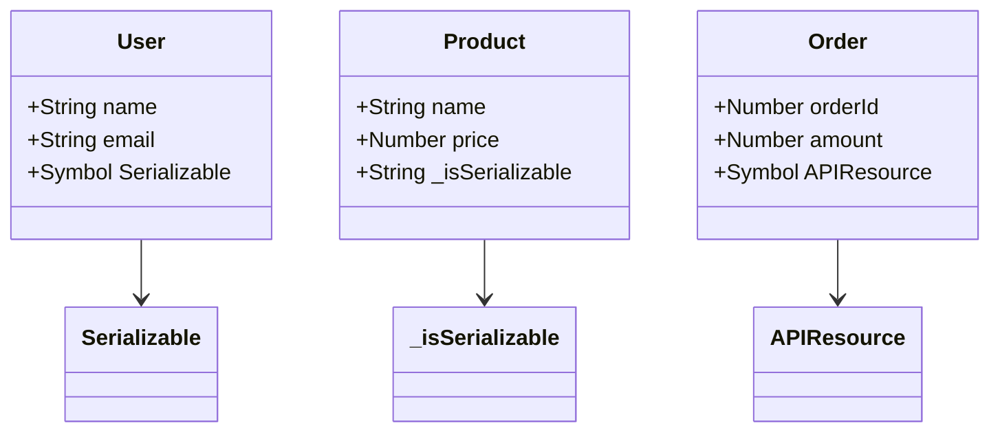

## 6.9 Marker Interfaces in JavaScript

In the world of software design patterns, marker interfaces play a unique role. Traditionally found in statically typed languages like Java, marker interfaces are used to indicate that a class or object possesses certain properties or should adhere to specific behaviors. However, JavaScript, being a dynamically typed language, does not support interfaces in the traditional sense. This section explores how we can simulate marker interfaces in JavaScript, their use cases, and alternative approaches to achieve similar outcomes.

### What Are Marker Interfaces?

Marker interfaces are a type of interface that do not contain any methods or fields. Instead, they serve as a tagging mechanism to indicate that a class or object should be treated in a particular way. For example, in Java, the `Serializable` interface is a marker interface that indicates an object can be serialized.

#### Intent

- **Tagging**: To mark a class or object with a specific property or capability.
- **Behavior Enforcement**: To enforce certain behaviors or constraints at runtime.
- **Code Clarity**: To improve code readability and maintainability by clearly indicating the intended use of a class or object.

### Simulating Marker Interfaces in JavaScript

JavaScript's dynamic nature allows us to simulate marker interfaces using various techniques. Let's explore some of these methods.

#### Using Symbols

Symbols in JavaScript are unique and immutable data types that can be used as keys for object properties. They provide a way to create hidden properties that can act as markers.

```javascript
// Define a unique symbol to act as a marker
const Serializable = Symbol('Serializable');

// Create a class and mark it with the symbol
class User {
  constructor(name, email) {
    this.name = name;
    this.email = email;
    this[Serializable] = true; // Mark the class as Serializable
  }
}

// Function to check if an object is marked as Serializable
function isSerializable(obj) {
  return obj[Serializable] === true;
}

// Example usage
const user = new User('Alice', 'alice@example.com');
console.log(isSerializable(user)); // Output: true
```

In this example, we use a symbol to mark the `User` class as `Serializable`. The `isSerializable` function checks for the presence of this symbol to determine if an object is serializable.

#### Using Properties

Another approach is to use a specific property to act as a marker. This method is simpler but less secure, as properties can be easily overwritten.

```javascript
// Define a marker property
const MARKER_PROPERTY = '_isSerializable';

// Create a class and add the marker property
class Product {
  constructor(name, price) {
    this.name = name;
    this.price = price;
    this[MARKER_PROPERTY] = true; // Mark the class as Serializable
  }
}

// Function to check if an object is marked as Serializable
function isSerializable(obj) {
  return obj[MARKER_PROPERTY] === true;
}

// Example usage
const product = new Product('Laptop', 1200);
console.log(isSerializable(product)); // Output: true
```

Here, we use a property `_isSerializable` to mark the `Product` class. The `isSerializable` function checks for this property to determine if an object is serializable.

### Use Cases for Marker Interfaces

Marker interfaces can be beneficial in various scenarios, particularly when you want to enforce certain behaviors or improve code clarity.

#### Enforcing Serialization

In applications where serialization is required, marker interfaces can help ensure that only marked objects are serialized.

```javascript
function serialize(obj) {
  if (!isSerializable(obj)) {
    throw new Error('Object is not serializable');
  }
  return JSON.stringify(obj);
}

const user = new User('Bob', 'bob@example.com');
console.log(serialize(user)); // Output: JSON string of the user object
```

In this example, the `serialize` function checks if an object is marked as serializable before proceeding with serialization.

#### Enhancing Code Clarity

Marker interfaces can also enhance code clarity by clearly indicating the intended use of a class or object.

```javascript
// Define a marker for API resources
const APIResource = Symbol('APIResource');

// Create a class and mark it as an API resource
class Order {
  constructor(orderId, amount) {
    this.orderId = orderId;
    this.amount = amount;
    this[APIResource] = true; // Mark the class as an API resource
  }
}

// Function to check if an object is an API resource
function isAPIResource(obj) {
  return obj[APIResource] === true;
}

// Example usage
const order = new Order(123, 250);
console.log(isAPIResource(order)); // Output: true
```

Here, we use a marker to indicate that the `Order` class is an API resource, improving code readability and maintainability.

### Alternative Approaches

Given JavaScript's dynamic nature, there are alternative approaches to achieve similar outcomes as marker interfaces.

#### Using TypeScript

TypeScript, a statically typed superset of JavaScript, provides interfaces that can be used to enforce type constraints at compile time.

```typescript
interface Serializable {
  serialize(): string;
}

class User implements Serializable {
  constructor(public name: string, public email: string) {}

  serialize(): string {
    return JSON.stringify(this);
  }
}

const user = new User('Charlie', 'charlie@example.com');
console.log(user.serialize()); // Output: JSON string of the user object
```

In this TypeScript example, we define a `Serializable` interface with a `serialize` method. The `User` class implements this interface, ensuring that it provides a `serialize` method.

#### Using Decorators

Decorators, a proposed feature in JavaScript, can be used to add metadata to classes and methods, simulating marker interfaces.

```javascript
function Serializable(target) {
  target.prototype.isSerializable = true;
}

@Serializable
class Customer {
  constructor(name, age) {
    this.name = name;
    this.age = age;
  }
}

const customer = new Customer('Dave', 30);
console.log(customer.isSerializable); // Output: true
```

In this example, we use a decorator to add a `isSerializable` property to the `Customer` class, marking it as serializable.

### Design Considerations

When using marker interfaces in JavaScript, consider the following:

- **Security**: Symbols provide a more secure way to mark objects compared to properties, as they are unique and less likely to be overwritten.
- **Performance**: Checking for markers can introduce a small performance overhead, especially in performance-critical applications.
- **Readability**: Marker interfaces can improve code readability by clearly indicating the intended use of a class or object.

### JavaScript Unique Features

JavaScript's dynamic nature and features like symbols and decorators provide flexible ways to simulate marker interfaces. These features allow developers to implement marker interfaces without the need for traditional interfaces found in statically typed languages.

### Differences and Similarities

Marker interfaces are often confused with other design patterns like decorators and mixins. While decorators and mixins add functionality to classes, marker interfaces serve as a tagging mechanism without adding any behavior.

### Visualizing Marker Interfaces

To better understand how marker interfaces work in JavaScript, let's visualize the process using a class diagram.



In this diagram, we see how different classes are marked with symbols or properties to indicate their capabilities.

### Try It Yourself

Experiment with the code examples provided in this section. Try modifying the marker symbols or properties to see how they affect the behavior of the classes. Consider adding new markers to enforce different behaviors or capabilities.

### Knowledge Check

To reinforce your understanding of marker interfaces in JavaScript, try answering the following questions:

## Understanding Marker Interfaces in JavaScript: Quiz



### What is a marker interface in JavaScript?

- [x] A tagging mechanism to indicate certain properties or behaviors
- [ ] An interface with methods and fields
- [ ] A class that implements specific methods
- [ ] A function that returns an object

> **Explanation:** Marker interfaces are used as a tagging mechanism to indicate that a class or object possesses certain properties or should adhere to specific behaviors.

### How can you simulate marker interfaces in JavaScript?

- [x] Using symbols
- [x] Using properties
- [ ] Using arrays
- [ ] Using functions

> **Explanation:** Marker interfaces can be simulated using symbols or properties to mark classes or objects.

### What is a benefit of using symbols for marker interfaces?

- [x] Symbols are unique and less likely to be overwritten
- [ ] Symbols are faster than properties
- [ ] Symbols are easier to read
- [ ] Symbols are compatible with all browsers

> **Explanation:** Symbols are unique and immutable, making them a secure way to mark objects without the risk of being overwritten.

### Which of the following is an alternative approach to marker interfaces in JavaScript?

- [x] Using TypeScript interfaces
- [ ] Using arrays
- [ ] Using loops
- [ ] Using strings

> **Explanation:** TypeScript interfaces provide a way to enforce type constraints at compile time, serving as an alternative to marker interfaces.

### What is a potential drawback of using marker interfaces in JavaScript?

- [x] Performance overhead
- [ ] Increased readability
- [ ] Improved security
- [ ] Enhanced functionality

> **Explanation:** Checking for markers can introduce a small performance overhead, especially in performance-critical applications.

### What is the purpose of a marker interface?

- [x] To tag a class or object with a specific property or capability
- [ ] To add methods to a class
- [ ] To create a new object
- [ ] To delete an object

> **Explanation:** Marker interfaces are used to tag a class or object with a specific property or capability, without adding any methods or fields.

### How can decorators be used in relation to marker interfaces?

- [x] To add metadata to classes and methods
- [ ] To remove properties from objects
- [ ] To create new functions
- [ ] To delete classes

> **Explanation:** Decorators can be used to add metadata to classes and methods, simulating marker interfaces.

### What is a key difference between marker interfaces and decorators?

- [x] Marker interfaces serve as a tagging mechanism, while decorators add functionality
- [ ] Marker interfaces add methods, while decorators do not
- [ ] Marker interfaces are faster than decorators
- [ ] Marker interfaces are more secure than decorators

> **Explanation:** Marker interfaces serve as a tagging mechanism without adding any behavior, while decorators add functionality to classes.

### Which JavaScript feature provides a secure way to mark objects?

- [x] Symbols
- [ ] Arrays
- [ ] Strings
- [ ] Numbers

> **Explanation:** Symbols provide a secure way to mark objects, as they are unique and less likely to be overwritten.

### True or False: Marker interfaces in JavaScript can improve code clarity.

- [x] True
- [ ] False

> **Explanation:** Marker interfaces can improve code clarity by clearly indicating the intended use of a class or object.



### Embrace the Journey

Remember, this is just the beginning. As you progress, you'll discover more ways to leverage JavaScript's dynamic features to create robust and maintainable code. Keep experimenting, stay curious, and enjoy the journey!
