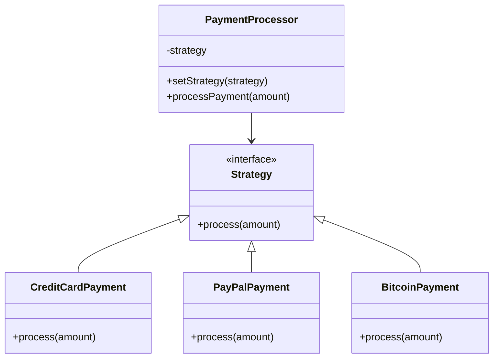

## 7.1 Strategy Pattern with Dynamic Functions

### Introduction to the Strategy Pattern

The Strategy Pattern is a behavioral design pattern that enables selecting an algorithm's behavior at runtime. This pattern promotes flexibility and reusability by encapsulating each algorithm within a separate object or function. By doing so, it allows for the dynamic swapping of strategies without altering the client code that uses them. This is particularly useful in scenarios where multiple algorithms can be applied to a problem, and the choice of algorithm might depend on runtime conditions.

### Intent of the Strategy Pattern

The primary intent of the Strategy Pattern is to define a family of algorithms, encapsulate each one, and make them interchangeable. This pattern allows the algorithm to vary independently from the clients that use it. By decoupling the algorithm from the client, the Strategy Pattern provides a way to configure a class with one of many behaviors.

### Dynamic Strategy Selection in JavaScript

JavaScript, with its first-class functions and dynamic typing, is particularly well-suited for implementing the Strategy Pattern. Strategies can be represented as functions or classes, and they can be swapped dynamically at runtime. This flexibility allows developers to write more maintainable and adaptable code.

#### Implementing the Strategy Pattern with Functions

Let's explore how to implement the Strategy Pattern using functions in JavaScript. We'll start with a simple example involving a payment processing system that can handle different payment methods.

```javascript
// Define strategy functions
function creditCardPayment(amount) {
    console.log(`Processing credit card payment of $${amount}`);
}

function paypalPayment(amount) {
    console.log(`Processing PayPal payment of $${amount}`);
}

function bitcoinPayment(amount) {
    console.log(`Processing Bitcoin payment of $${amount}`);
}

// Context that uses the strategy
class PaymentProcessor {
    constructor(strategy) {
        this.strategy = strategy;
    }

    setStrategy(strategy) {
        this.strategy = strategy;
    }

    processPayment(amount) {
        this.strategy(amount);
    }
}

// Usage
const paymentProcessor = new PaymentProcessor(creditCardPayment);
paymentProcessor.processPayment(100); // Processing credit card payment of $100

paymentProcessor.setStrategy(paypalPayment);
paymentProcessor.processPayment(200); // Processing PayPal payment of $200

paymentProcessor.setStrategy(bitcoinPayment);
paymentProcessor.processPayment(300); // Processing Bitcoin payment of $300
```

In this example, we define three different payment strategies as functions. The `PaymentProcessor` class acts as the context that uses these strategies. We can dynamically change the payment strategy by calling the `setStrategy` method.

#### Implementing the Strategy Pattern with Classes

Alternatively, we can implement the Strategy Pattern using classes. This approach is beneficial when strategies require more complex logic or state.

```javascript
// Define strategy classes
class CreditCardPayment {
    process(amount) {
        console.log(`Processing credit card payment of $${amount}`);
    }
}

class PayPalPayment {
    process(amount) {
        console.log(`Processing PayPal payment of $${amount}`);
    }
}

class BitcoinPayment {
    process(amount) {
        console.log(`Processing Bitcoin payment of $${amount}`);
    }
}

// Context that uses the strategy
class PaymentProcessor {
    constructor(strategy) {
        this.strategy = strategy;
    }

    setStrategy(strategy) {
        this.strategy = strategy;
    }

    processPayment(amount) {
        this.strategy.process(amount);
    }
}

// Usage
const paymentProcessor = new PaymentProcessor(new CreditCardPayment());
paymentProcessor.processPayment(100); // Processing credit card payment of $100

paymentProcessor.setStrategy(new PayPalPayment());
paymentProcessor.processPayment(200); // Processing PayPal payment of $200

paymentProcessor.setStrategy(new BitcoinPayment());
paymentProcessor.processPayment(300); // Processing Bitcoin payment of $300
```

In this version, each strategy is encapsulated within a class that implements a `process` method. The `PaymentProcessor` class interacts with these strategy classes in the same way as before.

### Use Cases for the Strategy Pattern

The Strategy Pattern is versatile and can be applied to various scenarios. Here are some common use cases:

1. **Sorting Algorithms**: Implement different sorting strategies (e.g., quicksort, mergesort) and select the appropriate one based on the dataset size or characteristics.

2. **Input Validation**: Use different validation strategies for form inputs, allowing for flexible validation rules that can be changed at runtime.

3. **Payment Processing**: As demonstrated in the examples, handle multiple payment methods by encapsulating each method's logic in a separate strategy.

4. **Compression Algorithms**: Choose between different compression strategies based on file type or size.

5. **Data Transformation**: Apply different data transformation strategies to datasets, such as filtering, mapping, or reducing.

### Importance of a Consistent Interface

For the Strategy Pattern to work effectively, all strategies must adhere to a consistent interface. This ensures that the context can interact with any strategy interchangeably without needing to know the details of each strategy's implementation. In JavaScript, this can be achieved by ensuring that all strategy functions or classes implement the same method signature.

### Benefits of the Strategy Pattern

The Strategy Pattern offers several benefits:

- **Flexibility**: Easily switch between different algorithms at runtime without modifying the client code.
- **Reusability**: Encapsulate algorithms in separate objects or functions, promoting code reuse.
- **Maintainability**: Reduce complex conditional statements by delegating algorithm selection to the strategy pattern.
- **Scalability**: Add new strategies without altering existing code, making it easier to extend functionality.

### Reducing Conditional Statements

One of the key advantages of the Strategy Pattern is its ability to reduce conditional statements in your code. Instead of using `if...else` or `switch` statements to select an algorithm, you can delegate this responsibility to the strategy pattern. This leads to cleaner, more maintainable code.

### JavaScript Unique Features

JavaScript's dynamic nature and first-class functions make it particularly well-suited for implementing the Strategy Pattern. The ability to pass functions as arguments and assign them to variables allows for a flexible and concise implementation of strategies.

### Differences and Similarities with Other Patterns

The Strategy Pattern is often compared to the State Pattern. While both patterns involve changing behavior at runtime, the Strategy Pattern focuses on selecting algorithms, whereas the State Pattern deals with changing an object's state. Additionally, the Strategy Pattern is more about encapsulating algorithms, while the State Pattern is about managing state transitions.

### Visualizing the Strategy Pattern

To better understand the Strategy Pattern, let's visualize the interaction between the context and strategies using a class diagram.



In this diagram, the `PaymentProcessor` class depends on the `Strategy` interface, which is implemented by the `CreditCardPayment`, `PayPalPayment`, and `BitcoinPayment` classes. This setup allows the `PaymentProcessor` to use any of these strategies interchangeably.

### Try It Yourself

To deepen your understanding of the Strategy Pattern, try modifying the code examples to include additional payment methods or different types of algorithms. Experiment with both function-based and class-based implementations to see which approach works best for your use case.

### Knowledge Check

- What is the primary intent of the Strategy Pattern?
- How does the Strategy Pattern promote flexibility and reusability?
- Why is a consistent interface important for interchangeable strategies?
- How can the Strategy Pattern reduce conditional statements in your code?
- What are some common use cases for the Strategy Pattern?

### Summary

The Strategy Pattern is a powerful tool for enhancing flexibility and reusability in your JavaScript applications. By encapsulating algorithms within separate objects or functions, you can dynamically select and swap strategies at runtime, leading to cleaner, more maintainable code. Remember, this is just the beginning. As you progress, you'll discover more ways to apply the Strategy Pattern to solve complex problems. Keep experimenting, stay curious, and enjoy the journey!

## Quiz: Mastering the Strategy Pattern in JavaScript



### What is the primary intent of the Strategy Pattern?

- [x] To define a family of algorithms, encapsulate each one, and make them interchangeable.
- [ ] To manage object state transitions.
- [ ] To create a single instance of a class.
- [ ] To provide a way to access elements of an aggregate object sequentially.

> **Explanation:** The Strategy Pattern's primary intent is to define a family of algorithms, encapsulate each one, and make them interchangeable, allowing the algorithm to vary independently from the clients that use it.

### How does the Strategy Pattern promote flexibility?

- [x] By allowing algorithms to be selected and swapped at runtime.
- [ ] By enforcing a strict class hierarchy.
- [ ] By using static methods for all operations.
- [ ] By requiring all strategies to be implemented as classes.

> **Explanation:** The Strategy Pattern promotes flexibility by allowing algorithms to be selected and swapped at runtime, enabling dynamic behavior changes without altering client code.

### Why is a consistent interface important for strategies?

- [x] It ensures that the context can interact with any strategy interchangeably.
- [ ] It allows for the use of global variables.
- [ ] It simplifies the implementation of singleton patterns.
- [ ] It enables the use of private methods in strategies.

> **Explanation:** A consistent interface is important because it ensures that the context can interact with any strategy interchangeably, without needing to know the details of each strategy's implementation.

### What is a common use case for the Strategy Pattern?

- [x] Payment processing with multiple payment methods.
- [ ] Managing object state transitions.
- [ ] Creating a single instance of a class.
- [ ] Accessing elements of an aggregate object sequentially.

> **Explanation:** A common use case for the Strategy Pattern is payment processing with multiple payment methods, where each method is encapsulated as a separate strategy.

### How can the Strategy Pattern reduce conditional statements?

- [x] By delegating algorithm selection to the strategy pattern.
- [ ] By using more `if...else` statements.
- [ ] By implementing all strategies as static methods.
- [ ] By enforcing a strict class hierarchy.

> **Explanation:** The Strategy Pattern can reduce conditional statements by delegating algorithm selection to the strategy pattern, leading to cleaner, more maintainable code.

### What is a key benefit of the Strategy Pattern?

- [x] It enhances code maintainability by reducing complex conditional statements.
- [ ] It enforces a strict class hierarchy.
- [ ] It requires all strategies to be implemented as classes.
- [ ] It simplifies the implementation of singleton patterns.

> **Explanation:** A key benefit of the Strategy Pattern is that it enhances code maintainability by reducing complex conditional statements, making the code cleaner and easier to manage.

### Which JavaScript feature makes it well-suited for the Strategy Pattern?

- [x] First-class functions and dynamic typing.
- [ ] Static typing and class inheritance.
- [ ] Global variables and static methods.
- [ ] Strict class hierarchies and private methods.

> **Explanation:** JavaScript's first-class functions and dynamic typing make it well-suited for the Strategy Pattern, allowing for flexible and concise implementation of strategies.

### What is the difference between the Strategy and State Patterns?

- [x] Strategy focuses on selecting algorithms, while State deals with changing an object's state.
- [ ] Strategy manages object state transitions, while State selects algorithms.
- [ ] Strategy creates a single instance of a class, while State provides sequential access to elements.
- [ ] Strategy enforces a strict class hierarchy, while State uses static methods.

> **Explanation:** The Strategy Pattern focuses on selecting algorithms, while the State Pattern deals with changing an object's state, making them suitable for different scenarios.

### How can you implement the Strategy Pattern in JavaScript?

- [x] By using functions or classes to represent strategies.
- [ ] By using global variables for all strategies.
- [ ] By implementing all strategies as static methods.
- [ ] By enforcing a strict class hierarchy.

> **Explanation:** In JavaScript, the Strategy Pattern can be implemented using functions or classes to represent strategies, allowing for flexible and dynamic behavior changes.

### True or False: The Strategy Pattern is only applicable to sorting algorithms.

- [x] False
- [ ] True

> **Explanation:** False. The Strategy Pattern is not limited to sorting algorithms; it can be applied to various scenarios, such as payment processing, input validation, and data transformation.




