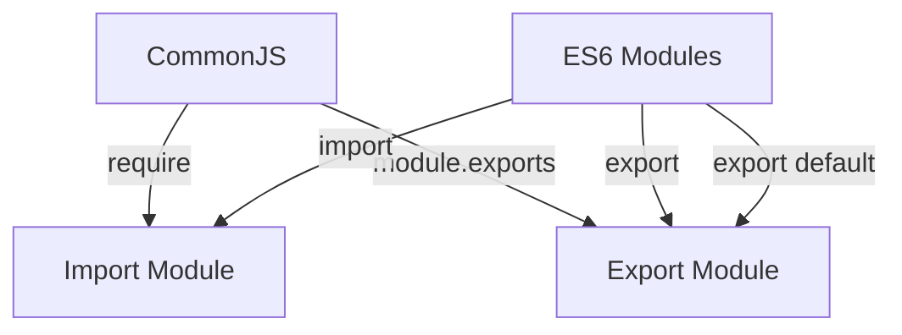

## 7. Node.js Specific Patterns
### 7.1 Module System and Exports

In the world of JavaScript and TypeScript, modularity is a key concept that enhances code organization, reusability, and maintainability. Node.js, a popular runtime for executing JavaScript on the server side, supports two primary module systems: CommonJS and ES6 Modules. This section delves into these systems, providing insights into their usage, differences, and practical applications.

## Understand the Concepts

### CommonJS Modules

Node.js initially adopted the CommonJS module system, which is characterized by its synchronous nature and simplicity. CommonJS uses the `require` function to import modules and `module.exports` or `exports` to export them.

### ES6 Modules

With the advent of ECMAScript 2015 (ES6), JavaScript introduced a standardized module system. ES6 modules use `import` and `export` statements, offering a more flexible and asynchronous approach to module management. This system is now widely used in modern JavaScript development.

## Implementation Steps

### For CommonJS

1. **Importing Modules:**
   - Use the `require('module')` function to import modules.
   - Example: `const fs = require('fs');`

2. **Exporting Modules:**
   - Use `module.exports` to export a single entity.
   - Use `exports` to export multiple entities.

```javascript
// math.js
exports.add = (a, b) => a + b;
exports.subtract = (a, b) => a - b;

// app.js
const math = require('./math');
console.log(math.add(2, 3)); // Output: 5
```

### For ES6 Modules

1. **Importing Modules:**
   - Use `import` statements to bring in modules.
   - Example: `import fs from 'fs';`

2. **Exporting Modules:**
   - Use `export` to export multiple entities.
   - Use `export default` to export a single entity.

```javascript
// math.js
export const add = (a, b) => a + b;
export const subtract = (a, b) => a - b;

// app.js
import { add, subtract } from './math.js';
console.log(add(2, 3)); // Output: 5
```

## Code Examples

### Simple Module Export and Import

#### CommonJS Example

```javascript
// greet.js
module.exports = function(name) {
    return `Hello, ${name}!`;
};

// app.js
const greet = require('./greet');
console.log(greet('World')); // Output: Hello, World!
```

#### ES6 Module Example

```javascript
// greet.js
export default function(name) {
    return `Hello, ${name}!`;
}

// app.js
import greet from './greet.js';
console.log(greet('World')); // Output: Hello, World!
```

### Converting CommonJS to ES6 Module

#### CommonJS

```javascript
// utils.js
exports.square = (x) => x * x;
exports.cube = (x) => x * x * x;
```

#### ES6 Module

```javascript
// utils.js
export const square = (x) => x * x;
export const cube = (x) => x * x * x;
```

## Use Cases

- **Organizing Code:** Modules help in organizing code into reusable components, making it easier to maintain and scale applications.
- **Code Sharing:** Modules facilitate code sharing between files and across projects, promoting DRY (Don't Repeat Yourself) principles.

## Practice

Create a utility library with multiple functions and import them where needed. For instance, a string manipulation library:

```javascript
// stringUtils.js
export const capitalize = (str) => str.charAt(0).toUpperCase() + str.slice(1);
export const reverse = (str) => str.split('').reverse().join('');

// app.js
import { capitalize, reverse } from './stringUtils.js';
console.log(capitalize('hello')); // Output: Hello
console.log(reverse('hello')); // Output: olleh
```

## Considerations

- **Node.js vs. Browsers:** Node.js natively supports CommonJS, while browsers require tools like Babel or Webpack to transpile ES6 modules.
- **Compatibility:** Ensure compatibility across environments by understanding how module bundlers and transpilers work.

## Visual Aids

### Module System Comparison



## Conclusion

Understanding the module systems in Node.js is crucial for building scalable and maintainable applications. By mastering CommonJS and ES6 modules, developers can effectively organize their code and leverage modern JavaScript features. As you continue to explore Node.js, consider the implications of each module system and choose the one that best fits your project's needs.

## Quiz Time!



### What is the primary module system used by Node.js?

- [x] CommonJS
- [ ] AMD
- [ ] UMD
- [ ] SystemJS

> **Explanation:** Node.js primarily uses the CommonJS module system for importing and exporting modules.

### Which statement is used to import modules in ES6?

- [ ] require
- [x] import
- [ ] include
- [ ] fetch

> **Explanation:** ES6 modules use the `import` statement to bring in modules.

### How do you export multiple entities in a CommonJS module?

- [ ] export
- [ ] export default
- [x] exports
- [ ] module.imports

> **Explanation:** In CommonJS, you use `exports` to export multiple entities.

### What is the syntax to export a single entity in ES6 modules?

- [ ] module.exports
- [ ] exports
- [ ] require
- [x] export default

> **Explanation:** The `export default` statement is used to export a single entity in ES6 modules.

### Which tool is commonly used to transpile ES6 modules for browser compatibility?

- [ ] Node.js
- [ ] npm
- [x] Babel
- [ ] Express

> **Explanation:** Babel is commonly used to transpile ES6 modules for browser compatibility.

### What is a key advantage of using modules in JavaScript?

- [x] Code organization and reusability
- [ ] Increased execution speed
- [ ] Reduced memory usage
- [ ] Enhanced graphics rendering

> **Explanation:** Modules help in organizing code into reusable components, enhancing maintainability and scalability.

### Which module system is synchronous by nature?

- [x] CommonJS
- [ ] ES6 Modules
- [ ] AMD
- [ ] UMD

> **Explanation:** CommonJS is synchronous by nature, which is suitable for server-side environments like Node.js.

### How do you import a default export in ES6?

- [ ] require
- [x] import default
- [ ] import
- [ ] include

> **Explanation:** You use the `import` statement to bring in a default export in ES6.

### What is the purpose of using `module.exports` in CommonJS?

- [x] To export a single entity from a module
- [ ] To import a module
- [ ] To define module dependencies
- [ ] To execute a module

> **Explanation:** `module.exports` is used to export a single entity from a module in CommonJS.

### True or False: ES6 modules are natively supported in all modern browsers.

- [x] True
- [ ] False

> **Explanation:** ES6 modules are natively supported in all modern browsers, although some older browsers may require transpilation.


