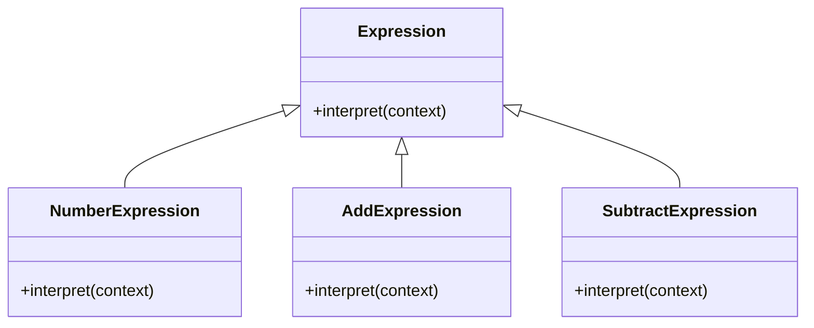

## 7.10 Interpreter Pattern for Parsing Expressions

### Introduction

The Interpreter Pattern is a behavioral design pattern that provides a way to evaluate sentences in a language by defining a representation for its grammar. This pattern is particularly useful when you need to interpret expressions or commands in a specific language, such as mathematical expressions, configuration files, or domain-specific languages (DSLs). In this section, we will delve into the Interpreter Pattern, explore its implementation in JavaScript, and discuss its use cases and performance considerations.

### Understanding the Interpreter Pattern

#### Definition and Purpose

The Interpreter Pattern is used to define a grammar for a language and provide an interpreter that uses this grammar to interpret sentences in the language. It is particularly useful in scenarios where you need to evaluate expressions or commands repeatedly. The pattern involves creating a class for each grammar rule and an interpreter that processes these rules to evaluate expressions.

#### Key Participants

- **AbstractExpression**: Declares an abstract `interpret` method that is implemented by all concrete expressions.
- **TerminalExpression**: Implements an `interpret` method associated with terminal symbols in the grammar.
- **NonTerminalExpression**: Implements an `interpret` method for non-terminal symbols, which may involve other expressions.
- **Context**: Contains information that is global to the interpreter.
- **Client**: Builds or defines the abstract syntax tree representing a particular sentence in the language.

### Implementing the Interpreter Pattern in JavaScript

Let's explore how to implement a simple language interpreter in JavaScript. We'll create an interpreter for a basic arithmetic expression language.

#### Step 1: Define the Grammar

First, we need to define the grammar for our language. For simplicity, we'll consider a language that supports addition and subtraction of integers.

#### Step 2: Create Expression Classes

We'll create classes for each type of expression in our grammar.

```javascript
// AbstractExpression
class Expression {
    interpret(context) {
        throw new Error("This method should be overridden!");
    }
}

// TerminalExpression for numbers
class NumberExpression extends Expression {
    constructor(number) {
        super();
        this.number = number;
    }

    interpret(context) {
        return this.number;
    }
}

// NonTerminalExpression for addition
class AddExpression extends Expression {
    constructor(left, right) {
        super();
        this.left = left;
        this.right = right;
    }

    interpret(context) {
        return this.left.interpret(context) + this.right.interpret(context);
    }
}

// NonTerminalExpression for subtraction
class SubtractExpression extends Expression {
    constructor(left, right) {
        super();
        this.left = left;
        this.right = right;
    }

    interpret(context) {
        return this.left.interpret(context) - this.right.interpret(context);
    }
}
```

#### Step 3: Build the Abstract Syntax Tree

The client will build an abstract syntax tree (AST) using the expression classes.

```javascript
// Context is not used in this simple example, but it can hold global information
const context = {};

// Example: (5 + 3) - 2
const expression = new SubtractExpression(
    new AddExpression(
        new NumberExpression(5),
        new NumberExpression(3)
    ),
    new NumberExpression(2)
);

// Interpret the expression
const result = expression.interpret(context);
console.log(`Result: ${result}`); // Output: Result: 6
```

### Use Cases for the Interpreter Pattern

The Interpreter Pattern is versatile and can be applied in various scenarios:

1. **Mathematical Expression Evaluation**: As demonstrated, it can be used to evaluate arithmetic expressions.
2. **Configuration Files**: Parse and evaluate configuration files, allowing dynamic configuration of applications.
3. **Domain-Specific Languages (DSLs)**: Implement DSLs for specific domains, such as financial calculations or business rules.
4. **Command Interpreters**: Create interpreters for command languages, such as shell scripts or SQL.

### Benefits of a Clear and Extensible Grammar Representation

- **Modularity**: Each grammar rule is encapsulated in its own class, making the system modular and easy to extend.
- **Reusability**: Expression classes can be reused across different parts of the application.
- **Maintainability**: Clear separation of concerns makes the codebase easier to maintain and understand.

### Performance Considerations

While the Interpreter Pattern provides a clear and extensible way to evaluate expressions, it can become inefficient for complex grammars due to the overhead of creating many objects. Consider the following strategies to mitigate performance issues:

- **Caching**: Cache results of frequently evaluated expressions to avoid redundant computations.
- **Optimization**: Optimize the AST by simplifying expressions before evaluation.
- **Alternative Patterns**: For complex grammars, consider using other patterns or tools, such as parsers or compilers, which may offer better performance.

### Visualizing the Interpreter Pattern

Below is a class diagram representing the Interpreter Pattern:



**Diagram Description**: This diagram illustrates the hierarchy of expression classes, with `Expression` as the abstract base class and `NumberExpression`, `AddExpression`, and `SubtractExpression` as concrete implementations.

### Try It Yourself

Experiment with the provided code by adding support for multiplication and division. Consider how you would extend the grammar and implement the corresponding expression classes.

### References and Links

- [MDN Web Docs: JavaScript Classes](https://developer.mozilla.org/en-US/docs/Web/JavaScript/Reference/Classes)
- [Design Patterns: Elements of Reusable Object-Oriented Software](https://en.wikipedia.org/wiki/Design_Patterns) by Erich Gamma et al.

### Knowledge Check

## Interpreter Pattern in JavaScript: Quiz



### What is the primary purpose of the Interpreter Pattern?

- [x] To define a representation for a language's grammar and interpret sentences in that language.
- [ ] To optimize the performance of complex algorithms.
- [ ] To provide a way to create objects without specifying their concrete classes.
- [ ] To separate the construction of a complex object from its representation.

> **Explanation:** The Interpreter Pattern is used to define a grammar and interpret sentences in that language.

### Which class in the Interpreter Pattern represents terminal symbols?

- [ ] AbstractExpression
- [x] TerminalExpression
- [ ] NonTerminalExpression
- [ ] Context

> **Explanation:** TerminalExpression represents terminal symbols in the grammar.

### What is a common use case for the Interpreter Pattern?

- [x] Parsing mathematical expressions.
- [ ] Optimizing database queries.
- [ ] Managing application state.
- [ ] Handling user authentication.

> **Explanation:** The Interpreter Pattern is commonly used for parsing and evaluating expressions, such as mathematical expressions.

### What is a potential drawback of the Interpreter Pattern?

- [x] It can become inefficient for complex grammars.
- [ ] It is difficult to implement.
- [ ] It lacks modularity.
- [ ] It cannot be used with object-oriented languages.

> **Explanation:** The Interpreter Pattern can become inefficient for complex grammars due to the overhead of creating many objects.

### How can performance issues be mitigated in the Interpreter Pattern?

- [x] By caching results of frequently evaluated expressions.
- [x] By optimizing the abstract syntax tree.
- [ ] By avoiding the use of classes.
- [ ] By using global variables.

> **Explanation:** Caching and optimizing the AST can help mitigate performance issues.

### Which of the following is NOT a key participant in the Interpreter Pattern?

- [ ] AbstractExpression
- [ ] TerminalExpression
- [ ] NonTerminalExpression
- [x] Singleton

> **Explanation:** Singleton is not a key participant in the Interpreter Pattern.

### What role does the Client play in the Interpreter Pattern?

- [x] It builds or defines the abstract syntax tree.
- [ ] It interprets the expressions.
- [ ] It represents terminal symbols.
- [ ] It provides global information to the interpreter.

> **Explanation:** The Client builds or defines the abstract syntax tree representing a particular sentence in the language.

### What is the role of the Context in the Interpreter Pattern?

- [ ] It represents terminal symbols.
- [ ] It interprets expressions.
- [x] It contains information that is global to the interpreter.
- [ ] It builds the abstract syntax tree.

> **Explanation:** The Context contains information that is global to the interpreter.

### True or False: The Interpreter Pattern is best suited for complex grammars.

- [ ] True
- [x] False

> **Explanation:** The Interpreter Pattern is not well-suited for complex grammars due to potential inefficiencies.

### Which of the following is a benefit of using the Interpreter Pattern?

- [x] Modularity and extensibility.
- [ ] Improved performance for complex grammars.
- [ ] Simplified user interfaces.
- [ ] Enhanced security features.

> **Explanation:** The Interpreter Pattern provides modularity and extensibility by encapsulating each grammar rule in its own class.



### Conclusion

The Interpreter Pattern is a powerful tool for defining and interpreting languages in JavaScript. By understanding its structure and implementation, you can create flexible and extensible systems for evaluating expressions and commands. Remember, this is just the beginning. As you progress, you'll build more complex interpreters and explore new domains. Keep experimenting, stay curious, and enjoy the journey!

---
