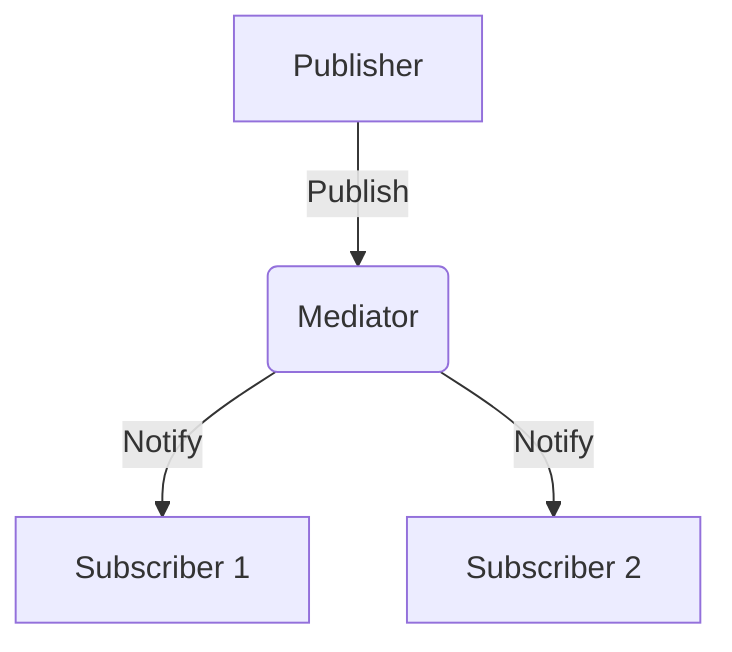

## 7.11 Mediator Pattern Using Pub/Sub

The Mediator Pattern is a behavioral design pattern that defines an object, known as the mediator, to encapsulate how a set of objects interact. This pattern promotes loose coupling by preventing objects from referring to each other explicitly, allowing them to communicate indirectly through the mediator. In JavaScript, the publish/subscribe (Pub/Sub) model is a common implementation of the Mediator Pattern, enabling components to communicate without direct dependencies.

### Understanding the Mediator Pattern

#### Definition and Intent

The Mediator Pattern's primary intent is to reduce the complexity of communication between multiple objects or components. By introducing a mediator, objects no longer need to be aware of each other, which simplifies their interactions and enhances modularity. This pattern is particularly useful in scenarios where a system has many components that need to interact in a complex manner.

#### Key Participants

- **Mediator**: The central object that facilitates communication between other objects.
- **Colleagues**: The objects that interact with each other through the mediator.

#### Applicability

Use the Mediator Pattern when:

- You have a set of objects that communicate in complex ways.
- You want to promote loose coupling between components.
- You need to centralize control over how objects interact.

### The Publish/Subscribe Model

The Pub/Sub model is a messaging pattern where senders (publishers) do not send messages directly to specific receivers (subscribers). Instead, messages are published to a channel, and subscribers receive messages from channels they are subscribed to. This model is a natural fit for the Mediator Pattern, as it decouples the sender and receiver, allowing for flexible and scalable communication.

#### Implementing Pub/Sub in JavaScript

In JavaScript, the Pub/Sub model can be implemented using event emitters or custom messaging systems. Let's explore a basic implementation using JavaScript's `EventEmitter`.

```javascript
// Import the EventEmitter class
const EventEmitter = require('events');

// Create a new instance of EventEmitter
const mediator = new EventEmitter();

// Subscriber function
function subscriber1(data) {
    console.log(`Subscriber 1 received: ${data}`);
}

// Subscriber function
function subscriber2(data) {
    console.log(`Subscriber 2 received: ${data}`);
}

// Subscribe to the 'event' channel
mediator.on('event', subscriber1);
mediator.on('event', subscriber2);

// Publisher function
function publisher(data) {
    console.log(`Publishing: ${data}`);
    mediator.emit('event', data);
}

// Publish a message
publisher('Hello, World!');
```

**Explanation:**

- **EventEmitter**: A built-in Node.js module used to handle events.
- **mediator**: Acts as the central hub for communication.
- **subscriber1** and **subscriber2**: Functions that listen for messages on the 'event' channel.
- **publisher**: Function that sends messages to the 'event' channel.

### Visualizing the Mediator Pattern with Pub/Sub

Below is a diagram illustrating the interaction between publishers, the mediator, and subscribers in the Pub/Sub model.



**Diagram Description**: This diagram shows how the publisher sends messages to the mediator, which then notifies all subscribed components.

### Use Cases for the Mediator Pattern Using Pub/Sub

#### Chat Applications

In a chat application, users send messages to a central server (mediator), which then broadcasts the messages to all connected clients (subscribers). This setup allows for real-time communication without clients needing to know about each other.

#### UI Component Communication

In complex user interfaces, different components may need to communicate. Using the Mediator Pattern, components can publish events to a central mediator, which then notifies other components. This approach prevents direct dependencies between UI components, making the system more maintainable.

#### Decoupled System Interactions

In large systems, different modules may need to interact without being tightly coupled. The Mediator Pattern allows modules to communicate through a central mediator, facilitating integration and reducing dependencies.

### Advantages of the Mediator Pattern Using Pub/Sub

- **Reduced Dependencies**: Components do not need to know about each other, reducing direct dependencies.
- **Enhanced Modularity**: Components can be developed and tested independently.
- **Scalability**: New components can be added without modifying existing ones.
- **Centralized Control**: The mediator can manage complex interactions and enforce rules.

### Design Considerations

While the Mediator Pattern offers many benefits, it is essential to consider the following:

- **Single Point of Failure**: The mediator can become a bottleneck or single point of failure if not designed correctly.
- **Complexity**: Overuse of the pattern can lead to complex mediator logic, making it difficult to maintain.

### JavaScript Unique Features

JavaScript's event-driven nature and support for asynchronous programming make it well-suited for implementing the Mediator Pattern using Pub/Sub. The language's flexibility allows for dynamic creation and management of events, making it easy to adapt the pattern to various scenarios.

### Differences and Similarities with Other Patterns

The Mediator Pattern is often confused with the Observer Pattern. While both involve communication between components, the Mediator Pattern centralizes communication through a mediator, whereas the Observer Pattern involves direct notification from subjects to observers.

### Try It Yourself

Experiment with the provided code example by:

- Adding more subscribers to the 'event' channel.
- Creating additional channels for different types of messages.
- Implementing error handling to manage failed message deliveries.

### Knowledge Check

- What is the primary intent of the Mediator Pattern?
- How does the Pub/Sub model implement the Mediator Pattern?
- What are the advantages of using the Mediator Pattern in JavaScript?
- How can the Mediator Pattern be applied in a chat application?

### Embrace the Journey

Remember, mastering design patterns is a journey. As you continue to explore and implement the Mediator Pattern using Pub/Sub, you'll discover new ways to enhance your application's architecture. Keep experimenting, stay curious, and enjoy the journey!

### References and Links

- [MDN Web Docs: EventEmitter](https://nodejs.org/api/events.html)
- [W3Schools: JavaScript Events](https://www.w3schools.com/js/js_events.asp)

## Test Your Knowledge on JavaScript Mediator Pattern Using Pub/Sub



### What is the primary intent of the Mediator Pattern?

- [x] To reduce the complexity of communication between multiple objects.
- [ ] To increase the number of dependencies between objects.
- [ ] To enforce strict coupling between components.
- [ ] To eliminate the need for a central control object.

> **Explanation:** The Mediator Pattern aims to reduce the complexity of communication by introducing a mediator that facilitates interactions between objects.

### How does the Pub/Sub model implement the Mediator Pattern?

- [x] By decoupling senders and receivers through a central channel.
- [ ] By directly connecting publishers to subscribers.
- [ ] By enforcing strict dependencies between components.
- [ ] By eliminating the need for a mediator.

> **Explanation:** The Pub/Sub model decouples senders and receivers by using a central channel (mediator) for communication.

### What is a key advantage of using the Mediator Pattern in JavaScript?

- [x] It reduces dependencies between components.
- [ ] It increases the complexity of the system.
- [ ] It requires components to be tightly coupled.
- [ ] It makes the system less modular.

> **Explanation:** The Mediator Pattern reduces dependencies, allowing components to interact without direct references to each other.

### In a chat application, how can the Mediator Pattern be applied?

- [x] By using a central server to broadcast messages to clients.
- [ ] By having clients communicate directly with each other.
- [ ] By eliminating the need for a central server.
- [ ] By requiring each client to know about all other clients.

> **Explanation:** The Mediator Pattern can be applied by using a central server (mediator) to manage message broadcasting.

### What is a potential drawback of the Mediator Pattern?

- [x] The mediator can become a single point of failure.
- [ ] It enforces tight coupling between components.
- [ ] It eliminates the need for a central control object.
- [ ] It simplifies the logic of the mediator.

> **Explanation:** The mediator can become a bottleneck or single point of failure if not designed correctly.

### How can JavaScript's event-driven nature benefit the Mediator Pattern?

- [x] It allows for dynamic creation and management of events.
- [ ] It enforces strict dependencies between components.
- [ ] It eliminates the need for asynchronous programming.
- [ ] It makes the system less flexible.

> **Explanation:** JavaScript's event-driven nature allows for dynamic event management, enhancing the flexibility of the Mediator Pattern.

### What is a similarity between the Mediator and Observer Patterns?

- [x] Both involve communication between components.
- [ ] Both centralize communication through a mediator.
- [ ] Both eliminate the need for a central control object.
- [ ] Both enforce strict coupling between components.

> **Explanation:** Both patterns involve communication between components, but they differ in how communication is managed.

### What is a difference between the Mediator and Observer Patterns?

- [x] The Mediator Pattern centralizes communication, while the Observer Pattern involves direct notification.
- [ ] The Observer Pattern centralizes communication, while the Mediator Pattern involves direct notification.
- [ ] Both patterns centralize communication through a mediator.
- [ ] Both patterns involve direct notification between components.

> **Explanation:** The Mediator Pattern centralizes communication through a mediator, while the Observer Pattern involves direct notification from subjects to observers.

### How can you experiment with the provided code example?

- [x] By adding more subscribers to the 'event' channel.
- [ ] By removing the mediator from the code.
- [ ] By enforcing strict dependencies between components.
- [ ] By eliminating the need for a publisher.

> **Explanation:** You can experiment by adding more subscribers to see how the system handles multiple listeners.

### True or False: The Mediator Pattern eliminates the need for a central control object.

- [ ] True
- [x] False

> **Explanation:** The Mediator Pattern introduces a central control object (mediator) to manage interactions between components.




