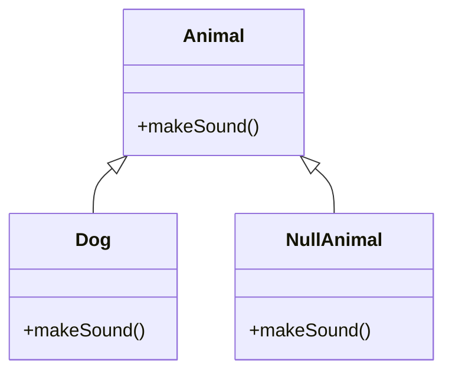

## 7.12 Null Object Pattern with Default Behaviors

In the world of software development, handling `null` or `undefined` values is a common challenge that can lead to errors and complex code. The Null Object Pattern offers a solution by providing a default object that implements expected behaviors, thus eliminating the need for null checks and simplifying code. In this section, we will delve into the Null Object Pattern, its intent, implementation, and benefits, as well as potential downsides.

### Intent of the Null Object Pattern

The Null Object Pattern is a behavioral design pattern that provides an object with default behaviors to represent the absence of a real object. Instead of using `null` or `undefined`, which require explicit checks and can lead to errors, a null object implements the same interface as a real object but with default, often do-nothing, behavior.

### Key Participants

1. **Abstract Object**: Defines the interface for real and null objects.
2. **Real Object**: Implements the interface with actual behavior.
3. **Null Object**: Implements the interface with default or do-nothing behavior.

### Applicability

Use the Null Object Pattern when:

- You want to avoid `null` or `undefined` checks throughout your code.
- You need to provide default behavior when an object is absent.
- You aim to simplify code and reduce the risk of null reference errors.

### Sample Code Snippet

Let's explore a simple example of the Null Object Pattern in JavaScript.

```javascript
// Abstract Object
class Animal {
  makeSound() {
    throw new Error("This method should be overridden!");
  }
}

// Real Object
class Dog extends Animal {
  makeSound() {
    console.log("Woof! Woof!");
  }
}

// Null Object
class NullAnimal extends Animal {
  makeSound() {
    // Do nothing
  }
}

// Usage
function getAnimal(type) {
  if (type === "dog") {
    return new Dog();
  }
  return new NullAnimal(); // Default to Null Object
}

const myAnimal = getAnimal("cat");
myAnimal.makeSound(); // No error, no sound
```

In this example, `NullAnimal` acts as a placeholder for any non-existent animal, preventing errors and eliminating the need for null checks.

### Design Considerations

- **Cleaner Code**: By using null objects, you can avoid repetitive null checks, leading to cleaner and more readable code.
- **Eliminated Null Reference Errors**: Null objects prevent null reference errors by providing default behavior.
- **Potential Downsides**: While null objects can simplify code, they may also hide errors or lead to unexpected behaviors if not used carefully.

### JavaScript Unique Features

JavaScript's dynamic nature and prototype-based inheritance make it particularly well-suited for implementing the Null Object Pattern. You can easily create null objects that mimic the behavior of real objects without the need for complex inheritance hierarchies.

### Differences and Similarities

The Null Object Pattern is often compared to the Strategy Pattern, as both involve defining a family of algorithms or behaviors. However, the Null Object Pattern specifically addresses the absence of an object, while the Strategy Pattern focuses on selecting among different behaviors.

### Visualizing the Null Object Pattern

To better understand the Null Object Pattern, let's visualize the relationship between the abstract object, real object, and null object.



In this diagram, `Animal` is the abstract object, `Dog` is the real object, and `NullAnimal` is the null object. Both `Dog` and `NullAnimal` implement the `makeSound` method, but `NullAnimal` provides a default, do-nothing behavior.

### Try It Yourself

Experiment with the code example by adding more real objects, such as `Cat` or `Bird`, and see how the Null Object Pattern simplifies handling different animal types. Try modifying the `NullAnimal` class to log a message when an unknown animal type is requested.

### References and Links

- [MDN Web Docs: Classes](https://developer.mozilla.org/en-US/docs/Web/JavaScript/Reference/Classes)
- [W3Schools: JavaScript Objects](https://www.w3schools.com/js/js_objects.asp)

### Knowledge Check

- What is the primary purpose of the Null Object Pattern?
- How does the Null Object Pattern simplify code?
- What are the potential downsides of using the Null Object Pattern?

### Embrace the Journey

Remember, mastering design patterns is a journey. The Null Object Pattern is just one tool in your toolkit for writing clean, maintainable code. Keep experimenting, stay curious, and enjoy the process of becoming a better developer!

## Quiz: Understanding the Null Object Pattern in JavaScript



### What is the primary purpose of the Null Object Pattern?

- [x] To provide default behaviors for absent objects
- [ ] To handle asynchronous operations
- [ ] To optimize performance
- [ ] To manage state in applications

> **Explanation:** The Null Object Pattern provides default behaviors for absent objects, eliminating the need for null checks.

### How does the Null Object Pattern simplify code?

- [x] By eliminating null checks
- [ ] By adding more complexity
- [ ] By increasing the number of classes
- [ ] By using more memory

> **Explanation:** The Null Object Pattern simplifies code by eliminating the need for null checks, leading to cleaner and more readable code.

### What is a potential downside of using the Null Object Pattern?

- [x] It may hide errors
- [ ] It increases code complexity
- [ ] It requires more memory
- [ ] It slows down execution

> **Explanation:** A potential downside of the Null Object Pattern is that it may hide errors or lead to unexpected behaviors if not used carefully.

### Which of the following is a key participant in the Null Object Pattern?

- [x] Null Object
- [ ] Singleton
- [ ] Adapter
- [ ] Observer

> **Explanation:** The Null Object is a key participant in the Null Object Pattern, providing default behaviors for absent objects.

### What is the relationship between the Null Object Pattern and the Strategy Pattern?

- [x] Both involve defining a family of behaviors
- [ ] Both are used for state management
- [ ] Both optimize performance
- [ ] Both are creational patterns

> **Explanation:** Both the Null Object Pattern and the Strategy Pattern involve defining a family of behaviors, but they address different problems.

### In JavaScript, what makes implementing the Null Object Pattern easier?

- [x] Dynamic nature and prototype-based inheritance
- [ ] Strict typing
- [ ] Complex inheritance hierarchies
- [ ] Lack of object-oriented features

> **Explanation:** JavaScript's dynamic nature and prototype-based inheritance make it easier to implement the Null Object Pattern.

### What is a common use case for the Null Object Pattern?

- [x] Avoiding null reference errors
- [ ] Optimizing database queries
- [ ] Managing application state
- [ ] Handling network requests

> **Explanation:** A common use case for the Null Object Pattern is avoiding null reference errors by providing default behaviors.

### How can you experiment with the Null Object Pattern?

- [x] By adding more real objects and modifying the null object
- [ ] By removing all objects
- [ ] By using only primitive data types
- [ ] By avoiding object-oriented programming

> **Explanation:** You can experiment with the Null Object Pattern by adding more real objects and modifying the null object to see how it simplifies code.

### What is a key benefit of using the Null Object Pattern?

- [x] Cleaner and more readable code
- [ ] Increased memory usage
- [ ] Slower execution
- [ ] More complex code

> **Explanation:** A key benefit of using the Null Object Pattern is cleaner and more readable code, as it eliminates null checks.

### True or False: The Null Object Pattern can be used to handle asynchronous operations.

- [ ] True
- [x] False

> **Explanation:** False. The Null Object Pattern is not used to handle asynchronous operations; it provides default behaviors for absent objects.



By understanding and applying the Null Object Pattern, you can write cleaner, more maintainable JavaScript code. Keep exploring and experimenting with different design patterns to enhance your skills and become a more proficient developer.
