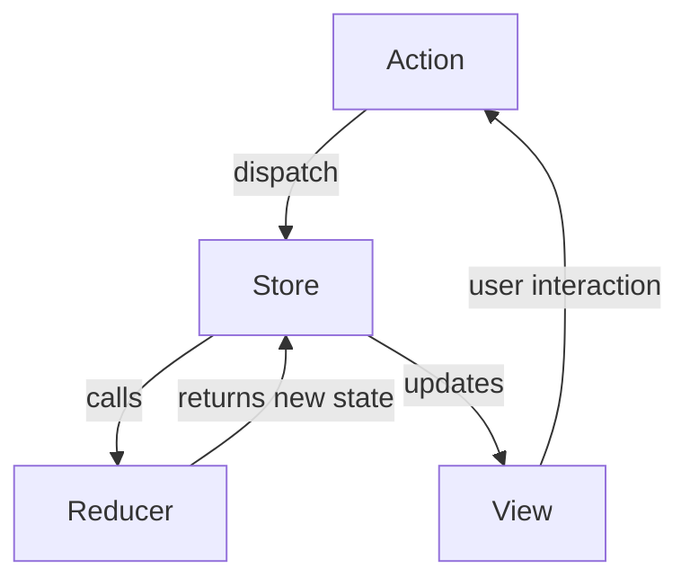

## 7.13 Command Pattern in Redux and Flux

In the realm of JavaScript development, particularly in state management, the Command Pattern plays a pivotal role. This pattern is integral to libraries like Redux and Flux, which are widely used for managing application state in a predictable and scalable manner. In this section, we will delve into the Command Pattern, explore the architectures of Redux and Flux, and understand how they leverage this pattern to facilitate state changes.

### Understanding the Command Pattern

The Command Pattern is a behavioral design pattern that turns a request into a stand-alone object containing all information about the request. This transformation allows for parameterization of clients with queues, requests, and operations. The pattern is particularly useful for implementing undoable operations, logging changes, and supporting transactional behavior.

**Key Participants in the Command Pattern:**

- **Command Interface**: Declares an interface for executing operations.
- **Concrete Command**: Implements the command interface and defines the binding between the receiver and the action.
- **Invoker**: Asks the command to carry out the request.
- **Receiver**: Knows how to perform the operations associated with carrying out a request.

### Introducing Redux and Flux

#### Redux

[Redux](https://redux.js.org/) is a predictable state container for JavaScript applications. It helps you write applications that behave consistently across different environments (client, server, and native) and are easy to test. Redux is based on the principles of unidirectional data flow and immutability.

#### Flux

Flux is an architectural pattern created by Facebook for building client-side web applications. It complements React's component-based architecture by utilizing a unidirectional data flow. Flux is not a library or a framework but a pattern that can be implemented in various ways.

### Command Pattern in Redux

In Redux, actions serve as commands that encapsulate state changes. An action is a plain JavaScript object that describes a change in the state. Actions are dispatched to the store, which then uses reducers to update the state.

**Example of a Redux Action:**

```javascript
// Action Type
const ADD_TODO = 'ADD_TODO';

// Action Creator
function addTodo(text) {
  return {
    type: ADD_TODO,
    payload: text
  };
}
```

**Dispatching Actions and Updating State:**

Reducers are pure functions that take the current state and an action as arguments and return a new state. They specify how the application's state changes in response to actions sent to the store.

```javascript
// Initial State
const initialState = {
  todos: []
};

// Reducer
function todoReducer(state = initialState, action) {
  switch (action.type) {
    case ADD_TODO:
      return {
        ...state,
        todos: [...state.todos, action.payload]
      };
    default:
      return state;
  }
}

// Store
const store = Redux.createStore(todoReducer);

// Dispatching an Action
store.dispatch(addTodo('Learn Redux'));
console.log(store.getState());
```

### Benefits of Unidirectional Data Flow

Unidirectional data flow is a core principle of Redux and Flux architectures. It ensures that data flows in a single direction, making the application more predictable and easier to debug.

**Advantages:**

- **Predictability**: With a single source of truth, the state of the application is predictable.
- **Ease of Debugging**: Since the state changes are predictable, debugging becomes straightforward.
- **Scalability**: Unidirectional data flow scales well with complex applications.

### Best Practices in Structuring Redux Applications

1. **Organize by Feature**: Group related actions, reducers, and components together.
2. **Use Action Creators**: Always use action creators to create actions. This practice ensures consistency and reduces errors.
3. **Keep Reducers Pure**: Reducers should be pure functions without side effects.
4. **Normalize State Shape**: Keep the state shape flat and normalized to avoid deeply nested structures.
5. **Use Middleware for Side Effects**: Handle side effects like API calls using middleware such as Redux Thunk or Redux Saga.

### Visualizing Redux Architecture



**Diagram Description**: This flowchart illustrates the unidirectional data flow in Redux. Actions are dispatched to the store, which calls the reducer to update the state. The view is then updated based on the new state, and user interactions trigger new actions.

### Try It Yourself

Experiment with the code examples provided by modifying the action types and payloads. Try adding new actions and reducers to handle different state changes. Observe how the state updates in response to dispatched actions.

### References and Links

- [Redux Official Documentation](https://redux.js.org/)
- [Flux Architecture](https://facebook.github.io/flux/docs/in-depth-overview/)
- [MDN Web Docs on JavaScript](https://developer.mozilla.org/en-US/docs/Web/JavaScript)

### Knowledge Check

- What is the Command Pattern, and how does it relate to Redux?
- How do actions in Redux encapsulate state changes?
- What are the benefits of unidirectional data flow in Redux and Flux?
- How can you structure a Redux application for scalability and maintainability?

### Embrace the Journey

Remember, mastering Redux and Flux is a journey. As you progress, you'll build more complex and interactive applications. Keep experimenting, stay curious, and enjoy the journey!

## Quiz: Mastering the Command Pattern in Redux and Flux



### What is the primary role of actions in Redux?

- [x] To encapsulate state changes
- [ ] To directly modify the state
- [ ] To manage side effects
- [ ] To render components

> **Explanation:** Actions in Redux encapsulate state changes and are dispatched to the store to trigger state updates.

### Which of the following best describes the Command Pattern?

- [x] A pattern that turns a request into a stand-alone object
- [ ] A pattern that manages component rendering
- [ ] A pattern that optimizes performance
- [ ] A pattern that handles asynchronous operations

> **Explanation:** The Command Pattern turns a request into a stand-alone object, allowing for parameterization of clients with queues, requests, and operations.

### What is a key benefit of unidirectional data flow in Redux?

- [x] Predictability of state changes
- [ ] Faster rendering of components
- [ ] Automatic error handling
- [ ] Simplified component structure

> **Explanation:** Unidirectional data flow ensures predictability of state changes, making the application easier to debug and maintain.

### In Redux, what is the purpose of a reducer?

- [x] To specify how the application's state changes in response to actions
- [ ] To dispatch actions to the store
- [ ] To manage side effects
- [ ] To render components

> **Explanation:** Reducers are pure functions that specify how the application's state changes in response to actions sent to the store.

### Which of the following is a best practice for structuring Redux applications?

- [x] Organize by feature
- [ ] Use deeply nested state structures
- [ ] Avoid using action creators
- [ ] Keep reducers impure

> **Explanation:** Organizing by feature helps maintain a scalable and maintainable codebase, while keeping reducers pure ensures predictable state changes.

### How does the Command Pattern facilitate undoable operations?

- [x] By encapsulating requests as objects
- [ ] By directly modifying the state
- [ ] By managing side effects
- [ ] By rendering components

> **Explanation:** The Command Pattern encapsulates requests as objects, which can be stored and manipulated to facilitate undoable operations.

### What is the role of middleware in Redux?

- [x] To handle side effects like API calls
- [ ] To directly modify the state
- [ ] To render components
- [ ] To encapsulate state changes

> **Explanation:** Middleware in Redux is used to handle side effects, such as API calls, without affecting the purity of reducers.

### Which of the following is NOT a key participant in the Command Pattern?

- [ ] Command Interface
- [x] Component
- [ ] Invoker
- [ ] Receiver

> **Explanation:** Components are not a key participant in the Command Pattern. The pattern involves Command Interface, Concrete Command, Invoker, and Receiver.

### What is the significance of using action creators in Redux?

- [x] Ensures consistency and reduces errors
- [ ] Directly modifies the state
- [ ] Manages component rendering
- [ ] Handles asynchronous operations

> **Explanation:** Action creators ensure consistency and reduce errors by providing a standard way to create actions.

### True or False: In Redux, reducers should have side effects.

- [ ] True
- [x] False

> **Explanation:** Reducers should be pure functions without side effects to ensure predictable state changes.



By understanding and implementing the Command Pattern in Redux and Flux, you can create robust and maintainable applications with predictable state management. Keep exploring and refining your skills to master these powerful patterns!
