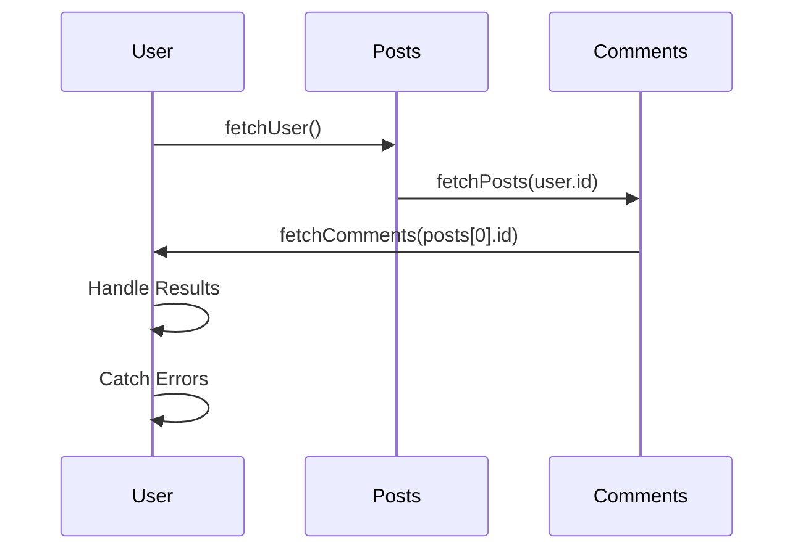

## 7.14 Asynchronous Patterns and Promise Chaining

Asynchronous programming is a cornerstone of modern web development, enabling applications to perform tasks without blocking the main execution thread. In JavaScript, Promises provide a powerful abstraction for handling asynchronous operations, allowing developers to write cleaner and more manageable code. In this section, we will delve into advanced asynchronous patterns, focusing on Promise chaining and composition to handle complex workflows efficiently.

### Understanding Promises

Before diving into chaining and composition, let's briefly revisit what Promises are. A Promise in JavaScript is an object representing the eventual completion or failure of an asynchronous operation. It provides a standard way to work with asynchronous code, offering methods like `.then()`, `.catch()`, and `.finally()` to handle results and errors.

### Chaining Promises for Sequential Operations

Promise chaining is a technique used to execute asynchronous operations in sequence. By chaining `.then()` calls, we can ensure that each operation starts only after the previous one has completed.

#### Example: Sequential API Calls

Consider a scenario where we need to fetch user data, then fetch posts by that user, and finally fetch comments on those posts. Here's how we can achieve this using Promise chaining:

```javascript
function fetchUser(userId) {
    return fetch(`https://api.example.com/users/${userId}`)
        .then(response => response.json());
}

function fetchPosts(userId) {
    return fetch(`https://api.example.com/users/${userId}/posts`)
        .then(response => response.json());
}

function fetchComments(postId) {
    return fetch(`https://api.example.com/posts/${postId}/comments`)
        .then(response => response.json());
}

// Chaining Promises
fetchUser(1)
    .then(user => {
        console.log('User:', user);
        return fetchPosts(user.id);
    })
    .then(posts => {
        console.log('Posts:', posts);
        return fetchComments(posts[0].id);
    })
    .then(comments => {
        console.log('Comments:', comments);
    })
    .catch(error => {
        console.error('Error:', error);
    });
```

In this example, each `.then()` call returns a new Promise, allowing us to chain subsequent operations. The `.catch()` method at the end handles any errors that occur during the chain.

### Composing Promises with `Promise.all`, `Promise.race`, and `Promise.allSettled`

While chaining is ideal for sequential tasks, sometimes we need to perform multiple asynchronous operations in parallel. JavaScript provides several methods to compose Promises for such scenarios.

#### `Promise.all`

`Promise.all` takes an array of Promises and returns a single Promise that resolves when all of the input Promises have resolved. This is useful for executing tasks in parallel and waiting for all of them to complete.

```javascript
const promise1 = fetch('https://api.example.com/data1').then(res => res.json());
const promise2 = fetch('https://api.example.com/data2').then(res => res.json());
const promise3 = fetch('https://api.example.com/data3').then(res => res.json());

Promise.all([promise1, promise2, promise3])
    .then(results => {
        console.log('All data:', results);
    })
    .catch(error => {
        console.error('Error:', error);
    });
```

In this example, `Promise.all` waits for all fetch requests to complete and then logs the results. If any Promise rejects, the entire `Promise.all` rejects.

#### `Promise.race`

`Promise.race` returns a Promise that resolves or rejects as soon as one of the input Promises resolves or rejects. This is useful when you want to respond to the fastest operation.

```javascript
const promise1 = new Promise((resolve) => setTimeout(resolve, 500, 'First'));
const promise2 = new Promise((resolve) => setTimeout(resolve, 100, 'Second'));

Promise.race([promise1, promise2])
    .then(result => {
        console.log('Winner:', result);
    })
    .catch(error => {
        console.error('Error:', error);
    });
```

Here, `Promise.race` resolves with the result of `promise2` because it completes faster than `promise1`.

#### `Promise.allSettled`

`Promise.allSettled` returns a Promise that resolves after all of the input Promises have settled (either resolved or rejected). It provides an array of results, each indicating the status of the corresponding Promise.

```javascript
const promise1 = Promise.resolve('Success');
const promise2 = Promise.reject('Failure');
const promise3 = Promise.resolve('Another Success');

Promise.allSettled([promise1, promise2, promise3])
    .then(results => {
        results.forEach((result, index) => {
            console.log(`Promise ${index + 1}:`, result.status, result.value || result.reason);
        });
    });
```

This method is particularly useful when you want to handle all results, regardless of whether they succeeded or failed.

### Handling Dependent and Parallel Asynchronous Tasks

In real-world applications, you often encounter scenarios where some tasks are dependent on others, while others can run in parallel. Combining Promise chaining and composition allows you to handle such complex workflows.

#### Example: Mixed Workflow

Let's consider a scenario where we need to fetch user data, then fetch posts by that user, and simultaneously fetch additional data that doesn't depend on the user.

```javascript
function fetchAdditionalData() {
    return fetch('https://api.example.com/additional-data')
        .then(response => response.json());
}

fetchUser(1)
    .then(user => {
        console.log('User:', user);
        return Promise.all([fetchPosts(user.id), fetchAdditionalData()]);
    })
    .then(([posts, additionalData]) => {
        console.log('Posts:', posts);
        console.log('Additional Data:', additionalData);
    })
    .catch(error => {
        console.error('Error:', error);
    });
```

In this example, `fetchPosts` and `fetchAdditionalData` run in parallel after fetching the user, and their results are handled together.

### Error Handling in Promise Chains

Error handling is crucial in asynchronous programming. In Promise chains, errors can be caught using the `.catch()` method. It's important to place `.catch()` at the end of the chain to handle errors from any part of the chain.

#### Example: Error Propagation

```javascript
fetchUser(1)
    .then(user => {
        if (!user) throw new Error('User not found');
        return fetchPosts(user.id);
    })
    .then(posts => {
        if (posts.length === 0) throw new Error('No posts found');
        return fetchComments(posts[0].id);
    })
    .then(comments => {
        console.log('Comments:', comments);
    })
    .catch(error => {
        console.error('Error:', error.message);
    });
```

In this example, errors are thrown if certain conditions aren't met, and the `.catch()` method handles them.

### Best Practices for Writing Clean and Maintainable Asynchronous Code

1. **Use Descriptive Variable and Function Names**: Clearly name your Promises and functions to indicate their purpose.

2. **Avoid Deep Nesting**: Use chaining to avoid deeply nested callbacks, which can make code difficult to read and maintain.

3. **Handle Errors Gracefully**: Always include error handling to manage unexpected failures.

4. **Use `async`/`await` for Simplicity**: For sequential operations, consider using `async`/`await` syntax to make your code more readable.

5. **Document Your Code**: Include comments to explain complex logic and the purpose of each asynchronous operation.

6. **Test Asynchronous Code Thoroughly**: Ensure your tests cover various scenarios, including success, failure, and edge cases.

### Visualizing Promise Chaining

To better understand how Promise chaining works, let's visualize the flow of operations using a sequence diagram.



This diagram illustrates the sequence of operations in a Promise chain, showing how each step depends on the completion of the previous one.

### Try It Yourself

Experiment with the provided code examples by modifying the URLs or adding additional asynchronous operations. Try introducing deliberate errors to see how they propagate through the chain and are handled by the `.catch()` method.

### Conclusion

Mastering asynchronous patterns and Promise chaining in JavaScript is essential for building efficient and responsive web applications. By understanding how to chain Promises, compose them for parallel execution, and handle errors effectively, you can write clean and maintainable asynchronous code. Remember, this is just the beginning. As you progress, you'll build more complex and interactive web applications. Keep experimenting, stay curious, and enjoy the journey!

## Quiz: Test Your Knowledge on Asynchronous Patterns and Promise Chaining



### What is the primary purpose of Promise chaining in JavaScript?

- [x] To execute asynchronous operations in sequence
- [ ] To execute asynchronous operations in parallel
- [ ] To handle synchronous operations
- [ ] To convert synchronous code to asynchronous

> **Explanation:** Promise chaining is used to execute asynchronous operations in sequence, ensuring each operation starts only after the previous one has completed.

### Which method is used to handle errors in a Promise chain?

- [ ] .then()
- [x] .catch()
- [ ] .finally()
- [ ] .resolve()

> **Explanation:** The `.catch()` method is used to handle errors in a Promise chain.

### What does `Promise.all` do?

- [x] Resolves when all input Promises have resolved
- [ ] Resolves when the first input Promise resolves
- [ ] Rejects when the first input Promise rejects
- [ ] Resolves or rejects when any input Promise settles

> **Explanation:** `Promise.all` resolves when all input Promises have resolved, making it useful for executing tasks in parallel.

### How does `Promise.race` differ from `Promise.all`?

- [x] It resolves or rejects as soon as one input Promise settles
- [ ] It resolves only when all input Promises resolve
- [ ] It rejects only when all input Promises reject
- [ ] It waits for the fastest operation to complete

> **Explanation:** `Promise.race` resolves or rejects as soon as one input Promise settles, making it useful for responding to the fastest operation.

### Which method provides an array of results indicating the status of each Promise?

- [ ] Promise.all
- [ ] Promise.race
- [x] Promise.allSettled
- [ ] Promise.any

> **Explanation:** `Promise.allSettled` provides an array of results, each indicating the status of the corresponding Promise.

### What is a best practice for writing clean asynchronous code?

- [x] Avoid deep nesting by using chaining
- [ ] Use global variables for all Promises
- [ ] Ignore error handling for simplicity
- [ ] Use synchronous code wherever possible

> **Explanation:** Avoiding deep nesting by using chaining is a best practice for writing clean asynchronous code.

### What is the benefit of using `async`/`await` over Promise chaining?

- [x] It makes code more readable and easier to understand
- [ ] It allows for parallel execution of tasks
- [ ] It eliminates the need for error handling
- [ ] It converts asynchronous code to synchronous

> **Explanation:** `async`/`await` makes code more readable and easier to understand, especially for sequential operations.

### How can you handle errors gracefully in a Promise chain?

- [x] Use the .catch() method at the end of the chain
- [ ] Use the .then() method to catch errors
- [ ] Ignore errors to simplify the code
- [ ] Use synchronous error handling techniques

> **Explanation:** Using the `.catch()` method at the end of the chain is the correct way to handle errors gracefully in a Promise chain.

### What is the purpose of `Promise.allSettled`?

- [x] To handle all results, regardless of success or failure
- [ ] To resolve only when all Promises succeed
- [ ] To reject when any Promise fails
- [ ] To race the Promises and return the fastest result

> **Explanation:** `Promise.allSettled` is used to handle all results, regardless of whether they succeeded or failed.

### True or False: `Promise.race` waits for all Promises to settle before resolving.

- [ ] True
- [x] False

> **Explanation:** False. `Promise.race` resolves or rejects as soon as one of the input Promises settles.


