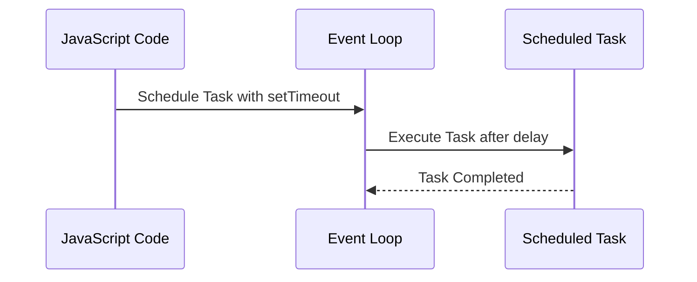

## 7.15 The Scheduler Pattern in Event Loops

In the realm of JavaScript, the event loop is the heart of asynchronous programming, enabling non-blocking operations and efficient task management. The Scheduler Pattern is a pivotal design pattern that leverages the event loop to manage the timing and order of task execution, thereby enhancing performance and responsiveness. This section delves into the intricacies of the Scheduler Pattern, its implementation, and its practical applications in modern web development.

### Understanding the Scheduler Pattern

The Scheduler Pattern is a behavioral design pattern that focuses on managing the execution of tasks in a controlled manner. In JavaScript, this pattern is crucial for optimizing the performance of applications by ensuring that tasks are executed at the right time without overwhelming the event loop. The Scheduler Pattern is particularly useful in scenarios where tasks need to be executed periodically, with delays, or in response to specific events.

#### Key Concepts

- **Task Scheduling**: The process of determining when and in what order tasks should be executed.
- **Event Loop**: The mechanism that allows JavaScript to perform non-blocking operations by offloading tasks to the system kernel whenever possible.
- **Concurrency**: The ability to execute multiple tasks simultaneously, improving the efficiency of applications.

### Implementing the Scheduler Pattern

JavaScript provides several mechanisms for implementing the Scheduler Pattern, each with its unique characteristics and use cases. Let's explore these mechanisms and how they can be used to control task execution.

#### Using `setTimeout`

The `setTimeout` function is a fundamental tool for scheduling tasks in JavaScript. It allows you to execute a function after a specified delay.

```javascript
// Schedule a task to run after 1000 milliseconds (1 second)
setTimeout(() => {
  console.log('Task executed after 1 second');
}, 1000);
```

**Key Points**:
- `setTimeout` is useful for delaying the execution of a task.
- It does not guarantee precise timing, as the actual delay may vary depending on the state of the event loop.

#### Using `setImmediate`

In Node.js, `setImmediate` is used to execute a task immediately after the current event loop cycle.

```javascript
// Schedule a task to run immediately after the current event loop cycle
setImmediate(() => {
  console.log('Task executed immediately after the current event loop cycle');
});
```

**Key Points**:
- `setImmediate` is ideal for tasks that need to be executed as soon as possible, without blocking the current event loop cycle.
- It is specific to Node.js and not available in browser environments.

#### Using `process.nextTick`

Another Node.js-specific function, `process.nextTick`, schedules a task to be executed at the end of the current operation, before the event loop continues.

```javascript
// Schedule a task to run at the end of the current operation
process.nextTick(() => {
  console.log('Task executed at the end of the current operation');
});
```

**Key Points**:
- `process.nextTick` is useful for deferring the execution of a task until the current operation completes.
- It can lead to performance issues if overused, as it can delay the event loop.

#### Using `requestAnimationFrame`

In browser environments, `requestAnimationFrame` is used to schedule tasks that involve animations or visual updates.

```javascript
// Schedule a task to run before the next repaint
requestAnimationFrame(() => {
  console.log('Task executed before the next repaint');
});
```

**Key Points**:
- `requestAnimationFrame` is optimized for animations, ensuring that updates occur before the next screen repaint.
- It provides a more efficient way to perform animations compared to `setTimeout`.

### Use Cases for the Scheduler Pattern

The Scheduler Pattern is versatile and can be applied to various scenarios in web development. Here are some common use cases:

#### Rate Limiting

Rate limiting is a technique used to control the frequency of task execution, preventing excessive load on resources.

```javascript
let lastExecution = 0;
const rateLimit = (callback, limit) => {
  return function () {
    const now = Date.now();
    if (now - lastExecution >= limit) {
      lastExecution = now;
      callback.apply(this, arguments);
    }
  };
};

// Usage
const limitedTask = rateLimit(() => {
  console.log('Rate-limited task executed');
}, 1000);

limitedTask();
```

#### Debouncing

Debouncing is a technique used to delay the execution of a task until a specified time has passed since the last invocation.

```javascript
const debounce = (callback, delay) => {
  let timeoutId;
  return function () {
    clearTimeout(timeoutId);
    timeoutId = setTimeout(() => {
      callback.apply(this, arguments);
    }, delay);
  };
};

// Usage
const debouncedTask = debounce(() => {
  console.log('Debounced task executed');
}, 1000);

debouncedTask();
```

#### Dividing Heavy Computations

For tasks that involve heavy computations, dividing the workload into smaller chunks can prevent blocking the event loop.

```javascript
const heavyComputation = (data) => {
  // Divide the computation into smaller chunks
  const chunkSize = 100;
  let index = 0;

  const processChunk = () => {
    const chunk = data.slice(index, index + chunkSize);
    // Perform computation on the chunk
    chunk.forEach(item => {
      // Simulate computation
    });

    index += chunkSize;
    if (index < data.length) {
      setTimeout(processChunk, 0); // Schedule the next chunk
    }
  };

  processChunk();
};

// Usage
heavyComputation(largeDataArray);
```

### Considerations for Balancing Performance and Responsiveness

When implementing the Scheduler Pattern, it's essential to balance performance and responsiveness. Here are some considerations:

- **Avoid Blocking the Event Loop**: Ensure that tasks do not block the event loop for extended periods, as this can lead to unresponsive applications.
- **Use Appropriate Scheduling Mechanisms**: Choose the right scheduling mechanism based on the task's requirements and the environment (Node.js or browser).
- **Monitor Performance**: Regularly profile your application to identify performance bottlenecks and optimize task scheduling accordingly.

### Visualizing the Scheduler Pattern

To better understand how the Scheduler Pattern interacts with the event loop, let's visualize the process using a sequence diagram.



**Diagram Explanation**: This sequence diagram illustrates how a task is scheduled using `setTimeout`, executed by the event loop after a delay, and then marked as completed.

### Try It Yourself

Experiment with the code examples provided in this section. Try modifying the delay values, task logic, and scheduling mechanisms to observe how they affect task execution and application performance.

### Knowledge Check

Reflect on the following questions to reinforce your understanding of the Scheduler Pattern:

- What are the key differences between `setTimeout`, `setImmediate`, and `process.nextTick`?
- How can the Scheduler Pattern be used to improve the performance of animations in a web application?
- What are some potential pitfalls of overusing `process.nextTick` in a Node.js application?

### Embrace the Journey

Remember, mastering the Scheduler Pattern is just one step in your journey to becoming a proficient JavaScript developer. As you continue to explore and experiment with different design patterns, you'll gain a deeper understanding of how to build efficient and responsive web applications. Keep experimenting, stay curious, and enjoy the journey!

## Quiz: Mastering the Scheduler Pattern in JavaScript



### What is the primary purpose of the Scheduler Pattern in JavaScript?

- [x] To manage task execution timing and order within the event loop
- [ ] To create new threads for parallel execution
- [ ] To handle HTTP requests asynchronously
- [ ] To optimize memory usage in JavaScript applications

> **Explanation:** The Scheduler Pattern is used to manage the timing and order of task execution within the event loop, enhancing performance and responsiveness.

### Which function is specific to Node.js for scheduling tasks immediately after the current event loop cycle?

- [ ] setTimeout
- [x] setImmediate
- [ ] requestAnimationFrame
- [ ] setInterval

> **Explanation:** `setImmediate` is specific to Node.js and schedules tasks to run immediately after the current event loop cycle.

### What is the main advantage of using `requestAnimationFrame` in browser environments?

- [x] It optimizes animations by scheduling updates before the next screen repaint
- [ ] It provides precise timing for task execution
- [ ] It allows tasks to run in parallel with other operations
- [ ] It is available in both Node.js and browser environments

> **Explanation:** `requestAnimationFrame` is optimized for animations, ensuring updates occur before the next screen repaint.

### How does the debounce technique improve performance?

- [x] By delaying task execution until a specified time has passed since the last invocation
- [ ] By executing tasks immediately after the current event loop cycle
- [ ] By dividing tasks into smaller chunks for parallel execution
- [ ] By scheduling tasks to run before the next screen repaint

> **Explanation:** Debouncing delays task execution until a specified time has passed since the last invocation, reducing unnecessary executions.

### Which scheduling mechanism should be used for tasks that need to be executed as soon as possible in Node.js?

- [ ] setTimeout
- [x] process.nextTick
- [ ] requestAnimationFrame
- [ ] setInterval

> **Explanation:** `process.nextTick` schedules tasks to run at the end of the current operation, making it suitable for tasks that need immediate execution.

### What is a potential drawback of overusing `process.nextTick` in Node.js?

- [x] It can delay the event loop and lead to performance issues
- [ ] It is not available in browser environments
- [ ] It provides imprecise timing for task execution
- [ ] It cannot be used for scheduling animations

> **Explanation:** Overusing `process.nextTick` can delay the event loop, leading to performance issues.

### Which mechanism is best suited for scheduling tasks that involve animations in a web application?

- [ ] setTimeout
- [ ] setImmediate
- [x] requestAnimationFrame
- [ ] process.nextTick

> **Explanation:** `requestAnimationFrame` is optimized for animations, ensuring updates occur before the next screen repaint.

### What is the purpose of rate limiting in task scheduling?

- [x] To control the frequency of task execution and prevent excessive load
- [ ] To execute tasks immediately after the current event loop cycle
- [ ] To divide tasks into smaller chunks for parallel execution
- [ ] To schedule tasks to run before the next screen repaint

> **Explanation:** Rate limiting controls the frequency of task execution, preventing excessive load on resources.

### How can heavy computations be managed to prevent blocking the event loop?

- [x] By dividing the workload into smaller chunks and scheduling them with setTimeout
- [ ] By using process.nextTick for immediate execution
- [ ] By scheduling tasks with requestAnimationFrame
- [ ] By executing tasks immediately after the current event loop cycle

> **Explanation:** Dividing heavy computations into smaller chunks and scheduling them with `setTimeout` prevents blocking the event loop.

### True or False: The Scheduler Pattern is only applicable in Node.js environments.

- [ ] True
- [x] False

> **Explanation:** The Scheduler Pattern is applicable in both Node.js and browser environments, with different mechanisms available for each.



By mastering the Scheduler Pattern, you can significantly enhance the performance and responsiveness of your JavaScript applications. Keep exploring and experimenting with different scheduling techniques to find the best solutions for your specific use cases.
