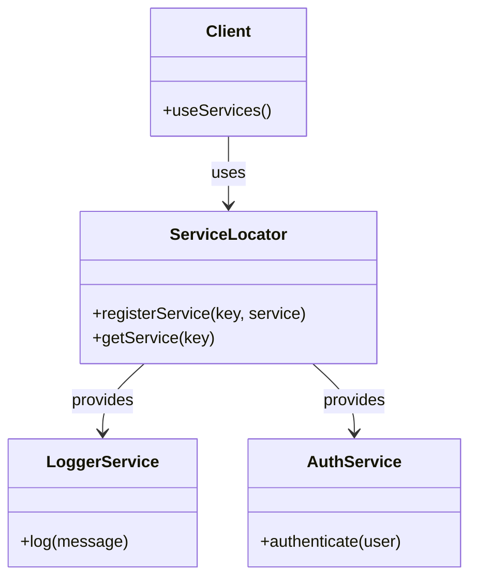

## 7.16 Service Locator Pattern

### Introduction

The Service Locator Pattern is a design pattern used in software development to provide a centralized registry for obtaining services and dependencies. It simplifies access to services by decoupling the client code from the service creation logic. However, it also introduces potential downsides, such as hidden dependencies and testing difficulties. In this section, we will explore the Service Locator Pattern in detail, including its implementation in JavaScript, benefits, criticisms, and comparisons with Dependency Injection.

### Understanding the Service Locator Pattern

The Service Locator Pattern acts as a centralized registry that provides access to various services and dependencies required by an application. It abstracts the process of locating and obtaining these services, allowing client code to focus on its core functionality without worrying about the underlying service creation and management.

#### Key Participants

- **Service Locator**: The central registry that holds references to services and provides methods for retrieving them.
- **Service**: The actual service or dependency that is registered with the Service Locator and accessed by client code.
- **Client**: The code that requires access to services and uses the Service Locator to obtain them.

#### How It Works

1. **Registration**: Services are registered with the Service Locator, typically during application initialization. Each service is associated with a unique identifier or key.
2. **Retrieval**: Client code requests services from the Service Locator using the unique identifier. The Service Locator returns the requested service instance.
3. **Decoupling**: The client code is decoupled from the service creation logic, as it only interacts with the Service Locator to obtain services.

### Implementing a Simple Service Locator in JavaScript

Let's implement a simple Service Locator in JavaScript to demonstrate its functionality.

```javascript
// Service Locator implementation
class ServiceLocator {
  constructor() {
    this.services = new Map();
  }

  // Register a service with a unique key
  registerService(key, service) {
    if (!this.services.has(key)) {
      this.services.set(key, service);
    } else {
      throw new Error(`Service with key '${key}' is already registered.`);
    }
  }

  // Retrieve a service by its key
  getService(key) {
    if (this.services.has(key)) {
      return this.services.get(key);
    } else {
      throw new Error(`Service with key '${key}' is not registered.`);
    }
  }
}

// Example services
class LoggerService {
  log(message) {
    console.log(`Log: ${message}`);
  }
}

class AuthService {
  authenticate(user) {
    console.log(`Authenticating user: ${user}`);
  }
}

// Usage
const serviceLocator = new ServiceLocator();

// Register services
serviceLocator.registerService('logger', new LoggerService());
serviceLocator.registerService('auth', new AuthService());

// Retrieve and use services
const logger = serviceLocator.getService('logger');
logger.log('This is a log message.');

const auth = serviceLocator.getService('auth');
auth.authenticate('John Doe');
```

### Benefits of Centralized Service Access

1. **Decoupling**: The Service Locator Pattern decouples client code from the service creation logic, allowing for more modular and maintainable code.
2. **Centralized Management**: Services are managed in a centralized location, making it easier to update or replace services without affecting client code.
3. **Flexibility**: The pattern provides flexibility in changing service implementations without modifying client code.

### Criticisms of the Service Locator Pattern

1. **Hidden Dependencies**: The pattern can lead to hidden dependencies, as client code does not explicitly declare its dependencies. This can make the code harder to understand and maintain.
2. **Testing Difficulties**: Testing can become challenging, as it may be difficult to mock or replace services during testing.
3. **Global State**: The Service Locator can introduce global state, which can lead to issues with concurrency and state management.

### Comparing Service Locator with Dependency Injection

The Service Locator Pattern and Dependency Injection (DI) are both used for managing dependencies in software applications. However, they have different approaches and use cases.

#### Service Locator

- **Centralized Access**: Provides a centralized registry for obtaining services.
- **Decoupling**: Decouples client code from service creation logic.
- **Hidden Dependencies**: Can lead to hidden dependencies and testing difficulties.

#### Dependency Injection

- **Explicit Dependencies**: Dependencies are explicitly declared and injected into client code.
- **Testability**: Easier to test, as dependencies can be easily mocked or replaced.
- **Configuration**: Requires configuration to manage dependency injection.

#### When to Use Each Pattern

- **Service Locator**: Use when you need a simple and centralized way to manage services and dependencies, and when testing and hidden dependencies are not major concerns.
- **Dependency Injection**: Use when you need explicit dependency management, better testability, and when you want to avoid hidden dependencies.

### Visualizing the Service Locator Pattern

To better understand the Service Locator Pattern, let's visualize its components and interactions using a Mermaid.js diagram.



**Diagram Description**: This diagram illustrates the relationship between the Service Locator, services (LoggerService and AuthService), and the client. The Service Locator provides access to the services, and the client uses the Service Locator to obtain and use these services.

### Design Considerations

- **Service Registration**: Ensure that services are registered with unique keys to avoid conflicts.
- **Error Handling**: Implement error handling for cases where services are not registered or cannot be retrieved.
- **Performance**: Consider the performance implications of using a centralized registry, especially in large applications.

### JavaScript Unique Features

- **Dynamic Typing**: JavaScript's dynamic typing allows for flexible service registration and retrieval without strict type constraints.
- **First-Class Functions**: Services can be registered as functions or objects, providing flexibility in service implementation.
- **Closures**: JavaScript's closures can be used to encapsulate service logic and maintain state.

### Differences and Similarities with Other Patterns

- **Service Locator vs. Dependency Injection**: As discussed earlier, the Service Locator provides centralized access, while Dependency Injection focuses on explicit dependency management.
- **Singleton Pattern**: The Service Locator can be implemented as a singleton to ensure a single instance of the registry is used throughout the application.

### Try It Yourself

Experiment with the Service Locator Pattern by modifying the code example provided. Try adding new services, changing service implementations, or handling errors when services are not registered.

### Knowledge Check

- What is the primary purpose of the Service Locator Pattern?
- How does the Service Locator Pattern decouple client code from service creation logic?
- What are some criticisms of the Service Locator Pattern?
- How does the Service Locator Pattern compare to Dependency Injection?
- When should you use the Service Locator Pattern over Dependency Injection?

### Summary

The Service Locator Pattern provides a centralized registry for obtaining services and dependencies, simplifying access and decoupling client code from service creation logic. However, it also introduces potential downsides, such as hidden dependencies and testing difficulties. By understanding the benefits and criticisms of the Service Locator Pattern, you can make informed decisions about when to use it in your JavaScript applications.

## Quiz: Mastering the Service Locator Pattern in JavaScript



### What is the primary purpose of the Service Locator Pattern?

- [x] To provide a centralized registry for obtaining services and dependencies.
- [ ] To enforce strict type constraints on services.
- [ ] To eliminate the need for service registration.
- [ ] To replace all instances of Dependency Injection.

> **Explanation:** The Service Locator Pattern provides a centralized registry for obtaining services and dependencies, simplifying access and decoupling client code from service creation logic.

### How does the Service Locator Pattern decouple client code from service creation logic?

- [x] By providing a centralized registry for service access.
- [ ] By enforcing strict type constraints on services.
- [ ] By eliminating the need for service registration.
- [ ] By replacing all instances of Dependency Injection.

> **Explanation:** The Service Locator Pattern decouples client code from service creation logic by providing a centralized registry for service access.

### What are some criticisms of the Service Locator Pattern?

- [x] Hidden dependencies and testing difficulties.
- [ ] Enforcing strict type constraints on services.
- [ ] Eliminating the need for service registration.
- [ ] Replacing all instances of Dependency Injection.

> **Explanation:** The Service Locator Pattern can lead to hidden dependencies and testing difficulties, as client code does not explicitly declare its dependencies.

### How does the Service Locator Pattern compare to Dependency Injection?

- [x] Service Locator provides centralized access, while Dependency Injection focuses on explicit dependency management.
- [ ] Service Locator enforces strict type constraints, while Dependency Injection eliminates the need for service registration.
- [ ] Service Locator replaces all instances of Dependency Injection, while Dependency Injection provides centralized access.
- [ ] Service Locator eliminates the need for service registration, while Dependency Injection enforces strict type constraints.

> **Explanation:** The Service Locator provides centralized access to services, while Dependency Injection focuses on explicit dependency management and better testability.

### When should you use the Service Locator Pattern over Dependency Injection?

- [x] When you need a simple and centralized way to manage services and dependencies.
- [ ] When you need explicit dependency management and better testability.
- [ ] When you want to enforce strict type constraints on services.
- [ ] When you want to eliminate the need for service registration.

> **Explanation:** The Service Locator Pattern is useful when you need a simple and centralized way to manage services and dependencies, and when testing and hidden dependencies are not major concerns.

### What is a potential downside of using the Service Locator Pattern?

- [x] Hidden dependencies.
- [ ] Enforcing strict type constraints.
- [ ] Eliminating the need for service registration.
- [ ] Replacing all instances of Dependency Injection.

> **Explanation:** A potential downside of using the Service Locator Pattern is hidden dependencies, as client code does not explicitly declare its dependencies.

### What is a benefit of using the Service Locator Pattern?

- [x] Centralized management of services.
- [ ] Enforcing strict type constraints.
- [ ] Eliminating the need for service registration.
- [ ] Replacing all instances of Dependency Injection.

> **Explanation:** A benefit of using the Service Locator Pattern is centralized management of services, making it easier to update or replace services without affecting client code.

### How can the Service Locator Pattern be implemented in JavaScript?

- [x] By using a class with methods to register and retrieve services.
- [ ] By enforcing strict type constraints on services.
- [ ] By eliminating the need for service registration.
- [ ] By replacing all instances of Dependency Injection.

> **Explanation:** The Service Locator Pattern can be implemented in JavaScript by using a class with methods to register and retrieve services.

### What is a key participant in the Service Locator Pattern?

- [x] Service Locator.
- [ ] Strict type constraints.
- [ ] Service registration.
- [ ] Dependency Injection.

> **Explanation:** A key participant in the Service Locator Pattern is the Service Locator, which acts as the central registry for obtaining services.

### The Service Locator Pattern can lead to hidden dependencies.

- [x] True
- [ ] False

> **Explanation:** The Service Locator Pattern can lead to hidden dependencies, as client code does not explicitly declare its dependencies, making the code harder to understand and maintain.



Remember, understanding the Service Locator Pattern is just the beginning. As you progress in your journey of mastering JavaScript design patterns, you'll build more complex and interactive applications. Keep experimenting, stay curious, and enjoy the journey!

---
