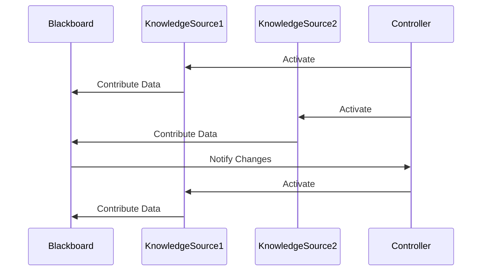

## 7.17 The Blackboard Pattern for Collaborative Solutions

In the realm of software design patterns, the Blackboard Pattern stands out as a powerful approach for collaborative problem-solving. This pattern is particularly useful in scenarios where multiple subsystems need to work together to solve complex problems, such as in artificial intelligence (AI) systems, data processing pipelines, or intricate calculations. In this section, we will delve into the Blackboard Pattern, exploring its components, functionality, and practical applications in JavaScript.

### Understanding the Blackboard Pattern

The Blackboard Pattern is a behavioral design pattern that facilitates collaboration among different subsystems by providing a shared knowledge base, known as the "blackboard." This pattern is inspired by the way human experts collaborate to solve complex problems, where each expert contributes their knowledge to a common workspace. The Blackboard Pattern consists of three main components:

1. **Blackboard**: The central repository where all knowledge is stored. It acts as a shared workspace that all subsystems can read from and write to.

2. **Knowledge Sources**: These are the subsystems or modules that contribute knowledge to the blackboard. Each knowledge source has specialized expertise and can add, modify, or retrieve information from the blackboard.

3. **Controller**: The component responsible for coordinating the activities of the knowledge sources. It manages the flow of information and ensures that the subsystems work together effectively.

### Components of the Blackboard Pattern

#### 1. Blackboard

The blackboard serves as the central hub for knowledge sharing. It is a dynamic data structure that can store various types of information, such as facts, hypotheses, and partial solutions. The blackboard is accessible to all knowledge sources, allowing them to contribute their insights and retrieve information as needed.

#### 2. Knowledge Sources

Knowledge sources are the individual subsystems or modules that possess specialized knowledge or expertise. Each knowledge source operates independently and can contribute to the problem-solving process by adding new information to the blackboard or refining existing data. Knowledge sources can also trigger actions based on changes in the blackboard.

#### 3. Controller

The controller orchestrates the interactions between the blackboard and the knowledge sources. It monitors the state of the blackboard, determines which knowledge sources should be activated, and manages the sequence of operations. The controller ensures that the problem-solving process progresses smoothly and efficiently.

### How the Blackboard Pattern Works

The Blackboard Pattern operates through a cycle of knowledge sharing and collaboration. Here's a step-by-step breakdown of how the pattern works:

1. **Initialization**: The blackboard is initialized with initial data or problem statements. This data serves as the starting point for the problem-solving process.

2. **Knowledge Contribution**: Knowledge sources analyze the current state of the blackboard and contribute their insights. They can add new information, refine existing data, or propose potential solutions.

3. **Coordination**: The controller monitors the blackboard and determines which knowledge sources should be activated based on the current state of the problem. It manages the sequence of operations and ensures that the knowledge sources work together effectively.

4. **Iteration**: The process of knowledge contribution and coordination continues iteratively. As new information is added to the blackboard, the problem-solving process evolves, and the solution becomes more refined.

5. **Solution**: The process continues until a satisfactory solution is reached or the problem is resolved. The final solution is stored on the blackboard and can be retrieved by the knowledge sources.

### Code Example: Implementing the Blackboard Pattern in JavaScript

Let's explore a JavaScript implementation of the Blackboard Pattern through a simple example. In this scenario, we'll simulate a collaborative problem-solving process where different knowledge sources work together to solve a complex calculation.

```javascript
// Define the Blackboard class
class Blackboard {
  constructor() {
    this.data = {};
  }

  // Method to add or update data on the blackboard
  setData(key, value) {
    this.data[key] = value;
  }

  // Method to retrieve data from the blackboard
  getData(key) {
    return this.data[key];
  }

  // Method to display the current state of the blackboard
  display() {
    console.log('Blackboard State:', this.data);
  }
}

// Define a Knowledge Source class
class KnowledgeSource {
  constructor(name, blackboard) {
    this.name = name;
    this.blackboard = blackboard;
  }

  // Method to contribute knowledge to the blackboard
  contribute() {
    // Each knowledge source has its own logic to contribute data
    console.log(`${this.name} is contributing to the blackboard.`);
  }
}

// Define a Controller class
class Controller {
  constructor(blackboard, knowledgeSources) {
    this.blackboard = blackboard;
    this.knowledgeSources = knowledgeSources;
  }

  // Method to coordinate the knowledge sources
  coordinate() {
    console.log('Controller is coordinating the knowledge sources.');
    this.knowledgeSources.forEach(source => source.contribute());
    this.blackboard.display();
  }
}

// Create a blackboard instance
const blackboard = new Blackboard();

// Create knowledge sources
const source1 = new KnowledgeSource('Source 1', blackboard);
const source2 = new KnowledgeSource('Source 2', blackboard);

// Create a controller
const controller = new Controller(blackboard, [source1, source2]);

// Simulate the problem-solving process
controller.coordinate();
```

In this example, we define a `Blackboard` class to represent the central repository for knowledge sharing. The `KnowledgeSource` class represents individual subsystems that contribute to the blackboard. The `Controller` class orchestrates the interactions between the blackboard and the knowledge sources.

### Visualizing the Blackboard Pattern

To better understand the flow of information in the Blackboard Pattern, let's visualize the interactions between the components using a Mermaid.js diagram.



**Diagram Description**: This sequence diagram illustrates the interactions between the blackboard, knowledge sources, and controller. The controller activates the knowledge sources, which contribute data to the blackboard. The blackboard notifies the controller of changes, prompting further coordination.

### Use Cases of the Blackboard Pattern

The Blackboard Pattern is particularly useful in scenarios where collaboration among multiple subsystems is required. Here are some common use cases:

#### 1. Artificial Intelligence Systems

In AI systems, the Blackboard Pattern is often used to integrate different AI techniques, such as rule-based systems, neural networks, and expert systems. Each technique acts as a knowledge source, contributing its insights to the blackboard to solve complex problems.

#### 2. Data Processing Pipelines

In data processing pipelines, the Blackboard Pattern can be used to coordinate the flow of data between different processing stages. Each stage acts as a knowledge source, processing data and contributing results to the blackboard.

#### 3. Complex Calculations

In scenarios involving complex calculations, the Blackboard Pattern can facilitate collaboration among different mathematical models or algorithms. Each model acts as a knowledge source, contributing its calculations to the blackboard to arrive at a final solution.

### Challenges and Considerations

While the Blackboard Pattern offers significant benefits in terms of collaboration and problem-solving, it also presents certain challenges:

- **Complexity of Coordination**: Managing the interactions between multiple knowledge sources can be complex, especially in large-scale systems. The controller must effectively coordinate the activities of the knowledge sources to ensure smooth operation.

- **Shared Data Management**: The blackboard serves as a shared data repository, which can lead to issues related to data consistency and synchronization. Careful management of shared data is essential to avoid conflicts and ensure accurate results.

- **Performance Overhead**: The iterative nature of the Blackboard Pattern can introduce performance overhead, especially in systems with a large number of knowledge sources. Optimizing the coordination process and minimizing redundant operations can help mitigate this issue.

### JavaScript-Specific Considerations

When implementing the Blackboard Pattern in JavaScript, there are several language-specific features to consider:

- **Asynchronous Operations**: JavaScript's asynchronous nature can be leveraged to manage the interactions between knowledge sources and the blackboard. Promises and async/await can be used to handle asynchronous operations effectively.

- **Event-Driven Architecture**: JavaScript's event-driven architecture can be utilized to trigger actions based on changes in the blackboard. Event emitters can be used to notify knowledge sources of updates, facilitating real-time collaboration.

- **Modular Design**: JavaScript's modular design capabilities, such as ES Modules, can be used to organize the components of the Blackboard Pattern into separate modules. This enhances code maintainability and reusability.

### Try It Yourself

To deepen your understanding of the Blackboard Pattern, try modifying the code example provided above. Here are some suggestions:

- **Add More Knowledge Sources**: Create additional knowledge sources with different logic for contributing data to the blackboard.

- **Implement Asynchronous Operations**: Modify the `contribute` method of the knowledge sources to perform asynchronous operations using Promises or async/await.

- **Enhance the Controller Logic**: Implement more sophisticated coordination logic in the controller to manage the interactions between knowledge sources more effectively.

### Conclusion

The Blackboard Pattern is a powerful design pattern that enables collaborative problem-solving through shared knowledge among multiple subsystems. By providing a central repository for knowledge sharing, the Blackboard Pattern facilitates the integration of diverse expertise and techniques, making it particularly useful in AI systems, data processing pipelines, and complex calculations. While the pattern presents certain challenges, such as coordination complexity and shared data management, careful design and implementation can help overcome these issues. By leveraging JavaScript's unique features, such as asynchronous operations and event-driven architecture, developers can effectively implement the Blackboard Pattern to solve complex problems collaboratively.

### Key Takeaways

- The Blackboard Pattern is a behavioral design pattern that facilitates collaboration among multiple subsystems through a shared knowledge base.
- The pattern consists of three main components: the blackboard, knowledge sources, and the controller.
- The Blackboard Pattern is commonly used in AI systems, data processing pipelines, and complex calculations.
- Challenges include coordination complexity, shared data management, and performance overhead.
- JavaScript's asynchronous operations, event-driven architecture, and modular design capabilities can be leveraged to implement the Blackboard Pattern effectively.

### References and Further Reading

- [MDN Web Docs: JavaScript](https://developer.mozilla.org/en-US/docs/Web/JavaScript)
- [Design Patterns: Elements of Reusable Object-Oriented Software](https://en.wikipedia.org/wiki/Design_Patterns)
- [JavaScript Design Patterns](https://addyosmani.com/resources/essentialjsdesignpatterns/book/)

## Test Your Knowledge on the Blackboard Pattern in JavaScript



### What is the main purpose of the Blackboard Pattern?

- [x] To facilitate collaboration among multiple subsystems through a shared knowledge base.
- [ ] To provide a single point of failure in a system.
- [ ] To enhance the performance of individual subsystems.
- [ ] To simplify the user interface of an application.

> **Explanation:** The Blackboard Pattern is designed to enable collaboration among different subsystems by providing a shared workspace for knowledge sharing.

### Which component of the Blackboard Pattern acts as the central repository for knowledge sharing?

- [x] Blackboard
- [ ] Knowledge Source
- [ ] Controller
- [ ] Observer

> **Explanation:** The blackboard serves as the central hub where all knowledge is stored and shared among the subsystems.

### What role does the controller play in the Blackboard Pattern?

- [x] It coordinates the activities of the knowledge sources.
- [ ] It stores all the data in the system.
- [ ] It provides user input to the system.
- [ ] It generates random data for the blackboard.

> **Explanation:** The controller is responsible for managing the interactions between the blackboard and the knowledge sources, ensuring effective collaboration.

### In which scenarios is the Blackboard Pattern particularly useful?

- [x] AI systems, data processing pipelines, and complex calculations.
- [ ] Simple CRUD applications.
- [ ] Static web pages.
- [ ] Basic form validation.

> **Explanation:** The Blackboard Pattern is ideal for complex problem-solving scenarios where collaboration among multiple subsystems is required.

### What is a potential challenge when implementing the Blackboard Pattern?

- [x] Managing shared data and ensuring consistency.
- [ ] Reducing the number of user interfaces.
- [ ] Simplifying the codebase.
- [ ] Eliminating all asynchronous operations.

> **Explanation:** Shared data management is a key challenge in the Blackboard Pattern, as it involves ensuring data consistency and synchronization.

### How can JavaScript's asynchronous nature be leveraged in the Blackboard Pattern?

- [x] By using Promises and async/await to handle asynchronous operations.
- [ ] By avoiding all asynchronous operations.
- [ ] By using synchronous loops exclusively.
- [ ] By implementing blocking I/O operations.

> **Explanation:** JavaScript's asynchronous capabilities, such as Promises and async/await, can be used to manage interactions between knowledge sources and the blackboard effectively.

### What is the primary function of knowledge sources in the Blackboard Pattern?

- [x] To contribute specialized knowledge to the blackboard.
- [ ] To act as the main user interface.
- [ ] To store all user data.
- [ ] To generate random numbers.

> **Explanation:** Knowledge sources are responsible for contributing their expertise to the blackboard, enhancing the problem-solving process.

### Which JavaScript feature can be used to trigger actions based on changes in the blackboard?

- [x] Event emitters
- [ ] Synchronous loops
- [ ] Blocking I/O operations
- [ ] Static variables

> **Explanation:** Event emitters can be used to notify knowledge sources of changes in the blackboard, facilitating real-time collaboration.

### What is a key benefit of using the Blackboard Pattern?

- [x] It enables the integration of diverse expertise and techniques.
- [ ] It simplifies the user interface design.
- [ ] It eliminates the need for a controller.
- [ ] It reduces the number of knowledge sources required.

> **Explanation:** The Blackboard Pattern allows for the integration of different knowledge sources, each contributing their expertise to solve complex problems.

### True or False: The Blackboard Pattern is only applicable to AI systems.

- [ ] True
- [x] False

> **Explanation:** While the Blackboard Pattern is commonly used in AI systems, it is also applicable to other scenarios, such as data processing pipelines and complex calculations.


