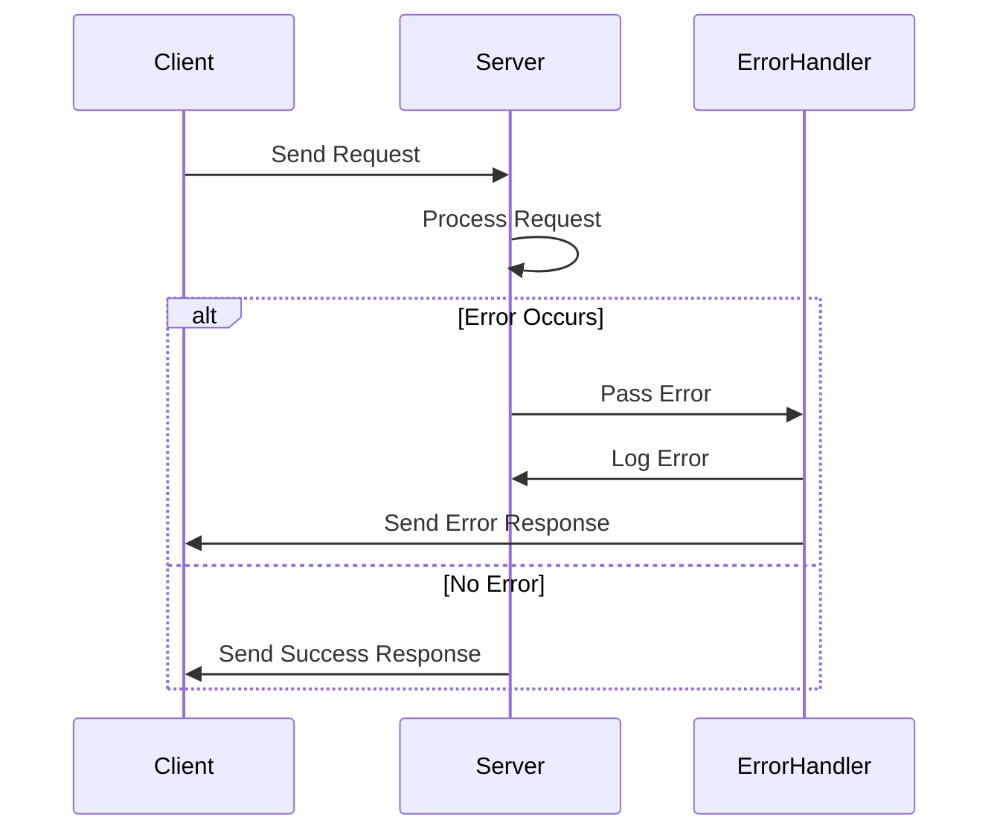

## 7.18 Centralized Error Handling Patterns

In modern web development, managing errors effectively is crucial for building robust applications. Centralized error handling patterns in JavaScript offer a structured approach to manage errors consistently across your application, enhancing maintainability and user experience. This section delves into the importance of centralized error handling, explores implementation strategies using frameworks like Express.js, and discusses best practices for logging, user feedback, and recovery.

### Importance of Consistent Error Handling

Consistent error handling is vital for several reasons:

- **Maintainability**: Centralized error handling simplifies the process of updating error management logic, as changes need to be made in one place rather than scattered throughout the codebase.
- **User Experience**: Providing users with clear, consistent feedback when errors occur improves their experience and trust in the application.
- **Debugging and Logging**: Centralized error handling facilitates comprehensive logging, making it easier to diagnose and fix issues.
- **Security**: Proper error handling prevents the leakage of sensitive information through error messages.

### Implementing Centralized Error Handlers in Express.js

Express.js, a popular Node.js web application framework, provides a straightforward way to implement centralized error handling using middleware. Let's explore how to set up a centralized error handler in an Express.js application.

#### Setting Up an Express.js Application

First, let's create a basic Express.js application:

```javascript
const express = require('express');
const app = express();

// Sample route
app.get('/', (req, res) => {
  res.send('Hello, World!');
});

// Start the server
app.listen(3000, () => {
  console.log('Server is running on port 3000');
});
```

#### Creating a Centralized Error Handler

To handle errors centrally, we can define an error-handling middleware function. This function will catch errors thrown in the application and process them consistently.

```javascript
// Error-handling middleware
app.use((err, req, res, next) => {
  console.error(err.stack); // Log the error stack

  res.status(500).json({
    message: 'Something went wrong!',
    error: process.env.NODE_ENV === 'production' ? {} : err // Hide error details in production
  });
});
```

In this example, the error-handling middleware logs the error stack and sends a JSON response with a generic error message. In a production environment, it's a best practice to hide error details from the user to avoid exposing sensitive information.

#### Using Middleware to Catch Errors

Middleware functions in Express.js can be used to catch errors in both synchronous and asynchronous code. Here's how you can handle errors in asynchronous routes:

```javascript
// Asynchronous route with error handling
app.get('/async', async (req, res, next) => {
  try {
    const data = await someAsyncFunction();
    res.json(data);
  } catch (err) {
    next(err); // Pass the error to the error-handling middleware
  }
});
```

By using `try...catch` blocks and passing errors to `next()`, we ensure that asynchronous errors are caught and handled by the centralized error handler.

### Best Practices for Centralized Error Handling

Implementing centralized error handling effectively involves several best practices:

#### Logging

- **Use a Logging Library**: Utilize libraries like `winston` or `morgan` for structured logging. These libraries provide features like log levels, transports, and formatting.
- **Log Contextual Information**: Include contextual information such as request IDs, user IDs, and timestamps in your logs to facilitate debugging.

#### User Feedback

- **Provide User-Friendly Messages**: Display user-friendly error messages that do not expose technical details.
- **Use Notifications**: Implement notification systems to inform users of errors without disrupting their workflow.

#### Recovery

- **Graceful Degradation**: Design your application to degrade gracefully in the event of an error, maintaining core functionality.
- **Retry Mechanisms**: Implement retry mechanisms for transient errors, such as network failures.

### Considerations for Synchronous and Asynchronous Code

Handling errors in synchronous and asynchronous code requires different approaches:

#### Synchronous Code

In synchronous code, errors can be caught using `try...catch` blocks. Ensure that all potential error points are wrapped in `try...catch` to prevent unhandled exceptions.

```javascript
try {
  const result = someFunction();
  console.log(result);
} catch (err) {
  console.error('Error:', err.message);
}
```

#### Asynchronous Code

Asynchronous code, especially when using Promises or `async/await`, requires careful error handling. Use `try...catch` with `async/await` and `.catch()` with Promises to handle errors effectively.

```javascript
// Using async/await
async function fetchData() {
  try {
    const response = await fetch('https://api.example.com/data');
    const data = await response.json();
    return data;
  } catch (err) {
    console.error('Fetch error:', err);
  }
}

// Using Promises
fetch('https://api.example.com/data')
  .then(response => response.json())
  .then(data => console.log(data))
  .catch(err => console.error('Fetch error:', err));
```

### Visualizing Centralized Error Handling

To better understand the flow of centralized error handling in an Express.js application, let's visualize it using a sequence diagram.



**Diagram Description**: This sequence diagram illustrates the flow of a request in an Express.js application. If an error occurs during request processing, it is passed to the centralized error handler, which logs the error and sends an error response to the client.

### Try It Yourself

Experiment with the code examples provided in this section. Try modifying the error-handling middleware to log errors to a file instead of the console. You can also implement different response messages based on the error type or status code.

### References and Links

- [Express.js Error Handling](https://expressjs.com/en/guide/error-handling.html)
- [Node.js Error Handling Best Practices](https://nodejs.dev/learn/error-handling-in-nodejs)
- [MDN Web Docs: Error Handling](https://developer.mozilla.org/en-US/docs/Web/JavaScript/Guide/Control_flow_and_error_handling)

### Knowledge Check

- What are the benefits of centralized error handling?
- How can middleware be used to handle errors in Express.js?
- What are some best practices for logging errors?
- How can you handle errors in asynchronous code using `async/await`?

### Embrace the Journey

Remember, mastering error handling is a journey. As you continue to build and refine your applications, you'll discover new patterns and techniques that enhance your error management strategy. Keep experimenting, stay curious, and enjoy the process of creating robust, user-friendly applications.

## Quiz: Centralized Error Handling Patterns in JavaScript



### What is a primary benefit of centralized error handling?

- [x] Simplifies maintenance by consolidating error logic
- [ ] Increases application size
- [ ] Reduces code readability
- [ ] Makes debugging harder

> **Explanation:** Centralized error handling consolidates error management logic, simplifying maintenance and updates.

### How can you handle errors in asynchronous routes in Express.js?

- [x] Use `try...catch` and pass errors to `next()`
- [ ] Use only `console.log()`
- [ ] Ignore errors
- [ ] Use synchronous code only

> **Explanation:** Using `try...catch` and passing errors to `next()` ensures that asynchronous errors are caught and handled by the centralized error handler.

### Which library is recommended for structured logging in Node.js?

- [x] winston
- [ ] lodash
- [ ] axios
- [ ] express

> **Explanation:** `winston` is a popular library for structured logging in Node.js applications.

### What should you avoid displaying in user-facing error messages?

- [x] Technical details and stack traces
- [ ] User-friendly messages
- [ ] Error codes
- [ ] Retry options

> **Explanation:** Avoid displaying technical details and stack traces to users to prevent information leakage.

### What is a recommended practice for handling transient errors?

- [x] Implement retry mechanisms
- [ ] Ignore them
- [ ] Log them without action
- [ ] Display them to users

> **Explanation:** Implementing retry mechanisms helps handle transient errors like network failures effectively.

### How can you handle errors in synchronous JavaScript code?

- [x] Use `try...catch` blocks
- [ ] Use `async/await`
- [ ] Use Promises
- [ ] Ignore errors

> **Explanation:** `try...catch` blocks are used to handle errors in synchronous JavaScript code.

### What is a key consideration when logging errors?

- [x] Include contextual information
- [ ] Log only error messages
- [ ] Avoid logging
- [ ] Log in production only

> **Explanation:** Including contextual information like request IDs and timestamps aids in debugging.

### What is the role of middleware in Express.js error handling?

- [x] To catch and process errors
- [ ] To increase response time
- [ ] To handle database queries
- [ ] To serve static files

> **Explanation:** Middleware in Express.js can be used to catch and process errors consistently.

### Which of the following is a best practice for user feedback on errors?

- [x] Provide user-friendly messages
- [ ] Display stack traces
- [ ] Use technical jargon
- [ ] Ignore user feedback

> **Explanation:** Providing user-friendly messages improves user experience and trust.

### True or False: Centralized error handling can improve application security.

- [x] True
- [ ] False

> **Explanation:** Centralized error handling can improve security by preventing sensitive information from being exposed through error messages.


