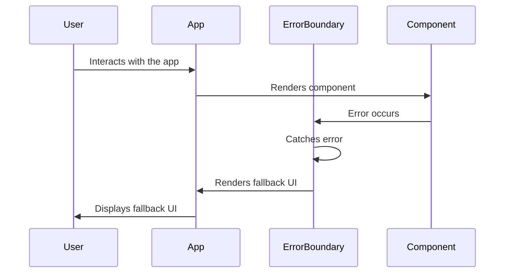

## 7.19 Implementing Error Boundaries in React

In modern web development, ensuring a seamless user experience is paramount. React, a popular JavaScript library for building user interfaces, provides a robust mechanism to handle errors gracefully through error boundaries. This section explores the concept of error boundaries, their implementation, and best practices for using them in React applications.

### Understanding Error Boundaries

Error boundaries are React components that catch JavaScript errors anywhere in their child component tree, log those errors, and display a fallback UI instead of crashing the entire application. They are essential for maintaining application stability and providing a better user experience.

#### Key Concepts

- **Error Propagation**: In React, errors that occur during rendering, in lifecycle methods, and in constructors of the whole tree are caught by error boundaries.
- **Fallback UI**: When an error is caught, error boundaries can render a fallback UI, which is a user-friendly message or component indicating that something went wrong.
- **Error Logging**: Error boundaries can also be used to log errors for further analysis and debugging.

### Implementing Error Boundaries

To implement an error boundary, you need to define a class component with two specific lifecycle methods: `componentDidCatch` and `static getDerivedStateFromError`.

#### Step-by-Step Implementation

1. **Create a Class Component**: Error boundaries must be class components because they rely on lifecycle methods.

2. **Define `getDerivedStateFromError`**: This static method is used to update the state so the next render will show the fallback UI.

3. **Implement `componentDidCatch`**: This lifecycle method is used to perform side effects, such as logging the error.

Here's a simple example of an error boundary component:

```javascript
import React, { Component } from 'react';

class ErrorBoundary extends Component {
  constructor(props) {
    super(props);
    this.state = { hasError: false };
  }

  static getDerivedStateFromError(error) {
    // Update state to trigger fallback UI
    return { hasError: true };
  }

  componentDidCatch(error, errorInfo) {
    // Log the error to an error reporting service
    console.error("Error caught by ErrorBoundary:", error, errorInfo);
  }

  render() {
    if (this.state.hasError) {
      // Render fallback UI
      return <h1>Something went wrong.</h1>;
    }

    return this.props.children;
  }
}

export default ErrorBoundary;
```

#### Using the Error Boundary

To use the error boundary, wrap it around any component tree that you want to protect:

```javascript
import React from 'react';
import ErrorBoundary from './ErrorBoundary';
import MyComponent from './MyComponent';

function App() {
  return (
    <ErrorBoundary>
      <MyComponent />
    </ErrorBoundary>
  );
}

export default App;
```

### Best Practices for Error Boundaries

1. **Granular Error Boundaries**: Use multiple error boundaries to isolate different parts of your application. This way, an error in one part doesn't affect the entire app.

2. **Logging Errors**: Integrate error logging services like Sentry or LogRocket to capture and analyze errors.

3. **Informing Users**: Provide meaningful fallback UI to inform users about the error and possible next steps.

4. **Testing Error Boundaries**: Regularly test your error boundaries to ensure they handle errors as expected.

### Limitations of Error Boundaries

While error boundaries are powerful, they have limitations:

- **Event Handlers**: Error boundaries do not catch errors inside event handlers. You need to handle these errors manually.
- **Asynchronous Code**: Errors in asynchronous code (e.g., `setTimeout`, `fetch`) are not caught by error boundaries.
- **Server-Side Rendering**: Error boundaries do not catch errors during server-side rendering.

### Visualizing Error Boundaries

To better understand how error boundaries work, let's visualize the process using a sequence diagram:



### Try It Yourself

Experiment with the error boundary example by introducing an error in `MyComponent` and observing how the error boundary handles it. Try modifying the fallback UI to provide more detailed information or actions for the user.

### Further Reading

For more information on error boundaries and React error handling, consider exploring the following resources:

- [React Error Boundaries Documentation](https://reactjs.org/docs/error-boundaries.html)
- [MDN Web Docs on Error Handling](https://developer.mozilla.org/en-US/docs/Web/JavaScript/Guide/Control_flow_and_error_handling)

### Knowledge Check

- What is the primary purpose of error boundaries in React?
- How do you implement an error boundary in a React application?
- What are the limitations of error boundaries?
- Why is it important to log errors caught by error boundaries?

### Summary

Error boundaries are a crucial tool in React for handling errors gracefully and maintaining application stability. By implementing error boundaries, you can catch errors in component trees, log them for analysis, and provide a fallback UI to enhance the user experience. Remember to consider their limitations and use best practices to maximize their effectiveness.

## Quiz: Mastering Error Boundaries in React



### What is the primary purpose of error boundaries in React?

- [x] To catch JavaScript errors in component trees and display a fallback UI
- [ ] To handle asynchronous errors in event handlers
- [ ] To improve the performance of React applications
- [ ] To manage state across different components

> **Explanation:** Error boundaries are designed to catch JavaScript errors in component trees and provide a fallback UI to prevent the entire application from crashing.

### Which lifecycle method is used to update the state for rendering a fallback UI?

- [x] getDerivedStateFromError
- [ ] componentDidMount
- [ ] componentWillUnmount
- [ ] shouldComponentUpdate

> **Explanation:** The `getDerivedStateFromError` static method is used to update the state so that the next render will show the fallback UI.

### Can error boundaries catch errors in event handlers?

- [ ] Yes
- [x] No

> **Explanation:** Error boundaries do not catch errors inside event handlers. These errors need to be handled manually.

### What should you do to handle errors in asynchronous code?

- [x] Use try-catch blocks or promise catch methods
- [ ] Rely on error boundaries
- [ ] Use componentDidCatch
- [ ] Ignore them

> **Explanation:** Errors in asynchronous code should be handled using try-catch blocks or promise catch methods, as error boundaries do not catch these errors.

### Why is it important to log errors caught by error boundaries?

- [x] To analyze and debug issues
- [ ] To improve application performance
- [ ] To automatically fix errors
- [ ] To prevent errors from occurring

> **Explanation:** Logging errors caught by error boundaries is important for analyzing and debugging issues to improve application stability.

### What is a limitation of error boundaries?

- [x] They do not catch errors in asynchronous code
- [ ] They cannot render fallback UI
- [ ] They are only available in functional components
- [ ] They improve application performance

> **Explanation:** Error boundaries do not catch errors in asynchronous code, such as those in `setTimeout` or `fetch`.

### How can you test error boundaries effectively?

- [x] By simulating errors in components and observing the fallback UI
- [ ] By using only unit tests
- [ ] By ignoring errors during testing
- [ ] By relying on user feedback

> **Explanation:** Testing error boundaries involves simulating errors in components to ensure the fallback UI is rendered as expected.

### What is the role of `componentDidCatch` in error boundaries?

- [x] To perform side effects like logging errors
- [ ] To update the state for rendering fallback UI
- [ ] To handle asynchronous errors
- [ ] To manage component lifecycle

> **Explanation:** The `componentDidCatch` lifecycle method is used to perform side effects, such as logging errors.

### Can error boundaries be implemented in functional components?

- [ ] Yes
- [x] No

> **Explanation:** Error boundaries must be implemented in class components because they rely on lifecycle methods.

### True or False: Error boundaries can catch errors during server-side rendering.

- [ ] True
- [x] False

> **Explanation:** Error boundaries do not catch errors during server-side rendering; they only work in the browser environment.



Remember, mastering error boundaries is just one step in building robust React applications. Keep exploring, experimenting, and enhancing your skills to create seamless user experiences.
