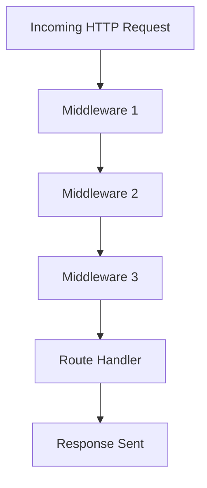

## 7.2 Middleware Pattern

### Introduction

The Middleware Pattern is a powerful design pattern commonly used in Node.js applications, particularly with frameworks like Express.js. It allows developers to process HTTP requests through a sequence of middleware functions, each responsible for a specific task. This pattern promotes separation of concerns, making your application more modular, maintainable, and scalable.

### Understand the Intent

The primary intent of the Middleware Pattern is to handle HTTP requests in a structured and organized manner. Middleware functions can perform a variety of tasks, such as logging, authentication, request parsing, and error handling. By chaining these functions together, you can create a robust and flexible request processing pipeline.

### Detailed Explanation

#### Components of Middleware

1. **Middleware Functions:** These are functions that take three arguments: `req`, `res`, and `next`. They can modify the request and response objects, end the request-response cycle, or pass control to the next middleware function using `next()`.

2. **Middleware Stack:** This is the sequence of middleware functions that an HTTP request passes through. The order of middleware in the stack is crucial as it determines the flow of request processing.

3. **Application of Middleware:** Middleware can be applied globally to all routes or selectively to specific routes, providing flexibility in how requests are handled.

#### Workflow



### Implementation Steps

#### Define Middleware Functions

Middleware functions are the building blocks of the middleware pattern. They have access to the request and response objects and can modify them as needed.

```javascript
// Logging middleware
function logRequests(req, res, next) {
    console.log(`${req.method} ${req.url}`);
    next(); // Pass control to the next middleware
}

// Error-handling middleware
function errorHandler(err, req, res, next) {
    console.error(err.stack);
    res.status(500).send('Something broke!');
}
```

#### Apply Middleware

Middleware can be applied globally using `app.use()` or to specific routes.

```javascript
const express = require('express');
const app = express();

// Apply logging middleware globally
app.use(logRequests);

// Apply error-handling middleware globally
app.use(errorHandler);

// Apply middleware to a specific route
app.get('/user', authenticateUser, (req, res) => {
    res.send('User Profile');
});
```

#### Call `next()`

The `next()` function is crucial in the middleware pattern. It passes control to the next middleware function in the stack. If `next()` is not called, the request-response cycle will be left hanging.

### Code Examples

#### Logging Middleware

Create middleware to log incoming requests.

```javascript
function logRequests(req, res, next) {
    console.log(`Received ${req.method} request for ${req.url}`);
    next();
}

app.use(logRequests);
```

#### Error-Handling Middleware

Implement middleware to catch and process errors.

```javascript
function errorHandler(err, req, res, next) {
    console.error('Error:', err.message);
    res.status(500).json({ error: 'Internal Server Error' });
}

app.use(errorHandler);
```

### Use Cases

Middleware is ideal for separating concerns in your application. Common use cases include:

- **Authentication:** Verify user credentials before granting access to protected routes.
- **Logging:** Record details of incoming requests for monitoring and debugging.
- **Error Handling:** Capture and handle errors gracefully to improve user experience.
- **Request Parsing:** Parse incoming request bodies, cookies, and query parameters.

### Practice

Build an Express.js application with custom middleware for request parsing and authentication.

```javascript
const express = require('express');
const app = express();

// Middleware for parsing JSON bodies
app.use(express.json());

// Custom authentication middleware
function authenticateUser(req, res, next) {
    const token = req.headers['authorization'];
    if (token === 'valid-token') {
        next();
    } else {
        res.status(401).send('Unauthorized');
    }
}

app.get('/dashboard', authenticateUser, (req, res) => {
    res.send('Welcome to your dashboard!');
});

app.listen(3000, () => {
    console.log('Server running on port 3000');
});
```

### Considerations

- **Order Matters:** The order in which middleware is applied is critical. Ensure middleware is added in the correct sequence to achieve the desired behavior.
- **Error Handling:** Always include error-handling middleware to prevent unhandled exceptions and improve application reliability.

### Advantages and Disadvantages

#### Advantages

- **Modularity:** Middleware functions encapsulate specific tasks, making the application more modular.
- **Reusability:** Middleware can be reused across different routes and applications.
- **Maintainability:** Clear separation of concerns improves code maintainability.

#### Disadvantages

- **Complexity:** Managing the order and flow of middleware can become complex in large applications.
- **Performance:** Each middleware adds overhead to request processing, potentially impacting performance.

### Best Practices

- **Keep Middleware Focused:** Each middleware should perform a single, well-defined task.
- **Error Handling:** Always include error-handling middleware at the end of the stack.
- **Use Third-Party Middleware:** Leverage existing middleware libraries to avoid reinventing the wheel.

### Conclusion

The Middleware Pattern is an essential tool in the Node.js developer's toolkit, particularly when working with Express.js. By understanding and effectively implementing middleware, you can create robust, scalable, and maintainable applications. Remember to consider the order of middleware, handle errors gracefully, and keep your middleware functions focused on specific tasks.

## Quiz Time!



### What is the primary intent of the Middleware Pattern in Node.js?

- [x] To handle HTTP requests in a structured and organized manner.
- [ ] To directly access the database.
- [ ] To compile JavaScript code.
- [ ] To manage user sessions.

> **Explanation:** The Middleware Pattern is designed to process HTTP requests through a sequence of middleware functions, each responsible for a specific task, thereby handling requests in a structured manner.

### Which of the following is NOT a component of middleware?

- [ ] Middleware Functions
- [ ] Middleware Stack
- [x] Database Connection
- [ ] Application of Middleware

> **Explanation:** Middleware components include functions, stack, and application, but not database connections.

### What arguments do middleware functions typically take?

- [x] `req`, `res`, `next`
- [ ] `request`, `response`, `callback`
- [ ] `input`, `output`, `done`
- [ ] `query`, `result`, `finish`

> **Explanation:** Middleware functions in Express.js take `req`, `res`, and `next` as arguments.

### How do you apply middleware globally in Express.js?

- [x] Using `app.use()`
- [ ] Using `app.get()`
- [ ] Using `app.post()`
- [ ] Using `app.listen()`

> **Explanation:** `app.use()` is used to apply middleware globally in Express.js applications.

### What is the purpose of the `next()` function in middleware?

- [x] To pass control to the next middleware function
- [ ] To terminate the server
- [ ] To send a response to the client
- [ ] To log the request details

> **Explanation:** The `next()` function is used to pass control to the next middleware function in the stack.

### Which middleware is responsible for handling errors?

- [x] Error-handling middleware
- [ ] Logging middleware
- [ ] Authentication middleware
- [ ] Request parsing middleware

> **Explanation:** Error-handling middleware is specifically designed to catch and process errors.

### What is a common use case for middleware?

- [x] Authentication
- [ ] Compiling code
- [ ] Rendering HTML
- [ ] Managing file uploads

> **Explanation:** Middleware is commonly used for tasks like authentication, logging, and error handling.

### Why is the order of middleware important?

- [x] It determines the flow of request processing.
- [ ] It affects the application startup time.
- [ ] It changes the server port.
- [ ] It modifies the database schema.

> **Explanation:** The order of middleware is crucial as it determines the sequence in which requests are processed.

### What is a disadvantage of using middleware?

- [x] Complexity in managing order and flow
- [ ] Increased database load
- [ ] Reduced code readability
- [ ] Limited scalability

> **Explanation:** Managing the order and flow of middleware can become complex, especially in large applications.

### True or False: Middleware functions can modify both request and response objects.

- [x] True
- [ ] False

> **Explanation:** Middleware functions have access to both the request and response objects and can modify them as needed.


