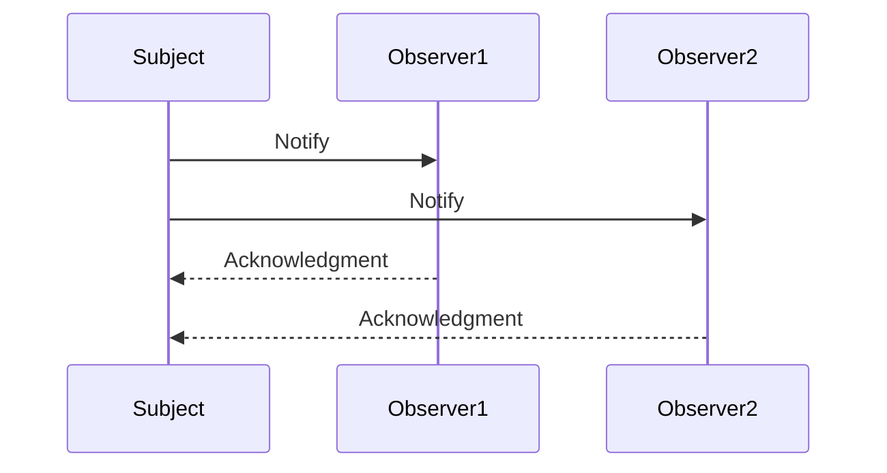

## 7.2 Observer Pattern Using Events

The Observer Pattern is a fundamental design pattern in software development that establishes a one-to-many dependency between objects. When one object changes state, all its dependents are notified and updated automatically. This pattern is particularly useful in scenarios where a change in one part of an application needs to be reflected in other parts without tightly coupling the components.

### Understanding the Observer Pattern

**Components of the Observer Pattern:**

- **Subject**: The core component that holds the state and notifies observers about changes.
- **Observers**: These are components that need to be informed about changes in the subject.

In JavaScript, the Observer Pattern is naturally implemented through its event system, allowing developers to create responsive and interactive applications.

### JavaScript's Event System and the Observer Pattern

JavaScript's event system is a powerful mechanism that aligns closely with the Observer Pattern. Events in JavaScript can be thought of as notifications that something has happened. These events can be listened to by multiple observers, which can then react accordingly.

#### Browser Events

In the browser environment, events are a core part of the DOM API. Events such as `click`, `load`, and `input` are dispatched by the browser and can be listened to by any element in the DOM.

```javascript
// Example: Listening to a click event on a button
const button = document.querySelector('button');

button.addEventListener('click', () => {
  console.log('Button was clicked!');
});
```

In this example, the button acts as the subject, and the function passed to `addEventListener` is the observer.

#### Custom Events with `EventTarget`

JavaScript allows for the creation of custom events using the `EventTarget` interface. This enables developers to implement the Observer Pattern for custom scenarios.

```javascript
// Example: Creating and dispatching a custom event
const myEventTarget = new EventTarget();

myEventTarget.addEventListener('customEvent', (event) => {
  console.log('Custom event received:', event.detail);
});

// Dispatching the custom event
const event = new CustomEvent('customEvent', { detail: { message: 'Hello, World!' } });
myEventTarget.dispatchEvent(event);
```

Here, `myEventTarget` is the subject, and the function listening to `customEvent` is the observer.

#### Node.js's EventEmitter

In Node.js, the `EventEmitter` class from the `events` module provides a robust implementation of the Observer Pattern.

```javascript
const EventEmitter = require('events');
const myEmitter = new EventEmitter();

myEmitter.on('event', () => {
  console.log('An event occurred!');
});

myEmitter.emit('event');
```

In this Node.js example, `myEmitter` is the subject, and the function passed to `on` is the observer.

### Creating a Simple Observer Implementation from Scratch

To deepen our understanding, let's create a basic implementation of the Observer Pattern in JavaScript.

```javascript
class Subject {
  constructor() {
    this.observers = [];
  }

  subscribe(observer) {
    this.observers.push(observer);
  }

  unsubscribe(observer) {
    this.observers = this.observers.filter(obs => obs !== observer);
  }

  notify(data) {
    this.observers.forEach(observer => observer(data));
  }
}

// Usage
const subject = new Subject();

const observer1 = (data) => console.log('Observer 1:', data);
const observer2 = (data) => console.log('Observer 2:', data);

subject.subscribe(observer1);
subject.subscribe(observer2);

subject.notify('Hello Observers!'); // Both observers will log the message

subject.unsubscribe(observer1);

subject.notify('Hello again!'); // Only Observer 2 will log the message
```

In this implementation, the `Subject` class manages a list of observers and provides methods to subscribe, unsubscribe, and notify them.

### Practical Applications

The Observer Pattern is widely used in various applications, including:

- **UI Updates**: Automatically updating the user interface when the underlying data changes.
- **Data Binding**: Synchronizing data between the model and the view in frameworks like Angular and React.
- **Reactive Programming**: Implementing reactive systems where changes propagate through a network of dependencies.

### Best Practices

When implementing the Observer Pattern, consider the following best practices:

- **Manage Subscriptions**: Ensure that observers are properly subscribed and unsubscribed to prevent memory leaks.
- **Avoid Memory Leaks**: Use weak references or ensure that observers are removed when no longer needed.
- **Decouple Components**: Keep subjects and observers loosely coupled to enhance maintainability and testability.

### Visualizing the Observer Pattern

To better understand the flow of the Observer Pattern, let's visualize it using a sequence diagram.



This diagram illustrates the notification process from the subject to its observers.

### Try It Yourself

Experiment with the provided code examples by modifying the events, adding more observers, or creating new custom events. This hands-on approach will deepen your understanding of the Observer Pattern in JavaScript.

### References and Further Reading

- [MDN Web Docs: EventTarget](https://developer.mozilla.org/en-US/docs/Web/API/EventTarget)
- [Node.js EventEmitter](https://nodejs.org/api/events.html)
- [Reactive Programming with RxJS](https://rxjs.dev/)

### Knowledge Check

## Observer Pattern in JavaScript Quiz



### What is the primary purpose of the Observer Pattern?

- [x] To establish a one-to-many dependency between objects
- [ ] To create a one-to-one relationship between objects
- [ ] To manage memory allocation in JavaScript
- [ ] To optimize performance in web applications

> **Explanation:** The Observer Pattern establishes a one-to-many dependency between objects, allowing changes in one object to automatically update its dependents.

### Which JavaScript feature naturally implements the Observer Pattern?

- [x] The event system
- [ ] The prototype chain
- [ ] The `this` keyword
- [ ] The `eval` function

> **Explanation:** JavaScript's event system naturally implements the Observer Pattern by allowing multiple observers to listen to events.

### What is the role of the `EventEmitter` in Node.js?

- [x] To provide a robust implementation of the Observer Pattern
- [ ] To manage file system operations
- [ ] To handle HTTP requests
- [ ] To optimize memory usage

> **Explanation:** The `EventEmitter` class in Node.js provides a robust implementation of the Observer Pattern, allowing objects to emit events and listeners to respond to them.

### How can you prevent memory leaks when using the Observer Pattern?

- [x] By properly unsubscribing observers when they are no longer needed
- [ ] By using the `eval` function
- [ ] By avoiding the use of closures
- [ ] By using synchronous code only

> **Explanation:** Properly unsubscribing observers when they are no longer needed helps prevent memory leaks in applications using the Observer Pattern.

### What is a practical application of the Observer Pattern?

- [x] UI updates
- [ ] Memory management
- [ ] File system operations
- [ ] Network requests

> **Explanation:** The Observer Pattern is commonly used for UI updates, where changes in data automatically update the user interface.

### Which method is used to listen to events in the browser?

- [x] `addEventListener`
- [ ] `emit`
- [ ] `dispatchEvent`
- [ ] `removeEventListener`

> **Explanation:** The `addEventListener` method is used to listen to events in the browser, allowing functions to respond to specific events.

### What is the purpose of the `notify` method in a custom Observer Pattern implementation?

- [x] To inform all subscribed observers about a change
- [ ] To remove an observer from the list
- [ ] To add a new observer to the list
- [ ] To initialize the subject

> **Explanation:** The `notify` method in a custom Observer Pattern implementation informs all subscribed observers about a change in the subject.

### How does the `EventTarget` interface help in implementing custom events?

- [x] It allows creating and dispatching custom events
- [ ] It optimizes memory usage
- [ ] It provides a way to manage file operations
- [ ] It enhances security features

> **Explanation:** The `EventTarget` interface in JavaScript allows developers to create and dispatch custom events, facilitating the implementation of the Observer Pattern.

### What is a key benefit of using the Observer Pattern?

- [x] Decoupling components
- [ ] Increasing code complexity
- [ ] Reducing performance
- [ ] Tight coupling of components

> **Explanation:** A key benefit of using the Observer Pattern is decoupling components, which enhances maintainability and testability.

### True or False: The Observer Pattern is only applicable in front-end development.

- [ ] True
- [x] False

> **Explanation:** False. The Observer Pattern is applicable in both front-end and back-end development, as it is a fundamental design pattern used in various programming scenarios.



Remember, this is just the beginning. As you progress, you'll build more complex and interactive web applications. Keep experimenting, stay curious, and enjoy the journey!
