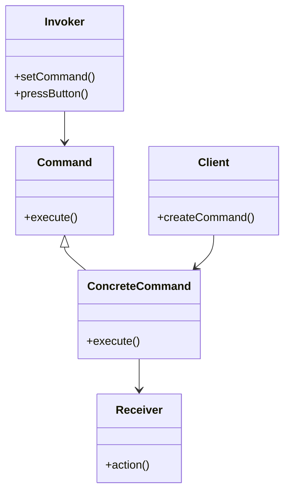

## 7.3 Command Pattern with Function Queues

The Command Pattern is a behavioral design pattern that encapsulates a request as an object, thereby allowing for parameterization of clients with queues, logs, and operations. This pattern is particularly useful in scenarios where you need to decouple the object that invokes the operation from the one that knows how to perform it. In JavaScript, the Command Pattern can be implemented using objects or functions, providing a flexible approach to executing actions.

### Understanding the Command Pattern

#### Intent

The primary intent of the Command Pattern is to encapsulate a request as an object, allowing for the following:

- **Parameterization of clients** with different requests.
- **Queuing of requests** for later execution.
- **Logging of requests** for auditing or debugging purposes.
- **Support for undoable operations**, enabling actions to be reversed.

#### Key Participants

1. **Command**: Declares an interface for executing an operation.
2. **ConcreteCommand**: Implements the Command interface, binding a receiver with an action.
3. **Client**: Creates a ConcreteCommand object and sets its receiver.
4. **Invoker**: Asks the command to carry out the request.
5. **Receiver**: Knows how to perform the operations associated with carrying out a request.

### Implementing the Command Pattern in JavaScript

In JavaScript, commands can be implemented as objects or functions. Let's explore both approaches.

#### Using Objects

```javascript
// Command Interface
class Command {
    execute() {
        throw new Error("This method should be overridden.");
    }
}

// Concrete Command
class LightOnCommand extends Command {
    constructor(light) {
        super();
        this.light = light;
    }

    execute() {
        this.light.on();
    }
}

// Receiver
class Light {
    on() {
        console.log("The light is on.");
    }

    off() {
        console.log("The light is off.");
    }
}

// Invoker
class RemoteControl {
    constructor() {
        this.command = null;
    }

    setCommand(command) {
        this.command = command;
    }

    pressButton() {
        if (this.command) {
            this.command.execute();
        }
    }
}

// Client
const light = new Light();
const lightOnCommand = new LightOnCommand(light);
const remote = new RemoteControl();

remote.setCommand(lightOnCommand);
remote.pressButton(); // Output: The light is on.
```

In this example, we encapsulate the `Light` operation in a `LightOnCommand` object, allowing the `RemoteControl` (Invoker) to execute the command without knowing the details of the operation.

#### Using Functions

JavaScript's first-class functions allow us to implement the Command Pattern more succinctly:

```javascript
// Receiver
class Light {
    on() {
        console.log("The light is on.");
    }

    off() {
        console.log("The light is off.");
    }
}

// Command as a function
const lightOnCommand = (light) => () => light.on();

// Invoker
class RemoteControl {
    constructor() {
        this.command = null;
    }

    setCommand(command) {
        this.command = command;
    }

    pressButton() {
        if (this.command) {
            this.command();
        }
    }
}

// Client
const light = new Light();
const remote = new RemoteControl();

remote.setCommand(lightOnCommand(light));
remote.pressButton(); // Output: The light is on.
```

Here, the command is represented as a function, demonstrating JavaScript's flexibility in implementing design patterns.

### Creating Command Queues

Command queues allow us to store commands for later execution, enabling batch processing or deferred execution.

```javascript
class CommandQueue {
    constructor() {
        this.queue = [];
    }

    addCommand(command) {
        this.queue.push(command);
    }

    execute() {
        while (this.queue.length > 0) {
            const command = this.queue.shift();
            command();
        }
    }
}

// Usage
const light = new Light();
const queue = new CommandQueue();

queue.addCommand(lightOnCommand(light));
queue.addCommand(() => console.log("Another command"));

queue.execute();
// Output:
// The light is on.
// Another command
```

### Implementing Undo/Redo Operations

The Command Pattern is ideal for implementing undo/redo functionality, as each command can store the state necessary to reverse its action.

```javascript
class Light {
    constructor() {
        this.isOn = false;
    }

    on() {
        this.isOn = true;
        console.log("The light is on.");
    }

    off() {
        this.isOn = false;
        console.log("The light is off.");
    }
}

class LightOnCommand {
    constructor(light) {
        this.light = light;
    }

    execute() {
        this.light.on();
    }

    undo() {
        this.light.off();
    }
}

class RemoteControl {
    constructor() {
        this.history = [];
    }

    executeCommand(command) {
        command.execute();
        this.history.push(command);
    }

    undoLastCommand() {
        const command = this.history.pop();
        if (command) {
            command.undo();
        }
    }
}

// Client
const light = new Light();
const lightOnCommand = new LightOnCommand(light);
const remote = new RemoteControl();

remote.executeCommand(lightOnCommand); // Output: The light is on.
remote.undoLastCommand(); // Output: The light is off.
```

### Use Cases for the Command Pattern

#### GUI Actions

In graphical user interfaces, the Command Pattern can be used to encapsulate actions triggered by user interactions, such as button clicks or menu selections.

#### Transaction Processing

In financial applications, commands can represent transactions, allowing for queuing, logging, and rollback of operations.

#### Job Scheduling

Commands can be scheduled for execution at specific times or intervals, making them suitable for task automation and scheduling systems.

### Benefits of Decoupling

The Command Pattern decouples the object that invokes the operation from the one that knows how to perform it. This separation of concerns enhances flexibility and maintainability, allowing for:

- **Easier modification** of command execution logic without affecting the invoker.
- **Simplified testing** of individual commands.
- **Reusability** of command objects across different invokers.

### Visualizing the Command Pattern

Below is a diagram illustrating the interaction between the components of the Command Pattern:



**Diagram Description**: This class diagram shows the relationships between the Command, ConcreteCommand, Client, Invoker, and Receiver. The Invoker interacts with the Command interface, while the ConcreteCommand implements the Command and interacts with the Receiver to perform the action.

### JavaScript Unique Features

JavaScript's first-class functions and closures provide a unique advantage in implementing the Command Pattern. Functions can be used directly as commands, and closures can capture the necessary context for command execution.

### Differences and Similarities

The Command Pattern is often confused with the Strategy Pattern. While both encapsulate behavior, the Command Pattern focuses on encapsulating requests, whereas the Strategy Pattern encapsulates algorithms.

### Try It Yourself

Experiment with the provided code examples by:

- Modifying the `Light` class to include additional operations, such as dimming or changing color.
- Implementing a macro command that executes multiple commands in sequence.
- Creating a command queue that supports priority-based execution.

### Knowledge Check

## Command Pattern with Function Queues Quiz



### What is the primary intent of the Command Pattern?

- [x] To encapsulate a request as an object
- [ ] To encapsulate an algorithm as an object
- [ ] To encapsulate a data structure as an object
- [ ] To encapsulate a user interface as an object

> **Explanation:** The Command Pattern encapsulates a request as an object, allowing for parameterization, queuing, and logging.

### Which component in the Command Pattern knows how to perform the operations?

- [ ] Command
- [ ] Invoker
- [x] Receiver
- [ ] Client

> **Explanation:** The Receiver knows how to perform the operations associated with carrying out a request.

### How can commands be implemented in JavaScript?

- [x] As objects or functions
- [ ] Only as objects
- [ ] Only as functions
- [ ] As arrays

> **Explanation:** In JavaScript, commands can be implemented as objects or functions, leveraging the language's flexibility.

### What is a common use case for the Command Pattern?

- [x] GUI actions
- [ ] Data storage
- [ ] Network communication
- [ ] File parsing

> **Explanation:** The Command Pattern is commonly used to encapsulate GUI actions, such as button clicks or menu selections.

### What advantage does the Command Pattern provide in terms of decoupling?

- [x] It decouples the invoker from the executor of the command.
- [ ] It decouples the client from the server.
- [ ] It decouples the data from the logic.
- [ ] It decouples the user interface from the database.

> **Explanation:** The Command Pattern decouples the object that invokes the operation from the one that knows how to perform it.

### Which JavaScript feature is particularly advantageous for implementing the Command Pattern?

- [x] First-class functions
- [ ] Prototypal inheritance
- [ ] Event loop
- [ ] Promises

> **Explanation:** JavaScript's first-class functions allow for flexible implementation of the Command Pattern.

### What is a macro command?

- [x] A command that executes multiple commands in sequence
- [ ] A command that executes a single operation
- [ ] A command that cancels other commands
- [ ] A command that logs operations

> **Explanation:** A macro command is a command that executes multiple commands in sequence.

### How can undo functionality be implemented in the Command Pattern?

- [x] By storing the state necessary to reverse actions in each command
- [ ] By using global variables
- [ ] By modifying the invoker
- [ ] By using event listeners

> **Explanation:** Each command can store the state necessary to reverse its action, enabling undo functionality.

### What is the role of the Invoker in the Command Pattern?

- [x] To ask the command to carry out the request
- [ ] To perform the operation
- [ ] To create the command
- [ ] To log the request

> **Explanation:** The Invoker asks the command to carry out the request.

### True or False: The Command Pattern is often confused with the Strategy Pattern.

- [x] True
- [ ] False

> **Explanation:** The Command Pattern is often confused with the Strategy Pattern, but they serve different purposes.



Remember, this is just the beginning. As you progress, you'll build more complex and interactive applications using the Command Pattern. Keep experimenting, stay curious, and enjoy the journey!

---
