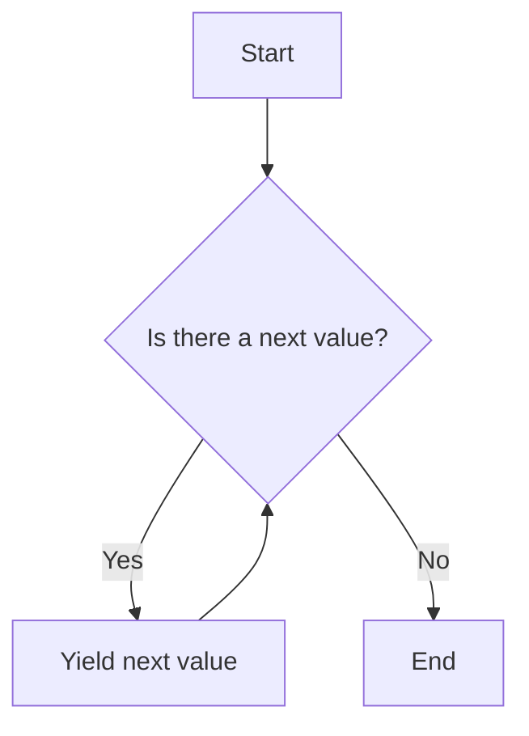

## 7.4 Iterator Pattern with Generators

### Introduction to the Iterator Pattern

The **Iterator Pattern** is a behavioral design pattern that provides a way to access the elements of an aggregate object sequentially without exposing its underlying representation. This pattern is particularly useful when dealing with collections of objects, such as arrays or lists, where you need to traverse the elements without knowing the internal structure of the collection.

### Intent of the Iterator Pattern

The primary intent of the Iterator Pattern is to decouple the traversal logic from the collection itself. By doing so, it allows for flexible iteration mechanisms that can be easily modified or extended without altering the collection's implementation. This separation of concerns enhances code maintainability and readability.

### JavaScript Generators: Simplifying Iterators

JavaScript introduces a powerful feature called **generators**, which simplifies the implementation of iterators. Generators are special functions that can be paused and resumed, allowing them to produce a sequence of values over time. They are defined using the `function*` syntax and utilize the `yield` keyword to return values.

#### Key Features of Generators

- **Lazy Evaluation**: Generators produce values on demand, making them memory efficient.
- **Pausing and Resuming**: Generators can pause their execution and resume later, maintaining their state between calls.
- **Simplified Syntax**: The `function*` and `yield` syntax provides a concise way to implement iterators.

### Creating Custom Iterators with Generators

Let's explore how to create custom iterators using JavaScript generators. We'll start with a simple example of iterating over an array.

```javascript
// Define a generator function
function* arrayIterator(arr) {
  for (let i = 0; i < arr.length; i++) {
    yield arr[i]; // Yield each element of the array
  }
}

// Create an iterator from the generator
const iterator = arrayIterator([1, 2, 3, 4, 5]);

// Iterate through the values
console.log(iterator.next().value); // Output: 1
console.log(iterator.next().value); // Output: 2
console.log(iterator.next().value); // Output: 3
```

In this example, the `arrayIterator` generator function iterates over an array and yields each element. The `next()` method is used to retrieve the next value from the iterator.

### Use Cases for Generators

Generators are versatile and can be used in various scenarios, including:

#### Traversing Data Structures

Generators can be used to traverse complex data structures, such as trees or graphs, without exposing their internal representation.

```javascript
// Define a tree node
class TreeNode {
  constructor(value, children = []) {
    this.value = value;
    this.children = children;
  }
}

// Define a generator for tree traversal
function* treeTraversal(node) {
  yield node.value; // Yield the current node's value
  for (const child of node.children) {
    yield* treeTraversal(child); // Recursively yield values from children
  }
}

// Create a tree structure
const root = new TreeNode(1, [
  new TreeNode(2, [new TreeNode(4), new TreeNode(5)]),
  new TreeNode(3),
]);

// Traverse the tree
const treeIterator = treeTraversal(root);
for (const value of treeIterator) {
  console.log(value); // Output: 1, 2, 4, 5, 3
}
```

In this example, the `treeTraversal` generator recursively traverses a tree structure, yielding each node's value.

#### Paginating Data

Generators can be used to paginate large datasets, fetching data in chunks as needed.

```javascript
// Define a generator for paginating data
function* paginateData(data, pageSize) {
  for (let i = 0; i < data.length; i += pageSize) {
    yield data.slice(i, i + pageSize); // Yield a page of data
  }
}

// Sample data
const data = Array.from({ length: 100 }, (_, i) => i + 1);

// Create a paginator
const paginator = paginateData(data, 10);

// Fetch pages
console.log(paginator.next().value); // Output: [1, 2, 3, ..., 10]
console.log(paginator.next().value); // Output: [11, 12, 13, ..., 20]
```

In this example, the `paginateData` generator yields pages of data, allowing for efficient data retrieval.

#### Lazy Evaluation

Generators enable lazy evaluation, where values are computed only when needed. This is particularly useful for handling large datasets or infinite sequences.

```javascript
// Define a generator for an infinite sequence
function* infiniteSequence() {
  let i = 0;
  while (true) {
    yield i++; // Yield the next number in the sequence
  }
}

// Create an infinite iterator
const infiniteIterator = infiniteSequence();

// Fetch values lazily
console.log(infiniteIterator.next().value); // Output: 0
console.log(infiniteIterator.next().value); // Output: 1
console.log(infiniteIterator.next().value); // Output: 2
```

In this example, the `infiniteSequence` generator produces an infinite sequence of numbers, demonstrating lazy evaluation.

### Benefits of Generators Over Traditional Iterators

Generators offer several advantages over traditional iterator implementations:

- **Conciseness**: The `function*` and `yield` syntax provides a more concise way to define iterators.
- **State Management**: Generators maintain their state between calls, eliminating the need for external state management.
- **Memory Efficiency**: Generators produce values on demand, reducing memory usage for large datasets.
- **Flexibility**: Generators can be used to implement complex iteration logic, such as recursive traversal or lazy evaluation.

### Visualizing the Iterator Pattern with Generators

To better understand how generators work, let's visualize the process using a flowchart.



**Caption**: This flowchart illustrates the process of using a generator to iterate over a collection. The generator checks if there is a next value, yields it if available, and repeats the process until no more values are left.

### JavaScript Unique Features

JavaScript's generator functions provide a unique way to implement the Iterator Pattern, leveraging the language's asynchronous capabilities and concise syntax. The `function*` and `yield` keywords are specific to JavaScript, offering a powerful tool for developers to create custom iterators.

### Differences and Similarities

The Iterator Pattern is often compared to the **Observer Pattern**, as both involve traversing or reacting to a sequence of events or data. However, the Iterator Pattern focuses on sequential access, while the Observer Pattern deals with event-driven updates.

### Design Considerations

When using the Iterator Pattern with generators, consider the following:

- **Performance**: Generators are efficient for large datasets due to their lazy evaluation.
- **Complexity**: While generators simplify iterator implementation, they may introduce complexity in understanding the flow of execution.
- **Compatibility**: Ensure compatibility with environments that support ES6 or later, as generators are not available in older JavaScript versions.

### Try It Yourself

Experiment with the provided code examples by modifying the data structures or iteration logic. Try creating a generator that iterates over a custom data structure or implements a specific iteration pattern.

### References and Links

For further reading on JavaScript generators and iterators, consider the following resources:

- [MDN Web Docs: Iterators and Generators](https://developer.mozilla.org/en-US/docs/Web/JavaScript/Guide/Iterators_and_Generators)
- [JavaScript Info: Generators](https://javascript.info/generators)
- [W3Schools: JavaScript Generators](https://www.w3schools.com/js/js_function_generator.asp)

### Knowledge Check

- What is the primary intent of the Iterator Pattern?
- How do generators simplify the implementation of iterators in JavaScript?
- What are some use cases for generators in web development?
- What are the benefits of using generators over traditional iterators?

### Embrace the Journey

Remember, mastering the Iterator Pattern with generators is just the beginning. As you progress, you'll discover more advanced techniques and patterns that enhance your JavaScript development skills. Keep experimenting, stay curious, and enjoy the journey!

## Quiz: Mastering JavaScript Iterator Pattern with Generators



### What is the primary intent of the Iterator Pattern?

- [x] To provide a way to access elements of an aggregate object sequentially without exposing its underlying representation.
- [ ] To modify the elements of an aggregate object.
- [ ] To expose the internal structure of an aggregate object.
- [ ] To create a new aggregate object.

> **Explanation:** The Iterator Pattern is designed to allow sequential access to elements without exposing the underlying representation.

### How do JavaScript generators simplify the implementation of iterators?

- [x] By using `function*` and `yield` syntax to produce values lazily.
- [ ] By requiring external state management.
- [ ] By exposing the internal structure of collections.
- [ ] By using traditional loops.

> **Explanation:** Generators use `function*` and `yield` to create iterators that produce values on demand, simplifying implementation.

### Which keyword is used in JavaScript to define a generator function?

- [x] `function*`
- [ ] `function`
- [ ] `yield`
- [ ] `async`

> **Explanation:** The `function*` keyword is used to define a generator function in JavaScript.

### What is a key benefit of using generators over traditional iterators?

- [x] Memory efficiency due to lazy evaluation.
- [ ] Increased complexity in implementation.
- [ ] Requirement for external state management.
- [ ] Exposure of internal data structures.

> **Explanation:** Generators are memory efficient because they produce values on demand, reducing memory usage.

### Which of the following is a use case for generators?

- [x] Traversing complex data structures.
- [x] Paginating large datasets.
- [ ] Modifying data structures.
- [ ] Exposing internal representations.

> **Explanation:** Generators are useful for traversing data structures and paginating datasets due to their lazy evaluation.

### What does the `yield` keyword do in a generator function?

- [x] It pauses the function and returns a value.
- [ ] It ends the function execution.
- [ ] It starts a new iteration.
- [ ] It modifies the internal state.

> **Explanation:** The `yield` keyword pauses the generator function and returns a value to the caller.

### What is lazy evaluation in the context of generators?

- [x] Producing values only when needed.
- [ ] Evaluating all values at once.
- [ ] Modifying values during iteration.
- [ ] Exposing internal data structures.

> **Explanation:** Lazy evaluation means values are produced only when requested, improving efficiency.

### How can generators be used for paginating data?

- [x] By yielding chunks of data as pages.
- [ ] By modifying data structures.
- [ ] By exposing internal representations.
- [ ] By using traditional loops.

> **Explanation:** Generators can yield chunks of data, allowing for efficient pagination.

### What is a potential design consideration when using generators?

- [x] Ensuring compatibility with environments that support ES6 or later.
- [ ] Exposing internal data structures.
- [ ] Increasing memory usage.
- [ ] Requiring external state management.

> **Explanation:** Generators require environments that support ES6 or later due to their syntax.

### Generators maintain their state between calls.

- [x] True
- [ ] False

> **Explanation:** Generators maintain their state between calls, allowing them to resume execution where they left off.


