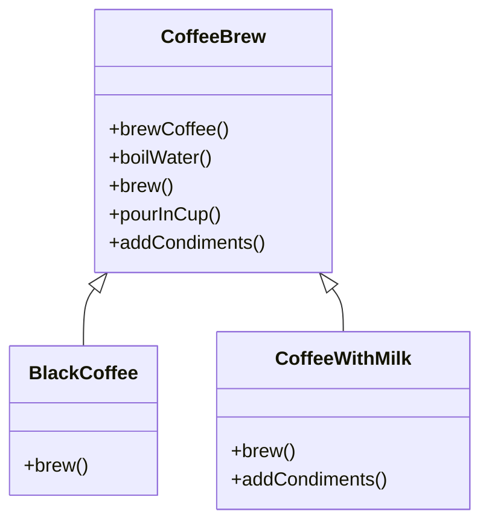

## 7.5 Template Method Pattern with Inheritance

The Template Method Pattern is a behavioral design pattern that defines the skeleton of an algorithm in a base class method, allowing subclasses to override specific steps of the algorithm without altering its overall structure. This pattern is particularly useful for defining workflows or processes with interchangeable steps, promoting code reuse and enforcing a consistent process structure.

### Understanding the Template Method Pattern

#### Definition and Components

The Template Method Pattern consists of the following components:

- **Abstract Class**: This class defines the template method, which outlines the algorithm's structure. It may include concrete methods, abstract methods, or hooks.
- **Template Method**: A method in the abstract class that defines the algorithm's skeleton. It calls other methods, some of which may be abstract or hooks.
- **Concrete Class**: Subclasses that implement or override the abstract methods or hooks to provide specific behavior.

#### Intent

The primary intent of the Template Method Pattern is to allow subclasses to redefine certain steps of an algorithm without changing its overall structure. This promotes code reuse and consistency across different implementations of the algorithm.

### Implementing the Template Method Pattern in JavaScript

Let's explore how to implement the Template Method Pattern using ES6 classes and inheritance.

#### Example: A Coffee Brewing Process

Consider a scenario where we want to define a process for brewing different types of coffee. The steps involved in brewing coffee are similar, but certain steps may vary depending on the type of coffee.

```javascript
// Abstract class representing the coffee brewing process
class CoffeeBrew {
  // Template method defining the algorithm's skeleton
  brewCoffee() {
    this.boilWater();
    this.brew();
    this.pourInCup();
    this.addCondiments();
  }

  // Concrete method
  boilWater() {
    console.log('Boiling water...');
  }

  // Abstract method to be implemented by subclasses
  brew() {
    throw new Error('This method must be overridden!');
  }

  // Concrete method
  pourInCup() {
    console.log('Pouring into cup...');
  }

  // Hook method with a default implementation
  addCondiments() {
    // Optional step
  }
}

// Concrete class for brewing black coffee
class BlackCoffee extends CoffeeBrew {
  brew() {
    console.log('Brewing black coffee...');
  }
}

// Concrete class for brewing coffee with milk
class CoffeeWithMilk extends CoffeeBrew {
  brew() {
    console.log('Brewing coffee with milk...');
  }

  addCondiments() {
    console.log('Adding milk...');
  }
}

// Client code
const blackCoffee = new BlackCoffee();
blackCoffee.brewCoffee();

const coffeeWithMilk = new CoffeeWithMilk();
coffeeWithMilk.brewCoffee();
```

In this example, the `CoffeeBrew` class defines the template method `brewCoffee()`, which outlines the steps for brewing coffee. The `brew()` method is abstract and must be implemented by subclasses, while `addCondiments()` is a hook method with a default implementation that can be overridden.

### Scenarios for Using the Template Method Pattern

The Template Method Pattern is ideal for scenarios where you need to define a workflow or process with interchangeable steps. Some common use cases include:

- **Defining a Report Generation Process**: Different types of reports may require different data gathering or formatting steps, but the overall process remains the same.
- **Implementing a Game Loop**: A game loop may involve steps like updating game state, rendering graphics, and handling user input, with variations for different game types.
- **Creating a Data Processing Pipeline**: A data processing pipeline may involve steps like data validation, transformation, and output, with variations for different data sources or formats.

### Advantages of the Template Method Pattern

The Template Method Pattern offers several advantages:

- **Code Reuse**: By defining the algorithm's skeleton in a base class, you can reuse the same structure across multiple implementations.
- **Consistency**: The pattern enforces a consistent process structure, ensuring that all subclasses follow the same algorithm.
- **Flexibility**: Subclasses can override specific steps of the algorithm to provide custom behavior, allowing for flexibility and customization.

### Potential Downsides and Alternatives

While the Template Method Pattern offers many benefits, it also has potential downsides:

- **Inheritance Overhead**: The pattern relies on inheritance, which can lead to tight coupling between the base class and subclasses. This can make the code less flexible and harder to maintain.
- **Limited Flexibility**: Since the algorithm's structure is defined in the base class, it may be difficult to change the overall process without modifying the base class.

#### Alternatives: Composition Over Inheritance

One alternative to the Template Method Pattern is to use composition instead of inheritance. By composing objects with interchangeable behaviors, you can achieve similar flexibility without the drawbacks of inheritance.

For example, you could define a `CoffeeBrew` class that accepts strategy objects for each step of the process:

```javascript
class CoffeeBrew {
  constructor(brewStrategy, condimentsStrategy) {
    this.brewStrategy = brewStrategy;
    this.condimentsStrategy = condimentsStrategy;
  }

  brewCoffee() {
    this.boilWater();
    this.brewStrategy.brew();
    this.pourInCup();
    this.condimentsStrategy.addCondiments();
  }

  boilWater() {
    console.log('Boiling water...');
  }

  pourInCup() {
    console.log('Pouring into cup...');
  }
}

class BlackCoffeeStrategy {
  brew() {
    console.log('Brewing black coffee...');
  }
}

class MilkCondimentsStrategy {
  addCondiments() {
    console.log('Adding milk...');
  }
}

// Client code
const blackCoffee = new CoffeeBrew(new BlackCoffeeStrategy(), new MilkCondimentsStrategy());
blackCoffee.brewCoffee();
```

### JavaScript Unique Features

JavaScript's prototypal inheritance and dynamic typing offer unique opportunities for implementing the Template Method Pattern. You can leverage JavaScript's flexibility to create more dynamic and adaptable implementations.

### Differences and Similarities with Other Patterns

The Template Method Pattern is often compared to the Strategy Pattern. While both patterns allow for interchangeable behavior, the Template Method Pattern defines the algorithm's structure in a base class, whereas the Strategy Pattern delegates the entire algorithm to strategy objects.

### Visualizing the Template Method Pattern

To better understand the Template Method Pattern, let's visualize the relationship between the abstract class and its concrete subclasses.



In this diagram, `CoffeeBrew` is the abstract class with the template method `brewCoffee()`. `BlackCoffee` and `CoffeeWithMilk` are concrete subclasses that implement or override specific steps of the algorithm.

### Try It Yourself

Experiment with the code examples by modifying the `brew()` and `addCondiments()` methods to create new types of coffee. Try adding additional steps to the `brewCoffee()` method or creating new strategy objects for different brewing techniques.

### Knowledge Check

To reinforce your understanding of the Template Method Pattern, consider the following questions:

- What is the primary intent of the Template Method Pattern?
- How does the Template Method Pattern promote code reuse and consistency?
- What are the potential downsides of using inheritance in the Template Method Pattern?
- How can composition be used as an alternative to inheritance in the Template Method Pattern?

### Summary

The Template Method Pattern is a powerful tool for defining workflows or processes with interchangeable steps. By leveraging inheritance, you can promote code reuse and enforce a consistent process structure. However, it's important to be aware of the potential downsides of inheritance and consider alternatives like composition when appropriate.

Remember, this is just the beginning. As you progress, you'll build more complex and interactive web applications. Keep experimenting, stay curious, and enjoy the journey!

## Quiz: Mastering the Template Method Pattern in JavaScript



### What is the primary intent of the Template Method Pattern?

- [x] To define the skeleton of an algorithm in a method, deferring some steps to subclasses.
- [ ] To encapsulate a request as an object, thereby allowing for parameterization.
- [ ] To provide a way to access the elements of an aggregate object sequentially.
- [ ] To define a family of algorithms, encapsulate each one, and make them interchangeable.

> **Explanation:** The Template Method Pattern defines the skeleton of an algorithm in a method, deferring some steps to subclasses without changing the algorithm's structure.

### Which component of the Template Method Pattern outlines the algorithm's structure?

- [x] Template Method
- [ ] Concrete Class
- [ ] Abstract Class
- [ ] Hook Method

> **Explanation:** The Template Method is the method in the abstract class that outlines the algorithm's structure.

### What is a potential downside of using inheritance in the Template Method Pattern?

- [x] Tight coupling between the base class and subclasses.
- [ ] Increased flexibility and adaptability.
- [ ] Simplified code maintenance.
- [ ] Enhanced performance and speed.

> **Explanation:** Inheritance can lead to tight coupling between the base class and subclasses, making the code less flexible and harder to maintain.

### How can composition be used as an alternative to inheritance in the Template Method Pattern?

- [x] By composing objects with interchangeable behaviors.
- [ ] By defining all methods in the base class.
- [ ] By using only concrete classes.
- [ ] By avoiding the use of abstract methods.

> **Explanation:** Composition allows for interchangeable behaviors by composing objects, providing flexibility without the drawbacks of inheritance.

### What is the role of a hook method in the Template Method Pattern?

- [x] To provide optional steps in the algorithm with a default implementation.
- [ ] To define the entire algorithm.
- [ ] To enforce a specific process structure.
- [ ] To encapsulate a request as an object.

> **Explanation:** A hook method provides optional steps in the algorithm with a default implementation that can be overridden by subclasses.

### Which pattern is often compared to the Template Method Pattern?

- [x] Strategy Pattern
- [ ] Observer Pattern
- [ ] Singleton Pattern
- [ ] Factory Pattern

> **Explanation:** The Strategy Pattern is often compared to the Template Method Pattern, as both allow for interchangeable behavior.

### What is a common use case for the Template Method Pattern?

- [x] Defining a report generation process.
- [ ] Implementing a singleton object.
- [ ] Managing object creation.
- [ ] Observing changes in state.

> **Explanation:** The Template Method Pattern is commonly used for defining workflows or processes, such as a report generation process.

### How does the Template Method Pattern promote code reuse?

- [x] By defining the algorithm's skeleton in a base class for reuse across multiple implementations.
- [ ] By encapsulating all logic in concrete classes.
- [ ] By avoiding the use of abstract methods.
- [ ] By using only hook methods.

> **Explanation:** The Template Method Pattern promotes code reuse by defining the algorithm's skeleton in a base class, allowing for reuse across multiple implementations.

### What is the benefit of using hook methods in the Template Method Pattern?

- [x] They allow for optional steps in the algorithm that can be customized by subclasses.
- [ ] They enforce a strict process structure.
- [ ] They eliminate the need for abstract methods.
- [ ] They simplify the algorithm's structure.

> **Explanation:** Hook methods allow for optional steps in the algorithm that can be customized by subclasses, providing flexibility.

### True or False: The Template Method Pattern can only be implemented using inheritance.

- [ ] True
- [x] False

> **Explanation:** While the Template Method Pattern is traditionally implemented using inheritance, it can also be implemented using composition for greater flexibility.




