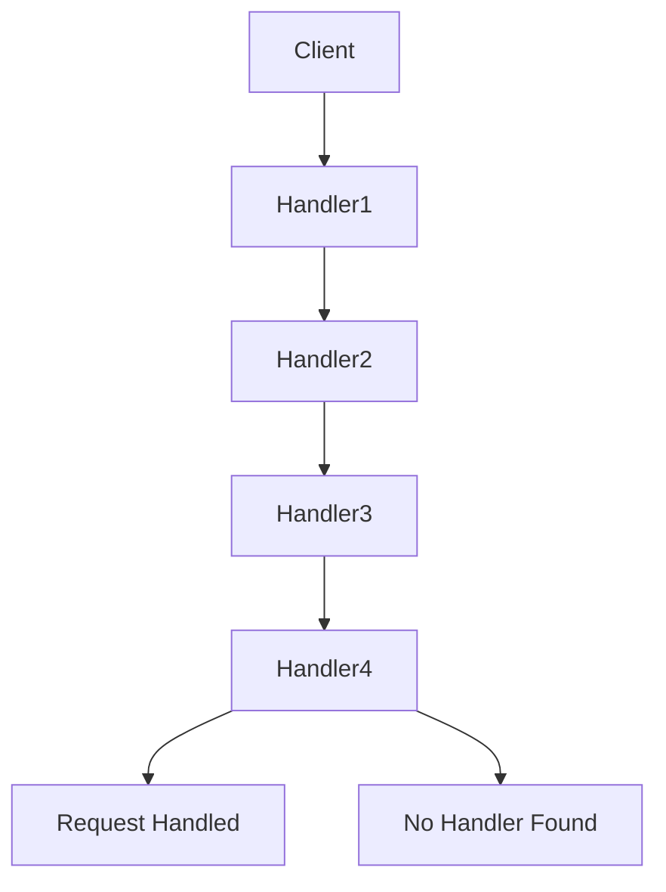

## 7.6 Chain of Responsibility Pattern

The Chain of Responsibility Pattern is a behavioral design pattern that allows an object to pass a request along a chain of potential handlers until one of them handles it. This pattern is particularly useful in scenarios where multiple objects might be capable of handling a request, but the specific handler is not known in advance. By decoupling the sender of a request from its receiver, the Chain of Responsibility Pattern enhances flexibility and maintainability in software design.

### Intent

The primary intent of the Chain of Responsibility Pattern is to avoid coupling the sender of a request to its receiver by allowing more than one object to handle the request. The request is passed along a chain of handlers until one of them handles it.

### Key Participants

- **Handler**: Defines an interface for handling requests and optionally implements the successor link.
- **ConcreteHandler**: Handles requests it is responsible for and forwards requests it does not handle to the next handler.
- **Client**: Initiates the request to a ConcreteHandler object on the chain.

### Applicability

Use the Chain of Responsibility Pattern when:

- More than one object can handle a request, and the handler is not known in advance.
- You want to issue a request to one of several objects without specifying the receiver explicitly.
- The set of objects that can handle a request should be specified dynamically.

### Sample Code Snippet

Let's explore a simple implementation of the Chain of Responsibility Pattern in JavaScript using function chains:

```javascript
// Define a generic handler function
function createHandler(name, nextHandler) {
    return function(request) {
        if (canHandleRequest(request)) {
            console.log(`${name} handled the request.`);
        } else if (nextHandler) {
            nextHandler(request);
        } else {
            console.log(`No handler could process the request.`);
        }
    };
}

// Example condition to determine if the handler can process the request
function canHandleRequest(request) {
    // Logic to determine if the request can be handled
    return request === "specificRequest";
}

// Create handlers
const handler1 = createHandler("Handler1", null);
const handler2 = createHandler("Handler2", handler1);
const handler3 = createHandler("Handler3", handler2);

// Start the chain
handler3("specificRequest"); // Output: "Handler3 handled the request."
handler3("anotherRequest");  // Output: "No handler could process the request."
```

### Use Cases

#### Event Bubbling in the DOM

In the Document Object Model (DOM), event bubbling is a natural example of the Chain of Responsibility Pattern. When an event occurs, it starts from the target element and bubbles up through its ancestors, giving each a chance to handle the event.

#### Middleware in Express.js

Express.js, a popular Node.js web application framework, uses middleware functions that process requests in a chain. Each middleware function can decide to pass control to the next middleware or terminate the request-response cycle.

```javascript
const express = require('express');
const app = express();

// Middleware functions
app.use((req, res, next) => {
    console.log('Middleware 1');
    next();
});

app.use((req, res, next) => {
    console.log('Middleware 2');
    next();
});

app.get('/', (req, res) => {
    res.send('Hello World');
});

app.listen(3000, () => console.log('Server running on port 3000'));
```

#### Handling Support Tickets

In a customer support system, a support ticket might be passed through various levels of support staff, each with the ability to handle the ticket or escalate it to the next level.

### Adding, Removing, or Reordering Handlers

The Chain of Responsibility Pattern is flexible, allowing handlers to be added, removed, or reordered dynamically. This flexibility is achieved by maintaining references to the next handler in the chain.

```javascript
// Dynamically add a new handler
const handler4 = createHandler("Handler4", handler3);

// Remove a handler by bypassing it
const handler5 = createHandler("Handler5", handler1);

// Reorder handlers by changing the chain
const handler6 = createHandler("Handler6", handler4);
```

### Benefits of Decoupling

- **Flexibility**: The pattern allows you to change the chain of handlers dynamically, making it easy to add, remove, or reorder handlers.
- **Decoupling**: By separating the sender and receiver, the pattern reduces dependencies and enhances maintainability.
- **Responsibility Segregation**: Each handler in the chain has a single responsibility, promoting cleaner and more modular code.

### Design Considerations

- **Performance**: The pattern may introduce performance overhead due to the traversal of the chain.
- **Complexity**: A long chain of handlers can become difficult to manage and debug.
- **Responsibility**: Ensure that each handler has a clear and distinct responsibility to avoid confusion.

### JavaScript Unique Features

JavaScript's first-class functions and closures make it particularly well-suited for implementing the Chain of Responsibility Pattern. Functions can be easily passed as arguments, returned from other functions, and stored in variables, allowing for flexible and dynamic handler chains.

### Differences and Similarities

The Chain of Responsibility Pattern is often confused with the Decorator Pattern. While both involve a chain of objects, the Decorator Pattern focuses on adding behavior to objects, whereas the Chain of Responsibility Pattern focuses on passing requests along a chain until one handles it.

### Visualizing the Chain of Responsibility Pattern

Below is a diagram illustrating the flow of a request through a chain of handlers:



**Diagram Description**: The diagram shows a client sending a request to a chain of handlers. Each handler has the opportunity to process the request or pass it to the next handler. If no handler processes the request, it results in "No Handler Found."

### Try It Yourself

Experiment with the code examples by:

- Adding new handlers to the chain.
- Changing the conditions under which handlers process requests.
- Reordering the handlers to see how it affects the outcome.

### Knowledge Check

- What is the primary purpose of the Chain of Responsibility Pattern?
- How does the Chain of Responsibility Pattern enhance flexibility in software design?
- Can you identify a real-world scenario where this pattern might be useful?
- What are the potential drawbacks of using this pattern?
- How does JavaScript's function handling capabilities benefit the implementation of this pattern?

### Embrace the Journey

Remember, mastering design patterns like the Chain of Responsibility is just the beginning. As you progress, you'll build more complex and interactive applications. Keep experimenting, stay curious, and enjoy the journey!

## Quiz: Mastering the Chain of Responsibility Pattern in JavaScript



### What is the primary intent of the Chain of Responsibility Pattern?

- [x] To avoid coupling the sender of a request to its receiver by allowing multiple objects to handle the request.
- [ ] To ensure that every request is handled by all objects in the chain.
- [ ] To create a single handler for all requests.
- [ ] To prioritize requests based on their type.

> **Explanation:** The Chain of Responsibility Pattern allows multiple objects to handle a request, avoiding tight coupling between the sender and receiver.

### Which of the following is a real-world example of the Chain of Responsibility Pattern?

- [x] Event bubbling in the DOM.
- [ ] Singleton pattern in object creation.
- [ ] Observer pattern in event handling.
- [ ] Factory pattern in object instantiation.

> **Explanation:** Event bubbling in the DOM is a classic example of the Chain of Responsibility Pattern, where events are passed up the DOM tree.

### How can handlers be dynamically added to the chain in JavaScript?

- [x] By creating a new handler and linking it to the existing chain.
- [ ] By modifying the core JavaScript engine.
- [ ] By using global variables.
- [ ] By recompiling the JavaScript code.

> **Explanation:** Handlers can be dynamically added by creating new handler functions and linking them to the existing chain.

### What is a potential drawback of the Chain of Responsibility Pattern?

- [x] It may introduce performance overhead due to chain traversal.
- [ ] It tightly couples the sender and receiver.
- [ ] It limits the number of handlers to one.
- [ ] It requires synchronous processing.

> **Explanation:** The pattern can introduce performance overhead as requests traverse the chain of handlers.

### In Express.js, what is an example of the Chain of Responsibility Pattern?

- [x] Middleware functions processing requests.
- [ ] Route handlers responding to requests.
- [ ] Static file serving.
- [ ] Template rendering.

> **Explanation:** Middleware functions in Express.js process requests in a chain, exemplifying the Chain of Responsibility Pattern.

### How does JavaScript's first-class functions benefit the Chain of Responsibility Pattern?

- [x] They allow functions to be passed as arguments, enabling flexible handler chains.
- [ ] They enforce strict typing in handler functions.
- [ ] They automatically optimize performance.
- [ ] They restrict the number of handlers.

> **Explanation:** JavaScript's first-class functions allow for flexible and dynamic handler chains by passing functions as arguments.

### What is a key difference between the Chain of Responsibility and Decorator Patterns?

- [x] The Chain of Responsibility focuses on passing requests, while the Decorator adds behavior.
- [ ] The Chain of Responsibility adds behavior, while the Decorator passes requests.
- [ ] Both patterns are identical in purpose and implementation.
- [ ] The Decorator Pattern is used for error handling.

> **Explanation:** The Chain of Responsibility Pattern focuses on passing requests along a chain, while the Decorator Pattern adds behavior to objects.

### What is the role of the Client in the Chain of Responsibility Pattern?

- [x] To initiate the request to a handler in the chain.
- [ ] To process the request directly.
- [ ] To terminate the request-response cycle.
- [ ] To log the request details.

> **Explanation:** The Client initiates the request to a handler in the chain, starting the process.

### Can the order of handlers in the chain affect the outcome?

- [x] Yes, the order can determine which handler processes the request.
- [ ] No, the order is irrelevant to the outcome.
- [ ] Yes, but only if there are more than three handlers.
- [ ] No, because all handlers process every request.

> **Explanation:** The order of handlers can affect which handler processes the request, impacting the outcome.

### True or False: The Chain of Responsibility Pattern is only applicable in synchronous processing.

- [ ] True
- [x] False

> **Explanation:** The Chain of Responsibility Pattern can be applied in both synchronous and asynchronous processing scenarios.




