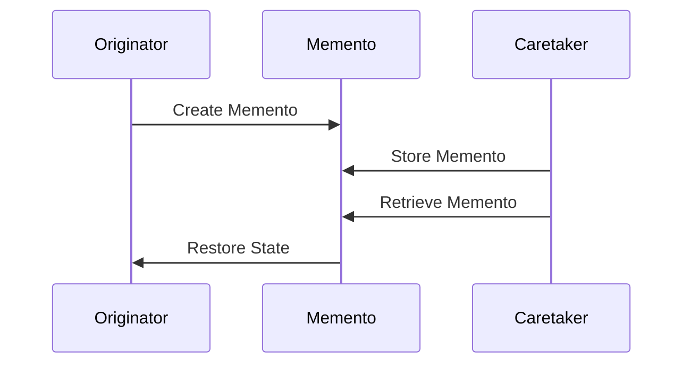

## 7.7 Memento Pattern for State Preservation

In the world of software design patterns, the Memento Pattern stands out as a powerful tool for managing state preservation. This pattern allows us to capture and externalize an object's internal state without violating encapsulation, enabling the object to be restored to this state later. This capability is particularly useful in scenarios such as implementing undo functionality, maintaining state history, or managing transactional memory.

### Understanding the Memento Pattern

The Memento Pattern is a behavioral design pattern that provides the ability to restore an object to its previous state. It is composed of three primary components:

1. **Originator**: The object whose state needs to be saved and restored.
2. **Memento**: A representation of the Originator's state at a particular point in time.
3. **Caretaker**: Manages the Memento's lifecycle, storing and retrieving it as needed.

#### Key Participants

- **Originator**: This is the object that can create a Memento containing a snapshot of its current internal state and use the Memento to restore its state.
- **Memento**: This object stores the internal state of the Originator. It should be opaque to the Caretaker, meaning the Caretaker should not modify it.
- **Caretaker**: This object is responsible for keeping track of the Memento. It does not modify or inspect the contents of the Memento.

### Applicability

The Memento Pattern is particularly useful in the following scenarios:

- **Undo Mechanisms**: Implementing undo functionality in applications, such as text editors or graphic design software.
- **State History**: Keeping a history of states for objects, allowing users to navigate through previous states.
- **Transactional Memory**: Managing state changes in a way that allows rolling back to a previous state if needed.

### Sample Code Snippet

Let's explore a simple implementation of the Memento Pattern in JavaScript. We'll create a `TextEditor` class that allows us to save and restore its state.

```javascript
// Originator: TextEditor
class TextEditor {
  constructor() {
    this.content = '';
  }

  // Method to write content
  write(text) {
    this.content += text;
  }

  // Method to save the current state to a Memento
  save() {
    return new Memento(this.content);
  }

  // Method to restore the state from a Memento
  restore(memento) {
    this.content = memento.getContent();
  }

  // Method to display the current content
  showContent() {
    console.log(this.content);
  }
}

// Memento: Stores the state of the TextEditor
class Memento {
  constructor(content) {
    this.content = content;
  }

  // Method to get the stored content
  getContent() {
    return this.content;
  }
}

// Caretaker: Manages the Memento
class Caretaker {
  constructor() {
    this.mementos = [];
  }

  // Method to add a Memento to the list
  addMemento(memento) {
    this.mementos.push(memento);
  }

  // Method to get a Memento from the list
  getMemento(index) {
    return this.mementos[index];
  }
}

// Example usage
const editor = new TextEditor();
const caretaker = new Caretaker();

editor.write('Hello, ');
caretaker.addMemento(editor.save());

editor.write('World!');
caretaker.addMemento(editor.save());

editor.showContent(); // Output: Hello, World!

// Restore to previous state
editor.restore(caretaker.getMemento(0));
editor.showContent(); // Output: Hello, 
```

### Design Considerations

When implementing the Memento Pattern, consider the following:

- **State Serialization**: Ensure that the state captured by the Memento is serializable, especially if it needs to be stored persistently.
- **Memory Overhead**: Be mindful of the memory overhead associated with storing multiple Mementos, particularly for large or complex states.
- **Data Integrity**: Maintain data integrity by ensuring that the Memento accurately captures the state and that the Originator can restore it correctly.

### JavaScript Unique Features

JavaScript's dynamic nature and object-oriented capabilities make it well-suited for implementing the Memento Pattern. The use of closures and encapsulation can help maintain the integrity of the Memento's state, ensuring that it remains opaque to the Caretaker.

### Differences and Similarities

The Memento Pattern is often compared to the Command Pattern, as both can be used to implement undo functionality. However, the Memento Pattern focuses on capturing and restoring state, while the Command Pattern encapsulates operations as objects.

### Visualizing the Memento Pattern

To better understand the interaction between the components of the Memento Pattern, let's visualize it using a sequence diagram.



**Diagram Description**: This sequence diagram illustrates the interaction between the Originator, Memento, and Caretaker. The Originator creates a Memento to capture its state, which the Caretaker stores. The Caretaker can later retrieve the Memento to restore the Originator's state.

### Use Cases

#### Undo Functionality

One of the most common use cases for the Memento Pattern is implementing undo functionality. By capturing the state of an object at various points, we can allow users to revert changes and navigate through previous states.

#### State History

In applications where maintaining a history of states is important, such as version control systems or data visualization tools, the Memento Pattern provides a structured approach to managing state transitions.

#### Transactional Memory

In systems that require transactional memory, the Memento Pattern can be used to capture the state before a transaction and restore it if the transaction fails, ensuring consistency and reliability.

### Best Practices

- **Encapsulation**: Ensure that the Memento is opaque to the Caretaker, preventing unauthorized access or modification of the state.
- **Efficient Storage**: Optimize the storage of Mementos to minimize memory overhead, especially for large or complex states.
- **State Validation**: Implement validation mechanisms to ensure that the state captured by the Memento is valid and can be restored accurately.

### Try It Yourself

To deepen your understanding of the Memento Pattern, try modifying the code example to include additional features:

- Implement a redo functionality that allows users to move forward through states.
- Add a mechanism to limit the number of stored Mementos to manage memory usage.
- Experiment with different types of state data, such as objects or arrays, to explore serialization challenges.

### References and Links

For further reading on the Memento Pattern and related concepts, consider exploring the following resources:

- [MDN Web Docs: JavaScript Guide](https://developer.mozilla.org/en-US/docs/Web/JavaScript/Guide)
- [Refactoring Guru: Memento Pattern](https://refactoring.guru/design-patterns/memento)
- [W3Schools: JavaScript Tutorial](https://www.w3schools.com/js/)

### Knowledge Check

To reinforce your understanding of the Memento Pattern, consider the following questions and challenges:

- How does the Memento Pattern differ from the Command Pattern in terms of functionality and use cases?
- What are the potential memory implications of using the Memento Pattern, and how can they be mitigated?
- How can the Memento Pattern be adapted for use in a distributed system where state needs to be preserved across multiple nodes?

### Embrace the Journey

Remember, mastering design patterns like the Memento Pattern is a journey. As you continue to explore and experiment with these patterns, you'll gain a deeper understanding of their applications and benefits. Keep experimenting, stay curious, and enjoy the journey!

## Test Your Knowledge on the Memento Pattern in JavaScript



### What is the primary purpose of the Memento Pattern?

- [x] To capture and restore an object's state
- [ ] To encapsulate operations as objects
- [ ] To manage object creation
- [ ] To provide a simplified interface to a complex system

> **Explanation:** The Memento Pattern is designed to capture and restore an object's state without violating encapsulation.

### Which component of the Memento Pattern is responsible for storing the state?

- [ ] Originator
- [x] Memento
- [ ] Caretaker
- [ ] Observer

> **Explanation:** The Memento component is responsible for storing the state of the Originator.

### What is a common use case for the Memento Pattern?

- [x] Implementing undo functionality
- [ ] Managing object creation
- [ ] Simplifying complex interfaces
- [ ] Decoupling abstraction from implementation

> **Explanation:** The Memento Pattern is commonly used to implement undo functionality by capturing and restoring previous states.

### How does the Caretaker interact with the Memento?

- [x] It stores and retrieves the Memento
- [ ] It modifies the Memento's state
- [ ] It creates the Memento
- [ ] It destroys the Memento

> **Explanation:** The Caretaker stores and retrieves the Memento but does not modify its state.

### What is a potential drawback of using the Memento Pattern?

- [x] Memory overhead
- [ ] Increased complexity
- [ ] Lack of encapsulation
- [ ] Difficulty in implementation

> **Explanation:** The Memento Pattern can lead to memory overhead due to storing multiple states.

### Which JavaScript feature is particularly useful for implementing the Memento Pattern?

- [x] Closures
- [ ] Promises
- [ ] Prototypes
- [ ] Async/Await

> **Explanation:** Closures in JavaScript can help maintain the integrity of the Memento's state.

### In the Memento Pattern, what should the Caretaker avoid doing?

- [x] Modifying the Memento's state
- [ ] Storing the Memento
- [ ] Retrieving the Memento
- [ ] Creating the Memento

> **Explanation:** The Caretaker should avoid modifying the Memento's state to maintain encapsulation.

### What is the role of the Originator in the Memento Pattern?

- [x] To create and restore Mementos
- [ ] To store Mementos
- [ ] To manage Memento lifecycle
- [ ] To simplify complex interfaces

> **Explanation:** The Originator creates and restores Mementos to manage its state.

### Can the Memento Pattern be used for transactional memory?

- [x] True
- [ ] False

> **Explanation:** The Memento Pattern can be used for transactional memory by capturing and restoring states during transactions.

### What is a best practice when using the Memento Pattern?

- [x] Ensure Memento is opaque to the Caretaker
- [ ] Allow Caretaker to modify Memento
- [ ] Store Memento in the Originator
- [ ] Use Memento for all state changes

> **Explanation:** Ensuring the Memento is opaque to the Caretaker maintains encapsulation and data integrity.




