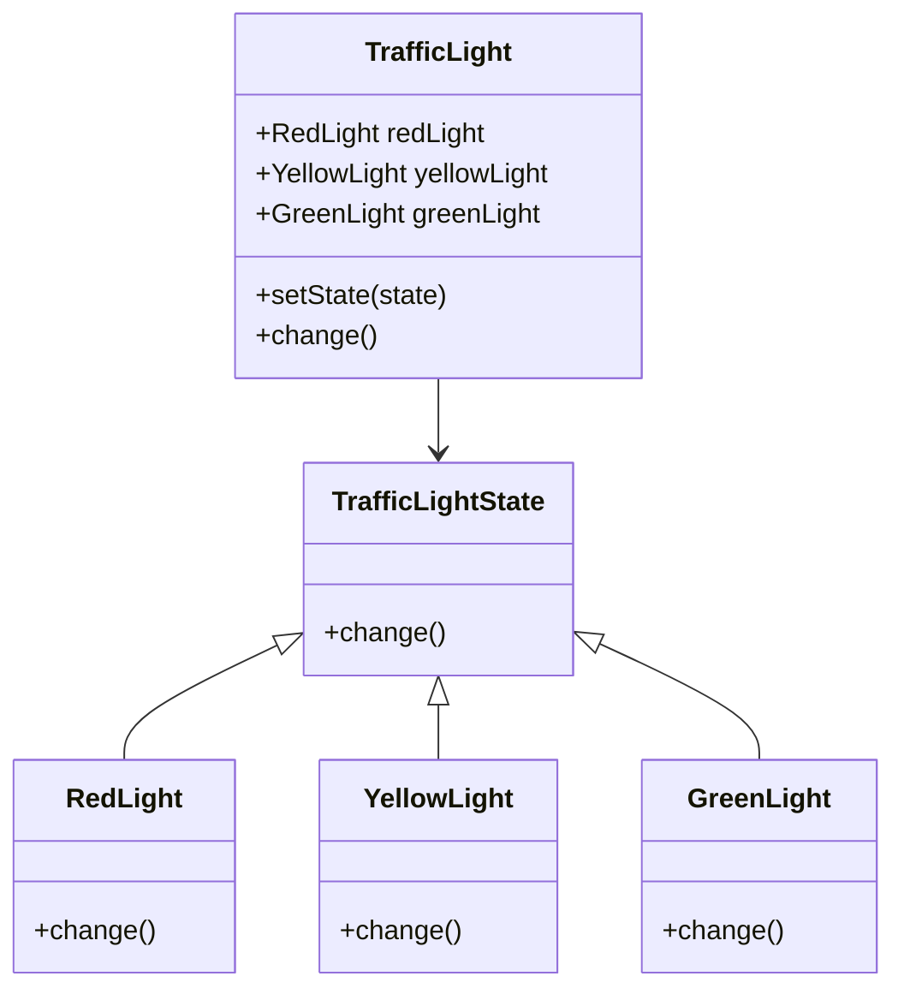

## 7.8 State Pattern Using Classes and Objects

### Introduction to the State Pattern

The State Pattern is a behavioral design pattern that allows an object to change its behavior when its internal state changes. This pattern is particularly useful when an object must exhibit different behaviors in different states, making it appear as if the object has changed its class. The State Pattern is often used to simplify complex conditional logic, making the code more maintainable and easier to understand.

### Intent of the State Pattern

The primary intent of the State Pattern is to allow an object to change its behavior when its internal state changes. This is achieved by encapsulating state-specific behavior within separate state classes and delegating state-specific behavior to the current state object. This pattern promotes the Open/Closed Principle by allowing new states to be added without modifying existing code.

### Key Participants

1. **Context**: Maintains an instance of a ConcreteState subclass that defines the current state.
2. **State**: Defines an interface for encapsulating the behavior associated with a particular state of the Context.
3. **ConcreteState**: Implements behavior associated with a state of the Context.

### Applicability

Use the State Pattern when:

- An object's behavior depends on its state, and it must change its behavior at runtime depending on that state.
- Operations have large, multipart conditional statements that depend on the object's state.

### Implementing the State Pattern in JavaScript

In JavaScript, we can represent different states as classes or objects. Let's explore how to implement the State Pattern using classes and objects.

#### Example: Traffic Light System

Consider a traffic light system where the light can be in one of three states: Red, Yellow, or Green. Each state has its own behavior, and the light transitions between these states.

```javascript
// State interface
class TrafficLightState {
  constructor(light) {
    this.light = light;
  }

  change() {
    throw new Error("This method should be overridden!");
  }
}

// Concrete States
class RedLight extends TrafficLightState {
  change() {
    console.log("Changing from Red to Green.");
    this.light.setState(this.light.greenLight);
  }
}

class YellowLight extends TrafficLightState {
  change() {
    console.log("Changing from Yellow to Red.");
    this.light.setState(this.light.redLight);
  }
}

class GreenLight extends TrafficLightState {
  change() {
    console.log("Changing from Green to Yellow.");
    this.light.setState(this.light.yellowLight);
  }
}

// Context
class TrafficLight {
  constructor() {
    this.redLight = new RedLight(this);
    this.yellowLight = new YellowLight(this);
    this.greenLight = new GreenLight(this);
    this.currentState = this.redLight;
  }

  setState(state) {
    this.currentState = state;
  }

  change() {
    this.currentState.change();
  }
}

// Usage
const trafficLight = new TrafficLight();
trafficLight.change(); // Changing from Red to Green.
trafficLight.change(); // Changing from Green to Yellow.
trafficLight.change(); // Changing from Yellow to Red.
```

### Benefits of the State Pattern

- **Encapsulation of State-Specific Behavior**: Each state is encapsulated in its own class, making the code easier to manage and extend.
- **Simplification of Complex Conditionals**: The State Pattern eliminates the need for complex conditional statements, making the code more readable and maintainable.
- **Ease of Adding New States**: New states can be added without modifying existing code, adhering to the Open/Closed Principle.

### Use Cases

1. **UI Component States**: Use the State Pattern to manage different states of UI components, such as buttons (enabled, disabled, loading).
2. **Game Character States**: Implement different behaviors for game characters based on their states (idle, running, jumping).
3. **Network Connections**: Manage different states of network connections (connected, disconnected, reconnecting).

### Visualizing the State Pattern

Below is a class diagram illustrating the State Pattern in the context of the traffic light system.



### JavaScript Unique Features

JavaScript's prototypal inheritance and dynamic typing make it a flexible language for implementing the State Pattern. The use of classes and objects allows for clear separation of state-specific behavior, and JavaScript's first-class functions can be leveraged to create more dynamic and flexible state transitions.

### Differences and Similarities with Other Patterns

The State Pattern is often confused with the Strategy Pattern. While both patterns involve encapsulating behavior, the State Pattern is used when an object's behavior changes based on its state, whereas the Strategy Pattern is used to select an algorithm at runtime.

### Design Considerations

- **State Transition Logic**: Ensure that state transitions are well-defined and that the system can handle invalid transitions gracefully.
- **Performance**: Consider the performance implications of frequent state changes, especially in performance-critical applications.

### Try It Yourself

Experiment with the traffic light example by adding a new state, such as a blinking light. Modify the `TrafficLight` class to handle this new state and observe how the system behaves.

### Knowledge Check

- What is the primary intent of the State Pattern?
- How does the State Pattern promote the Open/Closed Principle?
- What are some common use cases for the State Pattern?
- How does the State Pattern differ from the Strategy Pattern?
- What are the key participants in the State Pattern?

### Embrace the Journey

Remember, mastering design patterns is a journey. As you continue to explore and implement different patterns, you'll gain a deeper understanding of how to create flexible and maintainable code. Keep experimenting, stay curious, and enjoy the journey!

## Quiz: Mastering the State Pattern in JavaScript



### What is the primary intent of the State Pattern?

- [x] To allow an object to change its behavior when its internal state changes.
- [ ] To encapsulate algorithms within classes.
- [ ] To provide a way to access the elements of an aggregate object sequentially.
- [ ] To define a family of algorithms and make them interchangeable.

> **Explanation:** The State Pattern allows an object to change its behavior when its internal state changes, making it appear as if the object changed its class.

### Which of the following is a key participant in the State Pattern?

- [x] Context
- [x] State
- [x] ConcreteState
- [ ] Strategy

> **Explanation:** The key participants in the State Pattern are Context, State, and ConcreteState. Strategy is part of the Strategy Pattern.

### How does the State Pattern promote the Open/Closed Principle?

- [x] By allowing new states to be added without modifying existing code.
- [ ] By using inheritance to extend functionality.
- [ ] By encapsulating algorithms within classes.
- [ ] By providing a way to access the elements of an aggregate object sequentially.

> **Explanation:** The State Pattern promotes the Open/Closed Principle by allowing new states to be added without modifying existing code.

### What is a common use case for the State Pattern?

- [x] Managing different states of UI components.
- [x] Implementing different behaviors for game characters.
- [x] Managing different states of network connections.
- [ ] Sorting a list of items.

> **Explanation:** Common use cases for the State Pattern include managing different states of UI components, game characters, and network connections.

### How does the State Pattern differ from the Strategy Pattern?

- [x] The State Pattern is used when an object's behavior changes based on its state.
- [ ] The State Pattern is used to encapsulate algorithms.
- [ ] The State Pattern is used to provide a way to access the elements of an aggregate object sequentially.
- [ ] The State Pattern is used to define a family of algorithms and make them interchangeable.

> **Explanation:** The State Pattern is used when an object's behavior changes based on its state, whereas the Strategy Pattern is used to select an algorithm at runtime.

### What is the role of the Context in the State Pattern?

- [x] To maintain an instance of a ConcreteState subclass that defines the current state.
- [ ] To encapsulate algorithms within classes.
- [ ] To provide a way to access the elements of an aggregate object sequentially.
- [ ] To define a family of algorithms and make them interchangeable.

> **Explanation:** The Context maintains an instance of a ConcreteState subclass that defines the current state.

### What is a benefit of using the State Pattern?

- [x] Encapsulation of state-specific behavior.
- [x] Simplification of complex conditionals.
- [ ] Increased coupling between classes.
- [ ] Reduced code readability.

> **Explanation:** Benefits of the State Pattern include encapsulation of state-specific behavior and simplification of complex conditionals.

### What is a potential design consideration when using the State Pattern?

- [x] Ensuring that state transitions are well-defined.
- [ ] Increasing the number of conditional statements.
- [ ] Reducing the number of classes.
- [ ] Avoiding the use of inheritance.

> **Explanation:** A potential design consideration is ensuring that state transitions are well-defined and that the system can handle invalid transitions gracefully.

### How can JavaScript's unique features be leveraged in the State Pattern?

- [x] By using prototypal inheritance and dynamic typing.
- [ ] By avoiding the use of classes and objects.
- [ ] By using only primitive data types.
- [ ] By avoiding the use of functions.

> **Explanation:** JavaScript's prototypal inheritance and dynamic typing make it a flexible language for implementing the State Pattern.

### True or False: The State Pattern can be used to manage different states of UI components.

- [x] True
- [ ] False

> **Explanation:** True. The State Pattern can be used to manage different states of UI components, such as buttons (enabled, disabled, loading).




