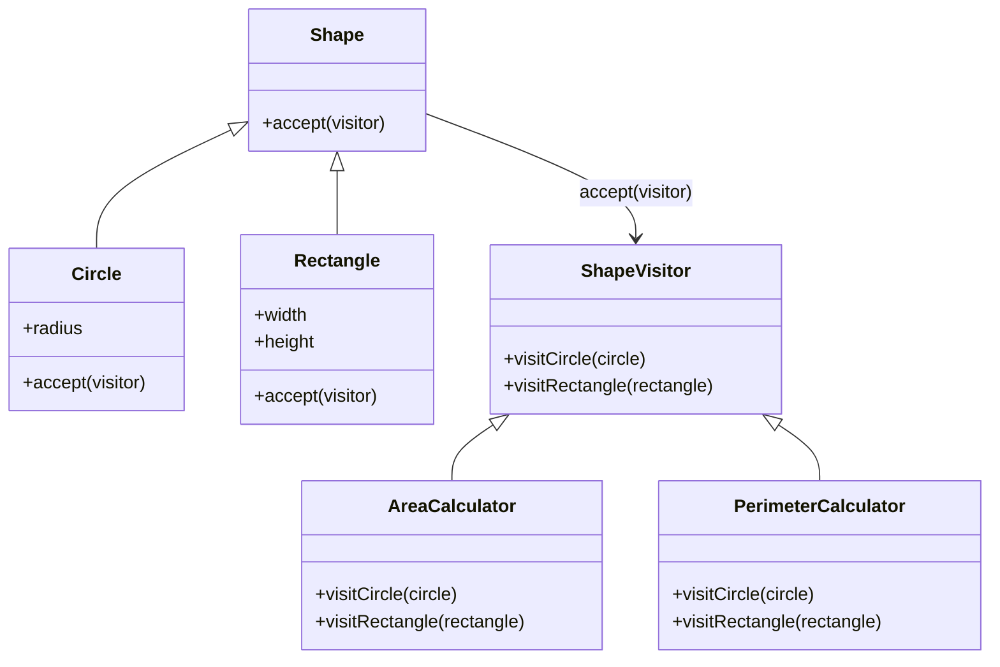

## 7.9 Visitor Pattern with Double Dispatch

The Visitor Pattern is a powerful design pattern that allows you to add new operations to existing object structures without modifying the objects themselves. This pattern is particularly useful when you want to perform operations that depend on the concrete classes of objects in a structure. By using double dispatch, the Visitor Pattern separates algorithms from the objects on which they operate, making it easier to extend and maintain your code.

### Understanding the Visitor Pattern

#### Definition

The Visitor Pattern is a behavioral design pattern that lets you define a new operation without changing the classes of the elements on which it operates. It involves two main components:

- **Visitor**: An interface or abstract class that declares a visit method for each type of concrete element.
- **Element**: An interface or abstract class that declares an accept method, which takes a visitor as an argument.

#### Key Participants

- **Concrete Visitor**: Implements the visitor interface and defines the operations to be performed on elements.
- **Concrete Element**: Implements the element interface and defines the accept method to accept a visitor.

### Double Dispatch Explained

Double dispatch is a technique that allows a function to be dynamically dispatched based on the runtime types of two objects. In the context of the Visitor Pattern, double dispatch ensures that the correct visit method is called for a given element type.

In JavaScript, double dispatch can be achieved by having the element call a method on the visitor, passing itself as an argument. This allows the visitor to determine the concrete type of the element and execute the appropriate operation.

### Implementing the Visitor Pattern in JavaScript

Let's explore how to implement the Visitor Pattern with double dispatch in JavaScript through a practical example. We'll create a simple system for processing different types of shapes, such as circles and rectangles, and perform operations like calculating area and perimeter.

#### Step 1: Define the Element Interface

First, define the element interface with an `accept` method:

```javascript
// Element interface
class Shape {
  accept(visitor) {
    throw new Error('This method should be overridden!');
  }
}
```

#### Step 2: Create Concrete Elements

Next, create concrete element classes that extend the `Shape` interface:

```javascript
// Concrete Element: Circle
class Circle extends Shape {
  constructor(radius) {
    super();
    this.radius = radius;
  }

  accept(visitor) {
    visitor.visitCircle(this);
  }
}

// Concrete Element: Rectangle
class Rectangle extends Shape {
  constructor(width, height) {
    super();
    this.width = width;
    this.height = height;
  }

  accept(visitor) {
    visitor.visitRectangle(this);
  }
}
```

#### Step 3: Define the Visitor Interface

Define the visitor interface with methods for each concrete element:

```javascript
// Visitor interface
class ShapeVisitor {
  visitCircle(circle) {
    throw new Error('This method should be overridden!');
  }

  visitRectangle(rectangle) {
    throw new Error('This method should be overridden!');
  }
}
```

#### Step 4: Create Concrete Visitors

Create concrete visitor classes that implement the visitor interface and define specific operations:

```javascript
// Concrete Visitor: AreaCalculator
class AreaCalculator extends ShapeVisitor {
  visitCircle(circle) {
    const area = Math.PI * Math.pow(circle.radius, 2);
    console.log(`Circle area: ${area}`);
  }

  visitRectangle(rectangle) {
    const area = rectangle.width * rectangle.height;
    console.log(`Rectangle area: ${area}`);
  }
}

// Concrete Visitor: PerimeterCalculator
class PerimeterCalculator extends ShapeVisitor {
  visitCircle(circle) {
    const perimeter = 2 * Math.PI * circle.radius;
    console.log(`Circle perimeter: ${perimeter}`);
  }

  visitRectangle(rectangle) {
    const perimeter = 2 * (rectangle.width + rectangle.height);
    console.log(`Rectangle perimeter: ${perimeter}`);
  }
}
```

#### Step 5: Use the Visitor Pattern

Finally, use the visitor pattern to perform operations on the elements:

```javascript
// Create shapes
const shapes = [
  new Circle(5),
  new Rectangle(4, 6)
];

// Create visitors
const areaCalculator = new AreaCalculator();
const perimeterCalculator = new PerimeterCalculator();

// Perform operations
shapes.forEach(shape => {
  shape.accept(areaCalculator);
  shape.accept(perimeterCalculator);
});
```

### Visualizing the Visitor Pattern

To better understand the Visitor Pattern and its components, let's visualize the interaction between elements and visitors using a class diagram.



**Diagram Description**: This class diagram illustrates the relationships between the `Shape`, `Circle`, `Rectangle`, `ShapeVisitor`, `AreaCalculator`, and `PerimeterCalculator` classes. The `Shape` class is an abstract class with an `accept` method, and `Circle` and `Rectangle` are concrete implementations. The `ShapeVisitor` class defines the visitor interface, and `AreaCalculator` and `PerimeterCalculator` are concrete visitors implementing specific operations.

### Benefits of the Visitor Pattern

The Visitor Pattern offers several benefits:

- **Separation of Concerns**: It separates algorithms from the objects on which they operate, making it easier to manage and extend code.
- **Open/Closed Principle**: You can add new operations without modifying existing classes, adhering to the open/closed principle.
- **Flexibility**: It allows you to define new operations for object structures without altering the objects themselves.

### Potential Complexities and Considerations

While the Visitor Pattern is powerful, it comes with potential complexities:

- **Complexity in Adding New Element Types**: Adding new element types requires modifying the visitor interface and all concrete visitors, which can be cumbersome.
- **Double Dispatch Overhead**: Implementing double dispatch can introduce additional complexity, especially in languages that do not natively support it.
- **Alternative Patterns**: Consider alternative patterns, such as the Strategy Pattern or Command Pattern, if the Visitor Pattern's complexity outweighs its benefits for your use case.

### JavaScript Unique Features

JavaScript's dynamic nature and prototypal inheritance make it well-suited for implementing the Visitor Pattern. The language's flexibility allows for easy creation and manipulation of objects, enabling seamless implementation of double dispatch.

### Differences and Similarities with Other Patterns

The Visitor Pattern is often compared to the Strategy Pattern and Command Pattern. While all three patterns separate algorithms from the objects they operate on, the Visitor Pattern is unique in its ability to add new operations without modifying existing classes. The Strategy Pattern focuses on interchangeable algorithms, and the Command Pattern encapsulates requests as objects.

### Try It Yourself

Experiment with the Visitor Pattern by modifying the code examples. Try adding new shapes, such as triangles or squares, and implement additional operations, like calculating the diagonal of a rectangle. This hands-on approach will deepen your understanding of the pattern and its applications.

### Knowledge Check

To reinforce your understanding of the Visitor Pattern with Double Dispatch, let's test your knowledge with a quiz.

## Mastering the Visitor Pattern with Double Dispatch: Quiz



### What is the primary purpose of the Visitor Pattern?

- [x] To add new operations to existing object structures without modifying them.
- [ ] To encapsulate requests as objects.
- [ ] To provide a way to access the elements of an aggregate object sequentially.
- [ ] To define a family of algorithms, encapsulate each one, and make them interchangeable.

> **Explanation:** The Visitor Pattern allows adding new operations to existing object structures without modifying them, separating algorithms from the objects on which they operate.

### Which of the following is a key component of the Visitor Pattern?

- [x] Visitor
- [ ] Command
- [ ] Strategy
- [ ] Singleton

> **Explanation:** The Visitor Pattern involves a visitor, which defines operations to be performed on elements.

### How does double dispatch work in the Visitor Pattern?

- [x] By having the element call a method on the visitor, passing itself as an argument.
- [ ] By encapsulating requests as objects.
- [ ] By defining a family of algorithms and making them interchangeable.
- [ ] By providing a way to access the elements of an aggregate object sequentially.

> **Explanation:** Double dispatch in the Visitor Pattern involves the element calling a method on the visitor, allowing the visitor to determine the concrete type of the element.

### What is a potential complexity of the Visitor Pattern?

- [x] Complexity in adding new element types.
- [ ] Difficulty in encapsulating requests as objects.
- [ ] Challenges in providing a way to access elements sequentially.
- [ ] Issues with defining a family of algorithms.

> **Explanation:** Adding new element types requires modifying the visitor interface and all concrete visitors, which can be cumbersome.

### Which pattern is often compared to the Visitor Pattern?

- [x] Strategy Pattern
- [ ] Singleton Pattern
- [ ] Factory Pattern
- [ ] Observer Pattern

> **Explanation:** The Visitor Pattern is often compared to the Strategy Pattern, as both separate algorithms from the objects they operate on.

### What is a benefit of the Visitor Pattern?

- [x] Separation of concerns.
- [ ] Encapsulation of requests as objects.
- [ ] Providing a way to access elements sequentially.
- [ ] Defining a family of algorithms.

> **Explanation:** The Visitor Pattern separates algorithms from the objects on which they operate, making it easier to manage and extend code.

### How can you implement double dispatch in JavaScript?

- [x] By having the element call a method on the visitor, passing itself as an argument.
- [ ] By encapsulating requests as objects.
- [ ] By defining a family of algorithms and making them interchangeable.
- [ ] By providing a way to access the elements of an aggregate object sequentially.

> **Explanation:** Double dispatch in JavaScript involves the element calling a method on the visitor, allowing the visitor to determine the concrete type of the element.

### What is a key advantage of using the Visitor Pattern?

- [x] Adding new operations without modifying existing classes.
- [ ] Encapsulating requests as objects.
- [ ] Providing a way to access elements sequentially.
- [ ] Defining a family of algorithms.

> **Explanation:** The Visitor Pattern allows adding new operations without modifying existing classes, adhering to the open/closed principle.

### Which of the following is a concrete visitor in the provided example?

- [x] AreaCalculator
- [ ] Shape
- [ ] Circle
- [ ] Rectangle

> **Explanation:** `AreaCalculator` is a concrete visitor that implements the visitor interface and defines specific operations.

### True or False: The Visitor Pattern is a structural design pattern.

- [ ] True
- [x] False

> **Explanation:** The Visitor Pattern is a behavioral design pattern, not a structural one.



Remember, mastering the Visitor Pattern with Double Dispatch is just the beginning. As you continue your journey in JavaScript development, you'll discover more patterns and techniques that will enhance your ability to create robust and maintainable applications. Keep experimenting, stay curious, and enjoy the journey!
