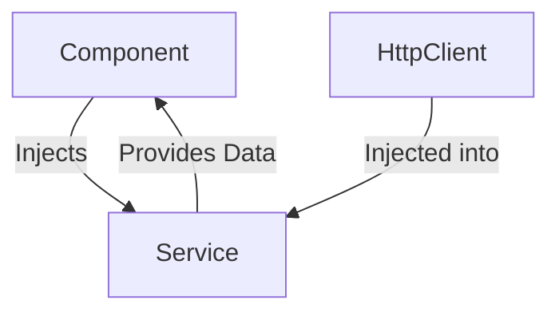

## 8.1.1 Dependency Injection in Angular

Dependency Injection (DI) is a fundamental design pattern in Angular that facilitates the development of modular, maintainable, and testable applications. By decoupling the creation of a service from its consumption, DI allows Angular components to request dependencies rather than create them. This article delves into the concept of Dependency Injection in Angular, its implementation, and best practices.

### Understand the Concept

Angular's dependency injection system is a powerful mechanism that allows developers to inject dependencies (services) into components, directives, pipes, or other services. This pattern promotes loose coupling and enhances code reusability.

- **Leverage Angular's Dependency Injection:** Angular's DI framework provides services to components, ensuring that each component receives the dependencies it needs without having to instantiate them directly.

### Implementation Steps

Let's explore the step-by-step process of implementing Dependency Injection in Angular.

#### 1. Create a Service

Services in Angular are classes that encapsulate business logic and data access. They are typically used to share data and functionality across multiple components.

```typescript
import { Injectable } from '@angular/core';

@Injectable({
  providedIn: 'root'
})
export class DataService {
  private data: string[] = ['Angular', 'React', 'Vue'];

  getData(): string[] {
    return this.data;
  }
}
```

- **`@Injectable` Decorator:** The `@Injectable` decorator marks the class as a service that can be injected. The `providedIn: 'root'` syntax ensures that the service is a singleton and is available throughout the application.

#### 2. Inject the Service

To use the service in a component, inject it through the component's constructor.

```typescript
import { Component, OnInit } from '@angular/core';
import { DataService } from './data.service';

@Component({
  selector: 'app-data-consumer',
  template: `<ul><li *ngFor="let item of data">{{ item }}</li></ul>`
})
export class DataConsumerComponent implements OnInit {
  data: string[];

  constructor(private dataService: DataService) {}

  ngOnInit() {
    this.data = this.dataService.getData();
  }
}
```

- **Constructor Injection:** The service is injected into the component's constructor, making it available for use within the component.

#### 3. Use the Service

Once injected, you can call the service methods within the component to perform operations.

- **Service Method Invocation:** In the `ngOnInit` lifecycle hook, the `getData` method of the `DataService` is called to retrieve data and assign it to the component's `data` property.

### Use Cases

Dependency Injection is particularly useful in scenarios where shared functionalities are required across multiple components. Common use cases include:

- **Logging Services:** Centralized logging mechanisms that can be injected into various components to log application activities.
- **Data Access Services:** Services that handle HTTP requests and data manipulation, providing a consistent API for data operations.
- **Configuration Services:** Services that manage application configuration settings, allowing components to access configuration data without hardcoding values.

### Practice: Implementing a Data Service

Let's implement a simple data service to fetch data from an API and inject it into a component.

```typescript
import { Injectable } from '@angular/core';
import { HttpClient } from '@angular/common/http';
import { Observable } from 'rxjs';

@Injectable({
  providedIn: 'root'
})
export class ApiService {
  private apiUrl = 'https://api.example.com/data';

  constructor(private http: HttpClient) {}

  fetchData(): Observable<any> {
    return this.http.get<any>(this.apiUrl);
  }
}
```

- **HTTP Client Injection:** The `HttpClient` service is injected into the `ApiService` to perform HTTP requests.

```typescript
import { Component, OnInit } from '@angular/core';
import { ApiService } from './api.service';

@Component({
  selector: 'app-api-consumer',
  template: `<div *ngIf="data">{{ data | json }}</div>`
})
export class ApiConsumerComponent implements OnInit {
  data: any;

  constructor(private apiService: ApiService) {}

  ngOnInit() {
    this.apiService.fetchData().subscribe(response => this.data = response);
  }
}
```

- **Asynchronous Data Handling:** The `fetchData` method returns an `Observable`, which is subscribed to in the component to handle asynchronous data fetching.

### Considerations

When working with Dependency Injection in Angular, consider the following:

- **Provider Scope:** Understand the scope of providers to manage service instances effectively. Services can be provided at different levels, such as root, module, or component level, affecting their lifecycle and instantiation.
- **Singleton Services:** By default, services provided in the root are singletons. Ensure that this behavior aligns with your application's requirements.
- **Testing:** DI facilitates testing by allowing mock dependencies to be injected into components, enabling isolated unit tests.

### Visual Aids

To better understand the flow of Dependency Injection in Angular, consider the following diagram:



- **Component-Service Relationship:** The component injects the service, which in turn may depend on other services like `HttpClient`.

### Advantages and Disadvantages

#### Advantages

- **Loose Coupling:** Components are decoupled from service instantiation, promoting modular design.
- **Reusability:** Services can be reused across multiple components, reducing code duplication.
- **Testability:** DI makes it easier to test components by allowing mock services to be injected.

#### Disadvantages

- **Complexity:** Understanding and managing provider scopes can add complexity to the application.
- **Overhead:** Improper use of DI can lead to unnecessary overhead, especially if services are injected where not needed.

### Best Practices

- **Use `providedIn: 'root'`:** For services that are used throughout the application, use `providedIn: 'root'` to ensure a single instance.
- **Limit Service Responsibilities:** Follow the Single Responsibility Principle by ensuring each service has a clear, focused responsibility.
- **Avoid Circular Dependencies:** Be cautious of circular dependencies, which can lead to runtime errors.

### Conclusion

Dependency Injection is a cornerstone of Angular applications, enabling efficient service management and promoting best practices in software design. By understanding and leveraging DI, developers can create scalable, maintainable, and testable applications. Explore further by implementing DI in your projects and experimenting with different provider scopes and configurations.

## Quiz Time!



### What is the primary purpose of Dependency Injection in Angular?

- [x] To decouple the creation of a service from its consumption
- [ ] To directly instantiate services within components
- [ ] To enhance the visual design of components
- [ ] To manage component lifecycle hooks

> **Explanation:** Dependency Injection decouples the creation of a service from its consumption, promoting modularity and reusability.

### How do you define a service in Angular to be a singleton?

- [x] Use `@Injectable({ providedIn: 'root' })`
- [ ] Use `@Component({ selector: 'app-root' })`
- [ ] Use `@NgModule({ imports: [] })`
- [ ] Use `@Directive({ selector: '[appDirective]' })`

> **Explanation:** The `@Injectable({ providedIn: 'root' })` decorator ensures that the service is a singleton, available throughout the application.

### What is the role of the `HttpClient` service in Angular?

- [x] To perform HTTP requests
- [ ] To manage component templates
- [ ] To handle component styles
- [ ] To define component selectors

> **Explanation:** `HttpClient` is used to perform HTTP requests, enabling data fetching and communication with external APIs.

### In which lifecycle hook is it common to call service methods in a component?

- [x] `ngOnInit`
- [ ] `ngOnDestroy`
- [ ] `ngAfterViewInit`
- [ ] `ngOnChanges`

> **Explanation:** `ngOnInit` is commonly used to call service methods as it is invoked after the component's data-bound properties are initialized.

### What is a potential disadvantage of Dependency Injection?

- [x] Complexity in managing provider scopes
- [ ] Improved testability
- [ ] Enhanced code reusability
- [ ] Reduced code duplication

> **Explanation:** Managing provider scopes can add complexity to the application, especially in large projects.

### Which of the following is a common use case for Dependency Injection?

- [x] Logging services
- [ ] Component styling
- [ ] Template rendering
- [ ] Event binding

> **Explanation:** Logging services are a common use case for DI, allowing centralized logging across components.

### What should you be cautious of when using Dependency Injection?

- [x] Circular dependencies
- [ ] Component selectors
- [ ] Template syntax
- [ ] CSS styles

> **Explanation:** Circular dependencies can lead to runtime errors and should be avoided when using DI.

### What is the benefit of using `providedIn: 'root'` for a service?

- [x] It ensures a single instance of the service is available throughout the application
- [ ] It restricts the service to a specific component
- [ ] It enhances the visual design of the service
- [ ] It automatically generates component templates

> **Explanation:** `providedIn: 'root'` ensures that the service is a singleton, available throughout the application.

### How does Dependency Injection enhance testability?

- [x] By allowing mock dependencies to be injected into components
- [ ] By directly instantiating services within components
- [ ] By managing component lifecycle hooks
- [ ] By enhancing component styles

> **Explanation:** DI allows mock dependencies to be injected into components, enabling isolated unit tests.

### True or False: Dependency Injection promotes loose coupling in Angular applications.

- [x] True
- [ ] False

> **Explanation:** True. DI promotes loose coupling by decoupling the creation of services from their consumption, enhancing modularity and reusability.


