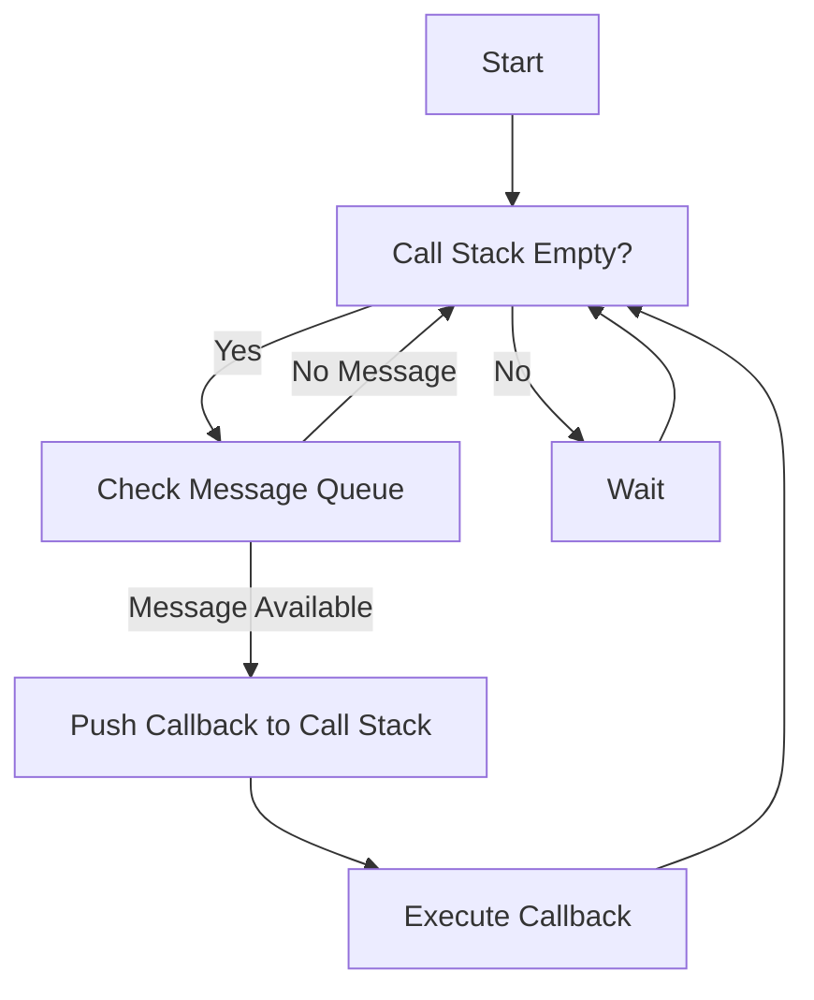

## 8.1 The Event Loop and Non-Blocking I/O

JavaScript is renowned for its non-blocking, asynchronous nature, which is largely facilitated by the event loop and non-blocking I/O operations. Despite being single-threaded, JavaScript can handle multiple operations concurrently, making it a powerful tool for modern web development. In this section, we will delve into the intricacies of the event loop, explore how non-blocking I/O operations work, and understand their significance in server-side applications like Node.js.

### Understanding the Event Loop

The event loop is a fundamental concept in JavaScript that allows it to perform non-blocking operations. It is the mechanism that enables JavaScript to execute asynchronous code, such as callbacks, Promises, and async/await, without blocking the main thread.

#### Key Components of the Event Loop

1. **Call Stack**: The call stack is a data structure that keeps track of the function calls in a program. When a function is called, it is added to the stack, and when it returns, it is removed. JavaScript executes code in a single-threaded manner, meaning only one function can run at a time.

2. **Message Queue**: The message queue is where messages (or events) are queued up for processing. Each message is associated with a callback function. When the call stack is empty, the event loop picks the first message from the queue and pushes its associated callback onto the stack for execution.

3. **Event Loop**: The event loop continuously checks the call stack and the message queue. If the call stack is empty, it takes the first message from the queue and processes it. This cycle allows JavaScript to handle asynchronous operations efficiently.

#### Visualizing the Event Loop

To better understand how the event loop works, let's visualize its operation using a diagram.



**Diagram Description**: This flowchart illustrates the operation of the event loop. It continuously checks if the call stack is empty and processes messages from the queue when available.

### Non-Blocking I/O Operations

Non-blocking I/O operations are crucial for JavaScript's concurrency model. They allow the program to initiate an I/O operation and continue executing other code without waiting for the operation to complete. This is achieved through callbacks, Promises, and async/await.

#### Callbacks

Callbacks are functions passed as arguments to other functions, which are invoked once an asynchronous operation completes. They are the foundation of non-blocking I/O in JavaScript.

**Example of a Callback Function**:

```javascript
function fetchData(callback) {
    setTimeout(() => {
        const data = { name: "John Doe", age: 30 };
        callback(data);
    }, 1000);
}

fetchData((data) => {
    console.log("Data received:", data);
});
```

**Explanation**: In this example, `fetchData` simulates an asynchronous operation using `setTimeout`. The callback function is invoked once the data is "fetched."

#### Promises

Promises provide a more structured way to handle asynchronous operations. They represent a value that may be available now, or in the future, or never.

**Example of a Promise**:

```javascript
function fetchData() {
    return new Promise((resolve, reject) => {
        setTimeout(() => {
            const data = { name: "John Doe", age: 30 };
            resolve(data);
        }, 1000);
    });
}

fetchData().then((data) => {
    console.log("Data received:", data);
}).catch((error) => {
    console.error("Error:", error);
});
```

**Explanation**: Here, `fetchData` returns a Promise that resolves with data after a delay. The `then` method is used to handle the resolved value, and `catch` handles any errors.

#### Async/Await

Async/await is syntactic sugar over Promises, providing a more readable and synchronous-looking code structure for asynchronous operations.

**Example of Async/Await**:

```javascript
async function fetchData() {
    return new Promise((resolve, reject) => {
        setTimeout(() => {
            const data = { name: "John Doe", age: 30 };
            resolve(data);
        }, 1000);
    });
}

async function getData() {
    try {
        const data = await fetchData();
        console.log("Data received:", data);
    } catch (error) {
        console.error("Error:", error);
    }
}

getData();
```

**Explanation**: The `getData` function uses `await` to pause execution until the Promise returned by `fetchData` is resolved. This makes the code easier to read and maintain.

### Significance of Non-Blocking I/O in Node.js

Node.js, a JavaScript runtime built on Chrome's V8 JavaScript engine, leverages non-blocking I/O to handle multiple connections concurrently. This makes it ideal for building scalable network applications.

#### Benefits of Non-Blocking I/O in Node.js

- **Scalability**: Non-blocking I/O allows Node.js to handle thousands of connections simultaneously, making it highly scalable.
- **Efficiency**: By not blocking the main thread, Node.js can perform I/O operations efficiently, reducing idle time.
- **Responsiveness**: Non-blocking I/O ensures that applications remain responsive, even under heavy load.

### Common Pitfalls and Performance Considerations

While non-blocking I/O offers numerous advantages, it also comes with challenges and potential pitfalls.

#### Common Pitfalls

- **Callback Hell**: Excessive nesting of callbacks can lead to complex and hard-to-read code, known as "callback hell." This can be mitigated by using Promises or async/await.
- **Error Handling**: Proper error handling is crucial in asynchronous code to prevent unhandled exceptions and ensure application stability.
- **Resource Management**: Non-blocking I/O can lead to resource exhaustion if not managed properly, especially in high-concurrency environments.

#### Performance Considerations

- **Event Loop Lag**: Long-running operations on the main thread can block the event loop, causing delays in processing other events. It's essential to offload heavy computations to worker threads or external services.
- **Memory Usage**: Asynchronous operations can lead to increased memory usage if not managed correctly. It's important to monitor and optimize memory usage in Node.js applications.

### Try It Yourself

To deepen your understanding of the event loop and non-blocking I/O, try modifying the code examples provided. Experiment with different asynchronous patterns, such as chaining Promises or using async/await in various scenarios. Observe how these changes affect the flow and performance of your code.

### Conclusion

The event loop and non-blocking I/O are at the heart of JavaScript's concurrency model, enabling it to handle asynchronous operations efficiently. By understanding these concepts and leveraging them effectively, you can build responsive and scalable applications. Remember, mastering these patterns takes practice and experimentation, so keep exploring and refining your skills.

### Knowledge Check

## Mastering JavaScript's Event Loop and Non-Blocking I/O



### What is the primary role of the event loop in JavaScript?

- [x] To manage the execution of asynchronous code
- [ ] To execute synchronous code only
- [ ] To handle errors in JavaScript
- [ ] To manage memory allocation

> **Explanation:** The event loop is responsible for managing the execution of asynchronous code by checking the call stack and message queue.

### Which of the following is NOT a component of the event loop?

- [ ] Call Stack
- [ ] Message Queue
- [x] Garbage Collector
- [ ] Event Loop

> **Explanation:** The garbage collector is not a component of the event loop. It is responsible for memory management.

### How do Promises improve asynchronous code handling compared to callbacks?

- [x] They provide a more structured and readable way to handle asynchronous operations
- [ ] They execute code synchronously
- [ ] They eliminate the need for error handling
- [ ] They block the main thread

> **Explanation:** Promises offer a structured way to handle asynchronous operations, improving code readability and maintainability compared to callbacks.

### What is a common pitfall of using callbacks in JavaScript?

- [x] Callback Hell
- [ ] Memory Leaks
- [ ] Blocking the Event Loop
- [ ] Synchronous Execution

> **Explanation:** Callback hell refers to the excessive nesting of callbacks, leading to complex and hard-to-read code.

### Which of the following is a benefit of non-blocking I/O in Node.js?

- [x] Scalability
- [ ] Increased memory usage
- [ ] Synchronous execution
- [ ] Blocking the main thread

> **Explanation:** Non-blocking I/O allows Node.js to handle multiple connections concurrently, enhancing scalability.

### What does the `await` keyword do in JavaScript?

- [x] Pauses execution until a Promise is resolved
- [ ] Executes code synchronously
- [ ] Blocks the main thread
- [ ] Handles errors automatically

> **Explanation:** The `await` keyword pauses the execution of an async function until the Promise is resolved, allowing for more readable asynchronous code.

### How can you mitigate callback hell in JavaScript?

- [x] Use Promises or async/await
- [ ] Use more callbacks
- [ ] Avoid asynchronous operations
- [ ] Block the main thread

> **Explanation:** Using Promises or async/await can help mitigate callback hell by providing a more structured way to handle asynchronous operations.

### What happens if the call stack is not empty in the event loop?

- [x] The event loop waits until the call stack is empty before processing the next message
- [ ] The event loop processes the next message immediately
- [ ] The event loop stops working
- [ ] The event loop clears the call stack

> **Explanation:** The event loop waits until the call stack is empty before processing the next message from the message queue.

### True or False: Non-blocking I/O operations block the main thread in JavaScript.

- [ ] True
- [x] False

> **Explanation:** Non-blocking I/O operations do not block the main thread, allowing JavaScript to handle multiple operations concurrently.

### Which of the following is a performance consideration when using non-blocking I/O?

- [x] Event Loop Lag
- [ ] Synchronous Execution
- [ ] Blocking the Main Thread
- [ ] Eliminating Error Handling

> **Explanation:** Event loop lag can occur if long-running operations block the event loop, causing delays in processing other events.



Remember, this is just the beginning. As you progress, you'll build more complex and interactive web applications. Keep experimenting, stay curious, and enjoy the journey!

---
