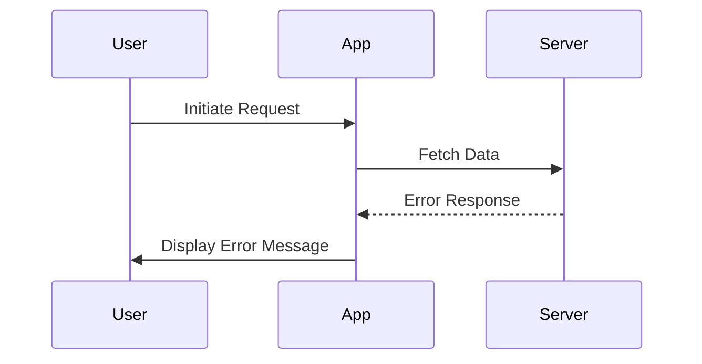

## 8.10 Patterns for Error Handling in Async Code

In the realm of JavaScript, asynchronous programming is a cornerstone for building responsive and efficient web applications. However, with the power of asynchronous operations comes the complexity of error handling. Unlike synchronous code, where errors can be caught and handled in a straightforward manner, asynchronous code requires a different approach. In this section, we will explore various patterns for handling errors in asynchronous JavaScript code, focusing on callbacks, Promises, and async/await. We will also discuss common pitfalls, best practices, and tools that can aid in detecting and managing errors effectively.

### Understanding Asynchronous Error Handling

Before diving into specific patterns, it's essential to understand why error handling in asynchronous code is unique. In synchronous code, errors propagate up the call stack and can be caught using `try...catch` blocks. However, in asynchronous code, operations are often executed outside the current call stack, making traditional error handling mechanisms insufficient.

#### Key Challenges:

- **Error Propagation**: Errors in asynchronous code do not automatically propagate up the call stack.
- **Timing**: Errors may occur at a different time than when the function is called, complicating error handling.
- **Multiple Sources**: Asynchronous operations can involve multiple sources of errors, such as network failures, timeouts, or invalid data.

### Error Handling in Callbacks

Callbacks are one of the earliest patterns for handling asynchronous operations in JavaScript. They involve passing a function as an argument to another function, which is then executed once the asynchronous operation completes.

#### Error-First Callbacks

The error-first callback pattern is a convention where the first argument of the callback function is reserved for an error object. If an error occurs, this argument is populated with the error; otherwise, it is `null`.

```javascript
function fetchData(callback) {
    setTimeout(() => {
        const error = null; // Simulate no error
        const data = { name: "John Doe" };
        callback(error, data);
    }, 1000);
}

fetchData((error, data) => {
    if (error) {
        console.error("Error fetching data:", error);
        return;
    }
    console.log("Data fetched:", data);
});
```

In this example, the `fetchData` function simulates an asynchronous operation using `setTimeout`. The callback checks for an error and handles it accordingly.

#### Common Pitfalls

- **Callback Hell**: Nesting multiple callbacks can lead to deeply nested code, making it difficult to read and maintain.
- **Error Handling Duplication**: Each callback must handle errors individually, leading to repetitive code.

### Error Handling with Promises

Promises provide a more structured way to handle asynchronous operations, allowing chaining and better error propagation.

#### Using `.catch()` for Error Handling

Promises have a `.catch()` method specifically for handling errors. If any promise in the chain is rejected, the `.catch()` block is executed.

```javascript
function fetchData() {
    return new Promise((resolve, reject) => {
        setTimeout(() => {
            const error = false; // Simulate no error
            if (error) {
                reject("Error fetching data");
            } else {
                resolve({ name: "John Doe" });
            }
        }, 1000);
    });
}

fetchData()
    .then(data => {
        console.log("Data fetched:", data);
    })
    .catch(error => {
        console.error("Error:", error);
    });
```

#### Common Pitfalls

- **Unhandled Promise Rejections**: If a promise is rejected and no `.catch()` is provided, it can lead to unhandled promise rejections, which can crash the application.
- **Chaining Errors**: Errors can propagate through the promise chain, but each link in the chain must handle errors appropriately.

### Error Handling with Async/Await

The `async/await` syntax, introduced in ES2017, provides a more synchronous-like way to handle asynchronous operations, making error handling more intuitive.

#### Using `try...catch` with Async/Await

With `async/await`, you can use `try...catch` blocks to handle errors, similar to synchronous code.

```javascript
async function fetchData() {
    return new Promise((resolve, reject) => {
        setTimeout(() => {
            const error = false; // Simulate no error
            if (error) {
                reject("Error fetching data");
            } else {
                resolve({ name: "John Doe" });
            }
        }, 1000);
    });
}

async function getData() {
    try {
        const data = await fetchData();
        console.log("Data fetched:", data);
    } catch (error) {
        console.error("Error:", error);
    }
}

getData();
```

#### Common Pitfalls

- **Forgetting `await`**: Forgetting to use `await` can lead to unhandled promise rejections.
- **Nested `try...catch`**: Overusing `try...catch` can lead to nested blocks, reducing code readability.

### Best Practices for Error Handling

1. **Centralized Error Handling**: Implement a centralized error handling mechanism to log and manage errors consistently across your application.
2. **Error Propagation**: Ensure errors are propagated correctly through your asynchronous code, allowing them to be handled at the appropriate level.
3. **Logging**: Use logging tools to capture and analyze errors, providing insights into application behavior and potential issues.
4. **Graceful Degradation**: Design your application to handle errors gracefully, providing fallback mechanisms or user-friendly error messages.
5. **Use Linters**: Tools like ESLint can help detect unhandled promise rejections and enforce best practices in your codebase.

### Tools and Linters for Error Detection

- **ESLint**: A popular linter for JavaScript that can be configured to detect unhandled promise rejections and enforce coding standards.
- **Sentry**: A real-time error tracking tool that helps monitor and fix crashes in real-time.
- **LogRocket**: A logging tool that records everything users do on your site, helping you understand and fix issues faster.

### Visualizing Asynchronous Error Handling

To better understand how errors propagate in asynchronous code, let's visualize the flow using a sequence diagram.



**Diagram Description**: This sequence diagram illustrates the flow of an error from the server back to the user. The application receives an error response from the server and displays an error message to the user.

### Try It Yourself

Experiment with the provided code examples by introducing errors or modifying the asynchronous operations. For instance, try changing the `error` variable to `true` in the `fetchData` function to simulate an error scenario. Observe how the error handling mechanisms respond and consider how you might improve or adapt them for your applications.

### Knowledge Check

- What are the key differences between error handling in synchronous and asynchronous JavaScript code?
- How does the error-first callback pattern work, and what are its limitations?
- Explain how Promises improve error handling compared to callbacks.
- What are the benefits of using `async/await` for error handling?
- How can tools like ESLint help in managing errors in asynchronous code?

### Summary

In this section, we've explored various patterns for handling errors in asynchronous JavaScript code. From callbacks to Promises and `async/await`, each approach offers unique advantages and challenges. By understanding these patterns and implementing best practices, you can build more robust and resilient applications. Remember, effective error handling is not just about catching errors but also about understanding their context and impact on your application.

### Embrace the Journey

As you continue your journey in mastering JavaScript, remember that error handling is a critical skill that will enhance your ability to build reliable and user-friendly applications. Keep experimenting, stay curious, and enjoy the process of learning and growing as a developer.

## Quiz: Mastering Error Handling in Asynchronous JavaScript



### What is a key challenge of error handling in asynchronous JavaScript code?

- [x] Errors do not automatically propagate up the call stack.
- [ ] Errors occur at the same time as the function call.
- [ ] Errors are always caught by `try...catch`.
- [ ] Errors are less frequent in asynchronous code.

> **Explanation:** In asynchronous JavaScript, errors do not automatically propagate up the call stack, making error handling more complex.

### How does the error-first callback pattern work?

- [x] The first argument of the callback is reserved for an error object.
- [ ] The last argument of the callback is reserved for an error object.
- [ ] Errors are handled in a separate function.
- [ ] Errors are ignored in this pattern.

> **Explanation:** In the error-first callback pattern, the first argument of the callback function is reserved for an error object, allowing the function to check for errors before processing data.

### What method is used to handle errors in Promises?

- [x] `.catch()`
- [ ] `.then()`
- [ ] `.finally()`
- [ ] `.resolve()`

> **Explanation:** The `.catch()` method is used to handle errors in Promises, allowing you to catch and manage rejected promises.

### What is a common pitfall when using Promises?

- [x] Unhandled promise rejections.
- [ ] Synchronous execution.
- [ ] Lack of chaining.
- [ ] Excessive nesting.

> **Explanation:** A common pitfall when using Promises is unhandled promise rejections, which can lead to application crashes if not managed properly.

### How does `async/await` improve error handling?

- [x] It allows using `try...catch` blocks for error handling.
- [ ] It eliminates the need for error handling.
- [ ] It automatically logs errors.
- [ ] It prevents errors from occurring.

> **Explanation:** `async/await` allows using `try...catch` blocks for error handling, making it more intuitive and similar to synchronous error handling.

### What tool can help detect unhandled promise rejections?

- [x] ESLint
- [ ] Babel
- [ ] Webpack
- [ ] Node.js

> **Explanation:** ESLint can be configured to detect unhandled promise rejections, helping developers enforce best practices in their codebase.

### What is a best practice for error handling in asynchronous code?

- [x] Implement centralized error handling.
- [ ] Ignore errors to improve performance.
- [ ] Use global variables for error messages.
- [ ] Handle errors only at the top level.

> **Explanation:** Implementing centralized error handling is a best practice, as it allows consistent management and logging of errors across the application.

### What is a common pitfall when using `async/await`?

- [x] Forgetting to use `await`.
- [ ] Overusing `try...catch`.
- [ ] Excessive promise chaining.
- [ ] Synchronous execution.

> **Explanation:** A common pitfall when using `async/await` is forgetting to use `await`, which can lead to unhandled promise rejections.

### What is the purpose of logging tools in error handling?

- [x] To capture and analyze errors.
- [ ] To prevent errors from occurring.
- [ ] To slow down application performance.
- [ ] To replace error handling mechanisms.

> **Explanation:** Logging tools are used to capture and analyze errors, providing insights into application behavior and potential issues.

### True or False: Asynchronous error handling is less important than synchronous error handling.

- [ ] True
- [x] False

> **Explanation:** Asynchronous error handling is equally important as synchronous error handling, as it ensures the reliability and user-friendliness of applications.




