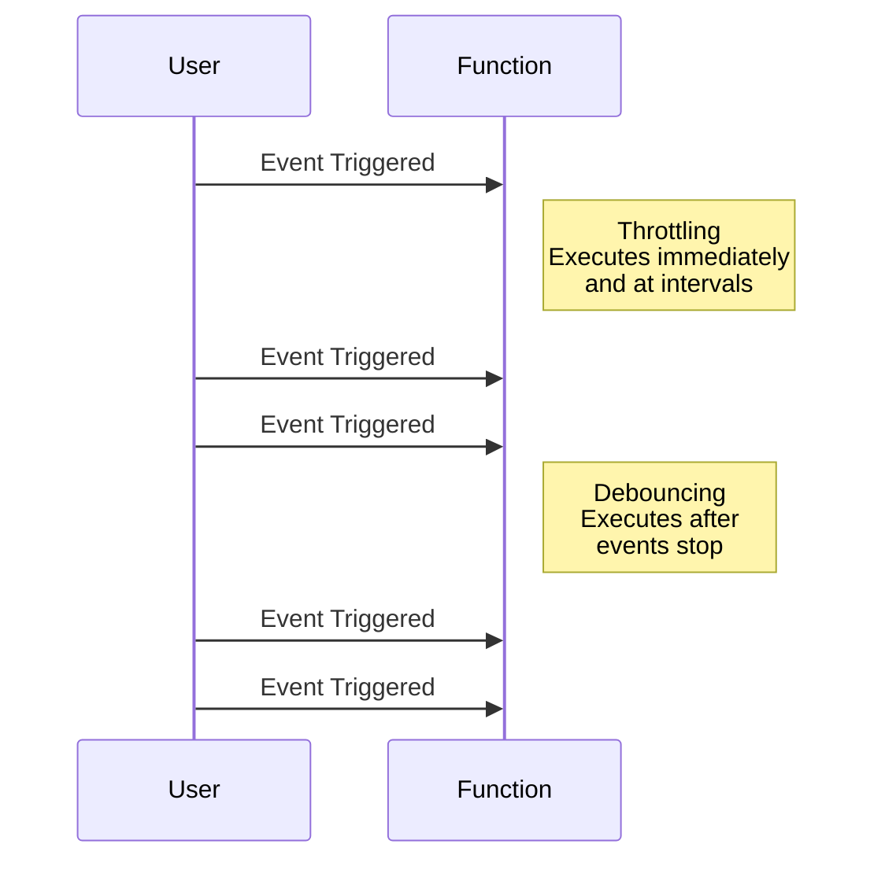

## 8.11 Throttling and Debouncing Functions

In modern web development, efficiently managing the frequency of function execution is crucial for maintaining optimal performance and enhancing user experience. Two powerful techniques for achieving this are **throttling** and **debouncing**. These methods are particularly useful in scenarios where functions are triggered by events that occur frequently, such as scrolling, resizing, or typing. In this section, we will explore the concepts of throttling and debouncing, provide practical examples, and discuss best practices for their implementation.

### Understanding Throttling and Debouncing

Before diving into code examples, let's define throttling and debouncing and understand their differences.

#### Throttling

**Throttling** is a technique used to limit the number of times a function can be called over time. It ensures that a function is executed at most once in a specified period, regardless of how many times the event is triggered. This is particularly useful for events like window resizing or scrolling, where continuous execution can lead to performance issues.

**Key Characteristics of Throttling:**
- Executes the function at regular intervals.
- Ensures consistent execution rate.
- Useful for maintaining performance during high-frequency events.

#### Debouncing

**Debouncing** is a technique that delays the execution of a function until after a specified period has elapsed since the last time the function was invoked. This is useful for scenarios like input validation, where you want to wait until the user has stopped typing before performing an action.

**Key Characteristics of Debouncing:**
- Delays function execution until a period of inactivity.
- Prevents unnecessary function calls.
- Ideal for reducing noise from rapid, successive events.

### Throttling vs. Debouncing: A Comparison

To better understand the differences, let's visualize the execution patterns of throttling and debouncing:



In the diagram above, throttling executes the function at regular intervals, while debouncing waits until the events stop before executing the function.

### Implementing Throttling and Debouncing

Now that we have a conceptual understanding, let's implement these techniques in JavaScript.

#### Throttling Implementation

Here's a simple implementation of a throttling function:

```javascript
function throttle(func, limit) {
  let lastFunc;
  let lastRan;
  return function(...args) {
    const context = this;
    if (!lastRan) {
      func.apply(context, args);
      lastRan = Date.now();
    } else {
      clearTimeout(lastFunc);
      lastFunc = setTimeout(function() {
        if ((Date.now() - lastRan) >= limit) {
          func.apply(context, args);
          lastRan = Date.now();
        }
      }, limit - (Date.now() - lastRan));
    }
  };
}

// Usage example
window.addEventListener('resize', throttle(() => {
  console.log('Window resized');
}, 200));
```

**Explanation:**
- The `throttle` function takes a `func` to execute and a `limit` for the interval.
- It uses `setTimeout` to ensure the function is called at most once per `limit` milliseconds.

#### Debouncing Implementation

Here's how you can implement a debouncing function:

```javascript
function debounce(func, delay) {
  let timeoutId;
  return function(...args) {
    const context = this;
    clearTimeout(timeoutId);
    timeoutId = setTimeout(() => func.apply(context, args), delay);
  };
}

// Usage example
const input = document.querySelector('input');
input.addEventListener('input', debounce(() => {
  console.log('Input value:', input.value);
}, 300));
```

**Explanation:**
- The `debounce` function takes a `func` and a `delay`.
- It clears the previous timeout and sets a new one, ensuring the function is only called after the delay period.

### Using Lodash for Throttling and Debouncing

Lodash, a popular JavaScript utility library, provides built-in functions for throttling and debouncing, simplifying their implementation.

#### Throttling with Lodash

```javascript
import { throttle } from 'lodash';

const throttledFunction = throttle(() => {
  console.log('Throttled function executed');
}, 200);

window.addEventListener('scroll', throttledFunction);
```

#### Debouncing with Lodash

```javascript
import { debounce } from 'lodash';

const debouncedFunction = debounce(() => {
  console.log('Debounced function executed');
}, 300);

document.querySelector('input').addEventListener('input', debouncedFunction);
```

### Use Cases for Throttling and Debouncing

Understanding when to use throttling and debouncing is crucial for optimizing performance and user experience.

#### Throttling Use Cases

- **Scroll Events:** Limit the frequency of function execution during scrolling to improve performance.
- **Window Resizing:** Adjust layout or perform calculations at regular intervals during resizing.
- **API Rate Limiting:** Control the rate of API requests to avoid exceeding limits.

#### Debouncing Use Cases

- **Input Validation:** Validate user input after they stop typing to reduce unnecessary checks.
- **Search Queries:** Delay search execution until the user finishes typing to minimize server requests.
- **Form Submissions:** Prevent multiple submissions by waiting for a pause in user actions.

### Selecting Appropriate Wait Times

Choosing the right wait time for throttling and debouncing is essential for balancing responsiveness and performance.

- **Throttling:** Consider the event frequency and desired execution rate. For example, a 200ms interval is often suitable for scroll events.
- **Debouncing:** Base the delay on expected user behavior. A 300ms delay is common for input fields to allow for natural typing pauses.

### Potential Issues and Mitigation Strategies

While throttling and debouncing are powerful techniques, they can introduce challenges such as delayed responses or missed events.

#### Delayed Responses

- **Issue:** Debouncing can delay function execution, potentially affecting user experience.
- **Mitigation:** Use a shorter delay or provide immediate feedback to users while processing.

#### Missed Events

- **Issue:** Throttling may skip events if they occur too frequently.
- **Mitigation:** Adjust the interval or use a combination of throttling and debouncing for critical actions.

### Try It Yourself

Experiment with the provided code examples by modifying the wait times or integrating them into your projects. Observe how different settings affect performance and user experience.

### Conclusion

Throttling and debouncing are essential techniques for managing function execution in response to frequent events. By understanding their differences and applications, you can optimize performance and improve user experience in your web applications. Remember to choose appropriate wait times and consider potential issues to ensure the best results.

### Key Takeaways

- **Throttling** limits function execution to a set interval, ensuring consistent performance.
- **Debouncing** delays execution until after a period of inactivity, reducing unnecessary calls.
- Use **Lodash** for simplified implementation of throttling and debouncing.
- Select appropriate wait times based on event frequency and user behavior.
- Be aware of potential issues like delayed responses and missed events, and adjust strategies accordingly.

### Further Reading

- [MDN Web Docs: Throttling and Debouncing](https://developer.mozilla.org/en-US/docs/Web/Events/scroll)
- [Lodash Documentation](https://lodash.com/docs/4.17.15)

## Quiz: Mastering Throttling and Debouncing in JavaScript



### What is the primary purpose of throttling in JavaScript?

- [x] To limit the number of times a function can be called over time
- [ ] To delay function execution until a period of inactivity
- [ ] To execute a function immediately after an event
- [ ] To prevent a function from being called

> **Explanation:** Throttling limits the number of times a function can be called over a specified period, ensuring consistent execution.

### Which of the following scenarios is best suited for debouncing?

- [ ] Handling scroll events
- [x] Validating input after typing
- [ ] Executing a function at regular intervals
- [ ] Making API requests continuously

> **Explanation:** Debouncing is ideal for scenarios like input validation, where you want to wait until the user has stopped typing before performing an action.

### How does the `throttle` function in Lodash differ from a custom implementation?

- [x] It provides built-in functionality for throttling with additional options
- [ ] It requires more code to implement
- [ ] It does not support limiting function execution
- [ ] It is less efficient than custom implementations

> **Explanation:** Lodash's `throttle` function offers built-in functionality with additional options, making it easier to implement and customize.

### What is a potential issue with using debouncing?

- [ ] It executes functions too frequently
- [x] It can delay function execution
- [ ] It skips events
- [ ] It is not suitable for input validation

> **Explanation:** Debouncing can delay function execution, which may affect user experience if not managed properly.

### Which library provides utility functions for throttling and debouncing?

- [ ] jQuery
- [x] Lodash
- [ ] React
- [ ] Angular

> **Explanation:** Lodash is a popular utility library that provides functions for throttling and debouncing.

### What is the key difference between throttling and debouncing?

- [x] Throttling executes functions at regular intervals, while debouncing delays execution until inactivity
- [ ] Throttling delays execution until inactivity, while debouncing executes functions at regular intervals
- [ ] Both execute functions immediately after an event
- [ ] Both prevent functions from being called

> **Explanation:** Throttling executes functions at regular intervals, while debouncing delays execution until a period of inactivity.

### Which of the following is a common use case for throttling?

- [x] Limiting scroll event handling
- [ ] Delaying input validation
- [ ] Executing functions after typing stops
- [ ] Preventing multiple form submissions

> **Explanation:** Throttling is commonly used to limit the frequency of function execution during scroll events to improve performance.

### How can you mitigate delayed responses when using debouncing?

- [x] Use a shorter delay or provide immediate feedback
- [ ] Increase the delay time
- [ ] Use throttling instead
- [ ] Ignore user feedback

> **Explanation:** Using a shorter delay or providing immediate feedback can help mitigate delayed responses when using debouncing.

### What is the recommended delay time for debouncing input fields?

- [ ] 100ms
- [ ] 200ms
- [x] 300ms
- [ ] 500ms

> **Explanation:** A 300ms delay is commonly used for input fields to allow for natural typing pauses.

### Throttling and debouncing are essential techniques for managing function execution in response to frequent events.

- [x] True
- [ ] False

> **Explanation:** Throttling and debouncing are crucial for optimizing performance and user experience by managing function execution in response to frequent events.



Remember, mastering these techniques is just the beginning. As you progress, you'll discover more ways to enhance your web applications. Keep experimenting, stay curious, and enjoy the journey!
