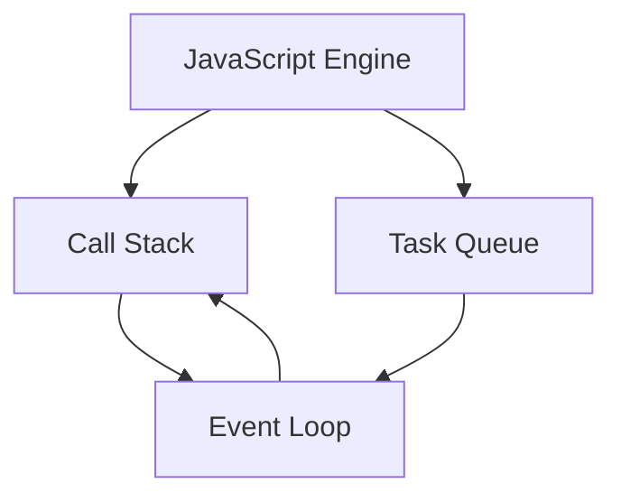
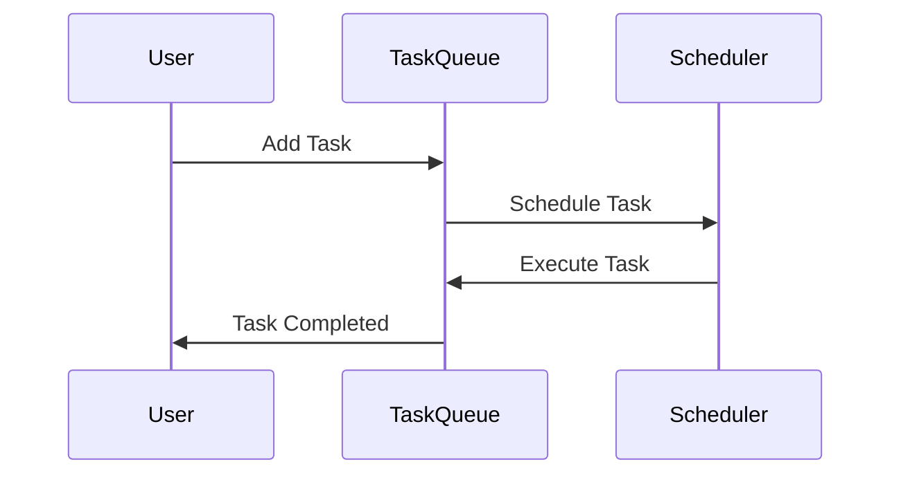

## 8.12 Queues and Schedulers

In modern web development, managing asynchronous tasks efficiently is crucial for creating responsive and performant applications. JavaScript, with its single-threaded nature, relies heavily on asynchronous patterns to handle tasks without blocking the main execution thread. This section delves into the concepts of queues and schedulers, which are essential tools for organizing and managing asynchronous operations in JavaScript.

### Understanding Task Queues in JavaScript

Task queues are fundamental to JavaScript's event-driven architecture. They allow the runtime to manage and execute tasks in a non-blocking manner. Let's explore how task queues work within the JavaScript engine.

#### The Event Loop and Task Queues

The event loop is the core mechanism that enables JavaScript to perform non-blocking I/O operations. It continuously checks the call stack and the task queue, executing tasks from the queue when the stack is empty.



**Diagram Description:** The event loop checks the call stack and task queue, executing tasks from the queue when the stack is empty.

#### Types of Task Queues

1. **Microtask Queue**: Handles tasks that need to be executed immediately after the current operation, such as promise callbacks.
2. **Macrotask Queue**: Manages tasks like `setTimeout`, `setInterval`, and I/O operations, which are executed after the microtasks.

### Implementing Custom Queues for Task Management

Custom queues can be implemented to manage tasks with specific requirements, such as rate limiting or prioritization. Let's create a simple task queue in JavaScript.

#### Basic Task Queue Implementation

```javascript
class TaskQueue {
    constructor() {
        this.queue = [];
        this.isProcessing = false;
    }

    addTask(task) {
        this.queue.push(task);
        this.processQueue();
    }

    async processQueue() {
        if (this.isProcessing) return;
        this.isProcessing = true;

        while (this.queue.length > 0) {
            const task = this.queue.shift();
            try {
                await task();
            } catch (error) {
                console.error('Task failed:', error);
            }
        }

        this.isProcessing = false;
    }
}

// Usage
const queue = new TaskQueue();
queue.addTask(() => new Promise(resolve => setTimeout(() => {
    console.log('Task 1 completed');
    resolve();
}, 1000)));
queue.addTask(() => new Promise(resolve => setTimeout(() => {
    console.log('Task 2 completed');
    resolve();
}, 500)));
```

**Code Explanation:** This implementation uses an array to store tasks and processes them sequentially. The `processQueue` method ensures that tasks are executed one at a time, handling errors gracefully.

#### Enhancing the Queue with Priority

To handle tasks with different priorities, we can modify the queue to sort tasks based on their priority level.

```javascript
class PriorityTaskQueue {
    constructor() {
        this.queue = [];
        this.isProcessing = false;
    }

    addTask(task, priority = 0) {
        this.queue.push({ task, priority });
        this.queue.sort((a, b) => b.priority - a.priority);
        this.processQueue();
    }

    async processQueue() {
        if (this.isProcessing) return;
        this.isProcessing = true;

        while (this.queue.length > 0) {
            const { task } = this.queue.shift();
            try {
                await task();
            } catch (error) {
                console.error('Task failed:', error);
            }
        }

        this.isProcessing = false;
    }
}

// Usage
const priorityQueue = new PriorityTaskQueue();
priorityQueue.addTask(() => new Promise(resolve => setTimeout(() => {
    console.log('High priority task completed');
    resolve();
}, 1000)), 1);
priorityQueue.addTask(() => new Promise(resolve => setTimeout(() => {
    console.log('Low priority task completed');
    resolve();
}, 500)), 0);
```

**Code Explanation:** This enhanced queue sorts tasks by priority, ensuring that higher-priority tasks are executed first.

### Schedulers in JavaScript

Schedulers are responsible for managing the execution timing of tasks. In the context of RxJS, schedulers control when and how tasks are executed within an observable sequence.

#### RxJS Schedulers

RxJS provides several built-in schedulers that can be used to control task execution:

1. **`asyncScheduler`**: Schedules tasks asynchronously, similar to `setTimeout`.
2. **`queueScheduler`**: Executes tasks synchronously in a FIFO order.
3. **`animationFrameScheduler`**: Schedules tasks to run just before the next browser repaint.

#### Using Schedulers in RxJS

Let's see how schedulers can be used in RxJS to manage asynchronous operations.

```javascript
import { of, asyncScheduler } from 'rxjs';
import { observeOn } from 'rxjs/operators';

const source$ = of(1, 2, 3).pipe(
    observeOn(asyncScheduler)
);

console.log('Before subscription');
source$.subscribe(value => console.log('Value:', value));
console.log('After subscription');
```

**Code Explanation:** This example uses the `asyncScheduler` to delay the emission of values, demonstrating how schedulers can control the timing of observable sequences.

### Use Cases for Queues and Schedulers

Queues and schedulers are versatile tools that can be applied in various scenarios:

- **Job Queues**: Manage background tasks, such as sending emails or processing data.
- **Rate Limiting**: Control the rate of API requests to avoid exceeding limits.
- **Task Prioritization**: Ensure critical tasks are executed before less important ones.

### Error Handling and Concurrency Control

When implementing queues and schedulers, it's essential to consider error handling and concurrency control to ensure robust and reliable systems.

#### Error Handling Strategies

- **Try-Catch Blocks**: Use try-catch blocks to handle errors within tasks gracefully.
- **Retry Mechanisms**: Implement retry logic for transient errors, with exponential backoff to avoid overwhelming resources.

#### Concurrency Control

- **Semaphore Pattern**: Limit the number of concurrent tasks to prevent resource exhaustion.
- **Throttling**: Control the rate of task execution to maintain system stability.

### Try It Yourself

Experiment with the provided code examples by modifying task priorities or implementing additional error handling strategies. Consider creating a custom scheduler to manage task execution based on specific requirements.

### Visualizing Task Execution



**Diagram Description:** This sequence diagram illustrates the interaction between a user, a task queue, and a scheduler, highlighting the flow of task execution.

### References and Further Reading

- [MDN Web Docs: Event Loop](https://developer.mozilla.org/en-US/docs/Web/JavaScript/EventLoop)
- [RxJS Documentation: Schedulers](https://rxjs.dev/guide/scheduler)
- [JavaScript.info: Promises, async/await](https://javascript.info/async)

### Knowledge Check

## Mastering JavaScript Queues and Schedulers Quiz



### What is the primary role of the event loop in JavaScript?

- [x] To manage the execution of tasks in a non-blocking manner
- [ ] To execute synchronous code only
- [ ] To handle only I/O operations
- [ ] To manage memory allocation

> **Explanation:** The event loop is responsible for managing the execution of tasks in a non-blocking manner, allowing JavaScript to handle asynchronous operations efficiently.

### Which type of queue handles promise callbacks?

- [x] Microtask Queue
- [ ] Macrotask Queue
- [ ] Event Queue
- [ ] Callback Queue

> **Explanation:** The microtask queue handles promise callbacks and other tasks that need to be executed immediately after the current operation.

### How does the PriorityTaskQueue sort tasks?

- [x] By priority level, with higher priority tasks executed first
- [ ] By the order they were added
- [ ] By task duration
- [ ] Randomly

> **Explanation:** The PriorityTaskQueue sorts tasks by priority level, ensuring that higher priority tasks are executed before lower priority ones.

### Which RxJS scheduler is similar to `setTimeout`?

- [x] asyncScheduler
- [ ] queueScheduler
- [ ] animationFrameScheduler
- [ ] immediateScheduler

> **Explanation:** The `asyncScheduler` in RxJS schedules tasks asynchronously, similar to `setTimeout`.

### What is a common use case for job queues?

- [x] Managing background tasks like sending emails
- [ ] Rendering UI components
- [ ] Handling synchronous operations
- [ ] Managing memory allocation

> **Explanation:** Job queues are commonly used to manage background tasks, such as sending emails or processing data, without blocking the main execution thread.

### What pattern can be used to limit the number of concurrent tasks?

- [x] Semaphore Pattern
- [ ] Observer Pattern
- [ ] Singleton Pattern
- [ ] Factory Pattern

> **Explanation:** The semaphore pattern can be used to limit the number of concurrent tasks, preventing resource exhaustion and maintaining system stability.

### Which strategy is used to control the rate of API requests?

- [x] Rate Limiting
- [ ] Error Handling
- [ ] Task Prioritization
- [ ] Memory Management

> **Explanation:** Rate limiting is used to control the rate of API requests, ensuring that the application does not exceed the allowed limits.

### What is the purpose of retry mechanisms in error handling?

- [x] To handle transient errors by retrying tasks
- [ ] To log errors for debugging
- [ ] To prevent errors from occurring
- [ ] To execute tasks in parallel

> **Explanation:** Retry mechanisms are used to handle transient errors by retrying tasks, often with exponential backoff to avoid overwhelming resources.

### Which scheduler in RxJS is used for tasks that should run before the next browser repaint?

- [x] animationFrameScheduler
- [ ] asyncScheduler
- [ ] queueScheduler
- [ ] immediateScheduler

> **Explanation:** The `animationFrameScheduler` is used for tasks that should run just before the next browser repaint, making it suitable for animations.

### True or False: The event loop executes tasks from the call stack when it is empty.

- [x] True
- [ ] False

> **Explanation:** True. The event loop executes tasks from the task queue when the call stack is empty, ensuring non-blocking execution.



Remember, mastering queues and schedulers in JavaScript is a journey. As you continue to explore and experiment, you'll gain a deeper understanding of how to manage asynchronous tasks efficiently. Keep pushing the boundaries of what's possible, and enjoy the process of learning and growing as a developer!
