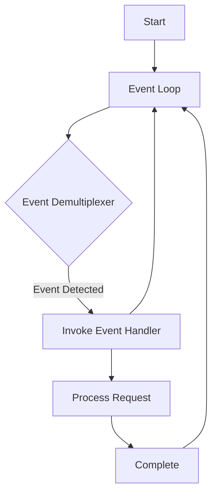

## 8.13 The Reactor Pattern in Node.js

### Introduction

The Reactor Pattern is a foundational concept in the world of asynchronous programming, particularly in environments like Node.js. It is the backbone of Node.js's non-blocking I/O model, enabling applications to handle numerous concurrent connections efficiently. In this section, we will delve into the Reactor Pattern, explore its components, and understand how Node.js implements it using the event loop and callbacks. We will also discuss the role of libuv in abstracting asynchronous I/O operations and provide examples to illustrate how this pattern facilitates high concurrency.

### Understanding the Reactor Pattern

#### Definition and Components

The Reactor Pattern is a design pattern used for handling service requests that are delivered concurrently to an application. It demultiplexes and dispatches these requests to the appropriate handlers. The pattern consists of the following key components:

- **Event Demultiplexer**: This component waits for events to occur on a set of file descriptors. In Node.js, this is managed by the event loop.
- **Event Handlers**: These are callback functions that process the events once they are detected.
- **Synchronous Event De-multiplexing**: The process of waiting for events and dispatching them to the appropriate handlers.
- **Request Handlers**: These handle the actual processing of the requests.

The Reactor Pattern is particularly effective in environments where multiple I/O operations need to be handled simultaneously, such as web servers.

#### How Node.js Implements the Reactor Pattern

Node.js is built on the V8 JavaScript engine and uses the Reactor Pattern to handle asynchronous I/O operations. The core of this implementation is the event loop, which is responsible for managing the execution of asynchronous code.

##### The Event Loop

The event loop is a single-threaded loop that continuously checks for events and executes the corresponding event handlers. It operates in phases, each responsible for a specific type of event, such as timers, I/O callbacks, and idle operations.

```javascript
// Example of a simple event loop in Node.js
setTimeout(() => {
  console.log('Timeout executed');
}, 1000);

console.log('Start');

// Output:
// Start
// Timeout executed
```

In this example, the `setTimeout` function schedules a callback to be executed after 1000 milliseconds. The event loop handles this by placing the callback in the appropriate phase and executing it when the time is right.

##### Callbacks and Non-blocking I/O

Node.js uses callbacks extensively to handle asynchronous operations. When an I/O operation is initiated, a callback function is passed, which is invoked once the operation is complete. This non-blocking approach allows Node.js to handle multiple operations concurrently without waiting for each to finish before starting the next.

```javascript
const fs = require('fs');

// Asynchronous file read
fs.readFile('example.txt', 'utf8', (err, data) => {
  if (err) {
    console.error(err);
    return;
  }
  console.log(data);
});

console.log('Reading file...');

// Output:
// Reading file...
// (Contents of example.txt)
```

In this example, the `fs.readFile` function reads a file asynchronously. The event loop continues to execute other code while waiting for the file read operation to complete, demonstrating the non-blocking nature of Node.js.

### The Role of libuv

libuv is a multi-platform support library that provides Node.js with asynchronous I/O capabilities. It abstracts the underlying operating system's asynchronous I/O operations, allowing Node.js to perform non-blocking I/O across different platforms.

#### Key Features of libuv

- **Cross-platform Compatibility**: libuv provides a consistent API for asynchronous I/O operations across different operating systems.
- **Thread Pool**: For operations that cannot be performed asynchronously by the operating system, libuv uses a thread pool to execute them in the background.
- **Event Loop Implementation**: libuv implements the event loop, which is central to Node.js's asynchronous I/O model.

#### How libuv Works

libuv operates by maintaining a queue of events and a pool of threads. When an I/O operation is initiated, libuv checks if it can be performed asynchronously by the operating system. If not, it delegates the task to a thread in the pool. Once the operation is complete, the result is added to the event queue, and the event loop processes it by invoking the appropriate callback.

### Benefits of the Reactor Pattern in Node.js

The Reactor Pattern offers several benefits, particularly in the context of Node.js:

- **High Concurrency**: By using non-blocking I/O, Node.js can handle thousands of concurrent connections with minimal overhead.
- **Efficient Resource Utilization**: The single-threaded nature of the event loop reduces the need for context switching, leading to more efficient CPU usage.
- **Scalability**: Applications built with Node.js can scale horizontally by adding more instances, each capable of handling numerous connections.

### Challenges and Considerations

While the Reactor Pattern provides significant advantages, it also presents some challenges:

- **Complexity in Error Handling**: Asynchronous code can be more challenging to debug and manage, particularly when dealing with errors.
- **Callback Hell**: Extensive use of callbacks can lead to deeply nested code, making it difficult to read and maintain. This can be mitigated using Promises and async/await.
- **Single-threaded Limitations**: While the event loop is efficient, CPU-bound tasks can block it, leading to performance bottlenecks. This can be addressed by offloading such tasks to worker threads or using external services.

### Code Example: High Concurrency with the Reactor Pattern

Let's explore a practical example demonstrating how the Reactor Pattern enables high concurrency in a Node.js application.

```javascript
const http = require('http');

// Create an HTTP server
const server = http.createServer((req, res) => {
  // Simulate a long-running operation
  setTimeout(() => {
    res.writeHead(200, { 'Content-Type': 'text/plain' });
    res.end('Hello, World!\n');
  }, 2000);
});

// Listen on port 3000
server.listen(3000, () => {
  console.log('Server running at http://localhost:3000/');
});
```

In this example, we create an HTTP server that responds to requests with a delay of 2 seconds. Despite the delay, the server can handle multiple requests concurrently, thanks to the non-blocking nature of the event loop.

### Visualizing the Reactor Pattern

To better understand the Reactor Pattern, let's visualize the interaction between the event loop, event demultiplexer, and event handlers.



**Diagram Description**: This diagram illustrates the flow of the Reactor Pattern in Node.js. The event loop continuously checks for events using the event demultiplexer. When an event is detected, the corresponding event handler is invoked to process the request.

### Try It Yourself

To deepen your understanding of the Reactor Pattern, try modifying the code examples provided:

- **Experiment with Different Delays**: Change the delay in the HTTP server example to see how it affects concurrency.
- **Add More Event Handlers**: Introduce additional asynchronous operations, such as file reads or database queries, to observe how the event loop manages them.
- **Implement Error Handling**: Enhance the examples with error handling mechanisms to manage potential issues gracefully.

### Summary

The Reactor Pattern is a powerful design pattern that underlies Node.js's non-blocking I/O model. By leveraging the event loop and callbacks, Node.js can handle numerous concurrent connections efficiently. While this model offers significant benefits in terms of concurrency and resource utilization, it also presents challenges that developers must address. Understanding the Reactor Pattern and its implementation in Node.js is crucial for building scalable and performant applications.

### Further Reading

For more information on the Reactor Pattern and Node.js, consider exploring the following resources:

- [Node.js Documentation](https://nodejs.org/en/docs/)
- [libuv Documentation](https://libuv.org/)
- [MDN Web Docs on Asynchronous JavaScript](https://developer.mozilla.org/en-US/docs/Learn/JavaScript/Asynchronous)

### Knowledge Check

To reinforce your understanding of the Reactor Pattern in Node.js, try answering the following questions:

## Mastering the Reactor Pattern in Node.js



### What is the primary role of the Reactor Pattern in Node.js?

- [x] To handle concurrent service requests efficiently
- [ ] To manage synchronous operations
- [ ] To simplify error handling
- [ ] To enhance security

> **Explanation:** The Reactor Pattern is designed to handle concurrent service requests efficiently by using non-blocking I/O.

### Which component of the Reactor Pattern waits for events to occur?

- [ ] Event Handler
- [x] Event Demultiplexer
- [ ] Request Handler
- [ ] Callback Function

> **Explanation:** The Event Demultiplexer is responsible for waiting for events to occur and dispatching them to the appropriate handlers.

### What library does Node.js use to abstract asynchronous I/O operations?

- [ ] V8
- [x] libuv
- [ ] Express
- [ ] Babel

> **Explanation:** Node.js uses libuv to abstract asynchronous I/O operations, providing a consistent API across different platforms.

### How does Node.js handle asynchronous operations?

- [ ] By using synchronous functions
- [x] By using callbacks
- [ ] By using blocking I/O
- [ ] By using threads

> **Explanation:** Node.js handles asynchronous operations by using callbacks, allowing the event loop to continue executing other code.

### What is a potential challenge of using the Reactor Pattern in Node.js?

- [x] Callback Hell
- [ ] High memory usage
- [ ] Slow performance
- [ ] Limited scalability

> **Explanation:** Callback Hell is a potential challenge of using the Reactor Pattern, as extensive use of callbacks can lead to deeply nested code.

### What is the role of the event loop in Node.js?

- [x] To manage the execution of asynchronous code
- [ ] To handle synchronous operations
- [ ] To provide a user interface
- [ ] To compile JavaScript code

> **Explanation:** The event loop in Node.js manages the execution of asynchronous code by continuously checking for events and executing the corresponding handlers.

### Which of the following is a benefit of the Reactor Pattern?

- [x] High concurrency
- [ ] Simplified code structure
- [ ] Reduced error rates
- [ ] Improved security

> **Explanation:** The Reactor Pattern enables high concurrency by allowing Node.js to handle numerous connections simultaneously.

### What is the purpose of libuv's thread pool?

- [ ] To execute synchronous operations
- [x] To execute operations that cannot be performed asynchronously by the OS
- [ ] To manage user sessions
- [ ] To compile JavaScript code

> **Explanation:** libuv's thread pool is used to execute operations that cannot be performed asynchronously by the operating system.

### How can developers mitigate the issue of Callback Hell?

- [x] By using Promises and async/await
- [ ] By using more callbacks
- [ ] By avoiding asynchronous operations
- [ ] By using synchronous functions

> **Explanation:** Developers can mitigate Callback Hell by using Promises and async/await, which provide a more readable and maintainable way to handle asynchronous operations.

### True or False: The Reactor Pattern is only applicable to Node.js.

- [ ] True
- [x] False

> **Explanation:** False. The Reactor Pattern is a general design pattern used in various environments for handling concurrent service requests, not just in Node.js.



Remember, mastering the Reactor Pattern is just the beginning. As you continue your journey in Node.js development, you'll encounter more complex patterns and techniques. Keep experimenting, stay curious, and enjoy the process of building efficient and scalable applications!
