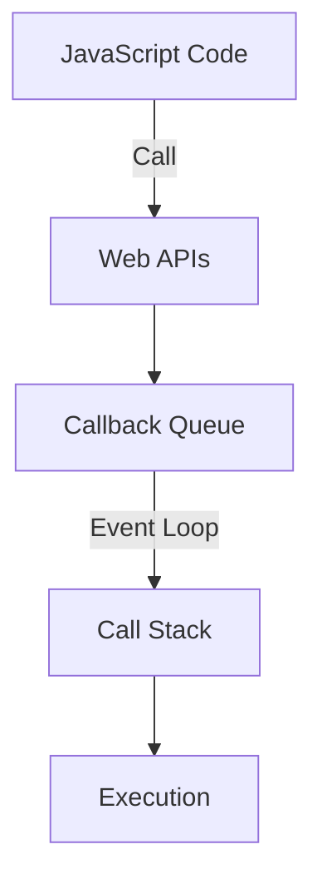

## 8.14 Avoiding Race Conditions and Deadlocks

Concurrency in JavaScript, despite its single-threaded nature, can lead to complex issues such as race conditions and deadlocks, especially when dealing with asynchronous operations. Understanding these problems and learning how to prevent them is crucial for writing robust, efficient, and error-free JavaScript code. In this section, we will explore these concepts in depth, provide examples, and discuss strategies to avoid them.

### Understanding Race Conditions

**Race conditions** occur when two or more operations must execute in the correct order, but the program does not enforce this order. This can lead to unpredictable behavior and bugs that are difficult to reproduce and fix.

#### Example of a Race Condition

Consider a scenario where two asynchronous functions attempt to update the same resource:

```javascript
let counter = 0;

// Function to increment the counter
function incrementCounter() {
  return new Promise((resolve) => {
    setTimeout(() => {
      counter += 1;
      resolve(counter);
    }, Math.random() * 1000);
  });
}

// Function to decrement the counter
function decrementCounter() {
  return new Promise((resolve) => {
    setTimeout(() => {
      counter -= 1;
      resolve(counter);
    }, Math.random() * 1000);
  });
}

// Simulate concurrent operations
Promise.all([incrementCounter(), decrementCounter()]).then((results) => {
  console.log(`Final counter value: ${counter}`);
});
```

In this example, the final value of `counter` is unpredictable because the increment and decrement operations can complete in any order.

### Techniques to Avoid Race Conditions

1. **Proper Sequencing**: Ensure that operations are executed in the correct order by using promises or async/await.

   ```javascript
   async function updateCounter() {
     await incrementCounter();
     await decrementCounter();
     console.log(`Final counter value: ${counter}`);
   }

   updateCounter();
   ```

2. **Atomic Operations**: Use atomic operations to ensure that a variable is updated correctly without interference from other operations.

3. **Locks and Semaphores**: Implement locks or semaphores to control access to shared resources. While JavaScript does not natively support these constructs, libraries such as `async-mutex` can be used.

4. **Avoid Shared State**: Minimize shared state between asynchronous operations to reduce the risk of race conditions.

### Understanding Deadlocks

**Deadlocks** occur when two or more operations are waiting for each other to complete, causing a standstill where none of the operations can proceed.

#### Example of a Deadlock

Deadlocks are less common in JavaScript due to its single-threaded nature, but they can occur in systems that involve multiple asynchronous operations waiting for each other:

```javascript
let lockA = false;
let lockB = false;

async function task1() {
  while (lockA) await new Promise(resolve => setTimeout(resolve, 100));
  lockA = true;
  console.log('Task 1 acquired lock A');

  while (lockB) await new Promise(resolve => setTimeout(resolve, 100));
  lockB = true;
  console.log('Task 1 acquired lock B');

  // Perform task
  console.log('Task 1 is performing its operation');

  lockB = false;
  lockA = false;
}

async function task2() {
  while (lockB) await new Promise(resolve => setTimeout(resolve, 100));
  lockB = true;
  console.log('Task 2 acquired lock B');

  while (lockA) await new Promise(resolve => setTimeout(resolve, 100));
  lockA = true;
  console.log('Task 2 acquired lock A');

  // Perform task
  console.log('Task 2 is performing its operation');

  lockA = false;
  lockB = false;
}

task1();
task2();
```

In this example, `task1` and `task2` can end up waiting indefinitely if they acquire locks in a conflicting order.

### Techniques to Avoid Deadlocks

1. **Lock Ordering**: Always acquire locks in a consistent order to prevent circular wait conditions.

2. **Timeouts**: Implement timeouts for lock acquisition to break potential deadlocks.

3. **Deadlock Detection**: Use algorithms to detect and resolve deadlocks dynamically.

4. **Avoid Nested Locks**: Minimize the use of nested locks to reduce the complexity of lock management.

### JavaScript's Single-Threaded Nature and Concurrency

JavaScript is inherently single-threaded, meaning it executes one task at a time. However, it can handle asynchronous operations through the event loop, which allows it to manage multiple tasks seemingly concurrently. This is where race conditions and deadlocks can manifest, especially when dealing with asynchronous code.

#### The Event Loop

The event loop is a fundamental concept in JavaScript's concurrency model. It allows JavaScript to perform non-blocking I/O operations by offloading tasks to the system's kernel whenever possible.



*Diagram: The Event Loop in JavaScript*

### Best Practices for Writing Safe Concurrent Code

1. **Use Promises and Async/Await**: These constructs help manage asynchronous operations more predictably.

2. **Avoid Global State**: Limit the use of global variables to reduce the risk of race conditions.

3. **Use Libraries**: Utilize libraries that provide concurrency control mechanisms, such as `async-mutex` for locks.

4. **Test Thoroughly**: Write tests that simulate concurrent operations to identify potential race conditions and deadlocks.

5. **Monitor Performance**: Use tools to monitor the performance of your application and identify bottlenecks caused by concurrency issues.

### Try It Yourself

Experiment with the code examples provided. Try modifying the delay times in the race condition example to see how it affects the final counter value. Implement a timeout mechanism in the deadlock example to resolve the deadlock condition.

### Knowledge Check

- What is a race condition, and how can it affect your JavaScript code?
- How does the event loop help manage asynchronous operations in JavaScript?
- What are some techniques to avoid deadlocks in JavaScript?
- Why is it important to avoid shared state in asynchronous operations?

### Summary

Race conditions and deadlocks are common concurrency problems that can occur in JavaScript, especially when dealing with asynchronous code. By understanding these issues and implementing strategies to prevent them, you can write more robust and reliable JavaScript applications. Remember, this is just the beginning. As you progress, you'll build more complex and interactive web applications. Keep experimenting, stay curious, and enjoy the journey!

## Quiz: Mastering Race Conditions and Deadlocks in JavaScript



### What is a race condition in JavaScript?

- [x] A situation where the outcome depends on the sequence or timing of uncontrollable events.
- [ ] A situation where two threads are waiting for each other to release resources.
- [ ] A method to optimize asynchronous operations.
- [ ] A technique to improve code readability.

> **Explanation:** A race condition occurs when the behavior of software depends on the relative timing of events such as the order of execution of threads.

### How can you avoid race conditions in JavaScript?

- [x] By using promises and async/await to control the sequence of operations.
- [ ] By using global variables to store shared state.
- [ ] By avoiding the use of asynchronous operations.
- [ ] By using `eval` to execute code dynamically.

> **Explanation:** Promises and async/await help ensure that operations are executed in the correct order, reducing the risk of race conditions.

### What is a deadlock?

- [x] A situation where two or more operations are waiting indefinitely for each other to release resources.
- [ ] A method to optimize code execution.
- [ ] A technique to improve code readability.
- [ ] A situation where operations are executed in parallel without issues.

> **Explanation:** A deadlock occurs when two or more operations are waiting for each other to release resources, causing a standstill.

### Which of the following is a technique to avoid deadlocks?

- [x] Lock ordering.
- [ ] Using global variables.
- [ ] Avoiding asynchronous operations.
- [ ] Using `eval` to execute code dynamically.

> **Explanation:** Lock ordering ensures that locks are acquired in a consistent order, preventing circular wait conditions that lead to deadlocks.

### What is the role of the event loop in JavaScript?

- [x] It manages asynchronous operations by offloading tasks to the system's kernel.
- [ ] It executes synchronous code in parallel.
- [ ] It prevents race conditions by executing code in a specific order.
- [ ] It optimizes code execution by using multiple threads.

> **Explanation:** The event loop allows JavaScript to perform non-blocking I/O operations by managing asynchronous tasks.

### How can you simulate concurrent operations in JavaScript?

- [x] By using promises and async/await.
- [ ] By using global variables.
- [ ] By avoiding asynchronous operations.
- [ ] By using `eval` to execute code dynamically.

> **Explanation:** Promises and async/await allow you to manage asynchronous operations, simulating concurrency in JavaScript.

### Why is it important to avoid shared state in asynchronous operations?

- [x] To reduce the risk of race conditions.
- [ ] To improve code readability.
- [ ] To optimize code execution.
- [ ] To ensure that operations are executed in parallel.

> **Explanation:** Avoiding shared state minimizes the risk of race conditions, as operations do not interfere with each other's data.

### What is an atomic operation?

- [x] An operation that completes in a single step without interference from other operations.
- [ ] An operation that requires multiple steps to complete.
- [ ] A method to optimize asynchronous operations.
- [ ] A technique to improve code readability.

> **Explanation:** An atomic operation is one that completes in a single step, ensuring that it is not interrupted by other operations.

### Which library can be used for concurrency control in JavaScript?

- [x] async-mutex
- [ ] lodash
- [ ] jQuery
- [ ] underscore

> **Explanation:** The `async-mutex` library provides concurrency control mechanisms such as locks for JavaScript.

### True or False: JavaScript is inherently multi-threaded.

- [ ] True
- [x] False

> **Explanation:** JavaScript is inherently single-threaded, but it can handle asynchronous operations through the event loop.


