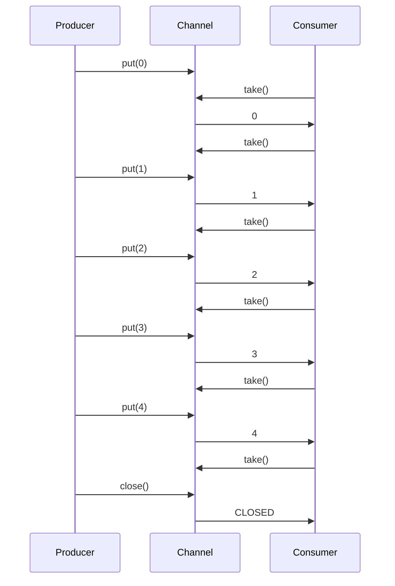

## 8.15 The CSP Model with js-csp

### Introduction to CSP and js-csp

Communicating Sequential Processes (CSP) is a formal language for describing patterns of interaction in concurrent systems. Developed by Tony Hoare in 1978, CSP provides a framework for modeling complex systems where multiple processes operate independently but communicate through message-passing. In JavaScript, the [js-csp](https://github.com/ubolonton/js-csp) library brings CSP concepts to life, allowing developers to manage asynchronous flows using channels and coroutines.

### Understanding CSP Concepts

#### Channels

Channels are the primary means of communication between processes in CSP. They act as conduits through which data is passed between different parts of a program. In js-csp, channels can be thought of as queues that can be used to send and receive messages asynchronously.

#### Coroutines

Coroutines are functions that can pause execution to yield control back to the caller, allowing other coroutines to run. This cooperative multitasking is central to CSP, enabling efficient management of concurrent operations without the complexity of traditional threading models.

### Benefits of CSP in JavaScript

- **Simplified Concurrency**: CSP abstracts the complexity of managing concurrent operations, making it easier to reason about asynchronous code.
- **Decoupled Components**: By using channels, CSP promotes loose coupling between components, enhancing modularity and maintainability.
- **Natural Flow Control**: CSP's use of coroutines and channels provides a natural way to model producer-consumer problems, pipelines, and other concurrency patterns.

### Using js-csp for Asynchronous Flows

Let's explore how js-csp can be used to manage asynchronous flows in JavaScript. We'll start with a simple example that demonstrates the basic usage of channels and coroutines.

#### Example: Basic Channel Communication

```javascript
const csp = require('js-csp');

function* producer(channel) {
  for (let i = 0; i < 5; i++) {
    yield csp.put(channel, i);
    console.log(`Produced: ${i}`);
  }
  channel.close();
}

function* consumer(channel) {
  while (true) {
    const value = yield csp.take(channel);
    if (value === csp.CLOSED) break;
    console.log(`Consumed: ${value}`);
  }
}

const channel = csp.chan();
csp.go(producer, [channel]);
csp.go(consumer, [channel]);
```

**Explanation**: In this example, we create a producer coroutine that sends numbers to a channel and a consumer coroutine that receives numbers from the channel. The `csp.put` and `csp.take` functions are used to send and receive messages, respectively.

### Visualizing CSP with js-csp

To better understand how CSP works, let's visualize the interaction between the producer and consumer using a sequence diagram.



**Diagram Explanation**: This sequence diagram illustrates the flow of data between the producer and consumer through the channel. The producer sends data to the channel, and the consumer retrieves it, demonstrating the decoupled nature of CSP.

### Advanced CSP Patterns with js-csp

#### Producer-Consumer Problem

The producer-consumer problem is a classic example of a concurrency pattern that can be elegantly solved using CSP. Let's see how js-csp can be used to implement this pattern.

```javascript
const csp = require('js-csp');

function* producer(channel) {
  for (let i = 0; i < 10; i++) {
    yield csp.put(channel, i);
    console.log(`Produced: ${i}`);
  }
  channel.close();
}

function* consumer(channel) {
  while (true) {
    const value = yield csp.take(channel);
    if (value === csp.CLOSED) break;
    console.log(`Consumed: ${value}`);
  }
}

const channel = csp.chan();
csp.go(producer, [channel]);
csp.go(consumer, [channel]);
```

**Explanation**: This example extends the basic channel communication to a producer-consumer pattern, where the producer generates data and the consumer processes it. The channel acts as a buffer, decoupling the producer and consumer.

#### Pipeline Pattern

The pipeline pattern is another powerful concurrency pattern that can be implemented using CSP. It involves a series of processing stages, each of which performs a specific transformation on the data.

```javascript
const csp = require('js-csp');

function* stage1(input, output) {
  while (true) {
    const value = yield csp.take(input);
    if (value === csp.CLOSED) break;
    yield csp.put(output, value * 2);
  }
  output.close();
}

function* stage2(input, output) {
  while (true) {
    const value = yield csp.take(input);
    if (value === csp.CLOSED) break;
    yield csp.put(output, value + 1);
  }
  output.close();
}

function* finalStage(input) {
  while (true) {
    const value = yield csp.take(input);
    if (value === csp.CLOSED) break;
    console.log(`Final output: ${value}`);
  }
}

const chan1 = csp.chan();
const chan2 = csp.chan();
const chan3 = csp.chan();

csp.go(stage1, [chan1, chan2]);
csp.go(stage2, [chan2, chan3]);
csp.go(finalStage, [chan3]);

for (let i = 0; i < 5; i++) {
  csp.putAsync(chan1, i);
}
chan1.close();
```

**Explanation**: In this example, we create a pipeline with two stages. The first stage doubles the input values, and the second stage adds one to the result. The final stage prints the output. Each stage communicates with the next through channels, allowing for concurrent processing.

### Alternatives and Influences

The CSP model has influenced many modern concurrency frameworks, including Go's goroutines. Goroutines are lightweight threads managed by the Go runtime, and they communicate through channels, similar to CSP. While js-csp brings these concepts to JavaScript, developers can also explore other alternatives like [async/await](https://developer.mozilla.org/en-US/docs/Web/JavaScript/Reference/Statements/async_function) and [RxJS](https://rxjs.dev/).

### Use Cases for CSP

- **Producer-Consumer Problems**: CSP provides a natural way to model producer-consumer problems, where multiple producers and consumers operate concurrently.
- **Pipelines**: CSP's channel-based communication is ideal for building data processing pipelines, where data flows through a series of transformations.
- **Coordination of Complex Workflows**: CSP can be used to coordinate complex workflows involving multiple asynchronous operations.

### Design Considerations

- **Channel Capacity**: When designing CSP systems, consider the capacity of channels. A bounded channel can prevent memory exhaustion but may require additional logic to handle full channels.
- **Error Handling**: Implement robust error handling to manage exceptions that may occur during coroutine execution.
- **Performance**: While CSP simplifies concurrency, it may introduce overhead compared to lower-level concurrency primitives. Profile and optimize as needed.

### JavaScript Unique Features

JavaScript's event-driven nature and single-threaded execution model make CSP a compelling choice for managing concurrency. The js-csp library leverages JavaScript's strengths, providing a powerful abstraction for asynchronous programming.

### Try It Yourself

Experiment with the examples provided by modifying the channel capacities, adding more stages to the pipeline, or introducing error handling. This hands-on approach will deepen your understanding of CSP and its applications in JavaScript.

### Knowledge Check

1. **What is the primary purpose of channels in CSP?**
   - Channels facilitate communication between concurrent processes.

2. **How do coroutines differ from traditional threads?**
   - Coroutines allow cooperative multitasking, yielding control back to the caller.

3. **What is a common use case for CSP in JavaScript?**
   - CSP is commonly used for implementing producer-consumer patterns.

4. **How does js-csp implement CSP concepts in JavaScript?**
   - js-csp uses channels and coroutines to manage asynchronous flows.

5. **What is an alternative to CSP for managing concurrency in JavaScript?**
   - Async/await and RxJS are alternatives for managing concurrency.

### Summary

The CSP model, implemented in JavaScript through the js-csp library, offers a powerful abstraction for managing concurrency. By using channels and coroutines, developers can simplify the coordination of complex asynchronous operations, making their code more modular and maintainable. As you explore CSP, remember to experiment with different patterns and configurations to fully grasp its potential.

## CSP Model with js-csp Quiz



### What is the primary purpose of channels in CSP?

- [x] To facilitate communication between concurrent processes
- [ ] To store data persistently
- [ ] To manage memory allocation
- [ ] To execute functions asynchronously

> **Explanation:** Channels in CSP are used to pass messages between concurrent processes, enabling communication and synchronization.

### How do coroutines differ from traditional threads?

- [x] Coroutines allow cooperative multitasking
- [ ] Coroutines run in parallel on multiple cores
- [ ] Coroutines are managed by the operating system
- [ ] Coroutines require explicit locking mechanisms

> **Explanation:** Coroutines yield control back to the caller, allowing other coroutines to run, unlike traditional threads which may run concurrently.

### What is a common use case for CSP in JavaScript?

- [x] Implementing producer-consumer patterns
- [ ] Managing file system operations
- [ ] Rendering graphics
- [ ] Handling synchronous code execution

> **Explanation:** CSP is well-suited for scenarios where multiple producers and consumers need to operate concurrently.

### How does js-csp implement CSP concepts in JavaScript?

- [x] Using channels and coroutines
- [ ] By creating new threads
- [ ] Through synchronous function calls
- [ ] By using global variables

> **Explanation:** js-csp uses channels for communication and coroutines for managing asynchronous flows.

### What is an alternative to CSP for managing concurrency in JavaScript?

- [x] Async/await
- [ ] Global variables
- [ ] Synchronous loops
- [ ] DOM manipulation

> **Explanation:** Async/await is a modern JavaScript feature for managing asynchronous code, offering an alternative to CSP.

### Which of the following is a benefit of using CSP?

- [x] Simplified concurrency management
- [ ] Increased memory usage
- [ ] Complex error handling
- [ ] Tight coupling between components

> **Explanation:** CSP abstracts concurrency complexities, making it easier to manage asynchronous operations.

### What is a key feature of js-csp channels?

- [x] They can be used to send and receive messages asynchronously
- [ ] They store data permanently
- [ ] They execute functions in parallel
- [ ] They require manual memory management

> **Explanation:** js-csp channels facilitate asynchronous message passing between coroutines.

### How does CSP promote decoupling in code?

- [x] By using channels for communication
- [ ] By sharing global variables
- [ ] By using synchronous function calls
- [ ] By relying on external libraries

> **Explanation:** Channels in CSP allow different parts of a program to communicate without being tightly coupled.

### What is a potential drawback of using CSP?

- [x] It may introduce overhead compared to lower-level concurrency primitives
- [ ] It requires complex locking mechanisms
- [ ] It is incompatible with JavaScript
- [ ] It cannot handle asynchronous operations

> **Explanation:** While CSP simplifies concurrency, it may add some overhead compared to more primitive concurrency techniques.

### True or False: CSP is only applicable to JavaScript.

- [ ] True
- [x] False

> **Explanation:** CSP is a concurrency model that can be applied to various programming languages, not just JavaScript.



Remember, this is just the beginning. As you progress, you'll build more complex and interactive web applications using CSP. Keep experimenting, stay curious, and enjoy the journey!
