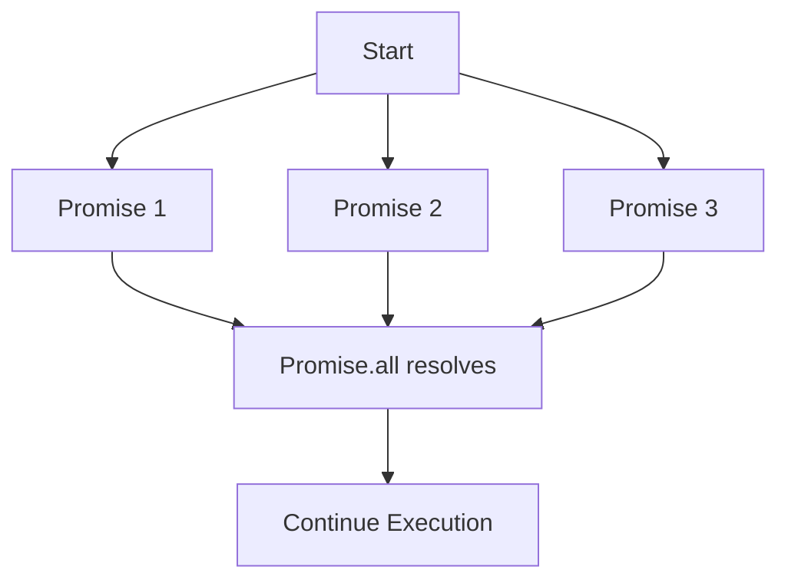

## 8.16 Task Parallelism and Promise.all

In the realm of JavaScript, task parallelism is a powerful concept that allows developers to execute multiple operations concurrently. This is particularly important in modern web development, where applications often need to handle multiple asynchronous tasks simultaneously, such as fetching data from APIs, processing user inputs, and updating the UI. In this section, we will delve into the concept of task parallelism, explore how `Promise.all` can be used to run promises in parallel, and discuss strategies for error handling and performance optimization. We will also touch upon the limitations of JavaScript's single-threaded nature and how web workers can be leveraged for true parallelism.

### Understanding Task Parallelism in JavaScript

Task parallelism refers to the ability to execute multiple tasks at the same time. In JavaScript, this is achieved through asynchronous programming, which allows the execution of code to continue without waiting for long-running operations to complete. This is crucial for maintaining a responsive user interface and improving the overall performance of web applications.

JavaScript's event-driven architecture, powered by the event loop, enables asynchronous operations. However, JavaScript is inherently single-threaded, meaning it can only execute one piece of code at a time. Despite this limitation, JavaScript can simulate parallelism by offloading tasks to the browser's APIs, such as `setTimeout`, `fetch`, and `XMLHttpRequest`, which run in the background and notify the main thread when they are complete.

### The Role of Promises in Asynchronous Programming

Promises are a fundamental building block for handling asynchronous operations in JavaScript. They represent a value that may be available now, or in the future, or never. A promise can be in one of three states: pending, fulfilled, or rejected. Promises provide a cleaner and more manageable way to handle asynchronous operations compared to traditional callback-based approaches.

Here's a simple example of a promise:

```javascript
const myPromise = new Promise((resolve, reject) => {
  setTimeout(() => {
    resolve('Promise resolved!');
  }, 1000);
});

myPromise.then((message) => {
  console.log(message); // Output: Promise resolved!
});
```

### Introducing `Promise.all`

`Promise.all` is a powerful method that allows you to run multiple promises in parallel and wait for all of them to resolve. It takes an iterable of promises as input and returns a single promise that resolves when all of the input promises have resolved, or rejects if any of the input promises reject.

#### Syntax

```javascript
Promise.all(iterable);
```

- **iterable**: An iterable object, such as an array, containing promises.

#### Example: Running Promises in Parallel

Let's consider a scenario where we need to fetch data from multiple APIs concurrently. Using `Promise.all`, we can execute these fetch operations in parallel and wait for all of them to complete before proceeding.

```javascript
const fetchDataFromAPI1 = fetch('https://api.example.com/data1');
const fetchDataFromAPI2 = fetch('https://api.example.com/data2');
const fetchDataFromAPI3 = fetch('https://api.example.com/data3');

Promise.all([fetchDataFromAPI1, fetchDataFromAPI2, fetchDataFromAPI3])
  .then((responses) => {
    return Promise.all(responses.map(response => response.json()));
  })
  .then((data) => {
    console.log('Data from API 1:', data[0]);
    console.log('Data from API 2:', data[1]);
    console.log('Data from API 3:', data[2]);
  })
  .catch((error) => {
    console.error('Error fetching data:', error);
  });
```

In this example, `fetchDataFromAPI1`, `fetchDataFromAPI2`, and `fetchDataFromAPI3` are executed concurrently. `Promise.all` waits for all fetch operations to complete and then processes the responses.

### Error Handling with `Promise.all`

One important consideration when using `Promise.all` is error handling. If any of the promises in the iterable reject, `Promise.all` immediately rejects with the reason of the first promise that rejected. This means that even if some promises have resolved successfully, their results will be ignored if any promise fails.

#### Example: Handling Errors

```javascript
const promise1 = Promise.resolve('Success 1');
const promise2 = Promise.reject('Error occurred');
const promise3 = Promise.resolve('Success 3');

Promise.all([promise1, promise2, promise3])
  .then((results) => {
    console.log('All promises resolved:', results);
  })
  .catch((error) => {
    console.error('One or more promises rejected:', error);
  });
```

In this example, `promise2` rejects, causing the entire `Promise.all` to reject. The error is caught in the `catch` block.

### Performance Optimization with `Promise.all`

Using `Promise.all` can significantly improve the performance of your application by reducing the total time required to complete multiple asynchronous operations. Instead of waiting for each operation to complete sequentially, `Promise.all` allows them to run concurrently, making efficient use of available resources.

#### Example: Sequential vs. Parallel Execution

Consider the following example, where we compare sequential and parallel execution of promises:

```javascript
// Sequential execution
async function fetchSequentially() {
  const data1 = await fetch('https://api.example.com/data1').then(res => res.json());
  const data2 = await fetch('https://api.example.com/data2').then(res => res.json());
  const data3 = await fetch('https://api.example.com/data3').then(res => res.json());
  console.log('Sequential data:', data1, data2, data3);
}

// Parallel execution
async function fetchInParallel() {
  const [data1, data2, data3] = await Promise.all([
    fetch('https://api.example.com/data1').then(res => res.json()),
    fetch('https://api.example.com/data2').then(res => res.json()),
    fetch('https://api.example.com/data3').then(res => res.json())
  ]);
  console.log('Parallel data:', data1, data2, data3);
}

fetchSequentially();
fetchInParallel();
```

In the sequential execution, each fetch operation waits for the previous one to complete, resulting in longer total execution time. In contrast, the parallel execution with `Promise.all` runs all fetch operations concurrently, reducing the overall time required.

### Limitations of JavaScript's Single-Threaded Nature

While `Promise.all` allows for concurrent execution of asynchronous tasks, it's important to understand that JavaScript is single-threaded. This means that true parallelism, where multiple tasks are executed simultaneously on different CPU cores, is not possible within the main JavaScript thread.

#### Leveraging Web Workers for True Parallelism

To achieve true parallelism, you can use web workers, which allow you to run scripts in background threads. Web workers enable you to perform heavy computations without blocking the main thread, improving the responsiveness of your application.

Here's a simple example of using a web worker:

**main.js**

```javascript
const worker = new Worker('worker.js');

worker.onmessage = function(event) {
  console.log('Message from worker:', event.data);
};

worker.postMessage('Start computation');
```

**worker.js**

```javascript
onmessage = function(event) {
  console.log('Message from main script:', event.data);
  // Perform heavy computation
  const result = performHeavyComputation();
  postMessage(result);
};

function performHeavyComputation() {
  // Simulate a heavy computation task
  let sum = 0;
  for (let i = 0; i < 1e9; i++) {
    sum += i;
  }
  return sum;
}
```

In this example, the main script creates a web worker and sends a message to it. The worker performs a heavy computation and sends the result back to the main script. This allows the main thread to remain responsive while the computation is performed in the background.

### Considerations for Using `Promise.all`

When using `Promise.all`, keep the following considerations in mind:

- **Error Handling**: Be aware that if any promise rejects, `Promise.all` will reject immediately. Consider using `Promise.allSettled` if you need to handle both resolved and rejected promises.
- **Resource Management**: Running too many promises in parallel can lead to resource exhaustion. Be mindful of the number of concurrent operations and consider using throttling or batching techniques.
- **Performance**: While `Promise.all` can improve performance by running tasks concurrently, it may not always be the best choice. Evaluate the specific requirements of your application and test different approaches to find the optimal solution.

### Conclusion

Task parallelism is a crucial aspect of modern web development, enabling applications to handle multiple asynchronous operations efficiently. By leveraging `Promise.all`, you can execute promises in parallel, improving the performance and responsiveness of your application. However, it's important to be mindful of error handling, resource management, and the limitations of JavaScript's single-threaded nature. For true parallelism, consider using web workers to offload heavy computations to background threads.

Remember, mastering task parallelism and `Promise.all` is just the beginning. As you continue to explore asynchronous patterns and concurrency in JavaScript, you'll unlock new possibilities for building powerful and responsive web applications. Keep experimenting, stay curious, and enjoy the journey!

### Try It Yourself

Experiment with the code examples provided in this section. Try modifying the URLs in the fetch examples to see how `Promise.all` handles different scenarios. You can also explore creating your own web worker to perform a custom computation task.

### Visualizing Task Parallelism with `Promise.all`

Below is a diagram illustrating how `Promise.all` manages multiple promises concurrently:



This diagram shows that `Promise.all` waits for all promises to resolve before continuing execution.

### Knowledge Check

## Mastering Task Parallelism and Promise.all: Quiz



### What is task parallelism in JavaScript?

- [x] The ability to execute multiple tasks concurrently.
- [ ] The ability to execute tasks sequentially.
- [ ] The ability to execute tasks in a single thread.
- [ ] The ability to execute tasks in multiple threads.

> **Explanation:** Task parallelism refers to executing multiple tasks concurrently, which is crucial for handling asynchronous operations in JavaScript.

### What does `Promise.all` do?

- [x] Runs multiple promises in parallel and waits for all to resolve.
- [ ] Runs multiple promises sequentially.
- [ ] Runs a single promise multiple times.
- [ ] Runs promises in a single thread.

> **Explanation:** `Promise.all` takes an iterable of promises and runs them in parallel, resolving when all promises have resolved.

### What happens if one promise in `Promise.all` rejects?

- [x] `Promise.all` rejects immediately with the reason of the first promise that rejected.
- [ ] `Promise.all` waits for all promises to resolve.
- [ ] `Promise.all` ignores the rejected promise.
- [ ] `Promise.all` resolves with the remaining promises.

> **Explanation:** If any promise in `Promise.all` rejects, it immediately rejects with the reason of the first promise that rejected.

### How can you achieve true parallelism in JavaScript?

- [x] By using web workers.
- [ ] By using `Promise.all`.
- [ ] By using `setTimeout`.
- [ ] By using callbacks.

> **Explanation:** True parallelism can be achieved by using web workers, which run scripts in background threads.

### What is a limitation of JavaScript's single-threaded nature?

- [x] It cannot execute multiple tasks simultaneously on different CPU cores.
- [ ] It cannot execute tasks concurrently.
- [ ] It cannot handle asynchronous operations.
- [ ] It cannot use promises.

> **Explanation:** JavaScript's single-threaded nature means it cannot execute multiple tasks simultaneously on different CPU cores.

### What is a potential downside of using `Promise.all`?

- [x] It can lead to resource exhaustion if too many promises are run in parallel.
- [ ] It cannot handle rejected promises.
- [ ] It runs promises sequentially.
- [ ] It cannot improve performance.

> **Explanation:** Running too many promises in parallel with `Promise.all` can lead to resource exhaustion.

### What is the purpose of web workers?

- [x] To run scripts in background threads for true parallelism.
- [ ] To run scripts in the main thread.
- [ ] To handle asynchronous operations.
- [ ] To manage promises.

> **Explanation:** Web workers run scripts in background threads, allowing for true parallelism and offloading heavy computations.

### What is `Promise.allSettled` used for?

- [x] To handle both resolved and rejected promises.
- [ ] To run promises sequentially.
- [ ] To run a single promise multiple times.
- [ ] To run promises in a single thread.

> **Explanation:** `Promise.allSettled` is used to handle both resolved and rejected promises, providing a way to handle all outcomes.

### What is the benefit of using `Promise.all` for performance optimization?

- [x] It reduces the total time required to complete multiple asynchronous operations.
- [ ] It increases the time required to complete operations.
- [ ] It runs operations sequentially.
- [ ] It does not affect performance.

> **Explanation:** `Promise.all` reduces the total time required by running multiple asynchronous operations concurrently.

### True or False: `Promise.all` can achieve true parallelism in JavaScript.

- [ ] True
- [x] False

> **Explanation:** `Promise.all` can run promises concurrently but does not achieve true parallelism, as JavaScript is single-threaded. True parallelism requires web workers.


