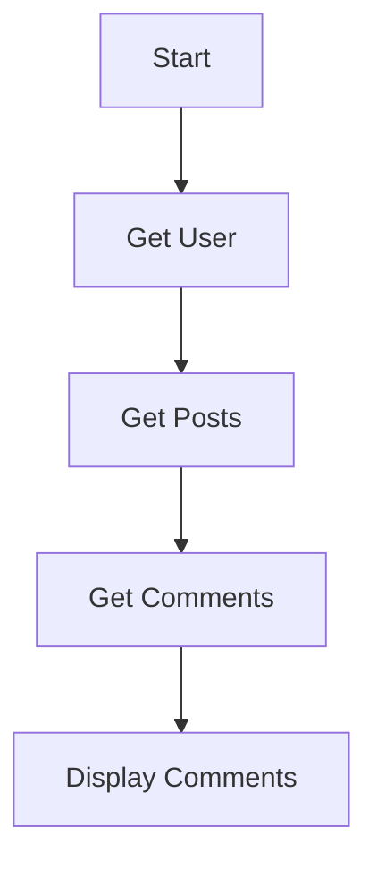

## 8.2 Callbacks and Callback Hell

In the realm of JavaScript, handling asynchronous operations is a fundamental skill. Callbacks are one of the earliest and most essential tools for managing asynchronous code. However, they come with their own set of challenges, notably the infamous "callback hell." In this section, we'll explore what callbacks are, how they function, and the pitfalls of callback hell. We'll also discuss strategies to mitigate these issues and introduce alternatives like Promises and async/await.

### Understanding Callbacks

A **callback** is a function passed into another function as an argument, which is then invoked inside the outer function to complete some kind of routine or action. Callbacks are a way to ensure that certain code doesn't execute until another piece of code has finished executing. This is particularly useful in asynchronous programming, where operations like network requests or file I/O can take an indeterminate amount of time.

#### How Callbacks Work

Let's start with a simple example to illustrate how callbacks work:

```javascript
function fetchData(callback) {
    setTimeout(() => {
        const data = { name: "John Doe", age: 30 };
        callback(data);
    }, 1000);
}

function displayData(data) {
    console.log(`Name: ${data.name}, Age: ${data.age}`);
}

fetchData(displayData);
```

In this example, `fetchData` simulates an asynchronous operation using `setTimeout`. Once the data is "fetched," it invokes the `callback` function, `displayData`, passing the data as an argument. This pattern allows us to handle the data only after it has been retrieved.

### The Problem of Callback Hell

As applications grow in complexity, the use of nested callbacks can lead to code that is difficult to read and maintain, a situation often referred to as **callback hell**. This occurs when callbacks are nested within other callbacks several levels deep, creating a pyramid-like structure that is hard to follow.

#### Example of Callback Hell

Consider the following example, which demonstrates callback hell:

```javascript
function getUser(userId, callback) {
    setTimeout(() => {
        console.log("Fetching user...");
        callback({ userId, username: "john_doe" });
    }, 1000);
}

function getPosts(username, callback) {
    setTimeout(() => {
        console.log("Fetching posts...");
        callback(["Post 1", "Post 2"]);
    }, 1000);
}

function getComments(post, callback) {
    setTimeout(() => {
        console.log("Fetching comments...");
        callback(["Comment 1", "Comment 2"]);
    }, 1000);
}

getUser(1, (user) => {
    getPosts(user.username, (posts) => {
        getComments(posts[0], (comments) => {
            console.log(comments);
        });
    });
});
```

In this example, each asynchronous operation depends on the result of the previous one, leading to deeply nested callbacks. This structure can quickly become unwieldy, making it difficult to understand the flow of the program and to handle errors effectively.

### Strategies to Mitigate Callback Hell

To avoid callback hell, we can employ several strategies:

#### 1. Modularizing Functions

Break down complex operations into smaller, reusable functions. This not only makes the code more readable but also easier to test and maintain.

```javascript
function handleUser(user) {
    getPosts(user.username, handlePosts);
}

function handlePosts(posts) {
    getComments(posts[0], handleComments);
}

function handleComments(comments) {
    console.log(comments);
}

getUser(1, handleUser);
```

#### 2. Using Named Functions

Instead of using anonymous functions, use named functions to improve readability and debugging.

#### 3. Error Handling

Implement proper error handling to manage exceptions and ensure that errors are caught and handled gracefully.

```javascript
function getUser(userId, callback) {
    setTimeout(() => {
        if (userId <= 0) {
            return callback(new Error("Invalid user ID"));
        }
        callback(null, { userId, username: "john_doe" });
    }, 1000);
}

getUser(-1, (error, user) => {
    if (error) {
        console.error(error.message);
        return;
    }
    console.log(user);
});
```

### Alternatives to Callbacks

While callbacks are a powerful tool, JavaScript provides modern alternatives that can simplify asynchronous code and avoid callback hell.

#### Promises

A **Promise** is an object representing the eventual completion or failure of an asynchronous operation. Promises provide a cleaner and more manageable way to handle asynchronous operations compared to callbacks.

```javascript
function getUser(userId) {
    return new Promise((resolve, reject) => {
        setTimeout(() => {
            if (userId <= 0) {
                reject(new Error("Invalid user ID"));
            } else {
                resolve({ userId, username: "john_doe" });
            }
        }, 1000);
    });
}

getUser(1)
    .then(user => console.log(user))
    .catch(error => console.error(error.message));
```

#### Async/Await

The `async` and `await` keywords provide a more synchronous way to write asynchronous code, making it easier to read and maintain.

```javascript
async function fetchUserData(userId) {
    try {
        const user = await getUser(userId);
        console.log(user);
    } catch (error) {
        console.error(error.message);
    }
}

fetchUserData(1);
```

### Best Practices for Writing Callback-Based Code

1. **Keep Callbacks Shallow**: Avoid nesting callbacks more than necessary. Use helper functions to keep the code flat and readable.
2. **Handle Errors Gracefully**: Always include error handling in your callbacks to manage exceptions effectively.
3. **Use Promises or Async/Await**: For complex asynchronous operations, consider using Promises or async/await to simplify the code structure.
4. **Document Your Code**: Provide clear comments and documentation to explain the purpose and flow of your callbacks.
5. **Test Thoroughly**: Ensure that your callback-based code is thoroughly tested to catch any potential issues early.

### Visualizing Callback Hell

To better understand the structure of callback hell, let's visualize it using a flowchart:



This diagram illustrates the sequential nature of nested callbacks, where each step depends on the completion of the previous one.

### Try It Yourself

Experiment with the code examples provided. Try modifying the `getUser`, `getPosts`, and `getComments` functions to introduce new asynchronous operations. Observe how the structure changes and practice refactoring the code to use Promises or async/await.

### References and Further Reading

- [MDN Web Docs: Asynchronous JavaScript](https://developer.mozilla.org/en-US/docs/Learn/JavaScript/Asynchronous)
- [JavaScript Promises: An Introduction](https://developers.google.com/web/fundamentals/primers/promises)
- [Async/Await: The Modern Way to Handle Asynchronous Code](https://javascript.info/async-await)

### Knowledge Check

- What is a callback in JavaScript?
- How does callback hell affect code readability?
- What are some strategies to avoid callback hell?
- How do Promises improve asynchronous code handling?
- What is the purpose of the `async` and `await` keywords?

### Embrace the Journey

Remember, mastering asynchronous programming in JavaScript is a journey. As you progress, you'll develop a deeper understanding of how to write clean, efficient, and maintainable code. Keep experimenting, stay curious, and enjoy the process!

---

## Quiz: Mastering JavaScript Callbacks and Avoiding Callback Hell



### What is a callback in JavaScript?

- [x] A function passed as an argument to another function
- [ ] A function that returns a promise
- [ ] A method that executes immediately
- [ ] A synchronous function

> **Explanation:** A callback is a function passed as an argument to another function, which is then invoked inside the outer function to complete some kind of routine or action.

### What is callback hell?

- [x] A situation where callbacks are nested within other callbacks, creating a complex and hard-to-read structure
- [ ] A scenario where callbacks are used incorrectly
- [ ] A method to handle synchronous code
- [ ] A way to improve code readability

> **Explanation:** Callback hell occurs when callbacks are nested within other callbacks several levels deep, leading to code that is difficult to read and maintain.

### Which of the following is a strategy to mitigate callback hell?

- [x] Modularizing functions
- [ ] Using more nested callbacks
- [ ] Avoiding error handling
- [ ] Ignoring code readability

> **Explanation:** Modularizing functions helps break down complex operations into smaller, reusable functions, improving code readability and maintainability.

### What is a Promise in JavaScript?

- [x] An object representing the eventual completion or failure of an asynchronous operation
- [ ] A synchronous function
- [ ] A method that executes immediately
- [ ] A callback function

> **Explanation:** A Promise is an object representing the eventual completion or failure of an asynchronous operation, providing a cleaner way to handle asynchronous code.

### How do the `async` and `await` keywords help in JavaScript?

- [x] They provide a more synchronous way to write asynchronous code
- [ ] They make code execution faster
- [ ] They are used for synchronous operations
- [ ] They replace all callbacks

> **Explanation:** The `async` and `await` keywords allow developers to write asynchronous code in a more synchronous manner, improving readability and maintainability.

### What is the purpose of error handling in callbacks?

- [x] To manage exceptions and ensure errors are caught and handled gracefully
- [ ] To ignore errors
- [ ] To make code execution faster
- [ ] To replace all callbacks

> **Explanation:** Error handling in callbacks is crucial to manage exceptions and ensure that errors are caught and handled gracefully, preventing unexpected behavior.

### Which of the following is NOT a best practice for writing callback-based code?

- [ ] Keep callbacks shallow
- [ ] Handle errors gracefully
- [x] Use deeply nested callbacks
- [ ] Document your code

> **Explanation:** Using deeply nested callbacks leads to callback hell and should be avoided to maintain code readability and manageability.

### What is the benefit of using named functions in callbacks?

- [x] Improved readability and debugging
- [ ] Faster code execution
- [ ] Reduced code size
- [ ] Increased complexity

> **Explanation:** Named functions improve readability and debugging by providing clear function names and reducing the complexity of nested callbacks.

### How can Promises help avoid callback hell?

- [x] By providing a cleaner and more manageable way to handle asynchronous operations
- [ ] By increasing code complexity
- [ ] By making code execution slower
- [ ] By ignoring errors

> **Explanation:** Promises provide a cleaner and more manageable way to handle asynchronous operations, reducing the complexity of nested callbacks and avoiding callback hell.

### True or False: Async/await can only be used with Promises.

- [x] True
- [ ] False

> **Explanation:** Async/await syntax is designed to work with Promises, allowing developers to write asynchronous code in a more synchronous manner.




