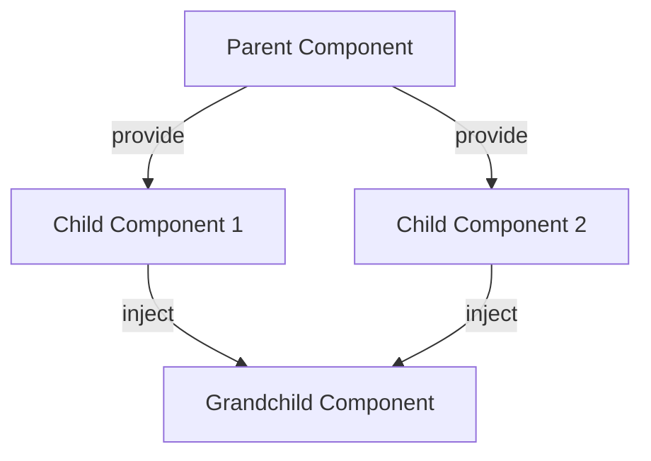

---

linkTitle: "8.3.2 Provide/Inject"
title: "Vue.js Provide/Inject Pattern: A Comprehensive Guide"
description: "Explore the Provide/Inject pattern in Vue.js for efficient data sharing between components, avoiding prop drilling, and enhancing maintainability."
categories:
- JavaScript
- TypeScript
- Vue.js
tags:
- Vue.js
- Provide/Inject
- Design Patterns
- Component Communication
- State Management
date: 2024-10-25
type: docs
nav_weight: 8320

canonical: "https://softwarepatternslexicon.com/patterns-js/8/3/2"
license: "© 2024 Tokenizer Inc. CC BY-NC-SA 4.0"
---

## 8.3.2 Provide/Inject

### Introduction

In the world of Vue.js, managing data flow between components can become cumbersome as your application grows. The **Provide/Inject** pattern offers a streamlined solution for passing data from parent components to deeply nested descendant components without the need for prop drilling. This pattern enhances maintainability and readability by reducing the complexity of component hierarchies.

### Understanding the Concept

The Provide/Inject pattern in Vue.js allows you to share data across components without explicitly passing props through every level of the component tree. This pattern is particularly useful for sharing global configurations, services, or state that multiple components need to access.

### Implementation Steps

#### Provide Data

To provide data, you define a `provide` option in the parent component. This can be a simple object or a function that returns an object. The keys of this object are the identifiers that descendant components will use to inject the data.

```javascript
// ParentComponent.vue
<template>
  <div>
    <ChildComponent />
  </div>
</template>

<script>
export default {
  provide() {
    return {
      sharedData: 'This is shared data',
      sharedFunction: () => console.log('Shared function called')
    };
  }
};
</script>
```

#### Inject Data

In the descendant components, you use the `inject` option to specify which provided data you want to access. The `inject` option is an array of keys or an object that maps keys to local names.

```javascript
// ChildComponent.vue
<template>
  <div>
    <p>{{ sharedData }}</p>
    <button @click="sharedFunction">Call Shared Function</button>
  </div>
</template>

<script>
export default {
  inject: ['sharedData', 'sharedFunction']
};
</script>
```

### Use Cases

- **Avoiding Prop Drilling:** When you need to pass data through multiple layers of components, Provide/Inject simplifies the process by allowing direct access to data without passing it through each component.
- **Global Configurations:** Share configurations or constants that are used across various components.
- **Service Injection:** Inject services or utility functions that multiple components need to access.

### Practice: Implementing a Shared Configuration

Let's implement a shared configuration using the Provide/Inject pattern. We'll create a theme configuration that can be accessed by multiple components.

```javascript
// ThemeProvider.vue
<template>
  <div>
    <ThemeButton />
  </div>
</template>

<script>
export default {
  provide() {
    return {
      theme: {
        color: 'blue',
        fontSize: '16px'
      }
    };
  }
};
</script>

// ThemeButton.vue
<template>
  <button :style="{ color: theme.color, fontSize: theme.fontSize }">
    Themed Button
  </button>
</template>

<script>
export default {
  inject: ['theme']
};
</script>
```

### Considerations

- **Reactivity:** Provided properties are not reactive by default. If you need reactivity, consider using Vue's `reactive` or `ref` to wrap the provided data.
- **Scope:** The Provide/Inject pattern is limited to the component hierarchy. It does not work across different root instances.

### Visual Representation



### Advantages and Disadvantages

**Advantages:**
- Reduces the need for prop drilling.
- Simplifies component communication.
- Enhances code readability and maintainability.

**Disadvantages:**
- Can lead to implicit dependencies, making the code harder to understand.
- Lack of reactivity unless explicitly managed.

### Best Practices

- Use Provide/Inject for global data or services that are needed by many components.
- Avoid overusing Provide/Inject for data that should be passed explicitly through props.
- Ensure that provided data is reactive if it needs to respond to changes.

### Comparisons

Compared to Vuex, the Provide/Inject pattern is simpler and more lightweight, suitable for smaller applications or specific use cases where a full state management solution is unnecessary.

### Conclusion

The Provide/Inject pattern in Vue.js is a powerful tool for managing data flow in complex component hierarchies. By understanding and implementing this pattern, you can create more maintainable and scalable Vue.js applications.

## Quiz Time!



### What is the primary purpose of the Provide/Inject pattern in Vue.js?

- [x] To pass data from parent to descendant components without prop drilling
- [ ] To manage global state across different root instances
- [ ] To replace Vuex for state management
- [ ] To enhance component styling

> **Explanation:** The Provide/Inject pattern is used to pass data from parent to descendant components without the need for prop drilling.

### How do you provide data in a Vue.js component?

- [x] By using the `provide` option in the parent component
- [ ] By using the `inject` option in the parent component
- [ ] By using the `data` option in the parent component
- [ ] By using the `props` option in the parent component

> **Explanation:** The `provide` option is used in the parent component to specify the data that can be injected by descendant components.

### Which option is used in descendant components to access provided data?

- [ ] provide
- [x] inject
- [ ] data
- [ ] props

> **Explanation:** The `inject` option is used in descendant components to access the data provided by an ancestor component.

### What is a common use case for the Provide/Inject pattern?

- [x] Sharing global configurations or services
- [ ] Managing component lifecycle hooks
- [ ] Handling component events
- [ ] Styling components

> **Explanation:** A common use case for the Provide/Inject pattern is sharing global configurations or services across components.

### Are provided properties reactive by default?

- [ ] Yes
- [x] No
- [ ] Only in Vue 3
- [ ] Only in Vue 2

> **Explanation:** Provided properties are not reactive by default. You need to explicitly make them reactive if needed.

### What is a disadvantage of the Provide/Inject pattern?

- [x] It can lead to implicit dependencies
- [ ] It requires prop drilling
- [ ] It is not supported in Vue 3
- [ ] It cannot be used with services

> **Explanation:** A disadvantage of the Provide/Inject pattern is that it can lead to implicit dependencies, making the code harder to understand.

### How can you make provided data reactive?

- [x] By using Vue's `reactive` or `ref`
- [ ] By using the `data` option
- [ ] By using the `props` option
- [ ] By using the `computed` option

> **Explanation:** You can make provided data reactive by using Vue's `reactive` or `ref` to wrap the data.

### Can the Provide/Inject pattern be used across different root instances?

- [ ] Yes
- [x] No
- [ ] Only in Vue 3
- [ ] Only in Vue 2

> **Explanation:** The Provide/Inject pattern is limited to the component hierarchy and does not work across different root instances.

### What is an advantage of using Provide/Inject over Vuex?

- [x] It is simpler and more lightweight
- [ ] It offers more features
- [ ] It is reactive by default
- [ ] It supports cross-instance communication

> **Explanation:** An advantage of using Provide/Inject over Vuex is that it is simpler and more lightweight, suitable for smaller applications or specific use cases.

### True or False: The Provide/Inject pattern can replace Vuex for all state management needs.

- [ ] True
- [x] False

> **Explanation:** False. The Provide/Inject pattern is not a replacement for Vuex for all state management needs. It is suitable for specific use cases but lacks the full capabilities of Vuex.


