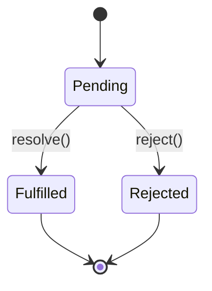
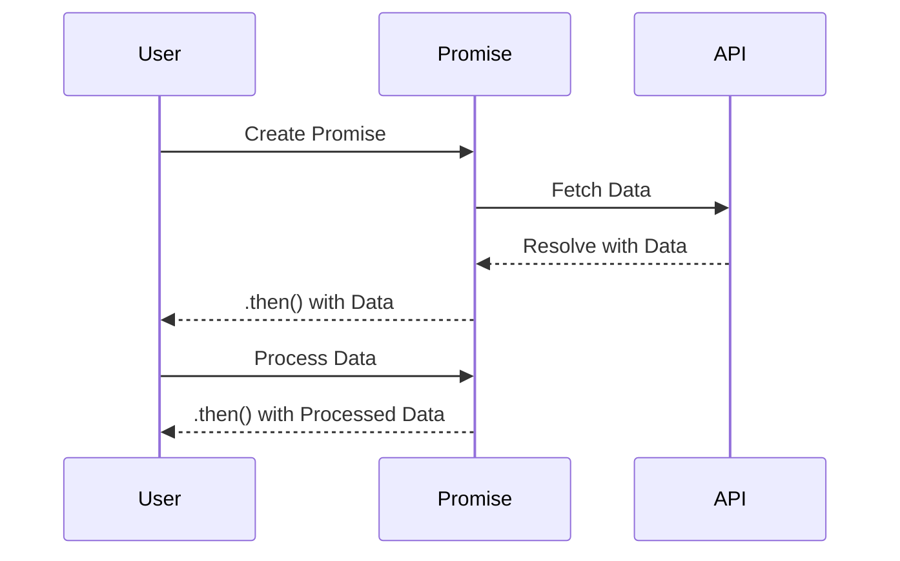

## 8.3 Promises and Promise Patterns

In modern web development, handling asynchronous operations efficiently is crucial for creating responsive and performant applications. JavaScript Promises provide a powerful mechanism to manage these operations, offering a more intuitive and manageable approach compared to traditional callback functions. In this section, we will explore what Promises are, how they work, and delve into various patterns and best practices for their use.

### Understanding Promises

A **Promise** in JavaScript is an object that represents the eventual completion (or failure) of an asynchronous operation and its resulting value. Promises provide a cleaner and more robust way to handle asynchronous tasks compared to callbacks, which can lead to complex and hard-to-maintain code, commonly known as "callback hell."

#### Promise States

A Promise can be in one of three states:

1. **Pending**: The initial state, neither fulfilled nor rejected.
2. **Fulfilled**: The operation completed successfully, and the Promise has a resulting value.
3. **Rejected**: The operation failed, and the Promise has a reason for the failure.

The state transition of a Promise can be visualized as follows:



### Creating and Using Promises

To create a Promise, you use the `Promise` constructor, which takes a function (executor) with two parameters: `resolve` and `reject`. Here's a basic example:

```javascript
// Creating a new Promise
const myPromise = new Promise((resolve, reject) => {
    const success = true; // Simulate an operation result
    if (success) {
        resolve("Operation was successful!");
    } else {
        reject("Operation failed.");
    }
});

// Consuming the Promise
myPromise
    .then(result => {
        console.log(result); // "Operation was successful!"
    })
    .catch(error => {
        console.error(error); // "Operation failed."
    });
```

In this example, the Promise is resolved if the operation is successful, and rejected if it fails. The `.then()` method is used to handle the resolved value, while `.catch()` is used to handle any errors.

### Chaining Promises

One of the key advantages of Promises is the ability to chain them, allowing for sequential execution of asynchronous operations. This is achieved by returning a new Promise from within a `.then()` callback:

```javascript
// Chaining Promises
const fetchData = () => {
    return new Promise((resolve) => {
        setTimeout(() => resolve("Data fetched"), 1000);
    });
};

fetchData()
    .then(data => {
        console.log(data); // "Data fetched"
        return "Processing data";
    })
    .then(processedData => {
        console.log(processedData); // "Processing data"
    })
    .catch(error => {
        console.error("Error:", error);
    });
```

In this example, each `.then()` returns a new Promise, allowing for a clean and readable flow of asynchronous operations.

### Error Handling with Promises

Proper error handling is crucial when working with Promises. The `.catch()` method is used to handle any errors that occur in the Promise chain. It's important to note that a `.catch()` can be placed at the end of a chain to handle errors from any preceding Promise:

```javascript
// Error handling in Promise chains
const fetchDataWithError = () => {
    return new Promise((resolve, reject) => {
        setTimeout(() => reject("Failed to fetch data"), 1000);
    });
};

fetchDataWithError()
    .then(data => {
        console.log(data);
    })
    .catch(error => {
        console.error("Caught error:", error); // "Caught error: Failed to fetch data"
    });
```

### Advanced Promise Patterns

JavaScript provides several static methods on the `Promise` object to handle multiple Promises concurrently or to manage their outcomes in different ways.

#### `Promise.all`

`Promise.all` takes an iterable of Promises and returns a single Promise that resolves when all of the input Promises have resolved, or rejects if any of the input Promises reject.

```javascript
// Using Promise.all
const promise1 = Promise.resolve(3);
const promise2 = 42;
const promise3 = new Promise((resolve) => {
    setTimeout(resolve, 100, 'foo');
});

Promise.all([promise1, promise2, promise3]).then(values => {
    console.log(values); // [3, 42, "foo"]
});
```

This pattern is useful when you need to wait for multiple asynchronous operations to complete before proceeding.

#### `Promise.race`

`Promise.race` returns a Promise that resolves or rejects as soon as one of the input Promises resolves or rejects.

```javascript
// Using Promise.race
const promise1 = new Promise((resolve) => setTimeout(resolve, 500, 'one'));
const promise2 = new Promise((resolve) => setTimeout(resolve, 100, 'two'));

Promise.race([promise1, promise2]).then(value => {
    console.log(value); // "two"
});
```

This pattern is useful when you want to perform an action as soon as the first Promise settles.

#### `Promise.allSettled`

`Promise.allSettled` returns a Promise that resolves after all of the given Promises have either resolved or rejected, with an array of objects that each describe the outcome of each Promise.

```javascript
// Using Promise.allSettled
const promise1 = Promise.resolve(3);
const promise2 = new Promise((resolve, reject) => setTimeout(reject, 100, 'error'));

Promise.allSettled([promise1, promise2]).then(results => {
    results.forEach((result) => console.log(result.status));
    // "fulfilled"
    // "rejected"
});
```

This pattern is useful when you want to know the outcome of all Promises, regardless of whether they were successful or not.

### Common Mistakes and How to Avoid Them

When working with Promises, developers often encounter common pitfalls. Here are some mistakes and how to avoid them:

1. **Forgetting to Return Promises**: Always return Promises in a chain to ensure proper sequencing.
2. **Not Handling Errors**: Use `.catch()` to handle errors and avoid unhandled Promise rejections.
3. **Mixing Promises and Callbacks**: Stick to one approach to avoid confusion and maintain consistency.
4. **Creating Unnecessary Promises**: Avoid wrapping values in Promises unnecessarily, as this can lead to redundant code.

### Try It Yourself

Experiment with the following code examples by modifying them to see how changes affect the outcome. Try adding additional `.then()` calls, introducing errors, or using different Promise methods like `Promise.any`.

### Visualizing Promise Patterns

To better understand how Promises work, let's visualize a simple Promise chain:



This sequence diagram illustrates the flow of a Promise chain, from creation to resolution.

### References and Further Reading

- [MDN Web Docs: Promises](https://developer.mozilla.org/en-US/docs/Web/JavaScript/Guide/Using_promises)
- [JavaScript.info: Promises](https://javascript.info/promise-basics)
- [W3Schools: JavaScript Promises](https://www.w3schools.com/js/js_promise.asp)

### Knowledge Check

Let's reinforce what we've learned with some questions and exercises.

## Quiz: Mastering JavaScript Promises



### What is the initial state of a Promise?

- [x] Pending
- [ ] Fulfilled
- [ ] Rejected
- [ ] Resolved

> **Explanation:** A Promise starts in the "pending" state before it is either fulfilled or rejected.

### Which method is used to handle errors in a Promise chain?

- [ ] .then()
- [x] .catch()
- [ ] .finally()
- [ ] .resolve()

> **Explanation:** The `.catch()` method is used to handle errors in a Promise chain.

### What does `Promise.all` return?

- [x] A Promise that resolves when all input Promises resolve
- [ ] A Promise that resolves when the first input Promise resolves
- [ ] A Promise that rejects when any input Promise rejects
- [ ] A Promise that resolves or rejects based on the first input Promise

> **Explanation:** `Promise.all` returns a Promise that resolves when all input Promises have resolved.

### What is the purpose of `Promise.race`?

- [x] To return a Promise that resolves or rejects as soon as one of the input Promises resolves or rejects
- [ ] To return a Promise that resolves when all input Promises resolve
- [ ] To handle errors in a Promise chain
- [ ] To create a new Promise

> **Explanation:** `Promise.race` returns a Promise that resolves or rejects as soon as one of the input Promises resolves or rejects.

### Which method provides the outcome of all Promises, regardless of their success or failure?

- [ ] Promise.all
- [ ] Promise.race
- [x] Promise.allSettled
- [ ] Promise.any

> **Explanation:** `Promise.allSettled` returns a Promise that resolves after all input Promises have settled, providing the outcome of each.

### What is a common mistake when working with Promises?

- [x] Forgetting to return Promises in a chain
- [ ] Using `.then()` to handle errors
- [ ] Mixing Promises with async/await
- [ ] Using `Promise.all` for sequential execution

> **Explanation:** Forgetting to return Promises in a chain can lead to unexpected behavior and errors.

### What does the `.then()` method return?

- [x] A new Promise
- [ ] The original Promise
- [ ] The resolved value
- [ ] Undefined

> **Explanation:** The `.then()` method returns a new Promise, allowing for chaining.

### How can you handle both fulfillment and rejection in a Promise?

- [ ] Using `.then()` only
- [x] Using `.then()` and `.catch()`
- [ ] Using `.finally()` only
- [ ] Using `.resolve()` and `.reject()`

> **Explanation:** Use `.then()` for fulfillment and `.catch()` for rejection to handle both outcomes.

### What is the benefit of chaining Promises?

- [x] It allows for sequential execution of asynchronous operations
- [ ] It makes code run faster
- [ ] It prevents errors
- [ ] It simplifies synchronous code

> **Explanation:** Chaining Promises allows for sequential execution of asynchronous operations, making code more readable and manageable.

### True or False: `Promise.all` will reject immediately if any input Promise rejects.

- [x] True
- [ ] False

> **Explanation:** `Promise.all` will reject immediately if any of the input Promises reject.



### Embrace the Journey

Remember, mastering Promises and their patterns is just the beginning of your journey into asynchronous JavaScript. As you continue to explore and experiment, you'll discover even more powerful ways to create responsive and efficient web applications. Keep experimenting, stay curious, and enjoy the journey!
