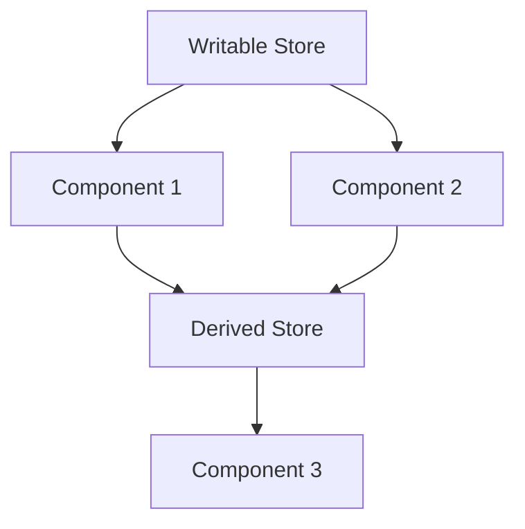

---

linkTitle: "8.4.1 Stores"
title: "Svelte Stores: Reactive State Management in JavaScript and TypeScript"
description: "Explore Svelte stores for reactive state management in JavaScript and TypeScript applications. Learn how to create, update, and subscribe to stores for efficient state handling."
categories:
- JavaScript
- TypeScript
- Svelte
tags:
- Svelte
- State Management
- Reactive Programming
- JavaScript
- TypeScript
date: 2024-10-25
type: docs
nav_weight: 841000
canonical: "https://softwarepatternslexicon.com/patterns-js/8/4/1"
license: "© 2024 Tokenizer Inc. CC BY-NC-SA 4.0"
---

## 8.4.1 Stores

### Introduction

In the world of modern web development, managing state efficiently is crucial for building responsive and interactive applications. Svelte, a popular JavaScript framework, offers a unique approach to state management through its concept of "stores." Svelte stores provide a reactive and straightforward way to manage shared state across components, making your applications more maintainable and scalable.

### Understanding the Concept of Svelte Stores

Svelte stores are a built-in feature that allows you to create reactive state management solutions. They are designed to be simple yet powerful, enabling developers to manage state without the complexity often associated with other state management libraries. Svelte provides three types of stores:

1. **Writable Stores:** These are the most common type of stores, allowing both reading and writing of values.
2. **Readable Stores:** These stores are read-only and are typically used for derived state that doesn't change independently.
3. **Derived Stores:** These are used to create stores whose values depend on other stores.

### Implementation Steps

#### Create a Store

To create a store in Svelte, you need to import the appropriate function from `svelte/store`. Here's how you can create different types of stores:

```javascript
import { writable, readable, derived } from 'svelte/store';

// Writable store
const count = writable(0);

// Readable store
const time = readable(new Date(), function start(set) {
  const interval = setInterval(() => {
    set(new Date());
  }, 1000);

  return function stop() {
    clearInterval(interval);
  };
});

// Derived store
const doubleCount = derived(count, $count => $count * 2);
```

#### Update the Store

Updating a writable store is straightforward. You can use the `set` method to assign a new value or the `update` method to modify the current value:

```javascript
// Setting a new value
count.set(10);

// Updating the current value
count.update(n => n + 1);
```

#### Subscribe to the Store

In Svelte components, you can automatically subscribe to a store by using the `$` prefix, which makes the store's value reactive:

```html
<script>
  import { count } from './stores.js';
</script>

<p>The count is {$count}</p>
<button on:click={() => count.update(n => n + 1)}>Increment</button>
```

### Use Cases

Svelte stores are particularly useful for managing shared state across components. They provide a clean and efficient way to handle global state without the need for complex state management libraries. Common use cases include:

- Managing user authentication state
- Handling application-wide settings
- Sharing data between sibling components

### Practice: Build a Counter Using a Writable Store

Let's build a simple counter application using a writable store:

```html
<script>
  import { writable } from 'svelte/store';

  // Create a writable store
  const counter = writable(0);

  // Function to increment the counter
  function increment() {
    counter.update(n => n + 1);
  }
</script>

<p>Counter: {$counter}</p>
<button on:click={increment}>Increment</button>
```

### Considerations

While Svelte stores are powerful, there are some considerations to keep in mind:

- **Unsubscription:** If you use stores outside of Svelte components, ensure you unsubscribe from them to prevent memory leaks.
- **Performance:** Svelte's reactivity model is efficient, but be mindful of unnecessary updates that could impact performance.

### Visual Aids

#### Conceptual Diagram of Svelte Stores



### Advantages and Disadvantages

#### Advantages

- **Simplicity:** Easy to use and integrate into Svelte applications.
- **Reactivity:** Automatic reactivity without boilerplate code.
- **Flexibility:** Suitable for both small and large applications.

#### Disadvantages

- **Limited to Svelte:** Not usable outside of Svelte applications.
- **Learning Curve:** Requires understanding of Svelte's reactivity model.

### Best Practices

- **Use Derived Stores:** For computed values, use derived stores to keep your logic clean and maintainable.
- **Unsubscribe When Necessary:** Always unsubscribe from stores when they are no longer needed, especially outside of components.
- **Keep Stores Focused:** Avoid bloating stores with too much logic; keep them focused on state management.

### Conclusion

Svelte stores offer a powerful and intuitive way to manage state in your applications. By leveraging writable, readable, and derived stores, you can create reactive and maintainable applications with ease. Whether you're building a small project or a large-scale application, Svelte stores provide the flexibility and simplicity needed for effective state management.

## Quiz Time!



### What is a writable store in Svelte?

- [x] A store that allows both reading and writing of values
- [ ] A store that only allows reading of values
- [ ] A store that is derived from other stores
- [ ] A store that is used for managing CSS styles

> **Explanation:** Writable stores in Svelte allow both reading and writing of values, making them the most common type of store for managing state.

### How do you create a readable store in Svelte?

- [x] By using the `readable` function from 'svelte/store'
- [ ] By using the `writable` function from 'svelte/store'
- [ ] By using the `derived` function from 'svelte/store'
- [ ] By using the `store` function from 'svelte/store'

> **Explanation:** Readable stores are created using the `readable` function from 'svelte/store', and they are typically used for state that doesn't change independently.

### What method is used to update a writable store?

- [x] `update`
- [ ] `modify`
- [ ] `change`
- [ ] `alter`

> **Explanation:** The `update` method is used to modify the current value of a writable store in Svelte.

### How do you automatically subscribe to a store in a Svelte component?

- [x] By using the `$` prefix
- [ ] By using the `subscribe` method
- [ ] By using the `listen` method
- [ ] By using the `observe` method

> **Explanation:** In Svelte components, you can automatically subscribe to a store by using the `$` prefix, which makes the store's value reactive.

### What is a derived store used for?

- [x] Creating stores whose values depend on other stores
- [ ] Creating stores that are read-only
- [ ] Creating stores that manage CSS styles
- [ ] Creating stores that handle user authentication

> **Explanation:** Derived stores are used to create stores whose values depend on other stores, allowing for computed state.

### What should you do when using stores outside of Svelte components?

- [x] Ensure you unsubscribe from them
- [ ] Ensure you subscribe to them
- [ ] Ensure you reset them
- [ ] Ensure you duplicate them

> **Explanation:** When using stores outside of Svelte components, it's important to unsubscribe from them to prevent memory leaks.

### Which of the following is an advantage of using Svelte stores?

- [x] Simplicity and ease of integration
- [ ] Complex setup process
- [ ] Requires additional libraries
- [ ] Limited to small applications

> **Explanation:** Svelte stores are simple to use and integrate, making them suitable for both small and large applications.

### What is a common use case for Svelte stores?

- [x] Managing shared state across components
- [ ] Managing CSS styles
- [ ] Handling server-side rendering
- [ ] Creating animations

> **Explanation:** A common use case for Svelte stores is managing shared state across components, providing a clean and efficient way to handle global state.

### What is the primary function of the `set` method in a writable store?

- [x] To assign a new value to the store
- [ ] To modify the current value of the store
- [ ] To subscribe to the store
- [ ] To unsubscribe from the store

> **Explanation:** The `set` method is used to assign a new value to a writable store in Svelte.

### True or False: Svelte stores can be used outside of Svelte applications.

- [ ] True
- [x] False

> **Explanation:** Svelte stores are specifically designed for use within Svelte applications and are not usable outside of them.


