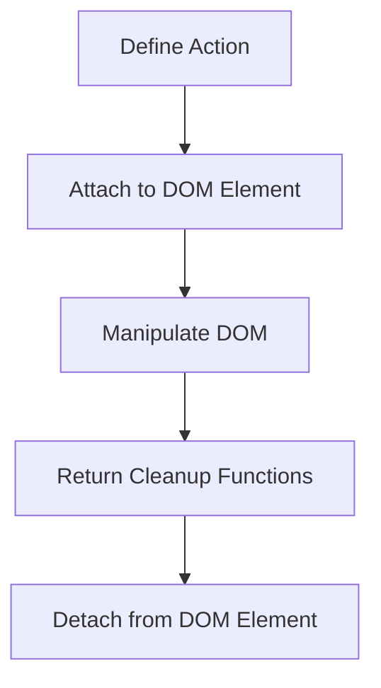

---

linkTitle: "8.4.2 Actions in Svelte"
title: "Mastering Svelte Actions: Enhance Your DOM Manipulation"
description: "Explore the power of Svelte Actions to add functionality to DOM elements. Learn how to define, use, and optimize actions in your Svelte applications."
categories:
- JavaScript
- TypeScript
- Svelte
tags:
- Svelte
- DOM Manipulation
- JavaScript
- TypeScript
- Web Development
date: 2024-10-25
type: docs
nav_weight: 842000
canonical: "https://softwarepatternslexicon.com/patterns-js/8/4/2"
license: "© 2024 Tokenizer Inc. CC BY-NC-SA 4.0"
---

## 8.4.2 Actions

In Svelte, actions are a powerful feature that allows developers to encapsulate and reuse DOM manipulation logic. They are functions that can be applied to DOM elements to enhance their behavior, making them a vital tool for creating interactive web applications.

### Understand the Concept

Actions in Svelte are essentially functions that can be attached to DOM elements. They provide a clean and reusable way to add functionality such as event listeners, animations, or any other DOM-related logic. This approach promotes separation of concerns and enhances code maintainability.

### Implementation Steps

#### Define an Action

To define an action, you create a function that receives the DOM node and an optional parameter. This function can manipulate the node directly and return an object with `update` and `destroy` methods if needed.

```javascript
// tooltip.js
export function tooltip(node, text) {
    const showTooltip = () => {
        const tooltipElement = document.createElement('div');
        tooltipElement.textContent = text;
        tooltipElement.style.position = 'absolute';
        tooltipElement.style.backgroundColor = 'black';
        tooltipElement.style.color = 'white';
        tooltipElement.style.padding = '5px';
        tooltipElement.style.borderRadius = '4px';
        tooltipElement.style.zIndex = '1000';
        document.body.appendChild(tooltipElement);

        const { top, left, width } = node.getBoundingClientRect();
        tooltipElement.style.top = `${top - tooltipElement.offsetHeight}px`;
        tooltipElement.style.left = `${left + width / 2 - tooltipElement.offsetWidth / 2}px`;

        node._tooltipElement = tooltipElement;
    };

    const hideTooltip = () => {
        if (node._tooltipElement) {
            document.body.removeChild(node._tooltipElement);
            node._tooltipElement = null;
        }
    };

    node.addEventListener('mouseenter', showTooltip);
    node.addEventListener('mouseleave', hideTooltip);

    return {
        destroy() {
            node.removeEventListener('mouseenter', showTooltip);
            node.removeEventListener('mouseleave', hideTooltip);
            hideTooltip();
        }
    };
}
```

#### Use the Action

Once defined, you can apply the action to any DOM element using the `use:` directive in your Svelte component.

```html
<script>
    import { tooltip } from './tooltip.js';
</script>

<button use:tooltip={'Hover over me!'}>Hover me</button>
```

### Use Cases

Svelte actions are versatile and can be used in various scenarios, including:

- **Adding Event Listeners:** Simplify the process of attaching and detaching event listeners.
- **DOM Manipulation:** Directly manipulate DOM nodes for animations or dynamic styling.
- **Integrating Third-Party Libraries:** Easily integrate libraries that require direct DOM access.

### Practice: Implement a Tooltip Action

Let's walk through the implementation of a tooltip action, which displays a tooltip when the user hovers over an element.

1. **Create the Action:** Define a function that manages the tooltip's lifecycle, including showing, positioning, and hiding the tooltip.

2. **Apply the Action:** Use the `use:` directive to attach the tooltip action to a button element.

3. **Test the Action:** Hover over the button to see the tooltip in action.

### Considerations

When implementing actions, consider the following:

- **Cleanup:** Always return a `destroy` function to remove event listeners and clean up any DOM changes when the action is no longer needed.
- **Parameter Updates:** If your action depends on parameters that might change, return an `update` function to handle these changes gracefully.
- **Performance:** Be mindful of performance, especially when manipulating the DOM or handling frequent events.

### Visual Aids

Below is a conceptual diagram illustrating how Svelte actions interact with DOM elements:



### Advantages and Disadvantages

#### Advantages

- **Reusability:** Actions encapsulate logic that can be reused across different components.
- **Separation of Concerns:** Keep DOM manipulation logic separate from component logic.
- **Flexibility:** Easily integrate with third-party libraries that require direct DOM access.

#### Disadvantages

- **Complexity:** Overusing actions can lead to complex code if not managed properly.
- **Performance Overhead:** Improper use of actions can introduce performance bottlenecks.

### Best Practices

- **Keep Actions Simple:** Focus on a single responsibility for each action.
- **Use Parameters Wisely:** Allow actions to accept parameters for flexibility and configurability.
- **Ensure Cleanup:** Always provide a `destroy` function to prevent memory leaks.

### Comparisons

Svelte actions can be compared to similar concepts in other frameworks:

- **React Hooks:** While hooks manage state and lifecycle, actions focus on DOM manipulation.
- **Vue Directives:** Similar to Vue's custom directives, Svelte actions provide a way to encapsulate DOM logic.

### Conclusion

Svelte actions are a powerful tool for enhancing DOM elements with additional functionality. By encapsulating logic in reusable functions, actions promote clean and maintainable code. Whether you're adding event listeners or integrating third-party libraries, mastering Svelte actions will elevate your web development skills.

## Quiz Time!



### What is the primary purpose of Svelte actions?

- [x] To add functionality to DOM elements
- [ ] To manage component state
- [ ] To handle routing in Svelte applications
- [ ] To define component styles

> **Explanation:** Svelte actions are designed to add functionality to DOM elements, such as event listeners or animations.

### How do you apply an action to a DOM element in Svelte?

- [x] Using the `use:` directive
- [ ] Using the `bind:` directive
- [ ] Using the `on:` directive
- [ ] Using the `class:` directive

> **Explanation:** The `use:` directive is used to apply actions to DOM elements in Svelte.

### What should an action return if it needs to perform cleanup?

- [x] A `destroy` function
- [ ] An `init` function
- [ ] A `reset` function
- [ ] A `remove` function

> **Explanation:** Actions should return a `destroy` function to clean up event listeners and DOM changes.

### Which of the following is a common use case for Svelte actions?

- [x] Adding event listeners
- [ ] Managing global state
- [ ] Handling API requests
- [ ] Defining component styles

> **Explanation:** Svelte actions are commonly used to add event listeners to DOM elements.

### What is the benefit of returning an `update` function in an action?

- [x] To handle parameter changes
- [ ] To initialize the action
- [ ] To reset the action
- [ ] To remove the action

> **Explanation:** An `update` function allows the action to handle changes in parameters.

### How can Svelte actions improve code maintainability?

- [x] By encapsulating DOM logic in reusable functions
- [ ] By managing component state
- [ ] By handling routing
- [ ] By defining component styles

> **Explanation:** Actions encapsulate DOM logic, making it reusable and maintainable.

### What is a potential disadvantage of overusing Svelte actions?

- [x] Increased code complexity
- [ ] Reduced code reusability
- [ ] Difficulty in managing state
- [ ] Limited styling options

> **Explanation:** Overusing actions can lead to complex code if not managed properly.

### Which of the following is NOT a feature of Svelte actions?

- [x] Managing component state
- [ ] Adding event listeners
- [ ] Manipulating DOM elements
- [ ] Integrating third-party libraries

> **Explanation:** Svelte actions are not designed to manage component state; they focus on DOM manipulation.

### How do Svelte actions compare to React Hooks?

- [x] Actions focus on DOM manipulation, while hooks manage state and lifecycle
- [ ] Actions manage state, while hooks focus on DOM manipulation
- [ ] Both actions and hooks manage component styles
- [ ] Both actions and hooks handle routing

> **Explanation:** Svelte actions focus on DOM manipulation, whereas React Hooks manage state and lifecycle.

### True or False: Svelte actions can be used to integrate third-party libraries that require direct DOM access.

- [x] True
- [ ] False

> **Explanation:** Svelte actions can be used to integrate third-party libraries that require direct DOM access, making them versatile for various use cases.




