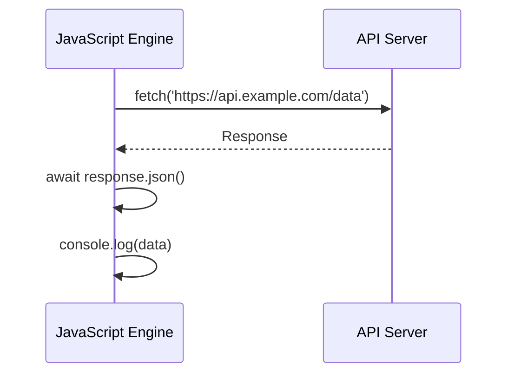

## 8.4 Async/Await Syntax and Patterns

Asynchronous programming in JavaScript has evolved significantly over the years, with the introduction of `async` and `await` in ES2017 marking a pivotal moment. These features simplify asynchronous code, making it more readable and easier to manage. In this section, we will delve into how `async` functions and `await` expressions work, compare them with Promises, explore error handling, and discuss best practices for using async/await effectively.

### Understanding Async Functions

An `async` function is a function that returns a Promise. It allows you to write asynchronous code in a synchronous manner, making it easier to read and maintain. When you declare a function as `async`, it automatically returns a Promise, and you can use the `await` keyword inside it to pause execution until a Promise is resolved.

#### Syntax of Async Functions

```javascript
async function fetchData() {
  // This function returns a Promise
  return "Data fetched";
}

fetchData().then(data => console.log(data)); // Output: Data fetched
```

In the example above, `fetchData` is an `async` function that returns a Promise. The `then` method is used to handle the resolved value of the Promise.

### The Await Expression

The `await` keyword can only be used inside an `async` function. It pauses the execution of the function until the Promise is resolved, allowing you to write code that looks synchronous.

#### Using Await

```javascript
async function getData() {
  const data = await fetch('https://api.example.com/data');
  const jsonData = await data.json();
  console.log(jsonData);
}

getData();
```

In this example, the `await` keyword is used to wait for the fetch operation to complete before proceeding to the next line. This makes the code easier to read compared to chaining `then` methods.

### Comparing Promises and Async/Await

While Promises provide a way to handle asynchronous operations, they can lead to complex and nested code structures, often referred to as "callback hell." Async/await simplifies this by allowing you to write asynchronous code in a more linear and readable fashion.

#### Promises Example

```javascript
fetch('https://api.example.com/data')
  .then(response => response.json())
  .then(data => console.log(data))
  .catch(error => console.error('Error:', error));
```

#### Async/Await Example

```javascript
async function fetchData() {
  try {
    const response = await fetch('https://api.example.com/data');
    const data = await response.json();
    console.log(data);
  } catch (error) {
    console.error('Error:', error);
  }
}

fetchData();
```

As you can see, the async/await version is more straightforward and easier to follow.

### Error Handling with Try...Catch

One of the advantages of using async/await is the ability to handle errors using `try...catch` blocks. This provides a cleaner and more intuitive way to manage errors compared to the `catch` method with Promises.

#### Error Handling Example

```javascript
async function fetchData() {
  try {
    const response = await fetch('https://api.example.com/data');
    if (!response.ok) {
      throw new Error('Network response was not ok');
    }
    const data = await response.json();
    console.log(data);
  } catch (error) {
    console.error('Fetch error:', error);
  }
}

fetchData();
```

In this example, any errors that occur during the fetch operation are caught in the `catch` block, allowing you to handle them gracefully.

### Best Practices for Using Async/Await

When using async/await, it's important to follow best practices to ensure your code is efficient and maintainable.

#### Avoid Blocking the Event Loop

While async/await makes code look synchronous, it's crucial to remember that JavaScript is single-threaded. Avoid blocking the event loop with long-running synchronous operations.

#### Sequential vs. Parallel Execution

Async/await can be used for both sequential and parallel execution of asynchronous tasks. Use `await` in a loop for sequential execution, and `Promise.all` for parallel execution.

##### Sequential Execution

```javascript
async function processSequentially(urls) {
  for (const url of urls) {
    const response = await fetch(url);
    const data = await response.json();
    console.log(data);
  }
}
```

##### Parallel Execution

```javascript
async function processInParallel(urls) {
  const promises = urls.map(url => fetch(url).then(response => response.json()));
  const results = await Promise.all(promises);
  results.forEach(data => console.log(data));
}
```

### Considerations for Async/Await

While async/await simplifies asynchronous code, there are some considerations to keep in mind:

- **Error Propagation**: Errors in async functions are propagated as rejected Promises. Use `try...catch` to handle them.
- **Performance**: Async/await can lead to performance bottlenecks if not used correctly. Use parallel execution where possible.
- **Compatibility**: Ensure your environment supports async/await, or use a transpiler like Babel for older environments.

### Visualizing Async/Await

To better understand how async/await works, let's visualize the execution flow using a sequence diagram.



This diagram illustrates how the JavaScript engine interacts with an API server, waits for the response, and processes the data.

### Try It Yourself

Experiment with the code examples provided. Try modifying the URLs, adding error scenarios, or implementing your own async functions to deepen your understanding.

### References and Links

- [MDN Web Docs: async function](https://developer.mozilla.org/en-US/docs/Web/JavaScript/Reference/Statements/async_function)
- [MDN Web Docs: await](https://developer.mozilla.org/en-US/docs/Web/JavaScript/Reference/Operators/await)
- [JavaScript.info: Async/await](https://javascript.info/async-await)

### Knowledge Check

- What is the purpose of the `async` keyword in JavaScript?
- How does `await` improve code readability?
- What are the benefits of using `try...catch` with async/await?
- How can you execute multiple asynchronous tasks in parallel using async/await?
- What are some best practices for using async/await effectively?

### Embrace the Journey

Remember, mastering async/await is just the beginning. As you progress, you'll be able to build more complex and interactive web applications. Keep experimenting, stay curious, and enjoy the journey!

## Quiz: Mastering Async/Await in JavaScript



### What does the `async` keyword do in a function?

- [x] It makes the function return a Promise.
- [ ] It makes the function run synchronously.
- [ ] It allows the function to run in a separate thread.
- [ ] It automatically handles errors in the function.

> **Explanation:** The `async` keyword makes a function return a Promise, enabling the use of `await` within it.

### How does `await` improve code readability?

- [x] By allowing asynchronous code to be written in a synchronous style.
- [ ] By making code run faster.
- [ ] By eliminating the need for Promises.
- [ ] By automatically handling errors.

> **Explanation:** `await` allows asynchronous code to be written in a synchronous style, improving readability.

### What is a common way to handle errors in async functions?

- [x] Using `try...catch` blocks.
- [ ] Using `if...else` statements.
- [ ] Using `switch` statements.
- [ ] Using `finally` blocks.

> **Explanation:** `try...catch` blocks are commonly used to handle errors in async functions.

### How can you execute multiple asynchronous tasks in parallel using async/await?

- [x] By using `Promise.all`.
- [ ] By using `await` in a loop.
- [ ] By using `setTimeout`.
- [ ] By using `setInterval`.

> **Explanation:** `Promise.all` is used to execute multiple asynchronous tasks in parallel.

### What should you avoid to prevent blocking the event loop?

- [x] Long-running synchronous operations.
- [ ] Using `await` in async functions.
- [ ] Using `try...catch` blocks.
- [ ] Using `Promise.all`.

> **Explanation:** Long-running synchronous operations should be avoided to prevent blocking the event loop.

### What happens if an error occurs in an async function without a `try...catch` block?

- [x] The Promise is rejected.
- [ ] The error is ignored.
- [ ] The function stops executing.
- [ ] The error is automatically logged.

> **Explanation:** If an error occurs in an async function without a `try...catch` block, the Promise is rejected.

### Can `await` be used outside of an `async` function?

- [ ] Yes
- [x] No

> **Explanation:** `await` can only be used inside an `async` function.

### What is the output of an `async` function?

- [x] A Promise
- [ ] A callback
- [ ] An object
- [ ] A string

> **Explanation:** An `async` function always returns a Promise.

### How can you handle multiple errors in parallel async operations?

- [x] Use `Promise.allSettled`.
- [ ] Use `try...catch` for each operation.
- [ ] Use `await` for each operation.
- [ ] Use `setTimeout`.

> **Explanation:** `Promise.allSettled` can be used to handle multiple errors in parallel async operations.

### True or False: Async/await can be used to simplify callback hell.

- [x] True
- [ ] False

> **Explanation:** True. Async/await simplifies asynchronous code, reducing the complexity of callback hell.


