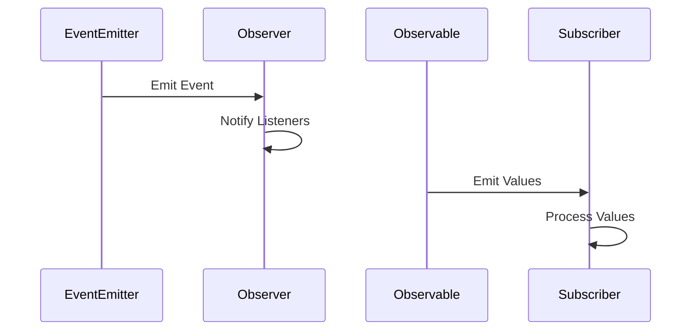

## 8.5 Event Emitters and Observables

In the realm of JavaScript, handling asynchronous events and data streams efficiently is crucial for building responsive and scalable applications. Two powerful paradigms that facilitate this are Event Emitters and Observables. In this section, we will delve into these concepts, exploring how they can be leveraged to manage complex asynchronous operations seamlessly.

### Understanding Event Emitters

Event Emitters are a core component of Node.js, providing a mechanism to handle events in an asynchronous and non-blocking manner. They are based on the Observer Pattern, a design pattern where an object, known as the subject, maintains a list of dependents, called observers, and notifies them of any state changes.

#### The Observer Pattern

The Observer Pattern is a behavioral design pattern that defines a one-to-many dependency between objects. When the state of one object changes, all its dependents are notified and updated automatically. This pattern is particularly useful in scenarios where an object needs to communicate changes to multiple other objects without being tightly coupled to them.

#### EventEmitter in Node.js

Node.js provides the `EventEmitter` class as part of its core `events` module. This class allows you to create, listen to, and emit events. Let's explore how to use `EventEmitter` with a practical example.

```javascript
const EventEmitter = require('events');

// Create an instance of EventEmitter
const myEmitter = new EventEmitter();

// Define an event handler
myEmitter.on('event', () => {
  console.log('An event occurred!');
});

// Emit the event
myEmitter.emit('event');
```

In this example, we create an instance of `EventEmitter`, define an event handler for the `event` event, and then emit the event. When the event is emitted, the handler is invoked, logging a message to the console.

#### Key Features of EventEmitter

- **Event Handling**: Register multiple listeners for a single event.
- **Asynchronous Execution**: Event handlers are executed asynchronously, allowing for non-blocking operations.
- **Error Handling**: Emitters can emit error events, which should be handled to prevent the application from crashing.

#### Advanced Usage of EventEmitter

Let's explore a more advanced example where we handle multiple events and pass data to event listeners.

```javascript
const EventEmitter = require('events');

class MyEmitter extends EventEmitter {}

const myEmitter = new MyEmitter();

// Register multiple listeners for different events
myEmitter.on('data', (data) => {
  console.log(`Received data: ${data}`);
});

myEmitter.on('error', (err) => {
  console.error(`Error occurred: ${err.message}`);
});

// Emit events with data
myEmitter.emit('data', 'Hello, World!');
myEmitter.emit('error', new Error('Something went wrong'));
```

In this example, we extend the `EventEmitter` class to create a custom emitter. We register listeners for `data` and `error` events, demonstrating how to pass data to listeners and handle errors gracefully.

### Introducing Observables

Observables are a key concept in reactive programming, providing a powerful way to work with asynchronous data streams. They are part of the Reactive Extensions for JavaScript (RxJS) library, which offers a rich set of operators for composing asynchronous and event-based programs.

#### What Are Observables?

An Observable is a data producer that emits values over time. Observers subscribe to an Observable to receive these values, allowing for a push-based approach to handling data streams.

#### Creating and Subscribing to Observables

Let's explore how to create and subscribe to Observables using RxJS.

```javascript
const { Observable } = require('rxjs');

// Create an Observable
const observable = new Observable((subscriber) => {
  subscriber.next('Hello');
  subscriber.next('World');
  subscriber.complete();
});

// Subscribe to the Observable
observable.subscribe({
  next(x) { console.log('Received value: ' + x); },
  error(err) { console.error('Error: ' + err); },
  complete() { console.log('Completed'); }
});
```

In this example, we create an Observable that emits two values, `Hello` and `World`, and then completes. We subscribe to the Observable, providing handlers for `next`, `error`, and `complete` notifications.

#### Key Features of Observables

- **Lazy Execution**: Observables are lazy, meaning they do not emit values until an observer subscribes.
- **Composability**: Use operators to transform, filter, and combine Observables.
- **Cancellation**: Subscriptions can be canceled to stop receiving values.

#### Using Operators with Observables

RxJS provides a wide array of operators to manipulate Observables. Let's explore some common operators.

```javascript
const { of } = require('rxjs');
const { map, filter } = require('rxjs/operators');

// Create an Observable from an array
const numbers = of(1, 2, 3, 4, 5);

// Use operators to transform the data
numbers.pipe(
  filter(x => x % 2 === 0),
  map(x => x * 2)
).subscribe(x => console.log(x));
```

In this example, we create an Observable from an array of numbers. We use the `filter` operator to select even numbers and the `map` operator to double them. The transformed values are then logged to the console.

### Use Cases for Event Emitters and Observables

Event Emitters and Observables are powerful tools for handling asynchronous events and data streams. Here are some common use cases:

- **Real-Time Applications**: Use Event Emitters to handle real-time events, such as user interactions or server messages.
- **Data Streams**: Use Observables to process continuous data streams, such as sensor data or financial market feeds.
- **Complex Async Operations**: Use reactive programming with Observables to manage complex asynchronous workflows, such as data fetching and transformation.

### Benefits of Reactive Programming

Reactive programming offers several benefits for managing asynchronous operations:

- **Declarative Code**: Write code that describes what should happen, rather than how it should happen.
- **Composability**: Combine multiple asynchronous operations using operators, leading to cleaner and more maintainable code.
- **Error Handling**: Handle errors gracefully using built-in mechanisms, such as the `catchError` operator in RxJS.

### Visualizing Event Emitters and Observables

To better understand the flow of data and events, let's visualize the interaction between Event Emitters and Observables.



This diagram illustrates how an EventEmitter emits events to observers, and how an Observable emits values to subscribers. Both paradigms facilitate asynchronous communication between components.

### Try It Yourself

Experiment with the code examples provided in this section. Try modifying the event handlers and Observable operators to see how they affect the output. Consider creating a simple application that uses both Event Emitters and Observables to handle user interactions and data streams.

### References and Further Reading

- [Node.js EventEmitter Documentation](https://nodejs.org/api/events.html)
- [RxJS Documentation](https://rxjs.dev/)
- [MDN Web Docs: Observer Pattern](https://developer.mozilla.org/en-US/docs/Web/JavaScript/Guide/Design_Patterns#observer_pattern)

### Knowledge Check

- What is the Observer Pattern, and how is it implemented in JavaScript?
- How do Event Emitters facilitate asynchronous event handling in Node.js?
- What are the key features of Observables in RxJS?
- How can operators be used to transform data streams in reactive programming?

### Embrace the Journey

Remember, mastering Event Emitters and Observables is just the beginning. As you continue to explore asynchronous patterns and reactive programming, you'll unlock new possibilities for building responsive and scalable applications. Keep experimenting, stay curious, and enjoy the journey!

## Mastering Event Emitters and Observables in JavaScript



### What is the primary design pattern implemented by Event Emitters?

- [x] Observer Pattern
- [ ] Singleton Pattern
- [ ] Factory Pattern
- [ ] Strategy Pattern

> **Explanation:** Event Emitters implement the Observer Pattern, allowing objects to subscribe to and receive notifications of events.

### Which Node.js module provides the EventEmitter class?

- [x] events
- [ ] http
- [ ] fs
- [ ] stream

> **Explanation:** The `events` module in Node.js provides the EventEmitter class for handling events.

### What is a key feature of Observables in RxJS?

- [x] Lazy Execution
- [ ] Eager Execution
- [ ] Synchronous Execution
- [ ] Blocking Execution

> **Explanation:** Observables in RxJS are lazy, meaning they do not emit values until an observer subscribes.

### Which operator is used to transform data in an Observable?

- [x] map
- [ ] filter
- [ ] reduce
- [ ] concat

> **Explanation:** The `map` operator is used to transform data in an Observable by applying a function to each emitted value.

### What is a common use case for Event Emitters?

- [x] Real-Time Applications
- [ ] Static Websites
- [ ] Batch Processing
- [ ] Image Rendering

> **Explanation:** Event Emitters are commonly used in real-time applications to handle events such as user interactions or server messages.

### How can you handle errors in an Observable?

- [x] Using the catchError operator
- [ ] Using the map operator
- [ ] Using the filter operator
- [ ] Using the concat operator

> **Explanation:** The `catchError` operator in RxJS is used to handle errors in an Observable.

### What is the benefit of reactive programming?

- [x] Declarative Code
- [ ] Imperative Code
- [ ] Synchronous Code
- [ ] Blocking Code

> **Explanation:** Reactive programming allows for declarative code, where you describe what should happen rather than how it should happen.

### Which method is used to subscribe to an Observable?

- [x] subscribe
- [ ] emit
- [ ] on
- [ ] listen

> **Explanation:** The `subscribe` method is used to subscribe to an Observable and receive emitted values.

### What is the purpose of the EventEmitter class in Node.js?

- [x] To handle asynchronous events
- [ ] To manage file operations
- [ ] To create HTTP servers
- [ ] To perform mathematical calculations

> **Explanation:** The EventEmitter class in Node.js is used to handle asynchronous events by emitting and listening to events.

### True or False: Observables can be canceled to stop receiving values.

- [x] True
- [ ] False

> **Explanation:** Subscriptions to Observables can be canceled to stop receiving values, providing control over data streams.


