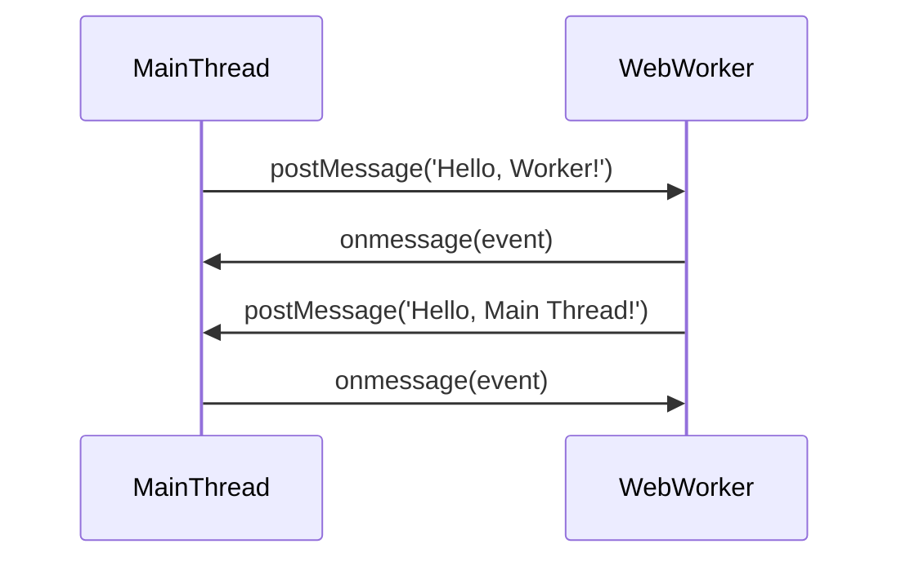

## 8.6 Web Workers and Multithreading in JavaScript

JavaScript is inherently single-threaded, which means it executes one task at a time. This can become a bottleneck when dealing with heavy computations or tasks that require real-time data processing. To overcome this limitation, JavaScript provides Web Workers, a powerful feature that allows you to run scripts in background threads, enabling concurrent execution and improving performance.

### What Are Web Workers?

Web Workers are a mechanism in JavaScript that allows you to run scripts in background threads separate from the main execution thread of a web application. This means that tasks can be performed without interfering with the user interface, leading to smoother and more responsive applications.

#### Key Features of Web Workers

- **Concurrency**: Web Workers enable concurrent execution of code, allowing multiple tasks to run simultaneously.
- **Isolation**: Each Web Worker runs in its own global context, separate from the main thread, which prevents direct access to the DOM.
- **Communication**: Web Workers communicate with the main thread through message passing, using the `postMessage` and `onmessage` methods.

#### Limitations of Web Workers

- **No DOM Access**: Web Workers cannot directly manipulate the DOM. They must communicate with the main thread to perform any DOM-related tasks.
- **Limited APIs**: Not all JavaScript APIs are available in Web Workers. For example, `alert` and `document` are not accessible.
- **Overhead**: Creating and managing Web Workers involves some overhead, which may not be suitable for lightweight tasks.

### Creating and Communicating with Web Workers

To create a Web Worker, you need to define a separate JavaScript file that contains the code to be executed in the worker. Here's a simple example:

#### Main Thread (main.js)

```javascript
// Create a new Web Worker
const worker = new Worker('worker.js');

// Listen for messages from the worker
worker.onmessage = function(event) {
  console.log('Message from worker:', event.data);
};

// Send a message to the worker
worker.postMessage('Hello, Worker!');
```

#### Worker Thread (worker.js)

```javascript
// Listen for messages from the main thread
onmessage = function(event) {
  console.log('Message from main thread:', event.data);
  
  // Send a response back to the main thread
  postMessage('Hello, Main Thread!');
};
```

In this example, the main thread creates a Web Worker and sends a message to it. The worker listens for messages, processes them, and sends a response back to the main thread.

### Data Sharing Through Message Passing

Web Workers communicate with the main thread using message passing. This involves sending data back and forth using the `postMessage` method. The data is serialized and deserialized, which means complex objects can be passed, but they must be structured cloneable.

#### Example: Passing Complex Data

```javascript
// Main thread
const worker = new Worker('worker.js');

worker.onmessage = function(event) {
  console.log('Received data:', event.data);
};

const data = { name: 'Alice', age: 30 };
worker.postMessage(data);
```

```javascript
// Worker thread
onmessage = function(event) {
  const receivedData = event.data;
  console.log('Received data:', receivedData);
  
  const processedData = { ...receivedData, status: 'Processed' };
  postMessage(processedData);
};
```

In this example, a complex object is passed from the main thread to the worker, processed, and then sent back.

### Use Cases for Web Workers

Web Workers are particularly useful for tasks that are computationally intensive or require real-time processing. Here are some common use cases:

- **Heavy Computations**: Tasks like image processing, data analysis, or complex mathematical calculations can be offloaded to Web Workers to prevent blocking the main thread.
- **Real-Time Data Processing**: Applications that handle real-time data, such as chat applications or live data feeds, can use Web Workers to process incoming data without affecting the user interface.
- **Background Tasks**: Tasks that run in the background, such as data synchronization or file processing, can be handled by Web Workers to improve application responsiveness.

### Debugging and Browser Support

Debugging Web Workers can be challenging due to their isolated nature. However, modern browsers provide tools to inspect and debug workers.

#### Debugging Tips

- **Use Console Logs**: Add `console.log` statements in both the main thread and worker thread to trace the flow of messages and data.
- **Browser Developer Tools**: Most browsers have developer tools that allow you to inspect and debug Web Workers. Look for the "Workers" section in the developer tools.

#### Browser Support

Web Workers are supported in all modern browsers, including Chrome, Firefox, Safari, and Edge. However, it's always a good practice to check compatibility if you're targeting older browsers.

### Visualizing Web Workers and Main Thread Interaction

To better understand how Web Workers interact with the main thread, let's visualize the process using a sequence diagram.



This diagram illustrates the message passing between the main thread and a Web Worker, highlighting the asynchronous nature of their communication.

### Try It Yourself

Experiment with the code examples provided by modifying the data being passed or the operations performed in the worker. For instance, try passing an array of numbers to the worker and calculate their sum or average.

### Knowledge Check

- What are the key features of Web Workers?
- How do Web Workers communicate with the main thread?
- What are some common use cases for Web Workers?
- How can you debug Web Workers in a web application?

### Summary

Web Workers provide a powerful way to enhance the performance of JavaScript applications by enabling concurrent execution of tasks. By offloading heavy computations or real-time data processing to background threads, you can create more responsive and efficient applications. Remember to consider the limitations and overhead of Web Workers, and use them judiciously to achieve the best results.

### Test Your Knowledge on Web Workers and Multithreading in JavaScript



### What is a key feature of Web Workers?

- [x] They enable concurrent execution of code.
- [ ] They allow direct DOM manipulation.
- [ ] They can access all JavaScript APIs.
- [ ] They run on the main thread.

> **Explanation:** Web Workers enable concurrent execution of code, allowing tasks to run simultaneously without blocking the main thread.

### How do Web Workers communicate with the main thread?

- [x] Through message passing using `postMessage` and `onmessage`.
- [ ] By directly accessing the DOM.
- [ ] By using global variables.
- [ ] Through synchronous function calls.

> **Explanation:** Web Workers communicate with the main thread through message passing using the `postMessage` and `onmessage` methods.

### What is a limitation of Web Workers?

- [x] They cannot directly manipulate the DOM.
- [ ] They can access all JavaScript APIs.
- [ ] They run synchronously with the main thread.
- [ ] They have no overhead.

> **Explanation:** Web Workers cannot directly manipulate the DOM and must communicate with the main thread for any DOM-related tasks.

### Which of the following is a common use case for Web Workers?

- [x] Heavy computations like image processing.
- [ ] Simple UI updates.
- [ ] Accessing the DOM.
- [ ] Running synchronous tasks.

> **Explanation:** Web Workers are commonly used for heavy computations like image processing to prevent blocking the main thread.

### How can you debug Web Workers?

- [x] Use console logs and browser developer tools.
- [ ] Directly access the DOM.
- [ ] Use synchronous function calls.
- [ ] Modify global variables.

> **Explanation:** Debugging Web Workers can be done using console logs and browser developer tools, which provide insights into the worker's execution.

### What is the primary method for passing data between the main thread and a Web Worker?

- [x] `postMessage`
- [ ] `alert`
- [ ] `document.write`
- [ ] `setTimeout`

> **Explanation:** The `postMessage` method is used to pass data between the main thread and a Web Worker.

### Can Web Workers access the `document` object?

- [ ] Yes
- [x] No

> **Explanation:** Web Workers cannot access the `document` object as they run in a separate global context from the main thread.

### What should you consider when using Web Workers?

- [x] The overhead of creating and managing workers.
- [ ] Direct DOM manipulation.
- [ ] Synchronous execution.
- [ ] Access to all JavaScript APIs.

> **Explanation:** When using Web Workers, consider the overhead of creating and managing them, as they may not be suitable for lightweight tasks.

### Which method is used to listen for messages in a Web Worker?

- [x] `onmessage`
- [ ] `addEventListener`
- [ ] `setInterval`
- [ ] `setTimeout`

> **Explanation:** The `onmessage` method is used to listen for messages in a Web Worker.

### True or False: Web Workers can run scripts in the main execution thread.

- [ ] True
- [x] False

> **Explanation:** False. Web Workers run scripts in background threads, separate from the main execution thread.



Remember, this is just the beginning. As you progress, you'll build more complex and interactive web applications. Keep experimenting, stay curious, and enjoy the journey!
