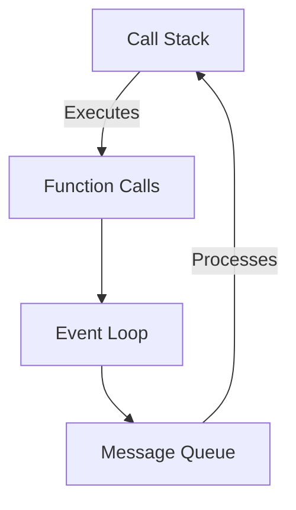
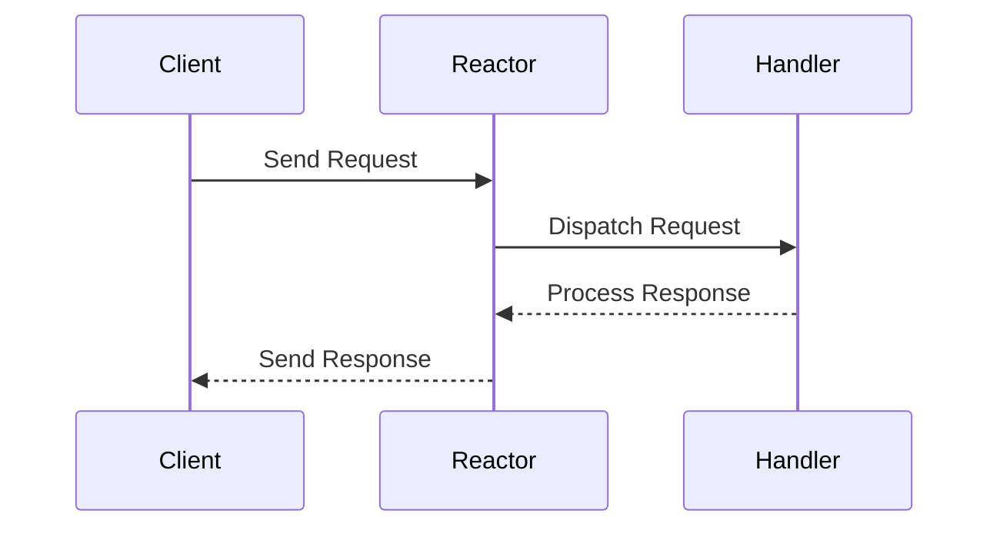

## 8.7 Concurrency Models and Patterns

JavaScript is renowned for its single-threaded nature, yet it handles concurrency with remarkable efficiency. This section delves into the concurrency models and patterns that empower JavaScript to manage multiple operations simultaneously, despite its single-threaded execution model.

### Understanding JavaScript's Concurrency Model

JavaScript's concurrency model is built around the event loop, which enables asynchronous operations. This model is crucial for non-blocking I/O operations, allowing JavaScript to handle multiple tasks without waiting for each to complete before starting the next.

#### The Event Loop

The event loop is the heart of JavaScript's concurrency model. It continuously checks the call stack and the message queue, executing tasks in the stack and processing messages from the queue.



**Figure 1:** Visualizing the Event Loop in JavaScript.

**Explanation:** The event loop processes tasks from the call stack and message queue, enabling asynchronous execution.

### Cooperative Multitasking

JavaScript employs cooperative multitasking, where tasks voluntarily yield control to allow other tasks to execute. This is achieved through asynchronous constructs like callbacks, Promises, and async/await.

#### Promises and Async/Await

Promises and async/await are fundamental to managing asynchronous operations in JavaScript. They provide a cleaner, more readable way to handle asynchronous code compared to traditional callbacks.

**Example: Using Promises**

```javascript
function fetchData(url) {
    return new Promise((resolve, reject) => {
        fetch(url)
            .then(response => response.json())
            .then(data => resolve(data))
            .catch(error => reject(error));
    });
}

fetchData('https://api.example.com/data')
    .then(data => console.log(data))
    .catch(error => console.error('Error:', error));
```

**Example: Using Async/Await**

```javascript
async function fetchData(url) {
    try {
        const response = await fetch(url);
        const data = await response.json();
        console.log(data);
    } catch (error) {
        console.error('Error:', error);
    }
}

fetchData('https://api.example.com/data');
```

**Explanation:** Async/await simplifies asynchronous code, making it look synchronous and easier to read.

### Concurrency Patterns

Concurrency patterns help manage multiple operations efficiently. Let's explore some common patterns used in JavaScript.

#### The Reactor Pattern

The Reactor Pattern is a design pattern used to handle service requests delivered concurrently to a service handler by one or more inputs. It demultiplexes and dispatches the requests to the associated request handlers.



**Figure 2:** The Reactor Pattern in action.

**Explanation:** The Reactor Pattern efficiently handles concurrent requests by dispatching them to appropriate handlers.

#### Queues for Managing Concurrency

Queues are essential for managing tasks in a concurrent environment. They ensure tasks are executed in order and help prevent race conditions.

**Example: Task Queue**

```javascript
class TaskQueue {
    constructor() {
        this.queue = [];
        this.processing = false;
    }

    addTask(task) {
        this.queue.push(task);
        this.processQueue();
    }

    async processQueue() {
        if (this.processing) return;
        this.processing = true;

        while (this.queue.length > 0) {
            const task = this.queue.shift();
            await task();
        }

        this.processing = false;
    }
}

const queue = new TaskQueue();

queue.addTask(async () => {
    console.log('Task 1');
    await new Promise(resolve => setTimeout(resolve, 1000));
});

queue.addTask(async () => {
    console.log('Task 2');
    await new Promise(resolve => setTimeout(resolve, 500));
});
```

**Explanation:** This task queue processes tasks sequentially, ensuring order and preventing race conditions.

### Challenges in Concurrency

Concurrency introduces challenges such as race conditions, where the outcome of operations depends on the sequence or timing of uncontrollable events.

#### Avoiding Race Conditions

Race conditions can be mitigated using synchronization mechanisms like semaphores and mutexes, especially in environments like Node.js with worker threads.

**Example: Using Mutex**

```javascript
class Mutex {
    constructor() {
        this.locked = false;
        this.queue = [];
    }

    lock() {
        return new Promise(resolve => {
            if (!this.locked) {
                this.locked = true;
                resolve();
            } else {
                this.queue.push(resolve);
            }
        });
    }

    unlock() {
        if (this.queue.length > 0) {
            const resolve = this.queue.shift();
            resolve();
        } else {
            this.locked = false;
        }
    }
}

const mutex = new Mutex();

async function criticalSection() {
    await mutex.lock();
    try {
        // Critical section code
    } finally {
        mutex.unlock();
    }
}
```

**Explanation:** A mutex ensures that only one task can access a critical section at a time, preventing race conditions.

### Coordinating Concurrent Operations

Coordinating concurrent operations is crucial for efficient execution. Patterns like semaphores and worker threads in Node.js facilitate this coordination.

#### Semaphores

Semaphores control access to a common resource by multiple processes in a concurrent system.

**Example: Semaphore**

```javascript
class Semaphore {
    constructor(max) {
        this.max = max;
        this.counter = 0;
        this.queue = [];
    }

    acquire() {
        return new Promise(resolve => {
            if (this.counter < this.max) {
                this.counter++;
                resolve();
            } else {
                this.queue.push(resolve);
            }
        });
    }

    release() {
        if (this.queue.length > 0) {
            const resolve = this.queue.shift();
            resolve();
        } else {
            this.counter--;
        }
    }
}

const semaphore = new Semaphore(2);

async function limitedResourceAccess() {
    await semaphore.acquire();
    try {
        // Access limited resource
    } finally {
        semaphore.release();
    }
}
```

**Explanation:** A semaphore limits the number of concurrent accesses to a resource, ensuring controlled execution.

### JavaScript's Unique Features in Concurrency

JavaScript's event-driven architecture and non-blocking I/O are unique features that facilitate efficient concurrency management. The use of Promises and async/await further enhances this capability.

### Differences and Similarities with Other Languages

JavaScript's concurrency model differs from languages with multi-threading capabilities. While JavaScript uses an event loop for concurrency, languages like Java and C++ use threads. However, the principles of managing concurrent operations, such as avoiding race conditions and coordinating tasks, remain similar.

### Try It Yourself

Experiment with the provided code examples by modifying task durations or adding more tasks to the queue. Observe how the task queue and semaphore manage concurrency.

### Key Takeaways

- JavaScript handles concurrency through the event loop and asynchronous constructs like Promises and async/await.
- Concurrency patterns like the Reactor Pattern and task queues help manage multiple operations efficiently.
- Synchronization mechanisms like mutexes and semaphores prevent race conditions and coordinate concurrent tasks.
- JavaScript's unique event-driven architecture facilitates efficient concurrency management.

### References and Further Reading

- [MDN Web Docs: Concurrency model and the event loop](https://developer.mozilla.org/en-US/docs/Web/JavaScript/EventLoop)
- [Node.js Documentation: Asynchronous Programming](https://nodejs.org/en/docs/guides/blocking-vs-non-blocking/)
- [JavaScript.info: Promises, async/await](https://javascript.info/async)

## Quiz: Mastering Concurrency Models and Patterns in JavaScript



### What is the core component of JavaScript's concurrency model?

- [x] Event Loop
- [ ] Thread Pool
- [ ] Worker Threads
- [ ] Asynchronous Functions

> **Explanation:** The event loop is the core component that enables JavaScript to handle concurrency.

### Which pattern is used to handle service requests concurrently?

- [x] Reactor Pattern
- [ ] Singleton Pattern
- [ ] Factory Pattern
- [ ] Observer Pattern

> **Explanation:** The Reactor Pattern is used to handle concurrent service requests efficiently.

### What is the purpose of a task queue in concurrency?

- [x] To manage tasks in order and prevent race conditions
- [ ] To execute tasks in parallel
- [ ] To block tasks until resources are available
- [ ] To prioritize tasks based on importance

> **Explanation:** A task queue manages tasks sequentially, ensuring order and preventing race conditions.

### How can race conditions be avoided in JavaScript?

- [x] Using synchronization mechanisms like mutexes
- [ ] By executing tasks in parallel
- [ ] By using global variables
- [ ] By increasing the number of threads

> **Explanation:** Synchronization mechanisms like mutexes ensure that only one task accesses a critical section at a time.

### What is the function of a semaphore in concurrency?

- [x] To control access to a common resource by multiple processes
- [ ] To execute tasks in parallel
- [ ] To block tasks until resources are available
- [ ] To prioritize tasks based on importance

> **Explanation:** A semaphore limits the number of concurrent accesses to a resource, ensuring controlled execution.

### Which JavaScript feature enhances concurrency management?

- [x] Promises and async/await
- [ ] Synchronous functions
- [ ] Global variables
- [ ] Thread pools

> **Explanation:** Promises and async/await provide a cleaner way to handle asynchronous operations, enhancing concurrency management.

### What is a unique feature of JavaScript's concurrency model?

- [x] Event-driven architecture and non-blocking I/O
- [ ] Multi-threading capabilities
- [ ] Synchronous execution
- [ ] Global state management

> **Explanation:** JavaScript's event-driven architecture and non-blocking I/O facilitate efficient concurrency management.

### How does JavaScript's concurrency model differ from Java's?

- [x] JavaScript uses an event loop, while Java uses threads
- [ ] JavaScript uses threads, while Java uses an event loop
- [ ] Both use threads for concurrency
- [ ] Both use an event loop for concurrency

> **Explanation:** JavaScript uses an event loop for concurrency, whereas Java uses threads.

### What is the role of the event loop in JavaScript?

- [x] To process tasks from the call stack and message queue
- [ ] To execute tasks in parallel
- [ ] To block tasks until resources are available
- [ ] To prioritize tasks based on importance

> **Explanation:** The event loop processes tasks from the call stack and message queue, enabling asynchronous execution.

### JavaScript is single-threaded but can handle concurrency through the event loop.

- [x] True
- [ ] False

> **Explanation:** JavaScript is single-threaded but uses the event loop to handle concurrency efficiently.



Remember, mastering concurrency in JavaScript is a journey. Keep experimenting, stay curious, and enjoy the process of building efficient and responsive applications!
