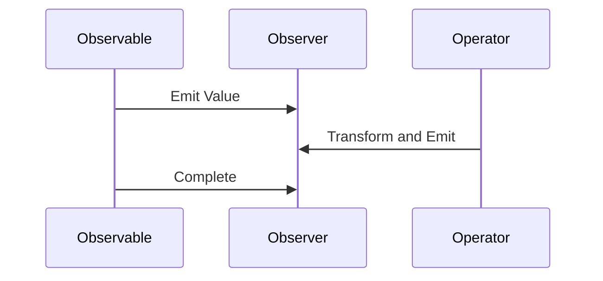

## 8.8 Reactive Programming with RxJS

Reactive programming is a programming paradigm that deals with asynchronous data streams and the propagation of change. In this section, we will delve into the world of reactive programming using RxJS, a library for composing asynchronous and event-based programs using observable sequences.

### Principles of Reactive Programming

Reactive programming is built on the idea of data streams and the propagation of change. In this paradigm, data is represented as streams that can be observed and reacted to. This approach allows developers to handle asynchronous data flows more efficiently and intuitively.

**Key Concepts:**

- **Data Streams**: Continuous flows of data that can be observed and manipulated.
- **Propagation of Change**: Automatic updating of dependent computations when the data they rely on changes.
- **Declarative Programming**: Describing what should happen rather than how it should happen.

### Introducing RxJS

RxJS (Reactive Extensions for JavaScript) is a library that enables reactive programming in JavaScript. It provides a powerful set of tools for working with asynchronous data streams, making it easier to handle complex data flows in web applications.

**Core Components of RxJS:**

- **Observables**: Represent data streams that can emit values over time.
- **Observers**: Consume the values emitted by observables.
- **Subjects**: Act as both an observable and an observer, allowing for multicasting of data streams.
- **Operators**: Functions that enable the transformation and combination of observables.

### Observables in RxJS

Observables are the foundation of RxJS. They represent data streams that can emit zero or more values over time. Observables can be created from various sources, such as arrays, events, or AJAX requests.

#### Creating Observables

To create an observable, you can use the `Observable` constructor or helper functions provided by RxJS.

```javascript
import { Observable } from 'rxjs';

// Creating an observable using the Observable constructor
const observable = new Observable(subscriber => {
  subscriber.next('Hello');
  subscriber.next('World');
  subscriber.complete();
});

// Subscribing to the observable
observable.subscribe({
  next: value => console.log(value),
  complete: () => console.log('Completed')
});
```

In this example, the observable emits two values, "Hello" and "World", and then completes. The `subscribe` method is used to consume the emitted values.

#### Subscribing to Observables

Subscribing to an observable involves providing an observer, which is an object with methods to handle emitted values, errors, and completion.

```javascript
observable.subscribe({
  next: value => console.log(value),
  error: err => console.error('Error:', err),
  complete: () => console.log('Completed')
});
```

### Observers and Subjects

Observers are objects that define how to handle values emitted by observables. They have three main methods: `next`, `error`, and `complete`.

**Subjects** are special types of observables that allow values to be multicasted to multiple observers. They act as both an observable and an observer.

```javascript
import { Subject } from 'rxjs';

const subject = new Subject();

// Subscribing to the subject
subject.subscribe(value => console.log('Observer 1:', value));
subject.subscribe(value => console.log('Observer 2:', value));

// Emitting values
subject.next('Hello');
subject.next('World');
```

In this example, the subject multicasts the emitted values to both observers.

### Operators in RxJS

Operators are functions that enable the transformation and combination of observables. They are used to manipulate data streams and create complex data flows.

#### Transforming Streams

Operators like `map`, `filter`, and `reduce` are used to transform data streams.

```javascript
import { from } from 'rxjs';
import { map, filter } from 'rxjs/operators';

const numbers = from([1, 2, 3, 4, 5]);

numbers.pipe(
  filter(n => n % 2 === 0),
  map(n => n * 2)
).subscribe(value => console.log(value));
```

In this example, the `filter` operator is used to select even numbers, and the `map` operator is used to double them.

#### Combining Streams

Operators like `merge`, `concat`, and `combineLatest` are used to combine multiple observables.

```javascript
import { of, interval } from 'rxjs';
import { merge, take } from 'rxjs/operators';

const observable1 = of('A', 'B', 'C');
const observable2 = interval(1000).pipe(take(3));

merge(observable1, observable2).subscribe(value => console.log(value));
```

This example demonstrates merging two observables: one that emits letters and another that emits numbers at intervals.

### Use Cases of RxJS

RxJS is widely used in scenarios where managing asynchronous data streams is crucial. Here are some common use cases:

#### Event Handling

RxJS can be used to handle events in a more declarative and efficient manner.

```javascript
import { fromEvent } from 'rxjs';
import { throttleTime, map } from 'rxjs/operators';

const clicks = fromEvent(document, 'click');

clicks.pipe(
  throttleTime(1000),
  map(event => `Clicked at: ${event.clientX}, ${event.clientY}`)
).subscribe(console.log);
```

In this example, click events are throttled to occur at most once per second, and the click coordinates are logged.

#### AJAX Requests

RxJS simplifies handling AJAX requests and responses.

```javascript
import { ajax } from 'rxjs/ajax';
import { catchError } from 'rxjs/operators';
import { of } from 'rxjs';

const apiData = ajax('https://api.example.com/data');

apiData.pipe(
  catchError(error => {
    console.error('Error:', error);
    return of(error);
  })
).subscribe(response => console.log(response));
```

This example demonstrates making an AJAX request and handling errors gracefully.

#### Real-Time Data Updates

RxJS is ideal for applications that require real-time data updates, such as chat applications or live dashboards.

### Integration with Angular

RxJS is a core part of Angular, a popular front-end framework. Angular uses RxJS for handling asynchronous operations, such as HTTP requests and event handling.

**Example: Angular Service Using RxJS**

```typescript
import { Injectable } from '@angular/core';
import { HttpClient } from '@angular/common/http';
import { Observable } from 'rxjs';
import { map } from 'rxjs/operators';

@Injectable({
  providedIn: 'root'
})
export class DataService {
  constructor(private http: HttpClient) {}

  getData(): Observable<any> {
    return this.http.get('https://api.example.com/data').pipe(
      map(response => response.data)
    );
  }
}
```

In this Angular service, RxJS is used to handle HTTP requests and transform the response data.

### Try It Yourself

Experiment with the examples provided by modifying the code to see how different operators and configurations affect the output. For instance, try changing the interval duration in the `merge` example or adding additional operators to the event handling example.

### Visualizing RxJS Concepts

To better understand the flow of data in RxJS, let's visualize the interaction between observables, observers, and operators using a sequence diagram.



This diagram illustrates how an observable emits values, which are then transformed by operators before being consumed by observers.

### References and Links

- [RxJS Official Documentation](https://rxjs.dev/)
- [MDN Web Docs: Asynchronous JavaScript](https://developer.mozilla.org/en-US/docs/Learn/JavaScript/Asynchronous)
- [Angular Documentation](https://angular.io/guide/rx-library)

### Knowledge Check

- What are the core components of RxJS?
- How do you create and subscribe to an observable?
- What are some common operators used in RxJS?
- How can RxJS be used in event handling and AJAX requests?
- How does RxJS integrate with Angular?

### Embrace the Journey

Remember, mastering reactive programming with RxJS is a journey. As you explore and experiment with different operators and configurations, you'll gain a deeper understanding of how to manage asynchronous data streams effectively. Keep experimenting, stay curious, and enjoy the journey!

## Mastering RxJS and Reactive Programming Quiz



### What is the primary purpose of RxJS?

- [x] To manage asynchronous data streams using observables
- [ ] To create synchronous data flows
- [ ] To replace JavaScript entirely
- [ ] To handle only HTTP requests

> **Explanation:** RxJS is designed to manage asynchronous data streams using observables, allowing for efficient handling of events, data updates, and more.

### Which RxJS component acts as both an observable and an observer?

- [ ] Observable
- [ ] Operator
- [x] Subject
- [ ] Subscriber

> **Explanation:** A Subject in RxJS acts as both an observable and an observer, allowing for multicasting of data streams to multiple observers.

### What operator would you use to transform each emitted value in an observable?

- [ ] filter
- [x] map
- [ ] merge
- [ ] concat

> **Explanation:** The `map` operator is used to transform each emitted value in an observable.

### How can RxJS be integrated with Angular?

- [x] By using RxJS for handling asynchronous operations like HTTP requests
- [ ] By replacing Angular's core modules
- [ ] By using RxJS only for styling
- [ ] By avoiding RxJS entirely

> **Explanation:** RxJS is integrated with Angular to handle asynchronous operations such as HTTP requests and event handling.

### Which operator would you use to combine multiple observables into one?

- [x] merge
- [ ] map
- [ ] filter
- [ ] take

> **Explanation:** The `merge` operator is used to combine multiple observables into one.

### What is the role of an observer in RxJS?

- [x] To consume values emitted by observables
- [ ] To create new observables
- [ ] To replace operators
- [ ] To handle only errors

> **Explanation:** An observer in RxJS consumes values emitted by observables and handles them using defined methods.

### Which RxJS operator is used to handle errors in an observable?

- [ ] map
- [ ] filter
- [x] catchError
- [ ] merge

> **Explanation:** The `catchError` operator is used to handle errors in an observable.

### What is a common use case for RxJS in web development?

- [x] Handling real-time data updates
- [ ] Styling web pages
- [ ] Compiling JavaScript code
- [ ] Managing database schemas

> **Explanation:** RxJS is commonly used for handling real-time data updates, such as in chat applications or live dashboards.

### True or False: RxJS can only be used with Angular.

- [ ] True
- [x] False

> **Explanation:** False. RxJS can be used with any JavaScript application, not just Angular.

### Which of the following is NOT a core component of RxJS?

- [ ] Observable
- [ ] Operator
- [x] Reducer
- [ ] Subject

> **Explanation:** Reducer is not a core component of RxJS. The core components include Observable, Operator, and Subject.


